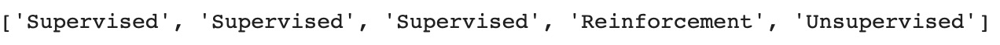
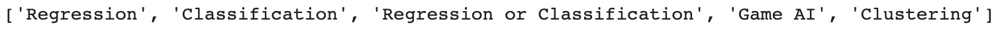

1. Introduction to Data Science in Python
=========================================


Overview

This very first lab will introduce you to the field of data science
and walk you through an overview of Python\'s core concepts and their
application in the world of data science.

By the end of this lab, you will be able to explain what data
science is and distinguish between supervised and unsupervised learning.
You will also be able to explain what machine learning is and
distinguish between regression, classification, and clustering problems.
You\'ll have learnt to create and manipulate different types of Python
variable, including core variables, lists, and dictionaries. You\'ll be
able to build a `for` loop, print results using f-strings,
define functions, import Python packages and load data in different
formats using `pandas`. You will also have had your first
taste of training a model using scikit-learn.


Overview of Python
==================


As mentioned earlier, Python is one of the most popular programming
languages for data science. But before diving into Python\'s data
science applications, let\'s have a quick introduction to some core
Python concepts.


Types of Variable
-----------------

In Python, you can handle and manipulate different types of variables.
Each has its own specificities and benefits. We will not go through
every single one of them but rather focus on the main ones that you will
have to use in this course. For each of the following code examples, you
can run the code in Google Colab to view the given output.


### Numeric Variables

The most basic variable type is numeric. This can contain integer or
decimal (or float) numbers, and some mathematical operations can be
performed on top of them.

Let\'s use an integer variable called `var1` that will take
the value `8` and another one called `var2` with the
value `160.88`, and add them together with the `+`
operator, as shown here:

```
var1 = 8
var2 = 160.88
var1 + var2
```
You should get the following output:


Caption: Output of the addition of two variables

In Python, you can perform other mathematical operations on numerical
variables, such as multiplication (with the `*` operator) and
division (with `/`).


### Text Variables

Another interesting type of variable is `string`, which
contains textual information. You can create a variable with some
specific text using the single or double quote, as shown in the
following example:

```
var3 = 'Hello, '
var4 = 'World'
```

In order to display the content of a variable, you can call the
`print()` function:

```
print(var3)
print(var4)
```
You should get the following output:


Caption: Printing the two text variables


For instance, if we want to print `Text:` before the values of
`var3` and `var4`, we will write the following code:

```
print(f"Text: {var3} {var4}!")
```
You should get the following output:


Caption: Printing with f-strings

You can also perform some text-related transformations with string
variables, such as capitalizing or replacing characters. For instance,
you can concatenate the two variables together with the `+`
operator:

```
var3 + var4
```
You should get the following output:


Caption: Concatenation of the two text variables


### Python List

Another very useful type of variable is the list. It is a collection of
items that can be changed (you can add, update, or remove items). To
declare a list, you will need to use square brackets, `[]`,
like this:

```
var5 = ['I', 'love', 'data', 'science']
print(var5)
```
You should get the following output:


Caption: List containing only string items

A list can have different item types, so you can mix numerical and text
variables in it:

```
var6 = ['Fenago', 15019, 2020, 'Data Science']
print(var6)
```


An item in a list can be accessed by its index (its position in the
list). To access the first (index 0) and third elements (index 2) of a
list, you do the following:

```
print(var6[0])
print(var6[2])
```
Note

In Python, all indexes start at `0`.


Python provides an API to access a range of items using the
`:` operator. You just need to specify the starting index on
the left side of the operator and the ending index on the right side.
The ending index is always excluded from the range. So, if you want to
get the first three items (index 0 to 2), you should do as follows:

```
print(var6[0:3])
```

You can also iterate through every item of a list using a
`for` loop. If you want to print every item of the
`var6` list, you should do this:

```
for item in var6:
    print(item)
```
You should get the following output:


You can add an item at the end of the list using the
`.append()` method:

```
var6.append('Python')
print(var6)
```


To delete an item from the list, you use the `.remove()`
method:

```
var6.remove(15019)
print(var6)
```


### Python Dictionary

A dictionary contains multiple elements, like a **list**, but each element
is organized as a key-value pair. A dictionary is not indexed by numbers
but by keys. So, to access a specific value, you will have to call the
item by its corresponding key. To define a dictionary in Python, you
will use curly brackets, `{}`, and specify the keys and values
separated by `:`, as shown here:

```
var7 = {'Topic': 'Data Science', 'Language': 'Python'}
print(var7)
```
You should get the following output:


Caption: Output of var7

To access a specific value, you need to provide the corresponding key
name. For instance, if you want to get the value `Python`, you
do this:

```
var7['Language']
```
You should get the following output:


Caption: Value for the \'Language\' key

Note

Each key-value pair in a dictionary needs to be unique.

Python provides a method to access all the key names from a dictionary,
`.keys()`, which is used as shown in the following code
snippet:

```
var7.keys()
```
You should get the following output:


Caption: List of key names

There is also a method called `.values()`, which is used to
access all the values of a dictionary:

```
var7.values()
```
You should get the following output:


Caption: List of values

You can iterate through all items from a dictionary using a
`for` loop and the `.items()` method, as shown in
the following code snippet:

```
for key, value in var7.items():
    print(key)
    print(value)
```
You should get the following output:


Caption: Output after iterating through the items of a dictionary

You can add a new element in a dictionary by providing the key name like
this:

```
var7['Publisher'] = 'Fenago'
print(var7)
```


You can delete an item from a dictionary with the `del`
command:

```
del var7['Publisher']
print(var7)
```
You should get the following output:


Caption: Output of a dictionary after removing an item

In *Exercise 1.01*, *Creating a Dictionary That Will Contain Machine
Learning Algorithms*, we will be looking to use these concepts that
we\'ve just looked at.


Exercise 1.01: Creating a Dictionary That Will Contain Machine Learning Algorithms
----------------------------------------------------------------------------------

In this exercise, we will create a dictionary using Python that will
contain a collection of different machine learning algorithms that will
be covered in this course.

The following steps will help you complete the exercise:

Note

Every exercise and activity in this course is to be executed on Google
Colab.

1.  Open on a new Colab notebook.

2.  Create a list called `algorithm` that will contain the
    following elements: `Linear Regression`,
    `Logistic Regression`, `RandomForest`, and
    `a3c`:

    ```
    algorithm = ['Linear Regression', 'Logistic Regression', \
                 'RandomForest', 'a3c']
    ```


    Note

    The code snippet shown above uses a backslash ( `\` ) to
    split the logic across multiple lines. When the code is executed,
    Python will ignore the backslash, and treat the code on the next
    line as a direct continuation of the current line.

3.  Now, create a list called `learning` that will contain the
    following elements: `Supervised`, `Supervised`,
    `Supervised`, and `Reinforcement`:
    ```
    learning = ['Supervised', 'Supervised', 'Supervised', \
                'Reinforcement']
    ```


4.  Create a list called `algorithm_type` that will contain
    the following elements: `Regression`,
    `Classification`,
    `Regression or Classification`, and `Game AI`:
    ```
    algorithm_type = ['Regression', 'Classification', \
                      'Regression or Classification', 'Game AI']
    ```


5.  Add an item called `k-means` into the
    `algorithm` list using the `.append()` method:
    ```
    algorithm.append('k-means')
    ```


6.  Display the content of `algorithm` using the
    `print()` function:

    ```
    print(algorithm)
    ```


    You should get the following output:

    


    Caption: Output of \'algorithm\'

    From the preceding output, we can see that we added the
    `k-means` item to the list.

7.  Now, add the `Unsupervised` item into the
    `learning` list using the `.append()` method:
    ```
    learning.append('Unsupervised')
    ```


8.  Display the content of `learning` using the
    `print()` function:

    ```
    print(learning)
    ```


    You should get the following output:

    



    Caption: Output of \'learning\'

    From the preceding output, we can see that we added the
    `Unsupervised` item into the list.

9.  Add the `Clustering` item into the
    `algorithm_type` list using the `.append()`
    method:
    ```
    algorithm_type.append('Clustering')
    ```


10. Display the content of `algorithm_type` using the
    `print()` function:

    ```
    print(algorithm_type)
    ```


    You should get the following output:

    



    Caption: Output of \'algorithm\_type\'

    From the preceding output, we can see that we added the
    `Clustering` item into the list.

11. Create an empty dictionary called `machine_learning` using
    curly brackets, `{}`:
    ```
    machine_learning = {}
    ```


12. Create a new item in `machine_learning` with the key as
    `algorithm` and the value as all the items from the
    `algorithm` list:
    ```
    machine_learning['algorithm'] = algorithm
    ```


13. Display the content of `machine_learning` using the
    `print()` function.

    ```
    print(machine_learning)
    ```


    You should get the following output:

    


    Caption: Output of \'machine\_learning\'

    From the preceding output, we notice that we have created a
    dictionary from the `algorithm` list.

14. Create a new item in `machine_learning` with the key as
    `learning` and the value as all the items from the
    `learning` list:
    ```
    machine_learning['learning'] = learning
    ```


15. Now, create a new item in `machine_learning` with the key
    as `algorithm_type` and the value as all the items from
    the algorithm\_type list:
    ```
    machine_learning['algorithm_type'] = algorithm_type
    ```


16. Display the content of `machine_learning` using the
    `print()` function.

    ```
    print(machine_learning)
    ```


    You should get the following output:

    


    Caption: Output of \'machine\_learning\'

17. Remove the `a3c` item from the `algorithm` key
    using the `.remove()` method:
    ```
    machine_learning['algorithm'].remove('a3c')
    ```


18. Display the content of the `algorithm` item from the
    `machine_learning` dictionary using the
    `print()` function:

    ```
    print(machine_learning['algorithm'])
    ```


    You should get the following output:

    


    Caption: Output of \'algorithm\' from \'machine\_learning\'

19. Remove the `Reinforcement` item from the
    `learning` key using the `.remove()` method:
    ```
    machine_learning['learning'].remove('Reinforcement')
    ```


20. Remove the `Game AI` item from the
    `algorithm_type` key using the `.remove()`
    method:
    ```
    machine_learning['algorithm_type'].remove('Game AI')
    ```


21. Display the content of `machine_learning` using the
    `print()` function:

    ```
    print(machine_learning)
    ```


    You should get the following output:

    


Caption: Output of \'machine\_learning\'


Python for Data Science
=======================


In this section, we will present to you two of the most popular ones:
`pandas` and `scikit-learn`.


The pandas Package
------------------

The pandas package provides an incredible amount of APIs for
manipulating data structures. The two main data structures defined in
the `pandas` package are `DataFrame` and
`Series`.


### DataFrame and Series


Caption: Components of a DataFrame


In pandas, a DataFrame is represented by the `DataFrame`
class. A `pandas` DataFrame is composed of `pandas`
Series, which are 1-dimensional arrays. A `pandas` Series is
basically a single column in a DataFrame.


### CSV Files

CSV files use the comma character---`,`---to separate columns
and newlines for a new row. The previous example of a DataFrame would
look like this in a CSV file:

```
algorithm,learning,type
Linear Regression,Supervised,Regression
Logistic Regression,Supervised,Classification
RandomForest,Supervised,Regression or Classification
k-means,Unsupervised,Clustering
```

In Python, you need to first import the packages you require before
being able to use them. To do so, you will have to use the
`import` command. You can create an alias of each imported
package using the `as` keyword. It is quite common to import
the `pandas` package with the alias `pd`:

```
import pandas as pd
```
`pandas` provides a `.read_csv()` method to easily
load a CSV file directly into a DataFrame. You just need to provide the
path or the URL to the CSV file, as shown below.

Note

Watch out for the slashes in the string below. Remember that the
backslashes ( `\` ) are used to split the code across multiple
lines, while the forward slashes ( `/` ) are part of the URL.

```
pd.read_csv('https://raw.githubusercontent.com/fenago'\
            '/data-science/master/Lab01/'\
            'Dataset/csv_example.csv')
```
You should get the following output:


### Excel Spreadsheets

Excel is a Microsoft tool and is very popular in the industry. It has
its own internal structure for recording additional information, such as
the data type of each cell or even Excel formulas. There is a specific
method in `pandas` to load Excel spreadsheets called
`.read_excel()`:

```
pd.read_excel('https://github.com/fenago'\
              '/data-science/blob/master'\
              '/Lab01/Dataset/excel_example.xlsx?raw=true')
```
You should get the following output:


Caption: Dataframe after loading an Excel spreadsheet


### JSON

JSON is a very popular file format, mainly used for transferring data
from web APIs. Its structure is very similar to that of a Python
dictionary with key-value pairs. The example DataFrame we used before
would look like this in JSON format:

```
{
  "algorithm":{
     "0":"Linear Regression",
     "1":"Logistic Regression",
     "2":"RandomForest",
     "3":"k-means"
  },
  "learning":{
     "0":"Supervised",
     "1":"Supervised",
     "2":"Supervised",
     "3":"Unsupervised"
  },
  "type":{
     "0":"Regression",
     "1":"Classification",
     "2":"Regression or Classification",
     "3":"Clustering"
  }
}
```
As you may have guessed, there is a `pandas` method for
reading JSON data as well, and it is called `.read_json()`:

```
pd.read_json('https://raw.githubusercontent.com/fenago'\
             '/data-science/master/Lab01'\
             '/Dataset/json_example.json')
```

You should get the following output:


Caption: Dataframe after loading JSON data


Exercise 1.02: Loading Data of Different Formats into a pandas DataFrame
------------------------------------------------------------------------

In this exercise, we will practice loading different data formats, such
as CSV, TSV, and XLSX, into pandas DataFrames. The dataset we will use
is the Top 10 Postcodes for the First Home Owner Grants dataset (this is
a grant provided by the Australian government to help first-time real
estate buyers). It lists the 10 postcodes (also known as zip codes) with
the highest number of First Home Owner grants.

In this dataset, you will find the number of First Home Owner grant
applications for each postcode and the corresponding suburb.


The following steps will help you complete the exercise:

1.  Open a new Colab notebook.

2.  Import the pandas package, as shown in the following code snippet:
    ```
    import pandas as pd
    ```


3.  Create a new variable called `csv_url` containing the URL
    to the raw CSV file:
    ```
    csv_url = 'https://raw.githubusercontent.com/fenago'\
              '/data-science/master/Lab01'\
              '/Dataset/overall_topten_2012-2013.csv'
    ```


4.  Load the CSV file into a DataFrame using the pandas
    `.read_csv()` method. The first row of this CSV file
    contains the name of the file, which you can see if you open the
    file directly. You will need to exclude this row by using the
    `skiprows=1` parameter. Save the result in a variable
    called `csv_df` and print it:

    ```
    csv_df = pd.read_csv(csv_url, skiprows=1)
    csv_df
    ```


    You should get the following output:

    


    Caption: The DataFrame after loading the CSV file

5.  Create a new variable called `tsv_url` containing the URL
    to the raw TSV file:

    ```
    tsv_url = 'https://raw.githubusercontent.com/fenago'\
              '/data-science/master/Lab01'\
              '/Dataset/overall_topten_2012-2013.tsv'
    ```


    Note

    A TSV file is similar to a CSV file but instead of using the comma
    character (`,`) as a separator, it uses the tab character
    (`\t`).

6.  Load the TSV file into a DataFrame using the pandas
    .`read_csv()` method and specify the
    `skiprows=1` and `sep='\t'` parameters. Save the
    result in a variable called `tsv_df` and print it:

    ```
    tsv_df = pd.read_csv(tsv_url, skiprows=1, sep='\t')
    tsv_df
    ```


    You should get the following output:

    


    Caption: The DataFrame after loading the TSV file

7.  Create a new variable called `xlsx_url` containing the URL
    to the raw Excel spreadsheet:
    ```
    xlsx_url = 'https://github.com/fenago'\
               '/data-science/blob/master/'\
               'Lab01/Dataset'\
               '/overall_topten_2012-2013.xlsx?raw=true'
    ```


8.  Load the Excel spreadsheet into a DataFrame using the pandas
    `.read_excel()` method. Save the result in a variable
    called `xlsx_df` and print it:

    ```
    xlsx_df = pd.read_excel(xlsx_url)
    xlsx_df
    ```


    You should get the following output:

    


    By default, `.read_excel()` loads the first sheet of an
    Excel spreadsheet. In this example, the data we\'re looking for is
    actually stored in the second sheet.

9.  Load the Excel spreadsheet into a Dataframe using the pandas
    `.read_excel()` method and specify the
    `skiprows=1` and `sheet_name=1` parameters.
    (Note that the `sheet_name` parameter is zero-indexed, so
    `sheet_name=0` returns the first sheet, while
    `sheet_name=1` returns the second sheet.) Save the result
    in a variable called `xlsx_df1` and print it:

    ```
    xlsx_df1 = pd.read_excel(xlsx_url, skiprows=1, sheet_name=1)
    xlsx_df1
    ```


    You should get the following output:

    


### The sklearn API


`sklearn` groups algorithms by family. For instance,
`RandomForest` and `GradientBoosting` are part of
the `ensemble` module. In order to make use of an algorithm,
you will need to import it first like this:

```
from sklearn.ensemble import RandomForestClassifier
```


It is recommended to at least set the `random_state`
hyperparameter in order to get reproducible results every time that you
have to run the same code:

```
rf_model = RandomForestClassifier(random_state=1)
```

The second step is to train the model with some data. In this example,
we will use a simple dataset that classifies 178 instances of Italian
wines into 3 categories based on 13 features. This dataset is part of
the few examples that `sklearn` provides within its API. We
need to load the data first:

```
from sklearn.datasets import load_wine
features, target = load_wine(return_X_y=True)
```

Then using the `.fit()` method to train the model, you will
provide the features and the target variable as input:

```
rf_model.fit(features, target)
```
You should get the following output:


Caption: Logs of the trained Random Forest model

In the preceding output, we can see a Random Forest model with the
default hyperparameters. You will be introduced to some of them in
*Lab 4*, *Multiclass Classification with RandomForest*.

Once trained, we can use the `.predict()` method to predict
the target for one or more observations. Here we will use the same data
as for the training step:

```
preds = rf_model.predict(features)
preds
```
You should get the following output:


Caption: Predictions of the trained Random Forest model


Finally, we want to assess the model\'s performance by comparing its
predictions to the actual values of the target variable. There are a lot
of different metrics that can be used for assessing model performance,
and you will learn more about them later in this course. For now, though,
we will just use a metric called **accuracy**. This metric calculates
the ratio of correct predictions to the total number of observations:

```
from sklearn.metrics import accuracy_score
accuracy_score(target, preds)
```
You should get the following output


Caption: Accuracy of the trained Random Forest model


Exercise 1.03: Predicting Breast Cancer from a Dataset Using sklearn
--------------------------------------------------------------------

In this exercise, we will build a machine learning classifier using
`RandomForest` from `sklearn` to predict whether the
breast cancer of a patient is malignant (harmful) or benign (not
harmful).


The following steps will help you complete the exercise:

1.  Open a new Colab notebook.

2.  Import the `load_breast_cancer` function from
    `sklearn.datasets`:
    ```
    from sklearn.datasets import load_breast_cancer
    ```


3.  Load the dataset from the `load_breast_cancer` function
    with the `return_X_y=True` parameter to return the
    features and response variable only:
    ```
    features, target = load_breast_cancer(return_X_y=True)
    ```


4.  Print the variable features:

    ```
    print(features)
    ```


    You should get the following output:

    


    Caption: Output of the variable features

    The preceding output shows the values of the features. (You can
    learn more about the features from the link given previously.)

5.  Print the `target` variable:

    ```
    print(target)
    ```


    You should get the following output:

    


    Caption: Output of the variable target

    The preceding output shows the values of the target variable. There
    are two classes shown for each instance in the dataset. These
    classes are `0` and `1`, representing whether
    the cancer is malignant or benign.

6.  Import the `RandomForestClassifier` class from
    `sklearn.ensemble`:
    ```
    from sklearn.ensemble import RandomForestClassifier
    ```


7.  Create a new variable called `seed`, which will take the
    value `888` (chosen arbitrarily):
    ```
    seed = 888
    ```


8.  Instantiate `RandomForestClassifier` with the
    `random_state=seed` parameter and save it into a variable
    called `rf_model`:
    ```
    rf_model = RandomForestClassifier(random_state=seed)
    ```


9.  Train the model with the `.fit()` method with
    `features` and `target` as parameters:

    ```
    rf_model.fit(features, target)
    ```


    You should get the following output:

    


    Caption: Logs of RandomForestClassifier

10. Make predictions with the trained model using the
    `.predict()` method and `features` as a
    parameter and save the results into a variable called
    `preds`:
    ```
    preds = rf_model.predict(features)
    ```


11. Print the `preds` variable:

    ```
    print(preds)
    ```


    You should get the following output:

    


    Caption: Predictions of the Random Forest model

    The preceding output shows the predictions for the training set. You
    can compare this with the actual target variable values shown in
    *Figure 1.48*.

12. Import the `accuracy_score` method from
    `sklearn.metrics`:
    ```
    from sklearn.metrics import accuracy_score
    ```


13. Calculate `accuracy_score()` with `target` and
    `preds` as parameters:

    ```
    accuracy_score(target, preds)
    ```


    You should get the following output:

    


Activity 1.01: Train a Spam Detector Algorithm
----------------------------------------------

You are working for an email service provider and have been tasked with
training an algorithm that recognizes whether an email is spam or not
from a given dataset and checking its performance.

In this dataset, the authors have already created 57 different features
based on some statistics for relevant keywords in order to classify
whether an email is spam or not.


The following steps will help you to complete this activity:

1.  Import the required libraries.

2.  Load the dataset using `.pd.read_csv()`.

3.  Extract the response variable using .`pop()` from
    `pandas`. This method will extract the column provided as
    a parameter from the DataFrame. You can then assign it a variable
    name, for example, `target = df.pop('class')`.

4.  Instantiate `RandomForestClassifier`.

5.  Train a Random Forest model to predict the outcome with
    .`fit()`.

6.  Predict the outcomes from the input data using
    `.predict()`.

7.  Calculate the accuracy score using `accuracy_score`.

    The output will be similar to the following:

    


Summary
=======


This lab provided you with an overview of what data science is in
general. We also learned the different types of machine learning
algorithms, including supervised and unsupervised, as well as regression
and classification. We had a quick introduction to Python and how to
manipulate the main data structures (lists and dictionaries) that will
be used in this course.

Then we walked you through what a DataFrame is and how to create one by
loading data from different file formats using the famous pandas
package. Finally, we learned how to use the sklearn package to train a
machine learning model and make predictions with it.

This was just a quick glimpse into the fascinating world of data
science. In this course, you will learn much more and discover new
techniques for handling data science projects from end to end.

The next lab will show you how to perform a regression task on a
real-world dataset.
