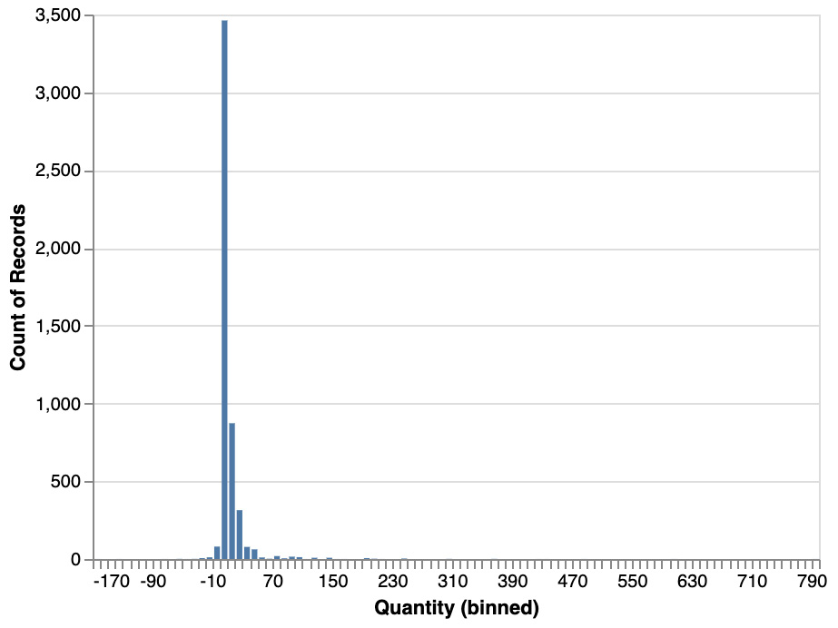
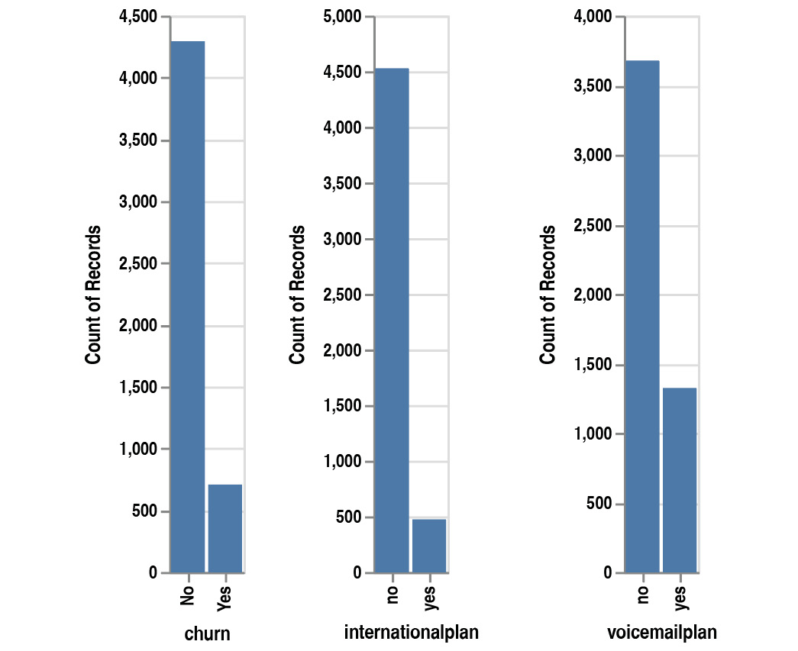

Lab 10. Analyzing a Dataset
=======================


Overview

By the end of this lab, you will be able to explain the key steps
involved in performing exploratory data analysis; identify the types of
data contained in the dataset; summarize the dataset and at a detailed
level for each variable; visualize the data distribution in each column;
find relationships between variables and analyze missing values and
outliers for each variable


Exploring Your Data
===================


Our dataset is an Excel spreadsheet. Luckily, the `pandas`
package provides a method we can use to load this type of file:
`read_excel()`.

Let\'s read the data using the `.read_excel()` method and
store it in a `pandas` DataFrame, as shown in the following
code snippet:

```
import pandas as pd
file_url = 'https://github.com/fenago/'\
           'data-science/blob/'\
           'master/Lab10/dataset/'\
           'Online%20Retail.xlsx?raw=true'
df = pd.read_excel(file_url)
```
After loading the data into a DataFrame, we want to know the size of
this dataset, that is, its number of rows and columns. To get this
information, we just need to call the `.shape` attribute from
`pandas`:

```
df.shape
```

You should get the following output:

```
(541909, 8)
```


Since this attribute returns a tuple, we can access each of its elements
independently by providing the relevant index. Let\'s extract the number
of rows (index `0`):

```
df.shape[0]
```

You should get the following output:

```
541909
```
Similarly, we can get the number of columns with the second index:

```
df.shape[1]
```

You should get the following output:

```
8
```


Once loaded into a `pandas` DataFrame, you can print out its
content by calling it directly:

```
df
```

You should get the following output:


Caption: First few rows of the loaded online retail DataFrame

To access the names of the columns for this DataFrame, we can call the
`.columns` attribute:

```
df.columns
```

You should get the following output:


Caption: List of the column names for the online retail DataFrame


Looking at these names, we can potentially guess what types of
information are contained in these columns, however, to be sure, we can
use the `dtypes` attribute, as shown in the following code
snippet:

```
df.dtypes
```

You should get the following output:


The `pandas` package provides a single method that can display
all the information we have seen so far, that is, the `info()`
method:

```
df.info()
```

You should get the following output:


Caption: Output of the info() method


Analyzing Your Dataset
======================


Previously, we learned about the overall structure of a dataset and the
kind of information it contains. Now, it is time to really dig into it
and look at the values of each column.

First, we need to import the `pandas` package:

```
import pandas as pd
```

Then, we\'ll load the data into a `pandas` DataFrame:

```
file_url = 'https://github.com/fenago/'\
           'data-science/blob/'\
           'master/Lab10/dataset/'\
           'Online%20Retail.xlsx?raw=true'
df = pd.read_excel(file_url)
```


The `head()` method will show the top rows of your dataset. By
default, `pandas` will display the first five rows:

```
df.head()
```

You should get the following output:


Caption: Displaying the first five rows using the head() method


With `pandas`, you can specify the number of top rows to be
displayed with the `head()` method by providing an integer as
its parameter. Let\'s try this by displaying the first `10`
rows:

```
df.head(10)
```

You should get the following output:


Caption: Displaying the first 10 rows using the head() method

Looking at this output, we can assume that the data is sorted by the
`InvoiceDate` column and grouped by `CustomerID` and
`InvoiceNo`. We can only see one value in the
`Country` column: `United Kingdom`. Let\'s check
whether this is really the case by looking at the last rows of the
dataset. This can be achieved by calling the `tail()` method.
Like `head()`, this method, by default, will display only five
rows, but you can specify the number of rows you want as a parameter.
Here, we will display the last eight rows:

```
df.tail(8)
```

You should get the following output:


Caption: Displaying the last eight rows using the tail() method


We can also use the `sample()` method to randomly pick a given
number of rows from the dataset with the `n` parameter. You
can also specify a **seed** (which we covered in *Lab 5*,
*Performing Your First Cluster Analysis*) in order to get reproducible
results if you run the same code again with the `random_state`
parameter:

```
df.sample(n=5, random_state=1)
```

You should get the following output:


Exercise 10.01: Exploring the Ames Housing Dataset with Descriptive Statistics
------------------------------------------------------------------------------

In this exercise, we will explore the `Ames Housing dataset`
in order to get a good understanding of it by analyzing its structure
and looking at some of its rows.


The following steps will help you to complete this exercise:

1.  Open a new Jupyter notebook.

2.  Import the `pandas` package:
    ```
    import pandas as pd
    ```


3.  Assign the link to the AMES dataset to a variable called
    `file_url`:
    ```
    file_url = 'https://raw.githubusercontent.com/'\
               'fenago/data-science/'\
               'master/Lab10/dataset/ames_iowa_housing.csv'
    ```


4.  Use the `.read_csv()` method from the
    `pandas `package and load the dataset into a new variable
    called `df`:
    ```
    df = pd.read_csv(file_url)
    ```


5.  Print the number of rows and columns of the DataFrame using the
    `shape` attribute from the `pandas` package:

    ```
    df.shape
    ```


    You should get the following output:

    ```
    (1460, 81)
    ```


    We can see that this dataset contains `1460` rows and
    `81` different columns.

6.  Print the names of the variables contained in this DataFrame using
    the `columns` attribute from the `pandas`
    package:

    ```
    df.columns
    ```


    You should get the following output:

    


7.  Print out the type of each variable contained in this DataFrame
    using the `dtypes` attribute from the `pandas`
    package:

    ```
    df.dtypes
    ```


    You should get the following output:

    


    Caption: List of columns and their type from the housing
    dataset

    We can see that the variables are either numerical or text types.
    There is no date column in this dataset.

8.  Display the top rows of the DataFrame using the `head()`
    method from `pandas`:

    ```
    df.head()
    ```


    You should get the following output:

    


    Caption: First five rows of the housing dataset

9.  Display the last five rows of the DataFrame using the
    `tail()` method from `pandas`:

    ```
    df.tail()
    ```


    You should get the following output:

    


    Caption: Last five rows of the housing dataset

    It seems that the `Alley` column has a lot of missing
    values, which are represented by the `NaN` value (which
    stands for `Not a Number`). The `Street` and
    `Utilities` columns seem to have only one value.

10. Now, display `5` random sampled rows of the DataFrame
    using the `sample()` method from `pandas` and
    pass it a `'random_state'` of `8`:

    ```
    df.sample(n=5, random_state=8)
    ```


    You should get the following output:

    


We learned quite a lot about this dataset in just a few lines of code,
such as the number of rows and columns, the data type of each variable,
and their information. We also identified some issues with missing
values.

 
Analyzing the Content of a Categorical Variable
===============================================


Now that we\'ve got a good feel for the kind of information contained in
the `online retail dataset`, we want to dig a little deeper
into each of its columns:

```
import pandas as pd
file_url = 'https://github.com/fenago/'\
           'data-science/blob'\
           '/master/Lab10/dataset/'\
           'Online%20Retail.xlsx?raw=true'
df = pd.read_excel(file_url)
```
For instance, we would like to know how many different values are
contained in each of the variables by calling the `nunique()`
method. This is particularly useful for a categorical variable with a
limited number of values, such as `Country`:

```
df['Country'].nunique()
```

You should get the following output:

```
38
```
We can see that there are 38 different countries in this dataset. It
would be great if we could get a list of all the values in this column.
Thankfully, the `pandas` package provides a method to get
these results: `unique()`:

```
df['Country'].unique()
```

You should get the following output:


Caption: List of unique values for the \'Country\' column


Another very useful method from `pandas `is
`value_counts()`. This method lists all the values from a
given column but also their occurrence. By providing the
`dropna=False` and `normalise=True` parameters, this
method will include the missing value in the listing and calculate the
number of occurrences as a ratio, respectively:

```
df['Country'].value_counts(dropna=False, normalize=True)
```

You should get the following output:


From this output, we can see that the `United Kingdom` value
is totally dominating this column as it represents over 91% of the rows
and that other values such as `Austria` and
`Denmark` are quite rare as they represent less than 1% of
this dataset.


Exercise 10.02: Analyzing the Categorical Variables from the Ames Housing Dataset
---------------------------------------------------------------------------------

In this exercise, we will continue our dataset exploration by analyzing
the categorical variables of this dataset. To do so, we will implement
our own `describe` functions.


1.  Open a new Jupyter notebook.

2.  Import the `pandas `package:
    ```
    import pandas as pd
    ```


3.  Assign the following link to the AMES dataset to a variable called
    `file_url`:
    ```
    file_url = 'https://raw.githubusercontent.com/'\
               'fenago/data-science/'\
               'master/Lab10/dataset/ames_iowa_housing.csv'
    ```


4.  Use the `.read_csv()` method from the `pandas`
    package and load the dataset into a new variable called
    `df`:
    ```
    df = pd.read_csv(file_url)
    ```


5.  Create a new DataFrame called `obj_df` with only the
    columns that are of numerical types using the
    `select_dtypes` method from `pandas` package.
    Then, pass in the `object` value to the
    `include `parameter:
    ```
    obj_df = df.select_dtypes(include='object')
    ```


6.  Using the `columns` attribute from `pandas`,
    extract the list of columns of this DataFrame, `obj_df`,
    assign it to a new variable called `obj_cols`, and print
    its content:

    ```
    obj_cols = obj_df.columns
    obj_cols
    ```


    You should get the following output:

    


    Caption: List of categorical variables

7.  Create a function called `describe_object` that takes a
    `pandas `DataFrame and a column name as input parameters.
    Then, inside the function, print out the name of the given column,
    its number of unique values using the `nunique()` method,
    and the list of values and their occurrence using the
    `value_counts()` method, as shown in the following code
    snippet:
    ```
    def describe_object(df, col_name):
        print(f"\nCOLUMN: {col_name}")
        print(f"{df[col_name].nunique()} different values")
        print(f"List of values:")
        print(df[col_name].value_counts\
                           (dropna=False, normalize=True))
    ```


8.  Test this function by providing the `df` DataFrame and the
    `'MSZoning'` column:

    ```
    describe_object(df, 'MSZoning')
    ```


    You should get the following output:

    


    Caption: Display of the created function for the MSZoning
    column

    For the `MSZoning` column, the `RL` value
    represents almost `79%` of the values, while `C`
    `(all)` is only present in less than `1%` of the
    rows.

9.  Create a `for `loop that will call the created function
    for every element from the `obj_cols` list:

    ```
    for col_name in obj_cols:
        describe_object(df, col_name)
    ```


    You should get the following output:

    


Summarizing Numerical Variables
===============================


With the `pandas` package, a lot of these measures have been
implemented as methods. For instance, if we want to know what the
highest value contained in the `'Quantity'` column is, we can
use the `.max()` method:

```
df['Quantity'].max()
```

You should get the following output:

```
80995
```
We can see that the maximum quantity of an item sold in this dataset is
`80995`, which seems extremely high for a retail business. In
a real project, this kind of unexpected value will have to be discussed
and confirmed with the data owner or key stakeholders to see whether
this is a genuine or an incorrect value. Now, let\'s have a look at the
lowest value for `'Quantity'` using the `.min()`
method:

```
df['Quantity'].min()
```

You should get the following output:

```
-80995
```


If we plot the `Quantity `column on a graph with its average,
it would look as follows:


Caption: Average value for the \'Quantity\' column

We can see the average for the `Quantity `column is very close
to 0 and most of the data is between `-50` and
`+50`.

We can get the average value of a feature by using the
`mean()` method from `pandas`:

```
df['Quantity'].mean()
```

You should get the following output:

```
9.55224954743324
```

In this dataset, the average quantity of items sold is around
`9.55`. The average measure is very sensitive to outliers and,
as we saw previously, the minimum and maximum values of the
`Quantity` column are quite extreme
(`-80995 to +80995`).

We can use the median instead as another measure of central tendency.
The median is calculated by splitting the column into two groups of
equal lengths and getting the value of the middle point by separating
these two groups, as shown in the following example:


Caption: Sample median example

In `pandas`, you can call the `median()` method to
get this value:

```
df['Quantity'].median()
```

You should get the following output:

```
3.0
```

We can also evaluate the spread of this column (how much the data points
vary from the central point). A common measure of spread is the standard
deviation. The smaller this measure is, the closer the data is to its
mean. On the other hand, if the standard deviation is high, this means
there are some observations that are far from the average. We will use
the `std()` method from `pandas `to calculate this
measure:

```
df['Quantity'].std()
```

You should get the following output:

```
218.08115784986612
```
As expected, the standard deviation for this column is quite high, so
the data is quite spread from the average, which is `9.55` in
this example.

In the `pandas `package, there is a method that can display
most of these descriptive statistics with one single line of code:
`describe()`:

```
df.describe()
```

You should get the following output:


Caption: Output of the describe() method


Exercise 10.03: Analyzing Numerical Variables from the Ames Housing Dataset
---------------------------------------------------------------------------

In this exercise, we will continue our dataset exploration by analyzing
the numerical variables of this dataset. To do so, we will implement our
own `describe `functions.


1.  Open a new Jupyter notebook.

2.  Import the `pandas` package:
    ```
    import pandas as pd
    ```


3.  Assign the link to the AMES dataset to a variable called
    `file_url`:
    ```
    file_url = 'https://raw.githubusercontent.com/'\
               'fenago/data-science/'\
               'master/Lab10/dataset/ames_iowa_housing.csv'
    ```


4.  Use the `.read_csv()` method from the
    `pandas `package and load the dataset into a new variable
    called `df`:
    ```
    df = pd.read_csv(file_url)
    ```


5.  Create a new DataFrame called `num_df` with only the
    columns that are numerical using the `select_dtypes`
    method from the `pandas `package and pass in the
    `'number'` value to the `include` parameter:
    ```
    num_df = df.select_dtypes(include='number')
    ```


6.  Using the `columns` attribute from `pandas`,
    extract the list of columns of this DataFrame, `num_df`,
    assign it to a new variable called `num_cols`, and print
    its content:

    ```
    num_cols = num_df.columns
    num_cols
    ```


    You should get the following output:

    


    Caption: List of numerical columns

7.  Create a function called `describe_numeric` that takes a
    `pandas `DataFrame and a column name as input parameters.
    Then, inside the function, print out the name of the given column,
    its minimum value using `min()`, its maximum value using
    `max()`, its average value using `mean()`, its
    standard deviation using `std()`, and its
    `median` using `median()`:
    ```
    def describe_numeric(df, col_name):
        print(f"\nCOLUMN: {col_name}")
        print(f"Minimum: {df[col_name].min()}")
        print(f"Maximum: {df[col_name].max()}")
        print(f"Average: {df[col_name].mean()}")
        print(f"Standard Deviation: {df[col_name].std()}")
        print(f"Median: {df[col_name].median()}")
    ```


8.  Now, test this function by providing the `df` DataFrame
    and the `SalePrice` column:

    ```
    describe_numeric(df, 'SalePrice')
    ```


    You should get the following output:

    


9.  Create a `for `loop that will call the created function
    for every element from the `num_cols` list:

    ```
    for col_name in num_cols:
        describe_numeric(df, col_name)
    ```


    You should get the following output:

    


Using the Altair API
--------------------


Let\'s see how we can display a bar chart step by step on the online
retail dataset.

First, import the `pandas` and `altair` packages:

```
import pandas as pd
import altair as alt
```

Then, load the data into a `pandas` DataFrame:

```
file_url = 'https://github.com/fenago/'\
           'data-science/blob/'\
           'master/Lab10/dataset/'\
           'Online%20Retail.xlsx?raw=true'
df = pd.read_excel(file_url)
```
We will randomly sample 5,000 rows of this DataFrame using the
`sample()` method (`altair `requires additional
steps in order to display a larger dataset):

```
sample_df = df.sample(n=5000, random_state=8)
```
Now instantiate a `Chart` object from `altair` with
the `pandas `DataFrame as its input parameter:

```
base = alt.Chart(sample_df)
```
Next, we call the `mark_circle()` method to specify the type
of graph we want to plot: a scatter plot:

```
chart = base.mark_circle()
```
Finally, we specify the names of the columns that will be displayed on
the *x* and *y* axes using the `encode()` method:

```
chart.encode(x='Quantity', y='UnitPrice')
```
We just plotted a scatter plot in seven lines of code:


Caption: Output of the scatter plot

Altair provides the option for combining its methods all together into
one single line of code, like this:

```
alt.Chart(sample_df).mark_circle()\
   .encode(x='Quantity', y='UnitPrice')
```

You should get the following output:


Caption: Output of the scatter plot with combined altair methods


Now, let\'s say we want to visualize the same plot while adding the
`Country` column\'s information. One easy way to do this is to
use the `color` parameter from the `encode()`
method. This will color all the data points according to their value in
the `Country` column:

```
alt.Chart(sample_df).mark_circle()\
   .encode(x='Quantity', y='UnitPrice', color='Country')
```

You should get the following output:


Caption: Scatter plot with colors based on the \'Country\' column


With `altair`, we can easily add some interactions on the
graph in order to display more information for each observation; we just
need to use the `tooltip` parameter from the
`encode()` method and specify the list of columns to be
displayed and then call the `interactive()` method to make the
whole thing interactive (as seen previously in *Lab 5*, *Performing
Your First Cluster Analysis*):

```
alt.Chart(sample_df).mark_circle()\
   .encode(x='Quantity', y='UnitPrice', color='Country', \
           tooltip=['InvoiceNo','StockCode','Description',\
                    'InvoiceDate','CustomerID']).interactive()
```

You should get the following output:


Caption: Interactive scatter plot with tooltip

Now, if we hover on the observation with the highest
`UnitPrice` value (the one near 600), we can see the
information displayed by the tooltip: this observation doesn\'t have any
value for `StockCode` and its `Description` is
`Manual`. So, it seems that this is not a normal transaction
to happen on the website. It may be a special order that has been
manually entered into the system. This is something you will have to
discuss with your stakeholder and confirm.


Histogram for Numerical Variables
---------------------------------

Now that we are familiar with the `altair` API, let\'s have a
look at some specific type of charts that will help us analyze and
understand each variable. First, let\'s focus on numerical variables
such as `UnitPrice` or `Quantity` in the online
retail dataset.


```
alt.Chart(sample_df).mark_bar()\
   .encode(alt.X("UnitPrice:Q", bin=True), \
           y='count()')
```

You should get the following output:


Caption: Histogram for UnitPrice with the default bin step size

By default, `altair` grouped the observations by bins of 100
steps: 0 to 100, then 100 to 200, and so on. The step size that was
chosen is not optimal as almost all the observations fell under the
first bin (0 to 100) and we can\'t see any other bin. With
`altair`, we can specify the values of the parameter bin and
we will try this with 5, that is, `alt.Bin(step=5)`:

```
alt.Chart(sample_df).mark_bar()\
   .encode(alt.X("UnitPrice:Q", bin=alt.Bin(step=5)), \
           y='count()')
```

You should get the following output:


Caption: Histogram for UnitPrice with a bin step size of 5


Let\'s plot the histogram for the `Quantity` column with a bin
step size of 10:

```
alt.Chart(sample_df).mark_bar()\
   .encode(alt.X("Quantity:Q", bin=alt.Bin(step=10)), \
           y='count()')
```

You should get the following output:



Caption: Histogram for Quantity with a bin step size of 10


Bar Chart for Categorical Variables
-----------------------------------

Now, we are going to have a look at categorical variables. For such
variables, there is no need to group the values into bins as, by
definition, they have a limited number of potential values. We can still
plot the distribution of such columns using a simple bar chart. In
`altair`, this is very simple -- it is similar to plotting a
histogram but without the `bin` parameter. Let\'s try this on
the `Country` column and look at the number of records for
each of its values:

```
alt.Chart(sample_df).mark_bar()\
   .encode(x='Country',y='count()')
```

You should get the following output:


Caption: Bar chart of the Country column\'s occurrence

We can confirm that `United Kingdom` is the most represented
country in this dataset (and by far), followed by `Germany`,
`France`, and `EIRE`. We clearly have imbalanced
data that may affect the performance of a predictive model. In *Lab
13*, *Imbalanced Datasets*, we will look at how we can handle this
situation.

Now, let\'s analyze the datetime column, that is,
`InvoiceDate`. The `altair` package provides some
functionality that we can use to group datetime information by period,
such as day, day of week, month, and so on. For instance, if we want to
have a monthly view of the distribution of a variable, we can use the
`yearmonth` function to group datetimes. We also need to
specify that the type of this variable is ordinal (there is an order
between the values) by adding `:O` to the column name:

```
alt.Chart(sample_df).mark_bar()\
   .encode(alt.X('yearmonth(InvoiceDate):O'),\
           y='count()')
```

You should get the following output:


Caption: Distribution of InvoiceDate by month

This graph tells us that there was a huge spike of items sold in
November 2011. It peaked to 800 items sold in this month, while the
average is around 300. Was there a promotion or an advertising campaign
run at that time that can explain this increase? These are the questions
you may want to ask your stakeholders so that they can confirm this
sudden increase of sales.


Boxplots
========


Another benefit of using a boxplot is to plot the distribution of
categorical variables against a numerical variable and compare them.
Let\'s try it with the `Country` and `Quantity`
columns using the `mark_boxplot()` method:

```
alt.Chart(sample_df).mark_boxplot()\
   .encode(x='Country:O', y='Quantity:Q')
```

You should receive the following output:


Caption: Boxplot of the \'Country\' and \'Quantity\' columns


Exercise 10.04: Visualizing the Ames Housing Dataset with Altair
----------------------------------------------------------------

In this exercise, we will learn how to get a better understanding of a
dataset and the relationship between variables using data visualization
features such as histograms, scatter plots, or boxplots.

Note

You will be using the same Ames housing dataset that was used in the
previous exercises.

1.  Open a new Jupyter notebook.

2.  Import the `pandas` and `altair` packages:
    ```
    import pandas as pd
    import altair as alt
    ```


3.  Assign the link to the AMES dataset to a variable called
    `file_url`:
    ```
    file_url = 'https://raw.githubusercontent.com/'\
               'fenago/data-science/'\
               'master/Lab10/dataset/ames_iowa_housing.csv'
    ```


4.  Using the `read_csv` method from the pandas package, load
    the dataset into a new variable called `'df'`:

    ```
    df = pd.read_csv(file_url)
    ```


    Plot the histogram for the `SalePrice` variable using the
    `mark_bar()` and `encode()` methods from the
    `altair` package. Use the `alt.X` and
    `alt.Bin` APIs to specify the number of bin steps, that
    is, `50000`:

    ```
    alt.Chart(df).mark_bar()\
       .encode(alt.X("SalePrice:Q", bin=alt.Bin(step=50000)),\
               y='count()')
    ```


    You should get the following output:

    


    Caption: Histogram of SalePrice

    This chart shows that most of the properties have a sale price
    centered around `100,000 – 150,000`. There are also a few
    outliers with a high sale price over `500,000`.

5.  Now, let\'s plot the histogram for `LotArea` but this time
    with a bin step size of `10000`:

    ```
    alt.Chart(df).mark_bar()\
       .encode(alt.X("LotArea:Q", bin=alt.Bin(step=10000)),\
               y='count()')
    ```


    You should get the following output:

    


    Caption: Histogram of LotArea

    `LotArea` has a totally different distribution compared to
    `SalePrice`. Most of the observations are between
    `0` and `20,000`. The rest of the observations
    represent a small portion of the dataset. We can also notice some
    extreme outliers over `150,000`.

6.  Now, plot a scatter plot with `LotArea` as the *x* axis
    and `SalePrice` as the *y* axis to understand the
    interactions between these two variables:

    ```
    alt.Chart(df).mark_circle()\
       .encode(x='LotArea:Q', y='SalePrice:Q')
    ```


    You should get the following output:

    


    Caption: Scatter plot of SalePrice and LotArea


7.  Now, let\'s plot the histogram for `OverallCond`, but this
    time with the default bin step size, that is,
    (`bin=True`):

    ```
    alt.Chart(df).mark_bar()\
       .encode(alt.X("OverallCond", bin=True), \
               y='count()')
    ```


    You should get the following output:

    


    Caption: Histogram of OverallCond


8.  Build a boxplot with `OverallCond:O` (`':O'` is
    for specifying that this column is ordinal) on the *x* axis and
    `SalePrice` on the *y* axis using the
    `mark_boxplot()` method, as shown in the following code
    snippet:

    ```
    alt.Chart(df).mark_boxplot()\
       .encode(x='OverallCond:O', y='SalePrice:Q')
    ```


    You should get the following output:

    


    Caption: Boxplot of OverallCond


9.  Now, let\'s plot a bar chart for `YrSold` as its *x* axis
    and `count()` as its *y* axis. Don\'t forget to specify
    that `YrSold` is an ordinal variable and not numerical
    using `':O'`:

    ```
    alt.Chart(df).mark_bar()\
       .encode(alt.X('YrSold:O'), y='count()')
    ```


    You should get the following output:

    


    Caption: Bar chart of YrSold


10. Plot a boxplot similar to the one shown in *Step 8* but for
    `YrSold` as its *x* axis:

    ```
    alt.Chart(df).mark_boxplot()\
       .encode(x='YrSold:O', y='SalePrice:Q')
    ```


    You should get the following output:

    


    Caption: Boxplot of YrSold and SalePrice

    Overall, the median sale price is quite stable across the years,
    with a slight decrease in 2010.

11. Let\'s analyze the relationship between `SalePrice` and
    `Neighborhood` by plotting a bar chart, similar to the one
    shown in *Step 9*:

    ```
    alt.Chart(df).mark_bar()\
       .encode(x='Neighborhood',y='count()')
    ```


    You should get the following output:

    


    Caption: Bar chart of Neighborhood


12. Let\'s analyze the relationship between `SalePrice` and
    `Neighborhood` by plotting a boxplot chart similar to the
    one in *Step 10*:

    ```
    alt.Chart(df).mark_boxplot()\
       .encode(x='Neighborhood:O', y='SalePrice:Q')
    ```


    You should get the following output:

    


Caption: Boxplot of Neighborhood and SalePrice


Activity 10.01: Analyzing Churn Data Using Visual Data Analysis Techniques
--------------------------------------------------------------------------

You are working for a major telecommunications company. The marketing
department has noticed a recent spike of customer churn (*customers that
stopped using or canceled their service from the company*).


The following steps will help you complete this activity:

1.  Download and load the dataset into Python using
    `.read_csv()`.
2.  Explore the structure and content of the dataset by using
    `.shape`, `.dtypes`, `.head()`,
    `.tail()`, or `.sample()`.
3.  Calculate and interpret descriptive statistics with
    `.describe()`.
4.  Analyze each variable using data visualization with bar charts,
    histograms, or boxplots.
5.  Identify areas that need clarification from the marketing department
    and potential data quality issues.

**Expected Output**

Here is the expected bar chart output:



Caption: Expected bar chart output

Here is the expected histogram output:


Caption: Expected histogram output

Here is the expected boxplot output:


Caption: Expected boxplot output


Summary
=======


You just learned a lot regarding how to analyze a dataset. This a very
critical step in any data science project. Getting a deep understanding
of the dataset will help you to better assess the feasibility of
achieving the requirements from the business.

You learned how to use descriptive statistics to summarize key
attributes of the dataset such as the average value of a numerical
column, its spread with standard deviation or its range (minimum and
maximum values), the unique values of a categorical variable, and its
most frequent values. You also saw how to use data visualization to get
valuable insights for each variable. Now, you know how to use scatter
plots, bar charts, histograms, and boxplots to understand the
distribution of a column.

