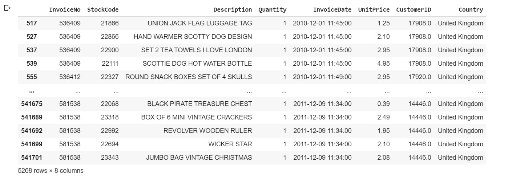
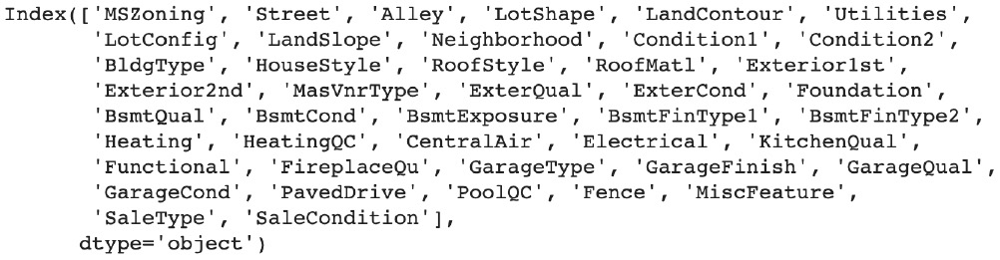

Lab 11. Data Preparation
====================


Overview

By the end of this lab you will be able to filter DataFrames with
specific conditions; remove duplicate or irrelevant records or columns;
convert variables into different data types; replace values in a column
and handle missing values and outlier observations.

This lab will introduce you to the main techniques you can use to
handle data issues in order to achieve high quality for your dataset
prior to modeling it.


Handling Row Duplication
========================


Let\'s use the example that we saw in *Lab 10*, *Analyzing a
Dataset*.

Start by **importing** the dataset into a DataFrame:

```
import pandas as pd
file_url = 'https://github.com/fenago/'\
           'data-science/blob/'\
           'master/Lab10/dataset/'\
           'Online%20Retail.xlsx?raw=true'
df = pd.read_excel(file_url)
```

The `duplicated()` method from `pandas` checks
whether any of the rows are duplicates and returns a **boolean** value
for each row, `True` if the row is a duplicate and
`False` if not:

```
df.duplicated()
```

You should get the following output:


Caption: Output of the duplicated() method


In Python, the `True` and `False` binary values
correspond to the numerical values 1 and 0, respectively. To find out
how many rows have been identified as duplicates, you can use the
`sum()` method on the output of `duplicated()`. This
will add all the 1s (that is, `True` values) and gives us the
count of duplicates:

```
df.duplicated().sum()
```

You should get the following output:

```
5268
```
Since the output of the `duplicated()` method is a
`pandas` series of binary values for each row, you can also
use it to subset the rows of a DataFrame. The `pandas` package
provides different APIs for subsetting a DataFrame, as follows:

- df\[\<rows\> or \<columns\>\]
- df.loc\[\<rows\>, \<columns\>\]
- df.iloc\[\<rows\>, \<columns\>\]

The first API subsets the DataFrame by **row** or **column**. To filter
specific columns, you can provide a list that contains their names. For
instance, if you want to keep only the variables, that is,
`InvoiceNo`, `StockCode`, `InvoiceDate`,
and `CustomerID`, you need to use the following code:

```
df[['InvoiceNo', 'StockCode', 'InvoiceDate', 'CustomerID']]
```

You should get the following output:


Caption: Subsetting columns

If you only want to filter the rows that are considered duplicates, you
can use the same API call with the output of the
`duplicated()` method. It will only keep the rows with
**True** as a value:

```
df[df.duplicated()]
```

You should get the following output:



Caption: Subsetting the duplicated rows

If you want to subset the rows and columns at the same time, you must
use one of the other two available APIs: `.loc` or
`.iloc`. These APIs do the exact same thing but
`.loc` uses labels or names while `.iloc` only takes
indices as input. You will use the `.loc` API to subset the
duplicated rows and keep only the selected four columns, as shown in the
previous example:

```
df.loc[df.duplicated(), ['InvoiceNo', 'StockCode', \
                         'InvoiceDate', 'CustomerID']]
```

You should get the following output:


Caption: Subsetting the duplicated rows and selected columns using
.loc

This preceding output shows that the first few duplicates are row
numbers `517`, `527`, `537`, and so on. By
default, `pandas` doesn\'t mark the first occurrence of
duplicates as duplicates: all the same, duplicates will have a value of
`True` except for the first occurrence. You can change this
behavior by specifying the `keep` parameter. If you want to
keep the last duplicate, you need to specify `keep='last'`:

```
df.loc[df.duplicated(keep='last'), ['InvoiceNo', 'StockCode', \
                                    'InvoiceDate', 'CustomerID']]
```

You should get the following output:


Caption: Subsetting the last duplicated rows

As you can see from the previous outputs, row `485` has the
same value as row `539`. As expected, row `539` is
not marked as a duplicate anymore. If you want to mark all the duplicate
records as duplicates, you will have to use `keep=False`:

```
df.loc[df.duplicated(keep=False), ['InvoiceNo', 'StockCode',\
                                   'InvoiceDate', 'CustomerID']]
```

You should get the following output:


Caption: Subsetting all the duplicated rows

This time, rows `485` and `539` have been listed as
duplicates. Now that you know how to identify duplicate observations,
you can decide whether you wish to remove them from the dataset. As we
mentioned previously, you must be careful when changing the data. You
may want to confirm with the business that they are comfortable with you
doing so. You will have to explain the reason why you want to remove
these rows. In the Online Retail dataset, if you take rows
`485` and `539` as an example, these two
observations are identical. From a business perspective, this means that
a specific customer (`CustomerID 17908`) has bought the same
item (`StockCode 22111`) at the exact same date and time
(`InvoiceDate 2010-12-01 11:45:00`) on the same invoice
(`InvoiceNo 536409`). This is highly suspicious. When you\'re
talking with the business, they may tell you that new software was
released at that time and there was a bug that was splitting all the
purchased items into single-line items.

In this case, you know that you shouldn\'t remove these rows. On the
other hand, they may tell you that duplication shouldn\'t happen and
that it may be due to human error as the data was entered or during the
data extraction step. Let\'s assume this is the case; now, it is safe
for you to remove these rows.

To do so, you can use the `drop_duplicates()` method from
`pandas`. It has the same `keep` parameter as
`duplicated()`, which specifies which duplicated record you
want to keep or if you want to remove all of them. In this case, we want
to keep at least one duplicate row. Here, we want to keep the first
occurrence:

```
df.drop_duplicates(keep='first')
```

You should get the following output:


Caption: Dropping duplicate rows with keep=\'first\'

The output of this method is a new DataFrame that contains unique
records where only the first occurrence of duplicates has been kept. If
you want to replace the existing DataFrame rather than getting a new
DataFrame, you need to use the `inplace=True` parameter.

The `drop_duplicates()` and `duplicated()` methods
also have another very useful parameter: `subset`. This
parameter allows you to specify the list of columns to consider while
looking for duplicates. By default, all the columns of a DataFrame are
used to find duplicate rows. Let\'s see how many duplicate rows there
are while only looking at the `InvoiceNo`,
`StockCode`, `invoiceDate`, and
`CustomerID` columns:

```
df.duplicated(subset=['InvoiceNo', 'StockCode', 'InvoiceDate',\
                      'CustomerID'], keep='first').sum()
```

You should get the following output:

```
10677
```

By looking only at these four columns instead of all of them, we can see
that the number of duplicate rows has increased from `5268` to
`10677`. This means that there are rows that have the exact
same values as these four columns but have different values in other
columns, which means they may be different records. In this case, it is
better to use all the columns to identify duplicate records.


Exercise 11.01: Handling Duplicates in a Breast Cancer Dataset
--------------------------------------------------------------

In this exercise, you will learn how to identify duplicate records and
how to handle such issues so that the dataset only contains **unique**
records. Let\'s get started:


1.  Open a new **Jupyter** notebook.

2.  Import the `pandas` package:
    ```
    import pandas as pd
    ```


3.  Assign the link to the `Breast Cancer` dataset to a
    variable called `file_url`:
    ```
    file_url = 'https://raw.githubusercontent.com/'\
               'fenago/data-science/'\
               'master/Lab11/dataset/'\
               'breast-cancer-wisconsin.data'
    ```


4.  Using the `read_csv()` method from the `pandas`
    package, load the dataset into a new variable called `df`
    with the `header=None` parameter. We\'re doing this
    because this file doesn\'t contain column names:
    ```
    df = pd.read_csv(file_url, header=None)
    ```


5.  Create a variable called `col_names` that contains the
    names of the columns:
    `Sample code number, Clump Thickness, Uniformity of Cell Size, Uniformity of Cell Shape, Marginal Adhesion, Single Epithelial Cell Size, Bare Nuclei, Bland Chromatin, Normal Nucleoli, Mitoses`,
    and `Class`:


    ```
    col_names = ['Sample code number','Clump Thickness',\
                 'Uniformity of Cell Size',\
                 'Uniformity of Cell Shape',\
                 'Marginal Adhesion','Single Epithelial Cell Size',\
                 'Bare Nuclei','Bland Chromatin',\
                 'Normal Nucleoli','Mitoses','Class'] 
    ```


6.  Assign the column names of the DataFrame using the
    `columns` attribute:
    ```
    df.columns = col_names
    ```


7.  Display the shape of the DataFrame using the `.shape`
    attribute:

    ```
    df.shape
    ```


    You should get the following output:

    ```
    (699, 11)
    ```


    This DataFrame contains `699` rows and `11`
    columns.

8.  Display the first five rows of the DataFrame using the
    `head()` method:

    ```
    df.head()
    ```


    You should get the following output:

    


    Caption: The first five rows of the Breast Cancer dataset

    All the variables are numerical. The Sample code number column is an
    identifier for the measurement samples.

9.  Find the number of duplicate rows using the `duplicated()`
    and `sum()` methods:

    ```
    df.duplicated().sum()
    ```


    You should get the following output:

    ```
    8
    ```


    Looking at the 11 columns in this dataset, we can see that there are
    `8` duplicate rows.

10. Display the duplicate rows using the `loc()` and
    `duplicated()` methods:

    ```
    df.loc[df.duplicated()]
    ```


    You should get the following output:

    


    Caption: Duplicate records

    The following rows are duplicates: `208`, `253`,
    `254`, `258`, `272`, `338`,
    `561`, and `684`.

11. Display the duplicate rows just like we did in *Step 9*, but with
    the `keep='last'` parameter instead:

    ```
    df.loc[df.duplicated(keep='last')]
    ```


    You should get the following output:

    


    Caption: Duplicate records with keep=\'last\'

    By using the `keep='last'` parameter, the following rows
    are considered duplicates: `42`, `62`,
    `168`, `207`, `267`, `314`,
    `560`, and `683`. By comparing this output to
    the one from the previous step, we can see that rows 253 and 42 are
    identical.

12. Remove the duplicate rows using the `drop_duplicates()`
    method along with the `keep='first'` parameter and save
    this into a new DataFrame called `df_unique`:
    ```
    df_unique = df.drop_duplicates(keep='first')
    ```


13. Display the shape of `df_unique` with the
    `.shape` attribute:

    ```
    df_unique.shape
    ```


    You should get the following output:

    ```
    (691, 11)
    ```


    Now that we have removed the eight duplicate records, only
    `691` rows remain. Now, the dataset only contains unique
    observations.


In this exercise, you learned how to identify and remove duplicate
records from a real-world dataset.


Converting Data Types
=====================


Another problem you may face in a project is incorrect data types being
inferred for some columns. As we saw in *Lab 10*, *Analyzing a
Dataset*, the `pandas` package provides us with a very easy
way to display the data type of each column using the
`.dtypes` attribute. You may be wondering, when did
`pandas` identify the type of each column? The types are
detected when you load the dataset into a `pandas` DataFrame
using methods such as `read_csv()`, `read_excel()`,
and so on.

When you\'ve done this, `pandas` will try its best to
automatically find the best type according to the values contained in
each column. Let\'s see how this works on the `Online Retail`
dataset.

First, you must import `pandas`:

```
import pandas as pd
```

Then, you need to assign the URL to the dataset to a new variable:

```
file_url = 'https://github.com/fenago/'\
           'data-science/blob/'\
           'master/Lab10/dataset/'\
           'Online%20Retail.xlsx?raw=true'
```
Let\'s load the dataset into a `pandas` DataFrame using
`read_excel()`:

```
df = pd.read_excel(file_url)
```
Finally, let\'s print the data type of each column:

```
df.dtypes
```

You should get the following output:


Caption: The data type of each column of the Online Retail dataset

The preceding output shows the data types that have been assigned to
each column. `Quantity`, `UnitPrice`, and
`CustomerID` have been identified as numerical variables
(`int64`, `float64`), `InvoiceDate` is a
`datetime` variable, and all the other columns are considered
text (`object`). This is not too bad. `pandas` did a
great job of recognizing non-text columns.

But what if you want to change the types of some columns? You have two
ways to achieve this.

The first way is to reload the dataset, but this time, you will need to
specify the data types of the columns of interest using the
`dtype` parameter. This parameter takes a dictionary with the
column names as keys and the correct data types as values, such as
{\'col1\': np.float64, \'col2\': np.int32}, as input. Let\'s try this on
`CustomerID`. We know this isn\'t a numerical variable as it
contains a unique **identifier** (code). Here, we are going to change
its type to **object**:

```
df = pd.read_excel(file_url, dtype={'CustomerID': 'category'})
df.dtypes
```

You should get the following output:


Caption: The data types of each column after converting CustomerID

As you can see, the data type for `CustomerID` has effectively
changed to a `category` type.

Now, let\'s look at the second way of converting a single column into a
different type. In `pandas`, you can use the
`astype()` method and specify the new data type that it will
be converted into as its **parameter**. It will return a new column (a
new `pandas` series, to be more precise), so you need to
reassign it to the same column of the DataFrame. For instance, if you
want to change the `InvoiceNo` column into a categorical
variable, you would do the following:

```
df['InvoiceNo'] = df['InvoiceNo'].astype('category')
df.dtypes
```

You should get the following output:


Caption: The data types of each column after converting InvoiceNo

As you can see, the data type for `InvoiceNo` has changed to a
categorical variable. The difference between `object` and
`category` is that the latter has a finite number of possible
values (also called discrete variables). Once these have been changed
into categorical variables, `pandas` will automatically list
all the values. They can be accessed using the
`.cat.categories` attribute:

```
df['InvoiceNo'].cat.categories
```

You should get the following output:


Caption: List of categories (possible values) for the InvoiceNo
categorical variable

`pandas` has identified that there are 25,900 different values
in this column and has listed all of them. Depending on the data type
that\'s assigned to a variable, `pandas` provides different
attributes and methods that are very handy for data transformation or
feature engineering (this will be covered in *Lab 12*, *Feature
Engineering*).

As a final note, you may be wondering when you would use the first way
of changing the types of certain columns (while loading the dataset). To
find out the current type of each variable, you must load the data
first, so why will you need to reload the data again with new data
types? It will be easier to change the type with the
`astype()` method after the first load. There are a few
reasons why you would use it. One reason could be that you have already
explored the dataset on a different tool, such as Excel, and already
know what the correct data types are.

The second reason could be that your dataset is big, and you cannot load
it in its entirety. As you may have noticed, by default,
`pandas` use 64-bit encoding for numerical variables. This
requires a lot of memory and may be overkill.

For example, the `Quantity` column has an int64 data type,
which means that the range of possible values is
-9,223,372,036,854,775,808 to 9,223,372,036,854,775,807. However, in
*Lab 10*, *Analyzing a Dataset* while analyzing the distribution of
this column, you learned that the range of values for this column is
only from -80,995 to 80,995. You don\'t need to use so much space. By
reducing the data type of this variable to int32 (which ranges from
-2,147,483,648 to 2,147,483,647), you may be able to reload the entire
dataset.


Exercise 11.02: Converting Data Types for the Ames Housing Dataset
------------------------------------------------------------------

In this exercise, you will prepare a dataset by converting its variables
into the correct data types.

You will use the Ames Housing dataset to do this, which we also used in
*Lab 10*, *Analyzing a Dataset*. For more information about this
dataset, refer to the following note. Let\'s get started:


1.  Open a new Jupyter notebook.

2.  Import the `pandas` package:
    ```
    import pandas as pd
    ```


3.  Assign the link to the Ames dataset to a variable called
    `file_url`:
    ```
    file_url = 'https://raw.githubusercontent.com/'\
               'fenago/data-science/'\
               'master/Lab10/dataset/ames_iowa_housing.csv'
    ```


4.  Using the `read_csv` method from the `pandas`
    package, load the dataset into a new variable called `df`:
    ```
    df = pd.read_csv(file_url)
    ```


5.  Print the data type of each column using the `dtypes`
    attribute:

    ```
    df.dtypes
    ```


    You should get the following output:

    


    Caption: List of columns and their assigned data types

    Note

    The preceding output has been truncated.

    From *Lab 10*, *Analyzing a Dataset* you know that the
    `Id`, `MSSubClass`, `OverallQual`, and
    `OverallCond` columns have been incorrectly classified as
    numerical variables. They have a finite number of unique values and
    you can\'t perform any mathematical operations on them. For example,
    it doesn\'t make sense to add, remove, multiply, or divide two
    different values from the `Id` column. Therefore, you need
    to convert them into categorical variables.

6.  Using the `astype()` method, convert the `'Id'`
    column into a categorical variable, as shown in the following code
    snippet:
    ```
    df['Id'] = df['Id'].astype('category')
    ```


7.  Convert the `'MSSubClass'`, `'OverallQual'`, and
    `'OverallCond'` columns into categorical variables, like
    we did in the previous step:
    ```
    df['MSSubClass'] = df['MSSubClass'].astype('category')
    df['OverallQual'] = df['OverallQual'].astype('category')
    df['OverallCond'] = df['OverallCond'].astype('category')
    ```


8.  Create a for loop that will iterate through the four categorical
    columns
    `('Id', 'MSSubClass', 'OverallQual', `and` 'OverallCond'`)
    and print their names and categories using the
    `.cat.categories` attribute:

    ```
    for col_name in ['Id', 'MSSubClass', 'OverallQual', \
                     'OverallCond']:
        print(col_name)
        print(df[col_name].cat.categories)
    ```


    You should get the following output:

    


    Caption: List of categories for the four newly converted
    variables

    Now, these four columns have been converted into categorical
    variables. From the output of *Step 5*, we can see that there are a
    lot of variables of the `object` type. Let\'s have a look
    at them and see if they need to be converted as well.

9.  Create a new DataFrame called `obj_df` that will only
    contain variables of the `object` type using the
    `select_dtypes` method along with the
    `include='object'` parameter:
    ```
    obj_df = df.select_dtypes(include='object')
    ```


10. Create a new variable called `obj_cols` that contains a
    list of column names from the `obj_df` DataFrame using the
    `.columns` attribute and display its content:

    ```
    obj_cols = obj_df.columns
    obj_cols
    ```


    You should get the following output:

    



    Caption: List of variables of the \'object\' type

11. Like we did in *Step 8*, create a `for` loop that will
    iterate through the column names contained in `obj_cols`
    and print their names and unique values using the
    `unique()` method:

    ```
    for col_name in obj_cols:
        print(col_name)
        print(df[col_name].unique())
    ```


    You should get the following output:

    


    Caption: List of unique values for each variable of the
    \'object\' type

    As you can see, all these columns have a finite number of unique
    values that are composed of text, which shows us that they are
    categorical variables.

12. Now, create a `for` loop that will iterate through the
    column names contained in `obj_cols` and convert each of
    them into a categorical variable using the `astype()`
    method:
    ```
    for col_name in obj_cols:
        df[col_name] = df[col_name].astype('category')
    ```


13. Print the data type of each column using the `dtypes`
    attribute:

    ```
    df.dtypes
    ```


    You should get the following output:

    


Handling Incorrect Values
=========================


Let\'s learn how to detect such issues in real life by using the
`Online Retail` dataset.

First, you need to load the data into a `pandas` DataFrame:

```
import pandas as pd
file_url = 'https://github.com/fenago/'\
           'data-science/blob/'\
           'master/Lab10/dataset/'\
           'Online%20Retail.xlsx?raw=true'
df = pd.read_excel(file_url)
```

In this dataset, there are two variables that seem to be related to each
other: `StockCode` and `Description`. The first one
contains the identifier code of the items sold and the other one
contains their descriptions. However, if you look at some of the
examples, such as `StockCode 23131`, the
`Description` column has different values:

```
df.loc[df['StockCode'] == 23131, 'Description'].unique()
```

You should get the following output


Let\'s focus on the misspelling issue. What we need to do here is modify
the incorrect spelling and replace it with the correct value. First,
let\'s create a new column called `StockCodeDescription`,
which is an exact copy of the `Description` column:

```
df['StockCodeDescription'] = df['Description']
```

You will use this new column to fix the misspelling issue. To do this,
use the subsetting technique you learned about earlier in this lab.
You need to use `.loc` and filter the rows and columns you
want, that is, all rows with `StockCode == 21131` and
`Description == MISELTOE HEART WREATH CREAM` and the
`Description` column:

```
df.loc[(df['StockCode'] == 23131) \
        & (df['StockCodeDescription'] \
           == 'MISELTOE HEART WREATH CREAM'), \
        'StockCodeDescription'] = 'MISTLETOE HEART WREATH CREAM'
```
If you reprint the value for this issue, you will see that the
misspelling value has been fixed and is not present anymore:

```
df.loc[df['StockCode'] == 23131, 'StockCodeDescription'].unique()
```

You should get the following output:


Caption: List of unique values for the Description column and
StockCode 23131 after fixing the first misspelling issue

As you can see, there are still five different values for this product,
but for one of them, that is, `MISTLETOE`, has been spelled
incorrectly: `MISELTOE`.

This time, rather than looking at an exact match (a word must be the
same as another one), we will look at performing a partial match (part
of a word will be present in another word). In our case, instead of
looking at the spelling of `MISELTOE`, we will only look at
`MISEL`. The `pandas` package provides a method
called `.str.contains()` that we can use to look for
observations that partially match with a given expression.

Let\'s use this to see if we have the same misspelling issue
(`MISEL`) in the entire dataset. You will need to add one
additional parameter since this method doesn\'t handle missing values.
You will also have to subset the rows that don\'t have missing values
for the `Description` column. This can be done by providing
the `na=False` parameter to the `.str.contains()`
method:

```
df.loc[df['StockCodeDescription']\
  .str.contains('MISEL', na=False),]
```

You should get the following output:


Caption: Displaying all the rows containing the misspelling
\'MISELTOE\'

This misspelling issue (`MISELTOE`) is not only related to
`StockCode 23131`, but also to other items. You will need to
fix all of these using the `str.replace()` method. This method
takes the string of characters to be replaced and the replacement string
as parameters:

```
df['StockCodeDescription'] = df['StockCodeDescription']\
                             .str.replace\
                             ('MISELTOE', 'MISTLETOE')
```
Now, if you print all the rows that contain the misspelling of
`MISEL`, you will see that no such rows exist anymore:

```
df.loc[df['StockCodeDescription']\
  .str.contains('MISEL', na=False),]
```

You should get the following output


You just saw how easy it is to clean observations that have incorrect
values using the `.str.contains` and
`.str.replace()` methods that are provided by the
`pandas` package. These methods can only be used for variables
containing strings, but the same logic can be applied to numerical
variables and can also be used to handle extreme values or outliers. You
can use the ==, \>, \<, \>=, or \<= operator to subset the rows you want
and then replace the observations with the correct values.


Exercise 11.03: Fixing Incorrect Values in the State Column
-----------------------------------------------------------

In this exercise, you will clean the `State` variable in a
modified version of a dataset by listing all the finance officers in the
USA. We are doing this because the dataset contains some incorrect
values. Let\'s get started:

1.  Open a new Jupyter notebook.

2.  Import the `pandas` package:
    ```
    import pandas as pd
    ```


3.  Assign the link to the dataset to a variable called
    `file_url`:
    ```
    file_url = 'https://raw.githubusercontent.com/'\
               'fenago/data-science/'\
               'master/Lab11/dataset/officers.csv'
    ```


4.  Using the `read_csv()` method from the `pandas`
    package, load the dataset into a new variable called `df`:
    ```
    df = pd.read_csv(file_url)
    ```


5.  Print the first five rows of the DataFrame using the
    `.head()` method:

    ```
    df.head()
    ```


    You should get the following output:

    


    Caption: The first five rows of the finance officers dataset

6.  Print out all the unique values of the `State` variable:

    ```
    df['State'].unique()
    ```


    You should get the following output:

    


    Caption: List of unique values in the State column

    All the states have been encoded into a two-capitalized character
    format. As you can see, there are some incorrect values with
    non-capitalized characters, such as `il` and
    `iL` (they look like spelling errors for Illinois), and
    unexpected values such as `8I`, `I`, and
    `60`. In the next few steps, you are going to fix these
    issues.

7.  Print out the rows that have the `il` value in the
    `State` column using the `pandas`
    `.str.contains()` method and the subsetting API, that is,
    DataFrame \[condition\]. You will also have to set the
    `na` parameter to `False` in
    `str.contains()` in order to exclude observations with
    missing values:

    ```
    df[df['State'].str.contains('il', na=False)]
    ```


    You should get the following output:

    


    Caption: Observations with a value of il

    As you can see, all the cities with the `il` value are
    from the state of Illinois. So, the correct `State` value
    should be `IL`. You may be thinking that the following
    values are also referring to Illinois: `Il`,
    `iL`, and `Il`. We\'ll have a look at them next.

8.  Now, create a `for` loop that will iterate through the
    following values in the `State` column: `Il`,
    `iL`, `Il`. Then, print out the values of the
    City and State variables using the `pandas` method for
    subsetting, that is, `.loc()`:
    DataFrame.loc\[row\_condition, column condition\]. Do this for each
    observation:

    ```
    for state in ['Il', 'iL', 'Il']:
        print(df.loc[df['State'] == state, ['City', 'State']])
    ```


    You should get the following output:

    


    Caption: Observations with the il value

    Note

    The preceding output has been truncated.

    As you can see, all these cities belong to the state of Illinois.
    Let\'s replace them with the correct values.

9.  Create a condition mask (`il_mask`) to subset all the rows
    that contain the four incorrect values (`il`,
    `Il`, `iL`, and `Il`) by using the
    `isin()` method and a list of these values as a parameter.
    Then, save the result into a variable called `il_mask`:
    ```
    il_mask = df['State'].isin(['il', 'Il', 'iL', 'Il'])
    ```


10. Print the number of rows that match the condition we set in
    `il_mask` using the `.sum()` method. This will
    sum all the rows that have a value of `True` (they match
    the condition):

    ```
    il_mask.sum()
    ```


    You should get the following output:

    ```
    672
    ```


11. Using the `pandas` `.loc()` method, subset the
    rows with the `il_mask` condition mask and replace the
    value of the `State` column with `IL`:
    ```
    df.loc[il_mask, 'State'] = 'IL'
    ```


12. Print out all the unique values of the `State` variable
    once more:

    ```
    df['State'].unique()
    ```


    You should get the following output:

    


    Caption: List of unique values for the \'State\' column

    As you can see, the four incorrect values are not present anymore.
    Let\'s have a look at the other remaining incorrect values:
    `II`, `I`, `8I`, and `60`.
    We will look at dealing `II` in the next step.

    Print out the rows that have a value of `II` into the
    `State` column using the `pandas` subsetting
    API, that is, DataFrame.loc\[row\_condition, column\_condition\]:

    ```
    df.loc[df['State'] == 'II',]
    ```


    You should get the following output:

    


    Caption: Subsetting the rows with a value of IL in the State
    column

    There are only two cases where the `II` value has been
    used for the `State` column and both have
    `Bloomington` as the city, which is in Illinois. Here, the
    correct `State` value should be `IL`.

13. Now, create a `for` loop that iterates through the three
    incorrect values (`I`, `8I`, and `60`)
    and print out the subsetted rows using the same logic that we used
    in *Step 12*. Only display the `City` and
    `State` columns:

    ```
    for val in ['I', '8I', '60']:
        print(df.loc[df['State'] == val, ['City', 'State']])
    ```


    You should get the following output:

    


    Caption: Observations with incorrect values (I, 8I, and 60)

    All the observations that have incorrect values are cities in
    Illinois. Let\'s fix them now.

14. Create a `for` loop that iterates through the four
    incorrect values (`II`, `I`, `8I`, and
    `60`) and reuse the subsetting logic from *Step 12* to
    replace the value in `State` with `IL`:
    ```
    for val in ['II', 'I', '8I', '60']:
        df.loc[df['State'] == val, 'State'] = 'IL'
    ```


15. Print out all the unique values of the `State` variable:

    ```
    df['State'].unique()
    ```


    You should get the following output:

    


    Caption: List of unique values for the State column

    You fixed the issues for the state of Illinois. However, there are
    two more incorrect values in this column: `In` and
    `ng`.

16. Repeat *Step 13*, but iterate through the `In` and
    `ng` values instead:

    ```
    for val in ['In', 'ng']:
        print(df.loc[df['State'] == val, ['City', 'State']])
    ```


    You should get the following output:

    


    Caption: Observations with incorrect values (In, ng)

    The rows that have the `ng` value in `State` are
    missing values. We will cover this topic in the next section. The
    observation that has `In` as its `State` is a
    city in Indiana, so the correct value should be `IN`.
    Let\'s fix this.

17. Subset the rows containing the `In` value in
    `State` using the `.loc()` and
    `.str.contains()` methods and replace the state value with
    `IN`. Don\'t forget to specify the `na=False`
    parameter as `.str.contains()`:

    ```
    df.loc[df['State']\
      .str.contains('In', na=False), 'State'] = 'IN'
    ```


    Print out all the unique values of the `State` variable:

    ```
    df['State'].unique()
    ```


    You should get the following output:

    


Caption: List of unique values for the State column


You just fixed all the incorrect values for the `State`
variable using the methods provided by the `pandas` package.
In the next section, we are going to look at handling missing values.


Handling Missing Values
=======================


So far, you have looked at a variety of issues when it comes to
datasets. Now it is time to discuss another issue that occurs quite
frequently: missing values. As you may have guessed, this type of issue
means that certain values are missing for certain variables.

The `pandas` package provides a method that we can use to
identify missing values in a DataFrame: `.isna()`. Let\'s see
it in action on the `Online Retail` dataset. First, you need
to import `pandas` and load the data into a DataFrame:

```
import pandas as pd
file_url = 'https://github.com/fenago/'\
           'data-science/blob/'\
           'master/Lab10/dataset/'\
           'Online%20Retail.xlsx?raw=true'
df = pd.read_excel(file_url)
```

The `.isna()` method returns a `pandas` series with
a binary value for each cell of a DataFrame and states whether it is
missing a value (`True`) or not (`False`):

```
df.isna()
```

You should get the following output:


Caption: Output of the .isna() method

As we saw previously, we can give the output of a binary variable to the
`.sum()` method, which will add all the `True`
values together (cells that have missing values) and provide a summary
for each column:

```
df.isna().sum()
```

You should get the following output:


Caption: Summary of missing values for each variable

As you can see, there are `1454` missing values in the
`Description` column and `135080` in the
`CustomerID` column. Let\'s have a look at the missing value
observations for `Description`. You can use the output of the
`.isna()` method to subset the rows with missing values:

```
df[df['Description'].isna()]
```

You should get the following output:


Caption: Subsetting the rows with missing values for Description

From the preceding output, you can see that all the rows with missing
values have `0.0` as the unit price and are missing the
`CustomerID` column. In a real project, you will have to
discuss these cases with the business and check whether these
transactions are genuine or not. If the business confirms that these
observations are irrelevant, then you will need to remove them from the
dataset.

The `pandas` package provides a method that we can use to
easily remove missing values: `.dropna()`. This method returns
a new DataFrame without all the rows that have missing values. By
default, it will look at all the columns. You can specify a list of
columns for it to look for with the `subset` parameter:

```
df.dropna(subset=['Description'])
```
This method returns a new DataFrame with no missing values for the
specified columns. If you want to replace the original dataset directly,
you can use the `inplace=True` parameter:

```
df.dropna(subset=['Description'], inplace=True)
```
Now, look at the summary of the missing values for each variable:

```
df.isna().sum()
```

You should get the following output:


Caption: Summary of missing values for each variable

As you can see, there are no more missing values in the
`Description` column. Let\'s have a look at the
`CustomerID` column:

```
df[df['CustomerID'].isna()]
```

You should get the following output:


Caption: Rows with missing values in CustomerID

This time, all the transactions look normal, except they are missing
values for the `CustomerID` column; all the other variables
have been filled in with values that seem genuine. There is no other way
to infer the missing values for the `CustomerID` column. These
rows represent almost 25% of the dataset, so we can\'t remove them.

However, most algorithms require a value for each observation, so you
need to provide one for these cases. We will use the
`.fillna()` method from `pandas` to do this. Provide
the value to be imputed as `Missing` and use
`inplace=True` as a parameter:

```
df['CustomerID'].fillna('Missing', inplace=True)
df[1443:1448]
```

You should get the following output:


Caption: Examples of rows where missing values for CustomerID have
been replaced with Missing

Let\'s see if we have any missing values in the dataset:

```
df.isna().sum()
```

You should get the following output:


Caption: Summary of missing values for each variable

You have successfully fixed all the missing values in this dataset.
These methods also work when we want to handle missing numerical
variables. We will look at this in the following exercise. All you need
to do is provide a numerical value when you want to impute a value with
`.fillna()`.


Exercise 11.04: Fixing Missing Values for the Horse Colic Dataset
-----------------------------------------------------------------

In this exercise, you will be cleaning out all the missing values for
all the numerical variables in the `Horse Colic` dataset.

Colic is a painful condition that horses can suffer from, and this
dataset contains various pieces of information related to specific cases
of this condition. You can use the link provided in the Note section if
you want to find out more about the dataset\'s attributes. Let\'s get
started:


1.  Open a new Jupyter notebook.

2.  Import the `pandas` package:
    ```
    import pandas as pd
    ```


3.  Assign the link to the dataset to a variable called
    `file_url`:
    ```
    file_url = 'http://raw.githubusercontent.com/'\
               'fenago/data-science/'\
               'master/Lab11/dataset/horse-colic.data'
    ```


4.  Using the `.read_csv()` method from the `pandas`
    package, load the dataset into a new variable called `df`
    and specify the `header=None`,` sep='\s+'`,
    and` prefix='X'` parameters:
    ```
    df = pd.read_csv(file_url, header=None, \
                     sep='\s+', prefix='X')
    ```


5.  Print the first five rows of the DataFrame using the
    `.head()` method:

    ```
    df.head()
    ```


    You should get the following output:

    


    Caption: The first five rows of the Horse Colic dataset

    As you can see, the authors have used the `?` character
    for missing values, but the `pandas` package thinks that
    this is a normal value. You need to transform them into missing
    values.

6.  Reload the dataset into a `pandas` DataFrame using the
    `.read_csv()` method, but this time, add the
    `na_values='?'` parameter in order to specify that this
    value needs to be treated as a missing value:
    ```
    df = pd.read_csv(file_url, header=None, sep='\s+', \
                     prefix='X', na_values='?')
    ```


7.  Print the first five rows of the DataFrame using the
    `.head()` method:

    ```
    df.head()
    ```


    You should get the following output:

    


    Caption: The first five rows of the Horse Colic dataset

    Now, you can see that `pandas` have converted all the
    `?` values into missing values.

8.  Print the data type of each column using the `dtypes`
    attribute:

    ```
    df.dtypes
    ```


    You should get the following output:

    


    Caption: Data type of each column

9.  Print the number of missing values for each column by combining the
    `.isna()` and `.sum()` methods:

    ```
    df.isna().sum()
    ```


    You should get the following output:

    


    Caption: Number of missing values for each column

10. Create a condition mask called `x0_mask` so that you can
    find the missing values in the `X0` column using the
    `.isna()` method:
    ```
    x0_mask = df['X0'].isna()
    ```


11. Display the number of missing values for this column by using the
    `.sum()` method on `x0_mask`:

    ```
    x0_mask.sum()
    ```


    You should get the following output:

    ```
    1
    ```


    Here, you got the exact same number of missing values for
    `X0` that you did in *Step 9*.

12. Extract the mean of `X0` using the `.median()`
    method and store it in a new variable called `x0_median`.
    Print its value:

    ```
    x0_median = df['X0'].median()
    print(x0_median)
    ```


    You should get the following output:

    ```
    1.0
    ```


    The median value for this column is `1`. You will replace
    all the missing values with this value in the `X0` column.

13. Replace all the missing values in the `X0` variable with
    their median using the `.fillna()` method, along with the
    `inplace=True` parameter:
    ```
    df['X0'].fillna(x0_median, inplace=True)
    ```


14. Print the number of missing values for `X0` by combining
    the `.isna()` and `.sum()` methods:

    ```
    df['X0'].isna().sum()
    ```


    You should get the following output:

    ```
    0
    ```


    There are no more missing values in the variables.

15. Create a `for` loop that will iterate through all the
    columns of the DataFrame. In the for loop, calculate the median for
    each and save them into a variable called `col_median`.
    Then, impute missing values with this median value using the
    `.fillna()` method, along with the
    `inplace=True` parameter, and print the name of the column
    and its median value:

    ```
    for col_name in df.columns:
        col_median = df[col_name].median()
        df[col_name].fillna(col_median, inplace=True)
        print(col_name)
        print(col_median)
    ```


    You should get the following output:

    


    Caption: Median values for each column

16. Print the number of missing values for each column by combining the
    `.isna()` and `.sum()` methods:

    ```
    df.isna().sum()
    ```


    You should get the following output:

    


Caption: Number of missing values for each column


You have successfully fixed the missing values for all the numerical
variables using the methods provided by the `pandas` package:
`.isna()` and `.fillna()`.


Activity 11.01: Preparing the Speed Dating Dataset
--------------------------------------------------

As an entrepreneur, you are planning to launch a new dating app into the
market. The key feature that will differentiate your app from other
competitors will be your high performing user-matching algorithm. Before
building this model, you have partnered with a speed dating company to
collect data from real events. You just received the dataset from your
partner company but realized it is not as clean as you expected; there
are missing and incorrect values. Your task is to fix the main data
quality issues in this dataset.

The following steps will help you complete this activity:

1.  Download and load the dataset into Python using
    `.read_csv()`.

2.  Print out the dimensions of the DataFrame using `.shape`.

3.  Check for duplicate rows by using `.duplicated()` and
    `.sum()` on all the columns.

4.  Check for duplicate rows by using `.duplicated() `and
    `.sum()` for the identifier columns (`iid`,
    `id`, `partner`, and `pid`).

5.  Check for unexpected values for the following numerical variables:
    `'imprace', 'imprelig', 'sports', 'tvsports', 'exercise', 'dining', 'museums', 'art', 'hiking', 'gaming', 'clubbing', 'reading', 'tv', 'theater', 'movies', 'concerts', 'music', 'shopping',`
    and `'yoga'`.

6.  Replace the identified incorrect values.

7.  Check the data type of the different columns using
    `.dtypes`.

8.  Change the data types to categorical for the columns that don\'t
    contain numerical values using `.astype()`.

9.  Check for any missing values using `.isna()` and
    `.sum()` for each numerical variable.

10. Replace the missing values for each numerical variable with their
    corresponding mean or median values using `.fillna()`,
    `.mean()`, and `.median()`.


You should get the following output. The figure represents the number of
rows with unexpected values for `imprace` and a list of
unexpected values:


The following figure illustrates the number of rows with unexpected
values and a list of unexpected values for each column:


The following figure illustrates a list of unique values for gaming:


Caption: List of unique values for gaming

The following figure displays the data types of each column:


Caption: Data types of each column

The following figure displays the updated data types of each column:


Caption: Data types of each column

The following figure displays the number of missing values for numerical
variables:


Caption: Number of missing values for numerical variables

The following figure displays the list of unique values for
`int_corr`:


Caption: List of unique values for \'int\_corr\'

The following figure displays the list of unique values for numerical
variables:


Caption: List of unique values for numerical variables

The following figure displays the number of missing values for numerical
variables:


Caption: Number of missing values for numerical variables


Summary
=======


In this lab, you learned how important it is to prepare any given
dataset and fix the main quality issues it has. This is critical because
the cleaner a dataset is, the easier it will be for any machine learning
model to easily learn about the relevant patterns. On top of this, most
algorithms can\'t handle issues such as missing values, so they must be
handled prior to the modeling phase. In this lab, you covered the
most frequent issues that are faced in data science projects: duplicate
rows, incorrect data types, unexpected values, and missing values.
