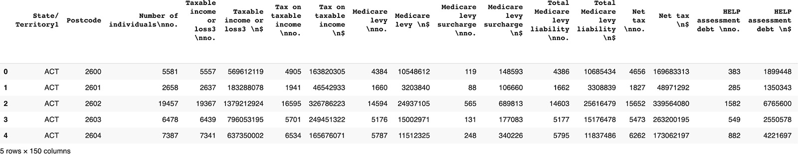
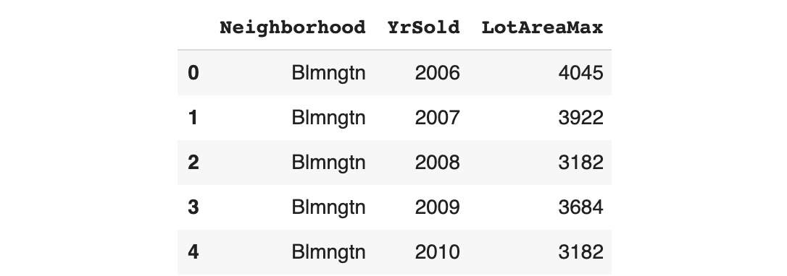

Lab 12. Feature Engineering
=======================


Overview

By the end of this lab, you will be able to merge multiple datasets
together; bin categorical and numerical variables; perform aggregation
on data; and manipulate dates using `pandas`.

This lab will introduce you to some of the key techniques for
creating new variables on an existing dataset.


Merging Datasets
----------------


First, we need to import the Online Retail dataset into a
`pandas` DataFrame:

```
import pandas as pd
file_url = 'https://github.com/fenago/'\
           'data-science/blob/'\
           'master/Lab12/Dataset/'\
           'Online%20Retail.xlsx?raw=true'
df = pd.read_excel(file_url)
df.head()
```

You should get the following output.


Let\'s focus on 2010 first:

```
uk_holidays_2010 = pd.read_csv\
                   ('https://date.nager.at/PublicHoliday/'\
                    'Country/GB/2010/CSV')
```
We can print its shape to see how many rows and columns it has:

```
uk_holidays_2010.shape
```

You should get the following output.

```
(13, 8)
```
We can see there were `13` public holidays in that year and
there are `8` different columns.

Let\'s print the first five rows of this DataFrame:

```
uk_holidays_2010.head()
```

You should get the following output:


Caption: First five rows of the UK 2010 public holidays DataFrame

Now that we have the list of public holidays for 2010, let\'s extract
the ones for 2011:

```
uk_holidays_2011 = pd.read_csv\
                   ('https://date.nager.at/PublicHoliday/'\
                    'Country/GB/2011/CSV')
uk_holidays_2011.shape
```

You should get the following output.

```
(15, 8)
```

There were `15` public holidays in 2011. Now we need to
combine the records of these two DataFrames. We will use the
`.append()` method from `pandas` and assign the
results into a new DataFrame:

```
uk_holidays = uk_holidays_2010.append(uk_holidays_2011)
```
Let\'s check we have the right number of rows after appending the two
DataFrames:

```
uk_holidays.shape
```

You should get the following output:

```
(28, 8)
```
We got `28` records, which corresponds with the total number
of public holidays in 2010 and 2011.

In order to merge two DataFrames together, we need to have at least one
common column between them.
For example, the date 2010-12-01 08:26:00 will first be converted into a
string and then we will keep only the first 10 characters, which will be
2010-12-01. We are going to save these results into a new column called
`InvoiceDay`:

```
df['InvoiceDay'] = df['InvoiceDate'].astype(str)\
                                    .str.slice(stop=10)
df.head()
```

The output is as follows:


Caption: First five rows after creating InvoiceDay


### The Left Join


Use the following code snippet:

```
df_left = pd.merge(df, uk_holidays, left_on='InvoiceDay', \
                   right_on='Date', how='left')
df_left.shape
```

You should get the following output:


```
(541909, 17)
```
We got the exact same number of rows as the original Online Retail
DataFrame, which is expected for a left join. Let\'s have a look at the
first five rows:

```
df_left.head()
```

You should get the following output:


Caption: First five rows of the left-merged DataFrame


### The Right Join

Use the following code snippet:

```
df_right = df.merge(uk_holidays, left_on='InvoiceDay', \
                    right_on='Date', how='right')
df_right.shape
```

You should get the following output:

```
(9602, 17)
```


For instance, looking at the first rows of the merged DataFrame, we can
see there were multiple purchases on January 4, 2011, so all of them
have been matched with the corresponding public holiday. Have a look at
the following code snippet:

```
df_right.head()
```

You should get the following output:


Caption: First five rows of the right-merged DataFrame

There are two other types of merging: inner and outer.

An inner join will only keep the rows that match between the two tables:


Caption: Venn diagram for inner join

You just need to specify the `how = 'inner'` parameter in the
`.merge()` method.

These parameters are clubbed together as shown in the following code
snippet:

```
df_inner = df.merge(uk_holidays, left_on='InvoiceDay', \
                    right_on='Date', how='inner')
df_inner.shape
```

You should get the following output:

```
(9579, 17)
```
We can see there are only 9,579 observations that happened during a
public holiday in the UK.

The outer join will keep all rows from both tables (matched and
unmatched), as shown in *Figure 12.09*:


Caption: Venn diagram for outer join

As you may have guessed, you just need to specify the
`how == 'outer'` parameter in the `.merge()` method:

```
df_outer = df.merge(uk_holidays, left_on='InvoiceDay', \
                    right_on='Date', how='outer')
df_outer.shape
```

You should get the following output:

```
(541932, 17)
```


Exercise 12.01: Merging the ATO Dataset with the Postcode Data
--------------------------------------------------------------

In this exercise, we will merge the ATO dataset (28 columns) with the
Postcode dataset (150 columns) to get a richer dataset with an increased
number of columns.


The following steps will help you complete the exercise:

1.  Open up a new Jupyter notebook.

2.  Now, begin with the `import` of the `pandas`
    package:
    ```
    import pandas as pd
    ```


3.  Assign the link to the ATO dataset to a variable called
    `file_url`:
    ```
    file_url = 'https://raw.githubusercontent.com/'\
               'fenago/data-science/'\
               'master/Lab12/Dataset/taxstats2015.csv'
    ```


4.  Using the `.read_csv()` method from the `pandas`
    package, load the dataset into a new DataFrame called
    `df`:
    ```
    df = pd.read_csv(file_url)
    ```


5.  Display the dimensions of this DataFrame using the
    `.shape` attribute:

    ```
    df.shape
    ```


    You should get the following output:

    ```
    (2473, 28)
    ```


    The ATO dataset contains `2471` rows and `28`
    columns.

6.  Display the first five rows of the ATO DataFrame using the
    `.head()` method:

    ```
    df.head()
    ```


    You should get the following output:

    


    Caption: First five rows of the ATO dataset

    Both DataFrames have a column called `Postcode` containing
    postcodes, so we will use it to merge them together.

    Note

    Postcode is the name used in Australia for zip code. It is an
    identifier for postal areas.

    We are interested in learning more about each of these postcodes.
    Let\'s make sure they are all unique in this dataset.

7.  Display the number of unique values for the `Postcode`
    variable using the `.nunique()` method:

    ```
    df['Postcode'].nunique()
    ```


    You should get the following output:

    ```
    2473
    ```


    There are `2473` unique values in this column and the
    DataFrame has `2473` rows, so we are sure the
    `Postcode` variable contains only unique values.

8.  Now, assign the link to the second Postcode dataset to a variable
    called `postcode_df`:
    ```
    postcode_url = 'https://github.com/fenago/'\
                   'data-science/blob/'\
                   'master/Lab12/Dataset/'\
                   'taxstats2016individual06taxablestatusstate'\
                   'territorypostcodetaxableincome%20(2).xlsx?'\
                   'raw=true'
    ```


9.  Load the second Postcode dataset into a new DataFrame called
    `postcode_df` using the `.read_excel()` method.

    We will only load the *Individuals Table 6B* sheet as this is where
    the data is located so we need to provide this name to the
    `sheet_name` parameter. Also, the header row (containing
    the name of the variables) in this spreadsheet is located on the
    third row so we need to specify it to the header parameter.

    Note

    Don\'t forget the `index` starts with 0 in Python.

    Have a look at the following code snippet:

    ```
    postcode_df = pd.read_excel(postcode_url, \
                                sheet_name='Individuals Table 6B', \
                                header=2)
    ```


10. Print the dimensions of `postcode_df` using the
    `.shape` attribute:

    ```
    postcode_df.shape
    ```


    You should get the following output:

    ```
    (2567, 150)
    ```


    This DataFrame contains `2567` rows for `150`
    columns. By merging it with the ATO dataset, we will get additional
    information for each postcode.

11. Print the first five rows of `postcode_df` using the
    `.head()` method:

    ```
    postcode_df.head()
    ```


    You should get the following output:

    



    Caption: First five rows of the Postcode dataset

    We can see that the second column contains the postcode value, and
    this is the one we will use to merge on with the ATO dataset. Let\'s
    check if they are unique.

12. Print the number of unique values in this column using the
    `.nunique()` method as shown in the following code
    snippet:

    ```
    postcode_df['Postcode'].nunique()
    ```


    You should get the following output:

    ```
    2567
    ```


    There are `2567` unique values, and this corresponds
    exactly to the number of rows of this DataFrame, so we\'re
    absolutely sure this column contains unique values. This also means
    that after merging the two tables, there will be only one-to-one
    matches. We won\'t have a case where we get multiple rows from one
    of the datasets matching with only one row of the other one. For
    instance, postcode `2029` from the ATO DataFrame will have
    exactly one match in the second Postcode DataFrame.

13. Perform a left join on the two DataFrames using the
    `.merge()` method and save the results into a new
    DataFrame called `merged_df`. Specify the
    `how='left'` and `on='Postcode'` parameters:
    ```
    merged_df = pd.merge(df, postcode_df, \
                         how='left', on='Postcode')
    ```


14. Print the dimensions of the new merged DataFrame using the
    `.shape` attribute:

    ```
    merged_df.shape
    ```


    You should get the following output:

    ```
    (2473, 177)
    ```


15. Print the total number of missing values from the
    `'State/Territory1'` column by combining the
    `.isna()` and `.sum()` methods:

    ```
    merged_df['State/ Territory1'].isna().sum()
    ```


    You should get the following output:

    ```
    4
    ```


    There are four postcodes from the ATO dataset that didn\'t match the
    Postcode code.

    Let\'s see which ones they are.

16. Print the missing postcodes using the `.iloc()` method, as
    shown in the following code snippet:

    ```
    merged_df.loc[merged_df['State/ Territory1'].isna(), \
                  'Postcode']
    ```


    You should get the following output:

    


Caption: List of unmatched postcodes

The missing postcodes from the Postcode dataset are `3010`,
`4462`, `6068`, and `6758`. In a real
project, you would have to get in touch with your stakeholders or the
data team to see if you are able to get this data.

We have successfully merged the two datasets of interest and have
expanded the number of features from `28` to `177`.
We now have a much richer dataset and will be able to perform a more
detailed analysis of it.


In the next topic, you will be introduced to the binning variables.


Binning Variables
-----------------

As mentioned earlier, feature engineering is not only about getting
information not present in a dataset. Quite often, you will have to
create new features from existing ones. One example of this is
consolidating values from an existing column to a new list of values.

For instance, you may have a very high number of unique values for some
of the categorical columns in your dataset, let\'s say over 1,000 values
for each variable. This is actually quite a lot of information that will
require extra computation power for an algorithm to process and learn
the patterns from. This can have a significant impact on the project
cost if you are using cloud computing services or on the delivery time
of the project.

One possible solution is to not use these columns and drop them, but in
that case, you may lose some very important and critical information for
the business. Another solution is to create a more consolidated version
of these columns by reducing the number of unique values to a smaller
number, let\'s say 100. This would drastically speed up the training
process for the algorithm without losing too much information. This kind
of transformation is called binning and, traditionally, it refers to
numerical variables, but the same logic can be applied to categorical
variables as well.

Let\'s see how we can achieve this on the Online Retail dataset. First,
we need to load the data:

```
import pandas as pd
file_url = 'https://github.com/fenago/'\
           'data-science/blob/'\
           'master/Lab12/Dataset/'\
           'Online%20Retail.xlsx?raw=true'
df = pd.read_excel(file_url)
```

In *Lab 10*, *Analyzing a Dataset* we learned that the
`Country` column contains `38` different unique
values:

```
df['Country'].unique()
```

You should get the following output:


Caption: List of unique values for the Country column

We are going to group some of the countries together into regions such
as Asia, the Middle East, and America. We will leave the European
countries as is.

First, let\'s create a new column called `Country_bin` by
copying the `Country` column:

```
df['Country_bin'] = df['Country']
```

Then, we are going to create a list called `asian_countries`
containing the name of Asian countries from the list of unique values
for the `Country` column:

```
asian_countries = ['Japan', 'Hong Kong', 'Singapore']
```
And finally, using the `.loc()` and `.isin()`
methods from `pandas`, we are going to change the value of
`Country_bin` to `Asia` for all of the countries
that are present in the `asian_countries` list:

```
df.loc[df['Country'].isin(asian_countries), \
       'Country_bin'] = 'Asia'
```
Now, if we print the list of unique values for this new column, we will
see the three Asian countries (`Japan`, `Hong Kong`,
and `Singapore`) have been replaced by the value
`Asia`:

```
df['Country_bin'].unique()
```

You should get the following output:


Caption: List of unique values for the Country\_bin column after
binning Asian countries

Let\'s perform the same process for Middle Eastern countries:

```
m_east_countries = ['Israel', 'Bahrain', 'Lebanon', \
                    'United Arab Emirates', 'Saudi Arabia']
df.loc[df['Country'].isin(m_east_countries), \
       'Country_bin'] = 'Middle East'
df['Country_bin'].unique()
```

You should get the following output:


Finally, let\'s group all countries from North and South America
together:

```
american_countries = ['Canada', 'Brazil', 'USA']
df.loc[df['Country'].isin(american_countries), \
       'Country_bin'] = 'America'
df['Country_bin'].unique()
```

You should get the following output:


Caption: List of unique values for the Country\_bin column after
binning countries from North and South America

```
df['Country_bin'].nunique()
```

You should get the following output:

```
30
```


Exercise 12.02: Binning the YearBuilt Variable from the AMES Housing Dataset
----------------------------------------------------------------------------

In this exercise, we will create a new feature by binning an existing
numerical column in order to reduce the number of unique values from
`112` to `15`.

Note

The dataset we will be using in this exercise is the Ames Housing
dataset.
This dataset contains the list of residential home sales in the city of
Ames, Iowa between 2010 and 2016.


1.  Open up a new Jupyter notebook.

2.  Import the `pandas` and `altair` packages:
    ```
    import pandas as pd
    import altair as alt
    ```


3.  Assign the link to the dataset to a variable called
    `file_url`:
    ```
    file_url = 'https://raw.githubusercontent.com/'\
               'fenago/data-science/'\
               'master/Lab12/Dataset/ames_iowa_housing.csv'
    ```


4.  Using the `.read_csv()` method from the `pandas`
    package, load the dataset into a new DataFrame called
    `df`:
    ```
    df = pd.read_csv(file_url)
    ```


5.  Display the first five rows using the` .head()` method:

    ```
    df.head()
    ```


    You should get the following output:

    


    Caption: First five rows of the AMES housing DataFrame

6.  Display the number of unique values on the column using
    `.nunique()`:

    ```
    df['YearBuilt'].nunique()
    ```


    You should get the following output:

    ```
    112
    ```


    There are `112` different or unique values in the
    `YearBuilt` column:

7.  Print a scatter plot using `altair` to visualize the
    number of records built per year. Specify `YearBuilt:O` as
    the x-axis and `count()` as the y-axis in the
    `.encode()` method:

    ```
    alt.Chart(df).mark_circle().encode(alt.X('YearBuilt:O'),\
                                       y='count()')
    ```


    You should get the following output:

    


    There weren\'t many properties sold in some of the years. So, you
    can group them by decades (groups of 10 years).

8.  Create a list called `year_built` containing all the
    unique values in the `YearBuilt `column:
    ```
    year_built = df['YearBuilt'].unique()
    ```


9.  Create another list that will compute the decade for each year in
    `year_built`. Use list comprehension to loop through each
    year and apply the following formula:
    `year - (year % 10)`.

    For example, this formula applied to the year 2015 will give 2015 -
    (2015 % 10), which is 2015 -- 5 equals 2010.

    Note

    \% corresponds to the modulo operator and will return the last digit
    of each year.

    Have a look at the following code snippet:

    ```
    decade_list = [year - (year % 10) for year in year_built]
    ```


10. Create a sorted list of unique values from `decade_list`
    and save the result into a new variable called
    `decade_built`. To do so, transform
    `decade_list` into a set (this will exclude all
    duplicates) and then use the `sorted()` function as shown
    in the following code snippet:
    ```
    decade_built = sorted(set(decade_list))
    ```


11. Print the values of `decade_built`:

    ```
    decade_built
    ```


    You should get the following output:

    


    Caption: List of decades

    Now we have the list of decades we are going to bin the
    `YearBuilt` column with.

12. Create a new column on the `df` DataFrame called
    `DecadeBuilt` that will bin each value from
    `YearBuilt` into a decade. You will use the
    `.cut()` method from `pandas` and specify the
    `bins=decade_built` parameter:
    ```
    df['DecadeBuilt'] = pd.cut(df['YearBuilt'], \
                               bins=decade_built)
    ```


13. Print the first five rows of the DataFrame but only for the
    `'YearBuilt'` and `'DecadeBuilt'` columns:

    ```
    df[['YearBuilt', 'DecadeBuilt']].head()
    ```


    You should get the following output:

    


Manipulating Dates
------------------


In *Lab 10*, *Analyzing a Dataset* you were introduced to the
concept of data types in `pandas`. At that time, we mainly
focused on numerical variables and categorical ones but there is another
important one: `datetime`. Let\'s have a look again at the
type of each column from the Online Retail dataset:

```
import pandas as pd
file_url = 'https://github.com/fenago/'\
           'data-science/blob/'\
           'master/Lab12/Dataset/'\
           'Online%20Retail.xlsx?raw=true'
df = pd.read_excel(file_url)
df.dtypes
```

You should get the following output:


Caption: Data types for the variables in the Online Retail dataset

We can see that `pandas` automatically detected that
`InvoiceDate` is of type `datetime`. But for some
other datasets, it may not recognize dates properly. In this case, you
will have to manually convert them using the `.to_datetime()`
method:

```
df['InvoiceDate'] = pd.to_datetime(df['InvoiceDate'])
```
Once the column is converted to `datetime`, pandas provides a
lot of attributes and methods for extracting time-related information.
For instance, if you want to get the year of a date, you use the
`.dt.year` attribute:

```
df['InvoiceDate'].dt.year
```

You should get the following output:


Caption: Extracted year for each row for the InvoiceDate column

As you may have guessed, there are attributes for extracting the month
and day of a date: `.dt.month` and `.dt.day`
respectively. You can get the day of the week from a date using the
`.dt.dayofweek` attribute:

```
df['InvoiceDate'].dt.dayofweek
```

You should get the following output.


Caption: Extracted day of the week for each row for the InvoiceDate column


With datetime columns, you can also perform some mathematical
operations. We can, for instance, add `3` days to each date by
using pandas time-series offset object,
`pd.tseries.offsets.Day(3)`:

```
df['InvoiceDate'] + pd.tseries.offsets.Day(3)
```

You should get the following output:


Caption: InvoiceDate column offset by three days

You can also offset days by business days using
`pd.tseries.offsets.BusinessDay()`. For instance, if we want
to get the previous business days, we do:

```
df['InvoiceDate'] + pd.tseries.offsets.BusinessDay(-1)
```

You should get the following output:


Caption: InvoiceDate column offset by -1 business day

Another interesting date manipulation operation is to apply a specific
time-frequency using `pd.Timedelta()`. For instance, if you
want to get the first day of the month from a date, you do:

```
df['InvoiceDate'] + pd.Timedelta(1, unit='MS')
```

You should get the following output:


Caption: InvoiceDate column transformed to the start of the month

As you have seen in this section, the `pandas` package
provides a lot of different APIs for manipulating dates. You have
learned how to use a few of the most popular ones. You can now explore
the other ones on your own.


Exercise 12.03: Date Manipulation on Financial Services Consumer Complaints
---------------------------------------------------------------------------

In this exercise, we will learn how to extract time-related information
from two existing date columns using `pandas` in order to
create six new columns:

Note

The dataset we will be using in this exercise is the Financial Services
Customer Complaints dataset


1.  Open up a new Jupyter notebook.

2.  Import the `pandas` package:
    ```
    import pandas as pd
    ```


3.  Assign the link to the dataset to a variable called
    `file_url`:
    ```
    file_url = 'https://raw.githubusercontent.com/'\
               'fenago/data-science/'\
               'master/Lab12/Dataset/Consumer_Complaints.csv'
    ```


4.  Use the `.read_csv()` method from the `pandas`
    package and load the dataset into a new DataFrame called
    `df`:
    ```
    df = pd.read_csv(file_url)
    ```


5.  Display the first five rows using the `.head()` method:

    ```
    df.head()
    ```


    You should get the following output:

    


    Caption: First five rows of the Customer Complaint DataFrame

6.  Print out the data types for each column using
    the` .dtypes` attribute:

    ```
    df.dtypes
    ```


    You should get the following output:

    


    Caption: Data types for the Customer Complaint DataFrame

    The `Date received` and `Date sent to company`
    columns haven\'t been recognized as datetime, so we need to manually
    convert them.

7.  Convert the `Date received` and
    `Date sent to company` columns to datetime using the
    `pd.to_datetime()` method:
    ```
    df['Date received'] = pd.to_datetime(df['Date received'])
    df['Date sent to company'] = pd.to_datetime\
                                 (df['Date sent to company'])
    ```


8.  Print out the data types for each column using the
    `.dtypes` attribute:

    ```
    df.dtypes
    ```


    You should get the following output:

    


    Caption: Data types for the Customer Complaint DataFrame after
    conversion

    Now these two columns have the right data types. Now let\'s create
    some new features from these two dates.

9.  Create a new column called `YearReceived`, which will
    contain the year of each date from the `Date Received`
    column using the `.dt.year` attribute:
    ```
    df['YearReceived'] = df['Date received'].dt.year
    ```


10. Create a new column called `MonthReceived`, which will
    contain the month of each date using the `.dt.month`
    attribute:
    ```
    df['MonthReceived'] = df['Date received'].dt.month
    ```


11. Create a new column called `DayReceived`, which will
    contain the day of the month for each date using the
    `.dt.day` attribute:
    ```
    df['DomReceived'] = df['Date received'].dt.day
    ```


12. Create a new column called `DowReceived`, which will
    contain the day of the week for each date using the
    `.dt.dayofweek` attribute:
    ```
    df['DowReceived'] = df['Date received'].dt.dayofweek
    ```


13. Display the first five rows using the `.head()` method:

    ```
    df.head()
    ```


    You should get the following output:

    


    Caption: First five rows of the Customer Complaint DataFrame
    after creating four new features

    We can see we have successfully created four new features:
    `YearReceived`, `MonthReceived`,
    `DayReceived`, and `DowReceived`. Now let\'s
    create another that will indicate whether the date was during a
    weekend or not.

14. Create a new column called `IsWeekendReceived`, which will
    contain binary values indicating whether the `DowReceived`
    column is over or equal to `5` (`0` corresponds
    to Monday, `5` and `6` correspond to Saturday
    and Sunday respectively):
    ```
    df['IsWeekendReceived'] = df['DowReceived'] >= 5
    ```


15. Display the first `5` rows using the `.head()`
    method:

    ```
    df.head()
    ```


    You should get the following output:

    


    Caption: First five rows of the Customer Complaint DataFrame
    after creating the weekend feature

    We have created a new feature stating whether each complaint was
    received during a weekend or not. Now we will feature engineer a new
    column with the numbers of days between
    `Date sent to company` and `Date received`.

16. Create a new column called `RoutingDays`, which will
    contain the difference between `Date sent to company` and
    `Date received`:
    ```
    df['RoutingDays'] = df['Date sent to company'] \
                        - df['Date received']
    ```


17. Print out the data type of the new `'RoutingDays'` column
    using the `.dtype` attribute:

    ```
    df['RoutingDays'].dtype
    ```


    You should get the following output:

    


    Caption: Data type of the RoutingDays column

    The result of subtracting two datetime columns is a new datetime
    column (`dtype('<M8[ns]'`), which is a specific datetime
    type for the `numpy` package). We need to convert this
    data type into an `int` to get the number of days between
    these two days.

18. Transform the `RoutingDays` column using the
    `.dt.days` attribute:
    ```
    df['RoutingDays'] = df['RoutingDays'].dt.days
    ```


19. Display the first five rows using the `.head()` method:

    ```
    df.head()
    ```


    You should get the following output:

    


Caption: First five rows of the Customer Complaint DataFrame after
creating RoutingDays


Performing Data Aggregation
---------------------------


Let\'s see how to do it on the Online Retail dataset. First, we need to
import the data:

```
import pandas as pd
file_url = 'https://github.com/fenago/'\
           'data-science/blob/'\
           'master/Lab12/Dataset/'\
           'Online%20Retail.xlsx?raw=true'
df = pd.read_excel(file_url)
```
Let\'s calculate the total quantity of items sold for each country. We
will specify the `Country` column as the grouping column:

```
df.groupby('Country').agg({'Quantity': 'sum'})
```

You should get the following output:


Caption: Sum of Quantity per Country (truncated)

This result gives the total volume of items sold for each country. We
can see that Australia has almost sold four times more items than
Belgium. This level of information may be too high-level and we may want
a bit more granular detail. Let\'s perform the same aggregation but this
time we will group on two columns: `Country` and
`StockCode`. We just need to provide the names of these
columns as a list to the `.groupby()` method:

```
df.groupby(['Country', 'StockCode']).agg({'Quantity': 'sum'})
```

You should get the following output:


Caption: Sum of Quantity per Country and StockCode


We can add one more layer of information and get the number of items
sold for each country, the product, and the date. To do so, we first
need to create a new feature that will extract the date component of
`InvoiceDate` (we just learned how to do this in the previous
section):

```
df['Invoice_Date'] = df['InvoiceDate'].dt.date
```

Then, we can add this new column in the `.groupby()` method:

```
df.groupby(['Country', 'StockCode', \
            'Invoice_Date']).agg({'Quantity': 'sum'})
```

You should get the following output:


Caption: Sum of Quantity per Country, StockCode, and Invoice\_Date


We can now merge this additional information back into the original
DataFrame. But before that, there is an additional data transformation
step required: reset the column index. The `pandas` package
creates a multi-level index after data aggregation by default. You can
think of it as though the column names were stored in multiple rows
instead of one only. To change it back to a single level, you need to
call the `.reset_index()` method:

```
df_agg = df.groupby(['Country', 'StockCode', 'Invoice_Date'])\
           .agg({'Quantity': 'sum'}).reset_index()
df_agg.head()
```

You should get the following output:


Caption: DataFrame containing data aggregation information

Now we can merge this new DataFrame into the original one using the
`.merge()` method we saw earlier in this lab:

```
df_merged = pd.merge(df, df_agg, how='left', \
                     on = ['Country', 'StockCode', \
                           'Invoice_Date'])
df_merged
```

You should get the following output:


Caption: Merged DataFrame (truncated)

We can see there are two columns called `Quantity_x` and
`Quantity_y` instead of `Quantity`.

The reason is that, after merging, there were two different columns with
the exact same name (`Quantity`), so by default, pandas added
a suffix to differentiate them.

We can fix this situation either by replacing the name of one of those
two columns before merging or we can replace both of them after merging.
To replace column names, we can use the `.rename()` method
from `pandas` by providing a dictionary with the old name as
the key and the new name as the value, such as
`{'old_name': 'new_name'}`.

Let\'s replace the column names after merging with `Quantity`
and `DailyQuantity`:

```
df_merged.rename(columns={"Quantity_x": "Quantity", \
                          "Quantity_y": "DailyQuantity"}, \
                 inplace=True)
df_merged
```

You should get the following output:


Caption: Renamed DataFrame (truncated)

Now we can create a new feature that will calculate the ratio between
the items sold with the daily total quantity of sold items in the
corresponding country:

```
df_merged['QuantityRatio'] = df_merged['Quantity'] \
                             / df_merged['DailyQuantity']
df_merged
```

You should get the following output:


Caption: Final DataFrame with new QuantityRatio feature


Exercise 12.04: Feature Engineering Using Data Aggregation on the AMES Housing Dataset
--------------------------------------------------------------------------------------

In this exercise, we will create new features using data aggregation.
First, we\'ll calculate the maximum `SalePrice` and
`LotArea` for each neighborhood and by `YrSold`.
Then, we will add this information back to the dataset, and finally, we
will calculate the ratio of each property sold with these two maximum
values:

Note

The dataset we will be using in this exercise is the Ames Housing
dataset

1.  Open up a new Jupyter notebook.

2.  Import the `pandas` and `altair` packages:
    ```
    import pandas as pd
    ```


3.  Assign the link to the dataset to a variable called
    `file_url`:
    ```
    file_url = 'https://raw.githubusercontent.com/'\
               'fenago/data-science/'\
               'master/Lab12/Dataset/ames_iowa_housing.csv'
    ```


4.  Using the `.read_csv()` method from the `pandas`
    package, load the dataset into a new DataFrame called
    `df`:
    ```
    df = pd.read_csv(file_url)
    ```


5.  Perform data aggregation to find the maximum `SalePrice`
    for each `Neighborhood` and the `YrSold` using
    the `.groupby.agg()` method and save the results in a new
    DataFrame called `df_agg`:
    ```
    df_agg = df.groupby(['Neighborhood', 'YrSold'])\
               .agg({'SalePrice': 'max'}).reset_index()
    ```


6.  Rename the `df_agg` columns to `Neighborhood`,
    `YrSold`, and `SalePriceMax`:
    ```
    df_agg.columns = ['Neighborhood', 'YrSold', 'SalePriceMax']
    ```


7.  Print out the first five rows of `df_agg`:

    ```
    df_agg.head()
    ```


    You should get the following output:

    


    Caption: First five rows of the aggregated DataFrame

8.  Merge the original DataFrame, `df`, to `df_agg`
    using a left join (`how='left'`) on the
    `Neighborhood` and `YrSold` columns using the
    `merge()` method and save the results into a new DataFrame
    called `df_new`:
    ```
    df_new = pd.merge(df, df_agg, how='left', \
                      on=['Neighborhood', 'YrSold'])
    ```


9.  Print out the first five rows of `df_new`:

    ```
    df_new.head()
    ```


    You should get the following output:

    


    Caption: First five rows of df\_new

    Note that we are displaying the last eight columns of the output.

10. Create a new column called `SalePriceRatio` by dividing
    `SalePrice` by `SalePriceMax`:
    ```
    df_new['SalePriceRatio'] = df_new['SalePrice'] \
                               / df_new['SalePriceMax']
    ```


11. Print out the first five rows of `df_new`:

    ```
    df_new.head()
    ```


    You should get the following output:

    


    Caption: First five rows of df\_new after feature engineering

    Note that we are displaying the last eight columns of the output.

12. Perform data aggregation to find the maximum `LotArea` for
    each `Neighborhood` and `YrSold` using the
    `.groupby.agg()` method and save the results in a new
    DataFrame called `df_agg2`:
    ```
    df_agg2 = df.groupby(['Neighborhood', 'YrSold'])\
                .agg({'LotArea': 'max'}).reset_index()
    ```


13. Rename the column of `df_agg2` to
    `Neighborhood`, `YrSold`, and
    `LotAreaMax` and print out the first five columns:

    ```
    df_agg2.columns = ['Neighborhood', 'YrSold', 'LotAreaMax']
    df_agg2.head()
    ```


    You should get the following output:

    



    Caption: First five rows of the aggregated DataFrame

14. Merge the original DataFrame, `df`, to `df_agg2`
    using a left join (`how='left'`) on the
    `Neighborhood` and `YrSold` columns using the
    `merge()` method and save the results into a new DataFrame
    called `df_final`:
    ```
    df_final = pd.merge(df_new, df_agg2, how='left', \
                        on=['Neighborhood', 'YrSold'])
    ```


15. Create a new column called `LotAreaRatio` by dividing
    `LotArea` by `LotAreaMax`:
    ```
    df_final['LotAreaRatio'] = df_final['LotArea'] \
                               / df_final['LotAreaMax']
    ```


16. Print out the first five rows of `df_final` for the
    following columns: `Id`, `Neighborhood`,
    `YrSold`, `SalePrice`, `SalePriceMax`,
    `SalePriceRatio`, `LotArea`,
    `LotAreaMax`, `LotAreaRatio`:

    ```
    df_final[['Id', 'Neighborhood', 'YrSold', 'SalePrice', \
              'SalePriceMax', 'SalePriceRatio', 'LotArea', \
              'LotAreaMax', 'LotAreaRatio']].head()
    ```


    You should get the following output:

    


Activity 12.01: Feature Engineering on a Financial Dataset
----------------------------------------------------------

You are working for a major bank in the Czech Republic and you have been
tasked to analyze the transactions of existing customers. The data team
has extracted all the tables from their database they think will be
useful for you to analyze the dataset. You will need to consolidate the
data from those tables into a single DataFrame and create new features
in order to get an enriched dataset from which you will be able to
perform an in-depth analysis of customers\' banking transactions.

You will be using only the following four tables:

- `account`: The characteristics of a customer\'s bank
    account for a given branch

- `client`: Personal information related to the bank\'s
    customers

- `disp`: A table that links an account to a customer

- `trans`: A list of all historical transactions by account


The following steps will help you complete this activity:

1.  Download and load the different tables from this dataset into
    Python.

2.  Analyze each table with the `.shape` and
    `.head()` methods.

3.  Find the common/similar column(s) between tables that will be used
    for merging based on the analysis from *Step 2*.

4.  There should be four common tables. Merge the four tables together
    using `pd.merge()`.

5.  Rename the column names after merging with `.rename()`.

6.  Check there is no duplication after merging with
    `.duplicated()` and `.sum()`.

7.  Transform the data type for date columns using
    `.to_datetime()`.

8.  Create two separate features from `birth_number` to get
    the date of birth and sex for each customer.

    Note

    This is the rule used for coding the data related to birthday and
    sex in this column: the number is in the YYMMDD format for men, the
    number is in the YYMM+50DD format for women, where YYMMDD is the
    date of birth.

9.  Fix data quality issues with `.isna()`.

10. Create a new feature that will calculate customers\' ages when they
    opened an account using date operations


**Expected output:**


Caption: Expected output with the merged rows


Summary
-------

We first learned how to analyze a dataset and get a very good
understanding of its data using data summarization and data
visualization. This is very useful for finding out what the limitations
of a dataset are and identifying data quality issues. We saw how to
handle and fix some of the most frequent issues (duplicate rows, type
conversion, value replacement, and missing values) using
`pandas`\' APIs. Finally, we went through several feature engineering techniques.
