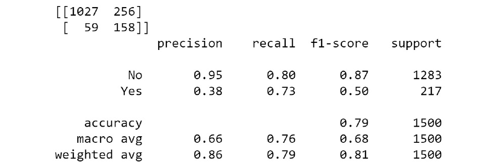

Lab 13. Imbalanced Datasets
=======================


In this lab, you will be dealing with imbalanced datasets, which are
very prevalent in real-life scenarios. You will be using techniques such
as `SMOTE`, `MSMOTE`, and random undersampling to
address imbalanced datasets.


Exercise 13.01: Benchmarking the Logistic Regression Model on the Dataset
-------------------------------------------------------------------------

In this exercise, we will be analyzing the problem of predicting whether
a customer will buy a term deposit. For this, you will be fitting a
logistic regression model, as you did in *Lab 3*, *Binary
Classification*, and you will look closely at the metrics:


1.  Open a new notebook in Jupyter.

2.  Next, import `pandas` and load the data from the GitHub
    repository:
    ```
    import pandas as pd
    filename = 'https://raw.githubusercontent.com/fenago'\
               '/data-science/master/'\
               'Lab13/Dataset/bank-full.csv'
    ```


3.  Now, load the data using `pandas`

    ```
    #Loading the data using pandas
    bankData = pd.read_csv(filename,sep=";")
    bankData.head()
    ```


    Your output would be as follows:

    


    Caption: The first 5 rows of bankData

    Now, to break the dataset down further, let\'s perform some
    feature-engineering steps.

4.  Normalize the numerical features (age, balance, and duration)
    through scaling, which was covered in *Lab 3*, *Binary
    Classification*. Enter the following code:

    ```
    from sklearn.preprocessing import RobustScaler
    rob_scaler = RobustScaler()
    ```


5.  After scaling the numerical data, we convert each of the columns to
    a scaled version, as in the following code snippet:
    ```
    # Converting each of the columns to scaled version
    bankData['ageScaled'] = rob_scaler.fit_transform\
                            (bankData['age'].values.reshape(-1,1))
    bankData['balScaled'] = rob_scaler.fit_transform\
                            (bankData['balance']\
                             .values.reshape(-1,1))
    bankData['durScaled'] = rob_scaler.fit_transform\
                            (bankData['duration']\
                             .values.reshape(-1,1))
    ```


6.  Now, drop the original features after we introduce the scaled
    features using the `.drop()` function:
    ```
    # Dropping the original columns
    bankData.drop(['age','balance','duration'], \
                  axis=1, inplace=True)
    ```


7.  Display the first five columns using the `.head()`
    function:

    ```
    bankData.head()
    ```


    The output is as follows:

    


    Caption: bankData with scaled features


8.  Convert all the categorical variables to dummy variables using the
    `.get_dummies()` function:
    ```
    bankCat = pd.get_dummies(bankData[['job','marital','education',\
                                       'default','housing','loan',\
                                       'contact','month',\
                                       'poutcome']])
    ```


9.  Separate the numerical data and observe the shape:

    ```
    bankNum = bankData[['ageScaled','balScaled','day',\
                        'durScaled','campaign','pdays','previous']]
    bankNum.shape
    ```


    The output would be as follows:

    ```
    (45211, 7)
    ```


10. Create the independent variables, `X`, and dependent
    variables, `Y`, from the combined dataset for modeling, as
    in the following code snippet:

    ```
    # Merging with the original data frame
    # Preparing the X variables
    X = pd.concat([bankCat, bankNum], axis=1)
    print(X.shape)
    # Preparing the Y variable
    Y = bankData['y']
    print(Y.shape)
    X.head()
    ```


    The output is as follows:

    


11. Now, `import` the necessary functions of
    `train_test_split()` and `LogisticRegression`
    from `sklearn`:
    ```
    from sklearn.model_selection import train_test_split
    from sklearn.linear_model import LogisticRegression
    ```


12. Split the data into train and test sets at a **70:30** ratio using
    the `test_size = 0.3` variable in the splitting function.
    We also set `random_state` for the reproducibility of the
    code:
    ```
    X_train, X_test, y_train, y_test = train_test_split\
                                       (X, Y, test_size=0.3, \
                                        random_state=123)
    ```


13. Now, fit the model using `.fit` on the training data:

    ```
    # Defining the LogisticRegression function
    bankModel = LogisticRegression()
    bankModel.fit(X_train, y_train)
    ```


    Your output should be as follows:

    


14. Next, find the prediction on the test set and print the accuracy
    scores:

    ```
    pred = bankModel.predict(X_test)
    print('Accuracy of Logistic regression model prediction on '\
          'test set: {:.2f}'\
          .format(bankModel.score(X_test, y_test)))
    ```


    You should get the following output:

    ```
    Accuracy of Logistic regression model prediction on test set: 0.90
    ```


15. Now, use both the `confusion_matrix()` and
    `classification_report()` functions to generate the
    metrics for further analysis, which we will cover in the *Analysis
    of the Result* section:

    ```
    # Confusion Matrix for the model
    from sklearn.metrics import confusion_matrix
    confusionMatrix = confusion_matrix(y_test, pred)
    print(confusionMatrix)
    from sklearn.metrics import classification_report
    print(classification_report(y_test, pred))
    ```


    You should get the following output:

    


To understand more about the reasons behind the skewed results, we will
analyze these metrics in detail in the following section.


Analysis of the Result
----------------------

To analyze the results obtained in the previous section, let\'s expand
the confusion matrix in the form:


We enter the values `11707`, `291`,
`1060`, and `506` from the output we got from the
previous exercise. We then place these values as shown in the diagram.
We will represent the propensity to take a term deposit (`No`)
as the positive class and the other as the negative class. So, from the
confusion matrix, we can calculate the accuracy measures, which were
covered in *Lab 3*, *Binary Classification*. The accuracy of the
model is given by:


Caption: Accuracy of a model

In our case, it will be (11707 + 506) / (11707 + 1060 + 291 + 506), or
90%.


The precision value of any class is given by:


The recall value for any class can be represented as follows:


The following code will generate the percentages of the classes in the
training data:

```
print('Percentage of negative class :',\
      (y_train[y_train=='yes'].value_counts()\
       /len(y_train) ) * 100)
print('Percentage of positive class :',\
      (y_train[y_train=='no'].value_counts()\
       /len(y_train) ) * 100)
```

You should get the following output:

```
Percentage of negative class: yes    11.764148
Name: y, dtype: float64
Percentage of positive class: no    88.235852
Name: y, dtype: float64
```

From this, we can see that the majority of the training set (88%) is
made up of the positive class. This imbalance is one of the major
reasons behind the poor metrics that we have had with the logistic
regression classifier we have selected.

Now, let\'s look at the challenges of imbalanced datasets.


Challenges of Imbalanced Datasets
=================================


As seen from the classifier example, one of the biggest challenges with
imbalanced datasets is the bias toward the majority class, which ended
up being 88% in the previous example. This will result in suboptimal
results. However, what makes such cases even more challenging is the
deceptive nature of results if the right metric is not used.

Let\'s take, for example, a dataset where the negative class is around
99% and the positive class is 1% (as in a use case where a rare disease
has to be detected, for instance).

Have a look at the following code snippet:

```
Data set Size: 10,000 examples
Negative class : 9910
Positive Class : 90
```
Suppose we had a poor classifier that was capable of only predicting the
negative class; we would get the following confusion matrix:


Caption: Confusion matrix of the poor classifier

From the confusion matrix, let\'s calculate the accuracy measures. Have
a look at the following code snippet:

```
# Classifier biased to only negative class
Accuracy = (TP + TN ) / ( TP + FP + FN + TN)
 = (0 + 9900) / ( 0 + 0 + 90 + 9900) = 9900/10000
 = 99%
```

It is important to identify cases with imbalanced datasets
and equally important to pick the right metric for analyzing such
datasets. The right metric in this example would have been to look at
the recall values for both the classes:

```
Recall Positive class  = TP / ( TP + FN ) = 0 / ( 0 + 90)
 = 0
Recall Negative Class = TN / ( TN + FP) = 9900 / ( 9900 + 0)
= 100%
```
From the recall values, we could have identified the bias of the
classifier toward the majority class, prompting us to look at strategies
for mitigating such biases, which is the next topic we will focus on.


Strategies for Dealing with Imbalanced Datasets
===============================================


Now that we have identified the challenges of imbalanced datasets,
let\'s look at strategies for combatting imbalanced datasets:


Exercise 13.02: Implementing Random Undersampling and Classification on Our Banking Dataset to Find the Optimal Result
----------------------------------------------------------------------------------------------------------------------

In this exercise, you will undersample the majority class (propensity
`'No'`) and then make the dataset balanced. On the new
balanced dataset, you will fit a logistic regression model and then
analyze the results:


1.  Open a new Jupyter notebook for this exercise.

2.  Perform the initial 12 steps of *Exercise 13.01*, *Benchmarking the
    Logistic Regression Model on the Dataset*, such that the dataset is
    split into training and testing sets.

3.  Now, join the `X` and `y` variables for the
    training set before resampling:

    ```
    """
    Let us first join the train_x and train_y for ease of operation
    """
    trainData = pd.concat([X_train,y_train],axis=1)
    ```


    In this step, we concatenated the `X_train` and
    `y_train` datasets to one single dataset. This is done to
    make the resampling process in the subsequent steps easier. To
    concatenate the two datasets, we use the `.concat()`
    function from `pandas`. In the code, we use
    `axis = 1` to indicate that the concatenation is done
    horizontally, which is along the columns.

4.  Now, display the new data with the `.head()` function:

    ```
    trainData.head()
    ```


    You should get the following output

    


5.  Next, find the indexes of the sample dataset where the propensity is
    `yes`:

    ```
    ind = trainData[trainData['y']=='yes'].index
    print(len(ind))
    ```


    You should get the following output:

    ```
    3723
    ```


6.  Separate by the minority class as in the following code snippet:

    ```
    minData = trainData.loc[ind]
    print(minData.shape)
    ```


    You should get the following output:

    ```
    (3723, 52)
    ```


7.  Now, find the indexes of the majority class:

    ```
    ind1 = trainData[trainData['y']=='no'].index
    print(len(ind1))
    ```


    You should get the following output:

    ```
    27924
    ```


8.  Separate by the majority class as in the following code snippet:

    ```
    majData = trainData.loc[ind1]
    print(majData.shape)
    majData.head()
    ```


    You should get the following output:

    


    Caption: Output after separating the majority classes

    Once the majority class is separated, we can proceed with sampling
    from the majority class. Once the sampling is done, the shape of the
    majority class dataset and its head are printed.

    Take a random sample equal to the length of the minority class to
    make the dataset balanced.

9.  Extract the samples using the `.sample()` function:

    ```
    majSample = majData.sample(n=len(ind),random_state = 123)
    ```


    The number of examples that are sampled is equal to the number of
    examples in the minority class. This is implemented with the
    parameters `(n=len(ind))`.

10. Now that sampling is done, the shape of the majority class dataset
    and its head is printed:

    ```
    print(majSample.shape)
    majSample.head()
    ```


    You should get the following output:

    


    Caption: Output showing the shape of the majority class dataset

    Now, we move onto preparing the new training data

11. After preparing the individual dataset, we can now concatenate them
    together using the `pd.concat()` function:

    ```
    """
    Concatenating both data sets and then shuffling the data set
    """
    balData = pd.concat([minData,majSample],axis = 0)
    ```


    Note

    In this case, we are concatenating in the vertical direction and,
    therefore, `axis = 0` is used.

12. Now, shuffle the dataset so that both the minority and majority
    classes are evenly distributed using the `shuffle()`
    function:

    ```
    # Shuffling the data set
    from sklearn.utils import shuffle
    balData = shuffle(balData)
    balData.head()
    ```


    You should get the following output:

    


    Caption: Output after shuffling the dataset

13. Now, separate the shuffled dataset into the independent variables,
    `X_trainNew`, and dependent variables,
    `y_trainNew`. The separation is to be done using the index
    features `0` to `51` for the dependent variables
    using the `.iloc()` function in `pandas`. The
    dependent variables are separated by sub-setting with the column
    name `'y'`:

    ```
    # Making the new X_train and y_train
    X_trainNew = balData.iloc[:,0:51]
    print(X_trainNew.head())
    y_trainNew = balData['y']
    print(y_trainNew.head())
    ```


    You should get the following output:

    


    Caption: Shuffling the dataset into independent variables

    Now, fit the model on the new data and generate the confusion matrix
    and classification report for our analysis.

14. First, define the `LogisticRegression` function with the
    following code snippet:

    ```
    from sklearn.linear_model import LogisticRegression
    bankModel1 = LogisticRegression()
    bankModel1.fit(X_trainNew, y_trainNew)
    ```


    You should get the following output:

    


    Caption: Fitting the model

15. Next, perform the prediction on the test with the following code
    snippet:

    ```
    pred = bankModel1.predict(X_test)
    print('Accuracy of Logistic regression model prediction on '\
          'test set for balanced data set: {:.2f}'\
          .format(bankModel1.score(X_test, y_test)))
    ```


    You should get the following output:

    ```
    Accuracy of Logistic regression model prediction on test set for balanced data set:0.83
    ```


    `{:.2f}'.format` is used to print the string values along
    with the accuracy score, which is output from
    `bankModel1.score(X_test, y_test)`. In this,
    `2f` means a numerical score with two decimals.

16. Now, generate the confusion matrix for the model and print the
    results:

    ```
    from sklearn.metrics import confusion_matrix
    confusionMatrix = confusion_matrix(y_test, pred)
    print(confusionMatrix)
    from sklearn.metrics import classification_report
    print(classification_report(y_test, pred))
    ```


    You should get the following output:

    


Implementation of SMOTE and MSMOTE
----------------------------------

`SMOTE` and `MSMOTE` can be implemented from a
package called `smote-variants` in Python. Let\'s now implement both these methods and analyze the results.


Exercise 13.03: Implementing SMOTE on Our Banking Dataset to Find the Optimal Result
------------------------------------------------------------------------------------

In this exercise, we will generate synthetic samples of the minority
class using `SMOTE` and then make the dataset balanced. Then,
on the new balanced dataset, we will fit a logistic regression model and
analyze the results:

1.  Implement all the steps of *Exercise 13.01*, *Benchmarking the
    Logistic Regression Model on the Dataset*, until the splitting of
    the train and test sets (*Step 12*).

2.  Now, print the count of both the classes before we oversample:

    ```
    # Shape before oversampling
    print("Before OverSampling count of yes: {}"\
          .format(sum(y_train=='yes')))
    print("Before OverSampling count of no: {} \n"\
          .format(sum(y_train=='no')))
    ```


    You should get the following output:

    ```
    Before OverSampling count of yes: 3694
    Before OverSampling count of no: 27953
    ```


    Next, we will be oversampling the training set using `SMOTE`.

3.  Begin by importing `sv` and `numpy`:

    ```
    !pip install smote-variants
    import smote_variants as sv
    import numpy as np
    ```


4.  Now, instantiate the `SMOTE` library to a variable called
    `oversampler` using the `sv.SMOTE()` function:

    ```
    # Instantiating the SMOTE class
    oversampler= sv.SMOTE()
    ```


    This is a common way of instantiating any of the variants of
    `SMOTE` from the `smote_variants` library.

5.  Now, sample the process using the `.sample()` function of
    `oversampler`:

    ```
    # Creating new training set
    X_train_os, y_train_os = oversampler.sample\
                             (np.array(X_train), np.array(y_train))
    ```


    Note

    Both the `X` and `y` variables are converted to
    `numpy` arrays before applying the `.sample()`
    function.

6.  Now, print the shapes of the new `X` and `y`
    variables and the `counts` of the classes. You will note
    that the size of the overall dataset has increased from the earlier
    count of around 31,647 (3694 + 27953) to 55,906. The increase in
    size can be attributed to the fact that the minority class has been
    oversampled from 3,694 to 27,953:

    ```
    # Shape after oversampling
    print('After OverSampling, the shape of train_X: {}'\
          .format(X_train_os.shape))
    print('After OverSampling, the shape of train_y: {} \n'\
          .format(y_train_os.shape))
    print("After OverSampling, counts of label 'Yes': {}"\
          .format(sum(y_train_os=='yes')))
    print("After OverSampling, counts of label 'no': {}"\
          .format(sum(y_train_os=='no')))
    ```


    You should get the following output:

    ```
    After OverSampling, the shape of train_X: (55906, 51)
    After OverSampling, the shape of train_y: (55906,) 
    After OverSampling, counts of label 'Yes': 27953
    After OverSampling, counts of label 'no': 27953
    ```


7.  Define the `LogisticRegression` function:
    ```
    # Training the model with Logistic regression model
    from sklearn.linear_model import LogisticRegression
    bankModel2 = LogisticRegression()
    bankModel2.fit(X_train_os, y_train_os)
    ```


8.  Now, predict using `.predict` on the test set, as
    mentioned in the following code snippet:
    ```
    pred = bankModel2.predict(X_test)
    ```


9.  Next, `print` the accuracy values:

    ```
    print('Accuracy of Logistic regression model prediction on '\
          'test set for Smote balanced data set: {:.2f}'\
          .format(bankModel2.score(X_test, y_test)))
    ```


    Your output should be as follows:

    ```
    Accuracy of Logistic regression model prediction on test set for Smote balanced data set: 0.83
    ```


10. Then, generate `ConfusionMatrix` for the model:

    ```
    from sklearn.metrics import confusion_matrix
    confusionMatrix = confusion_matrix(y_test, pred)
    print(confusionMatrix)
    ```


    The matrix is as follows:

    ```
    [[10042  1956]
     [  306  1260]]
    ```


11. Generate `Classification_report` for the model:

    ```
    from sklearn.metrics import classification_report
    print(classification_report(y_test, pred))
    ```


    You should get the following output:

    


Caption: Classification report for the model


In the next exercise, we will be implementing `MSMOTE`.


Exercise 13.04: Implementing MSMOTE on Our Banking Dataset to Find the Optimal Result
-------------------------------------------------------------------------------------

In this exercise, we will generate synthetic samples of the minority
class using `MSMOTE` and then make the dataset balanced. Then,
on the new balanced dataset, we will fit a logistic regression model and
analyze the results. This exercise will be very similar to the previous
one.

1.  Implement all the steps of *Exercise 13.01*, *Benchmarking the
    Logistic Regression Model on the Dataset*, until the splitting of
    the train and test sets (*Step 12*).

2.  Now, print the count of both the classes before we oversample:

    ```
    # Shape before oversampling
    print("Before OverSampling count of yes: {}"\
          .format(sum(y_train=='yes')))
    print("Before OverSampling count of no: {} \n"\
          .format(sum(y_train=='no')))
    ```


    You should get the following output:

    ```
    Before OverSampling count of yes: 3723
    Before OverSampling count of no: 27924
    ```


    Note

    The counts mentioned in this output can vary because of variability
    in the sampling process.

    Next, we will be oversampling the training set using
    `MSMOTE`.

3.  Begin by importing the `sv` and `numpy`:

    ```
    !pip install smote-variants
    import smote_variants as sv
    import numpy as np
    ```


    The library files that are required for oversampling the training
    set include the `smote_variants` library, which we
    installed earlier. This is imported as `sv`. The other
    library that is required is `numpy`, as the training set
    will have to be given a `numpy` array for the
    `smote_variants` library.

4.  Now, instantiate the `MSMOTE` library to a variable called
    `oversampler` using the `sv.MSMOTE()` function:
    ```
    # Instantiating the MSMOTE class
    oversampler= sv.MSMOTE()
    ```


5.  Now, sample the process using the `.sample()` function of
    `oversampler`:

    ```
    # Creating new training set
    X_train_os, y_train_os = oversampler.sample\
                             (np.array(X_train), np.array(y_train))
    ```


    Note

    Both the `X` and `y` variables are converted to
    `numpy` arrays before applying the `.sample()`
    function.

    Now, print the shapes of the new `X` and `y`
    variables and also the `counts` of the classes:

    ```
    # Shape after oversampling
    print('After OverSampling, the shape of train_X: {}'\
          .format(X_train_os.shape))
    print('After OverSampling, the shape of train_y: {} \n'\
          .format(y_train_os.shape))
    print("After OverSampling, counts of label 'Yes': {}"\
          .format(sum(y_train_os=='yes')))
    print("After OverSampling, counts of label 'no': {}"\
          .format(sum(y_train_os=='no')))
    ```


    You should get the following output:

    ```
    After OverSampling, the shape of train_X: (55848, 51)
    After OverSampling, the shape of train_y: (55848,) 
    After OverSampling, counts of label 'Yes': 27924
    After OverSampling, counts of label 'no': 27924
    ```


    Now that we have generated synthetic points using `MSMOTE`
    and balanced the dataset, let\'s fit a logistic regression model on
    the new sample and analyze the results using a confusion matrix and
    a classification report.

6.  Define the `LogisticRegression` function:
    ```
    # Training the model with Logistic regression model
    from sklearn.linear_model import LogisticRegression
    # Defining the LogisticRegression function
    bankModel3 = LogisticRegression()
    bankModel3.fit(X_train_os, y_train_os)
    ```


7.  Now, predict using `.predict` on the test set as in the
    following code snippet:
    ```
    pred = bankModel3.predict(X_test)
    ```


8.  Next, `print` the accuracy values:

    ```
    print('Accuracy of Logistic regression model prediction on '\
          'test set for MSMOTE balanced data set: {:.2f}'\
          .format(bankModel3.score(X_test, y_test)))
    ```


    You should get the following output:

    ```
    Accuracy of Logistic regression model prediction on test set for MSMOTE balanced data set: 0.84
    ```


9.  Generate the `ConfusionMatrix` for the model:

    ```
    from sklearn.metrics import confusion_matrix
    confusionMatrix = confusion_matrix(y_test, pred)
    print(confusionMatrix)
    ```


    The matrix should be as follows:

    ```
    [[10167  1831]
     [  314  1252]]
    ```


10. Generate the `Classification_report` for the model:

    ```
    from sklearn.metrics import classification_report
    print(classification_report(y_test, pred))
    ```


    You should get the following output:

    


Activity 13.01: Finding the Best Balancing Technique by Fitting a Classifier on the Telecom Churn Dataset
---------------------------------------------------------------------------------------------------------

You are working as a data scientist for a telecom company. You have
encountered a dataset that is highly imbalanced, and you want to correct
the class imbalance before fitting the classifier to analyze the churn.
You know different methods for correcting the imbalance in datasets and
you want to compare them to find the best method before fitting the
model.

In this activity, you need to implement all of the three methods that
you have come across so far and compare the results.

Note

You will be using the telecom churn dataset that you used in *Lab
10*, *Analyzing a Dataset*.

Use the `MinMaxscaler` function to scale the dataset instead
of the robust scaler function you have been using so far. Compare the
methods based on the results you get by fitting a logistic regression
model on the dataset.

The steps are as follows:

1.  Implement all the initial steps, which include installing
    smote-variants and loading the data using pandas.

2.  Normalize the numerical raw data using the
    `MinMaxScaler()` function we learned about in *Lab 3,
    Binary Classification*.

3.  Create dummy data for the categorical variables using the
    `pd.get_dummies()` function.

4.  Separate the numerical data from the original data frame.

5.  Concatenate numerical data and dummy categorical data using the
    `pd.concat()` function.

6.  Split the earlier dataset into train and test sets using the
    `train_test_split()` function.

    Since the dataset is imbalanced, you need to perform the various
    techniques mentioned in the following steps.

7.  For the undersampling method, find the index of the minority class
    using the `.index()` function and separate the minority
    class. After that, sample the majority class and make the majority
    dataset equal to the minority class using the `.sample()`
    function. Concatenate both the minority and under-sampled majority
    class to form a new dataset. Shuffle the dataset and separate the
    `X` and `Y` variables.

8.  Fit a logistic regression model on the under-sampled dataset and
    name it `churnModel1`.

9.  For the `SMOTE` method, create the oversampler using the
    `sv.SMOTE()` function and create the new `X` and
    `Y` training sets.

10. Fit a logistic regression model using `SMOTE` and name it
    `churnModel2`.

11. Import the `smote-variant` library and instantiate the
    `MSMOTE` algorithm using the `sv.MSMOTE()`
    function.

12. Create the oversampled data using the oversampler. Please note that
    the `X` and `y` variables have to be converted
    to a `numpy` array before oversampling

13. Fit the logistic regression model using the `MSMOTE`
    dataset and name the model `churnModel3`.

14. Generate the three separate predictions for each model.

15. Generate separate accuracy metrics, classification reports, and
    confusion matrices for each of the predictions.

16. Analyze the results and select the best method.

**Expected Output**:

The final metrics that you can expect will be similar to what you see
here.

**Undersampling Output**



Caption: Undersampling output report

**SMOTE Output**


Caption: SMOTE output report

**MSMOTE Output**


Caption: MSMOTE output report


Summary
=======


In this lab, we learned about imbalanced datasets and strategies for
addressing imbalanced datasets. We introduced the use cases where
imbalanced datasets would be encountered. We looked at the challenges
posed by imbalanced datasets and we were introduced to the metrics that
should be used in the case of an imbalanced dataset. We formulated
strategies for dealing with imbalanced datasets and implemented
different strategies, such as random undersampling and oversampling, for
balancing datasets. We then fit different models after balancing the
datasets and analyzed the results.
