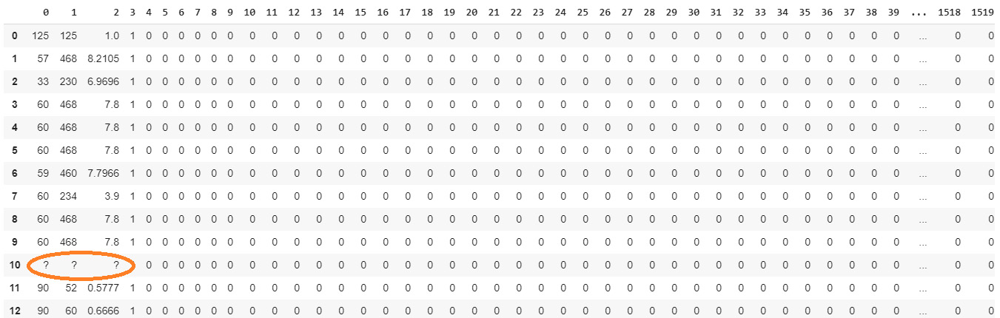

14. Dimensionality Reduction
============================


Overview

This lab introduces dimensionality reduction in data science. You
will be using the Internet Advertisements dataset to analyze and
evaluate different techniques in dimensionality reduction. By the end of
this lab, you will be able to analyze datasets with high dimensions
and deal with the challenges posed by these datasets. As well as
applying different dimensionality reduction techniques to large
datasets, you will fit models based on those datasets and analyze their
results. By the end of this lab, you will be able to deal with huge
datasets in the real world.


Business Context
----------------

The marketing head of your company comes to you with a problem she has
been grappling with. Many customers have been complaining about the
browsing experience of your company\'s website because of the number of
advertisements that pop up during browsing. Your company wants to build
an engine on your web server that identifies potential advertisements
and then eliminates them even before they pop up.

To help you to achieve this, you have been given a dataset that contains
a set of possible advertisements on a variety of web pages. The features
of the dataset represent the geometry of the images in the possible
adverts, as well as phrases occurring in the URL, image URLs, anchor
text, and words occurring near the anchor text. This dataset has also
been labeled, with each possible ad given a label that says whether it
is actually an advertisement or not. Using this dataset, you have to
build a model that predicts whether something is an advertisement or
not. You may think that this is a relatively simple problem that could
be solved with any binary classification algorithm. However, there is a
challenge in the dataset. The dataset has a large number of features.
You have set out to solve this high-dimensional dataset challenge.


Exercise 14.01: Loading and Cleaning the Dataset
------------------------------------------------

In this exercise, we will download the dataset, load it in our Colab
notebook, and do some basic explorations, such as printing the
dimensions of the dataset using the `.shape()` and
`.describe()` functions, and also cleaning the dataset.


The following steps will help you complete this exercise:

1.  Open a new Colab notebook file.

2.  Now, `import pandas` into your Colab notebook:
    ```
    import pandas as pd
    ```


3.  Next, set the path of the drive where the `ad.Data` file
    is uploaded, as shown in the following code snippet:
    ```
    # Defining file name of the GitHub repository
    filename = 'https://raw.githubusercontent.com'\
               '/fenago/data-science'\
               '/master/Lab14/Dataset/ad.data'
    ```


4.  Read the file using the `pd.read_csv()` function from the
    pandas data frame:

    ```
    adData = pd.read_csv(filename,sep=",",header = None,\
                         error_bad_lines=False)
    adData.head()
    ```


    The `pd.read_csv()` function\'s arguments are the filename
    as a string and the limit separator of a CSV file, which is
    `","`. Please note that as there are no headers for the
    dataset. We specifically mention this using the
    `header = None` command. The last argument,
    `error_bad_lines=False`, is to skip any errors in the
    format of the file and then load data.

    After reading the file, the data frame is printed using the
    `.head()` function.

    You should get the following output:

    


    Caption: Loading data into the Colab notebook

5.  Now, print the shape of the dataset, as shown in the following code
    snippet:

    ```
    # Printing the shape of the data
    print(adData.shape)
    ```


    You should get the following output:

    ```
    (3279, 1559)
    ```


    From the shape, we can see that we have a large number of features,
    `1559`.

6.  Find the summary of the numerical features of the raw data using the
    `.describe()` function in pandas, as shown in the
    following code snippet:

    ```
    # Summarizing the statistics of the numerical raw data
    adData.describe()
    ```


    You should get the following output:

    


    Caption: Loading data into the Colab notebook

    As we saw from the shape of the data, the dataset has
    `3279` examples with `1559 `variables. The
    variable set has both categorical and numerical variables. The
    summary statistics are only derived for numerical data.

7.  Separate the dependent and independent variables from our dataset,
    as shown in the following code snippet:

    ```
    # Separate the dependent and independent variables
    # Preparing the X variables
    X = adData.loc[:,0:1557]
    print(X.shape)
    # Preparing the Y variable
    Y = adData[1558]
    print(Y.shape)
    ```


    You should get the following output:

    ```
    (3279, 1558)
    (3279, )
    ```


    As seen earlier, there are `1559` features in the dataset.
    The first `1558` features are independent variables. They
    are separated from the initial `adData` data frame using
    the `.loc()` function and give the indexes of the
    corresponding features (`0` to `1557`). The
    independent variables are loaded into a new variable called
    `X`. The dependent variable, which is the label of the
    dataset, is loaded in variable `Y`. The shapes of the
    dependent and independent variables are also printed.

8.  Print the first `15` examples of the independent
    variables:

    ```
    # Printing the head of the independent variables
    X.head(15)
    ```


    You can print as many rows of the data by defining the number within
    the `head()` function. Here, we have printed out the first
    `15` rows of the data.

    The output is as follows:

    



    Caption: First 15 examples of independent variables

    From the output, we can see that there are many missing values in
    the dataset, which are represented by `?`. For further
    analysis, we have to remove these special characters and then
    replace those cells with assumed values. One popular method of
    replacing special characters is to impute the mean of the respective
    feature. Let\'s adopt this strategy. However, before doing that,
    let\'s look at the data types for this dataset to adopt a suitable
    replacement strategy.

9.  Print the data types of the dataset:

    ```
    # Printing the data types
    print(X.dtypes)
    ```


    We should get the following output:

    


    Caption: The data types in our dataset

    From the output, we can see that the first four columns are of the
    object type, which refers to string data, and the others are integer
    data. When replacing the special characters in the data, we need to
    be cognizant of the data types.

10. Replace special characters with `NaN` values for the first
    four columns.

    Replace the special characters in the first four columns, which are
    of the object type, with `NaN` values. `NaN` is
    an abbreviation for \"not a number.\" Replacing special characters
    with `NaN` values makes it easy to further impute data.

    This is achieved through the following code snippet:

    ```
    """
    Replacing special characters in first 3 columns 
    which are of type object
    """
    for i in range(0,3):
        X[i] = X[i].str.replace("?", 'nan')\
                   .values.astype(float)
    print(X.head(15))
    ```


    To replace the first three columns, we loop through the columns
    using the `for()` loop and also using the
    `range()` function. Since the first three columns are of
    the `object` or `string` type, we use the
    `.str.replace()` function, which stands for \"string
    replace\". After replacing the special characters, `?`, of
    the data with `nan`, we convert the data type to
    `float` with the `.values.astype(float)`
    function, which is required for further processing. By printing the
    first 15 examples, we can see that all special characters have been
    replaced with `nan` or `NaN` values

    You should get the following output:

    


    Caption: After replacing special characters with NaN

11. Now, replace special characters for the integer features.

    As in *Step 9*, let\'s also replace the special characters from the
    features of the `int64` data type with the following code
    snippet:

    ```
    """
    Replacing special characters in the remaining 
    columns which are of type integer
    """
    for i in range(3,1557):
        X[i] = X[i].replace("?", 'NaN').values.astype(float)
    ```


    Note

    For the integer features, we do not have `.str` before the
    `.replace()` function, as these features are integer
    values and not string values.

12. Now, impute the mean of each column for the `NaN` values.

    Now that we have replaced special characters in the data with
    `NaN` values, we can use the `fillna()` function
    in pandas to replace the `NaN` values with the mean of the
    column. This is executed using the following code snippet:

    ```
    import numpy as np
    # Impute the 'NaN'  with mean of the values
    for i in range(0,1557):
        X[i] = X[i].fillna(X[i].mean())
    print(X.head(15))
    ```


    In the preceding code snippet, the `.mean()` function
    calculates the mean of each column and then replaces the
    `nan` values with the mean of the column.

    You should get the following output:

    


    Caption: Mean of the NaN columns

13. Scale the dataset using the `minmaxScaler()` function.

    As in *Lab 3*, *Binary Classification*, scaling data is useful
    in the modeling step. Let\'s scale the dataset using the
    `minmaxScaler()` function as learned in *Lab 3*,
    *Binary Classification*.

    This is shown in the following code snippet:

    ```
    # Scaling the data sets
    # Import library function
    from sklearn import preprocessing
    # Creating the scaling function
    minmaxScaler = preprocessing.MinMaxScaler()
    # Transforming with the scaler function
    X_tran = pd.DataFrame(minmaxScaler.fit_transform(X))
    # Printing the output
    X_tran.head() 
    ```


    You should get the following output. Here, we have displayed the
    first 24 columns:

    


Caption: Scaling the dataset using the MinMaxScaler() function


Creating a High-Dimensional Dataset
===================================


In the earlier section, we worked with a dataset that has around
`1,558` features. In order to demonstrate the challenges with
high-dimensional datasets, let\'s create an extremely high dimensional
dataset from the internet dataset that we already have.

This we will achieve by replicating the existing number of features
multiple times so that the dataset becomes really large. To replicate
the dataset, we will use a function called `np.tile()`, which
copies a data frame multiple times across the axes we want. We will also
calculate the time it takes for any activity using the
`time()` function.

Let\'s look at both these functions in action with a toy example.

You begin by importing the necessary library functions:

```
import pandas as pd
import numpy as np
```

Then, to create a dummy data frame, we will use a small dataset with two
rows and three columns for this example. We use the
`pd.np.array()` function to create a data frame:

```
# Creating a simple data frame
df = pd.np.array([[1, 2, 3], [4, 5, 6]])
print(df.shape)
df
```
You should get the following output:


Caption: Array for the sample dummy data frame

Next, you replicate the dummy data frame and this replication of the
columns is done using the `pd.np.tile()` function in the
following code snippet:

```
# Replicating the data frame and noting the time
import time
# Starting a timing function
t0=time.time()
Newdf = pd.DataFrame(pd.np.tile(df, (1, 5)))
print(Newdf.shape)
print(Newdf)
# Finding the end time
print("Total time:", round(time.time()-t0, 3), "s")
```
You should get the following output:


Caption: Replication of the data frame

As we can see in the snippet, the `pd.np.tile()` function
accepts two sets of arguments. The first one is the data frame,
`df`, that we want to replicate. The next argument,
`(1,5)`, defines which axes we want to replicate. In this
example, we define that the rows will remain as is because of the
`1` argument, and the columns will be replicated `5`
times with the `5` argument. We can see from the
`shape()` function that the original data frame, which was of
shape `(2,3)`, has been transformed into a data frame with a
shape of `(2,15)`.

Calculating the total time is done using the `time` library.
To start the timing, we invoke the `time.time()` function. In
the example, we store the initial time in a variable called
`t0` and then subtract this from the end time to find the
total time it takes for the process. Thus we have augmented and added
more data frames to our exiting internet ads dataset.


Activity 14.01: Fitting a Logistic Regression Model on a HighDimensional Dataset
--------------------------------------------------------------------------------

You want to test the performance of your models when the dataset is
large. To do this, you are artificially augmenting the internet ads
dataset so that the dataset is 300 times bigger in dimension than the
original dataset. You will be fitting a logistic regression model on
this new dataset and then observe the results.

**Hint**: In this activity, we will use a notebook similar to *Exercise
14.01*, *Loading and Cleaning the Dataset*, and we will also be fitting
a logistic regression model as done in *Lab 3*, *Binary
Classification*.


The steps to complete this activity are as follows:

1.  Open a new Colab notebook.

2.  Implement all steps from *Exercise 14.01*, *Loading and Cleaning the
    Dataset*, until the normalization of data. Derive the transformed
    independent `X_tran` variable.

3.  Create a high-dimensional dataset by replicating the columns 300
    times using the `pd.np.tile()` function. Print the shape
    of the new dataset and observe the number of features in the new
    dataset.

4.  Split the dataset into train and test sets.

5.  Fit a logistic regression model on the new dataset and note the time
    it takes to fit the model. Note the color change for the indicator
    for RAM on your Colab notebook.

    **Expected Output**:

    You should get output similar to the following after fitting the
    logistic regression model on the new dataset:

    ```
    Total training time: 23.86 s
    ```


    


    Caption: Google Colab RAM utilization

6.  Predict on the test set and print the classification report and
    confusion matrix.

    You should get the following output:

    


Caption: Confusion matrix and the classification report results


In this activity, you will have created a high-dimensional dataset by
replicating the columns of the existing database and identified that the
resource utilization is quite high with this high dimensional dataset.
The resource utilization indicator changed its color to orange because
of the large dimensions. The longer time, `23.86` seconds,
taken for modeling was also noticed on this dataset. You will have also
predicted on the test set to get an accuracy level of around
`97%` using the logistic regression model.

First, you need to know why the color of RAM utilization on Colab
changed to orange. Because of the huge dataset we created by
replication, Colab had to use access RAM, due to which the color changed
to orange.

But, out of curiosity, what do you think the impact will be on the RAM
utilization if you increased the replication from 300 to 500? Let\'s
have a look at the following example.

Note

You don\'t need to perform this on your Colab notebook.

We begin by defining the path of the dataset for the GitHub repository
to our \"ads\" dataset:

```
# Defining the file name from GitHub
filename = 'https://raw.githubusercontent.com'\
           '/fenago/data-science'\
           '/master/Lab14/Dataset/ad.data'
```
Next, we simply load the data using pandas:

```
# import pandas as pd
# Loading the data using pandas
adData = pd.read_csv(filename,sep=",",header = None,\
                     error_bad_lines=False)
```
Create a high-dimensional dataset with a scaling factor of
`500`:

```
# Creating a high dimension dataset
X_hd = pd.DataFrame(pd.np.tile(adData, (1, 500)))
```
You will see the following output:


Caption: Colab crashing

From the output, you can see that the session crashes because all the
RAM provided by Colab has been used. The session will restart, and you
will lose all your variables. Hence, it is always good to be mindful of
the resources you are provided with, along with the dataset. As a data
scientist, if you feel that a dataset is huge with many features but the
resources to process that dataset are limited, you need to get in touch
with the organization and get the required resources or build an
appropriate strategy to address these high-dimensional datasets.


Strategies for Addressing High-Dimensional Datasets
===================================================


In *Activity 14.01*, *Fitting a Logistic Regression Model on a
High-Dimensional Dataset*, we witnessed the challenges of
high-dimensional datasets. We saw how the resources were challenged when
the replication factor was 300. You also saw that the notebook crashes
when the replication factor is increased to 500. When the replication
factor was 500, the number of features was around 750,000. In our case,
our resources would fail to scale up even before we hit the 1 million
mark on the number of features. Some modern-day datasets sometimes have
hundreds of millions, or in many cases billions, of features. Imagine
the kind of resources and time it would take to get any actionable
insights from the dataset.

Luckily, we have many robust methods for addressing high-dimensional
datasets. Many of these techniques are very effective and have helped to
address the challenges raised by huge datasets.

Let\'s look at some of the techniques for dealing with high-dimensional
datasets. In *Figure 14.14*, you can see the strategies we will be
coming across in this lab to deal with such datasets:


Caption: Strategies to address high dimensional datasets


Backward Feature Elimination (Recursive Feature Elimination)
------------------------------------------------------------

The mechanism behind the backward feature elimination algorithm is the
recursive elimination of features and building a model on those features
that remain after all the elimination.

Let\'s look under the hood of this algorithm step by step:

1.  Initially, at a given iteration, the selected classification
    algorithm is first trained on all the `n` features
    available. For example, let\'s take the case of the original dataset
    we had, which had `1,558` features. The algorithm starts
    off with all the `1,558` features in the first iteration.
2.  In the next step, we remove one feature at a time and train a model
    with the remaining `n-1` features. This process is
    repeated `n` times. For example, we first remove feature 1
    and then fit a model using all the remaining 1,557 variables. In the
    next iteration, we use feature `1` and instead, we
    eliminate feature `2` and then fit the model. This process
    is repeated `n` times (`1,558`) times.
3.  For each of the models fitted, the performance of the model (using
    measures such as accuracy) is calculated.
4.  The feature whose replacement has resulted in the smallest change in
    performance is removed permanently and *Step 2* is repeated with
    `n-1` features.
5.  The process is then repeated with `n-2` features and so
    on.
6.  The algorithm keeps on eliminating features until the threshold
    number of features we require is reached.

Let\'s take a look at the backward feature elimination algorithm in
action for the augmented ads dataset in the next exercise.


Exercise 14.02: Dimensionality Reduction Using Backward Feature Elimination
---------------------------------------------------------------------------

In this exercise, we will fit a logistic regression model after
eliminating features using the backward elimination technique to find
the accuracy of the model. We will be using the same ads dataset as
before, and we will be enhancing it with additional features for this
exercise.

The following steps will help you complete this exercise:

1.  Open a new Colab notebook file.

2.  Implement all the initial steps similar to *Exercise 14.01*,
    *Loading and Cleaning the Dataset*, until scaling the dataset using
    the `minmaxscaler()` function:
    ```
    filename = 'https://raw.githubusercontent.com'\
               '/fenago/data-science'\
               '/master/Lab14/Dataset/ad.data'
    import pandas as pd
    adData = pd.read_csv(filename,sep=",",header = None,\
                         error_bad_lines=False)
    X = adData.loc[:,0:1557]
    Y = adData[1558]
    import numpy as np
    for i in range(0,3):
        X[i] = X[i].str.replace("?", 'NaN').values.astype(float)
    for i in range(3,1557):
        X[i] = X[i].replace("?", 'NaN').values.astype(float)
    for i in range(0,1557):
        X[i] = X[i].fillna(X[i].mean())
    from sklearn import preprocessing
    minmaxScaler = preprocessing.MinMaxScaler()
    X_tran = pd.DataFrame(minmaxScaler.fit_transform(X))
    ```


3.  Next, create a high-dimensional dataset. We\'ll augment the dataset
    artificially by a factor of `2`. The process of backward
    feature elimination is a very compute-intensive process, and using
    higher dimensions will involve a longer processing time. This is why
    the augmenting factor has been kept at `2`. This is
    implemented using the following code snippet:

    ```
    # Creating a high dimension data set
    X_hd = pd.DataFrame(pd.np.tile(X_tran, (1, 2)))
    print(X_hd.shape)
    ```


    You should get the following output:

    ```
    (3279, 3116)
    ```


4.  Define the backward elimination model. Backward elimination works by
    providing two arguments to the `RFE()` function, which is
    the model we want to try (logistic regression in our case) and the
    number of features we want the dataset to be reduced to. This is
    implemented as follows:

    ```
    from sklearn.linear_model import LogisticRegression
    from sklearn.feature_selection import RFE
    # Defining the Classification function
    backModel = LogisticRegression()
    """
    Reducing dimensionality to 250 features for the 
    backward elimination model
    """
    rfe = RFE(backModel, 250)
    ```


    In this implementation, the number of features that we have given,
    `250`, is identified through trial and error. The process
    is to first assume an arbitrary number of features and then, based
    on the final metrics, arrive at the most optimum number of features
    for the model. In this implementation, our first assumption of
    `250` implies that we want the backward elimination model
    to start eliminating features until we get the best `250`
    features.

5.  Fit the backward elimination method to identify the best
    `250` features.

    We are now ready to fit the backward elimination method on the
    higher-dimensional dataset. We will also note the time it takes for
    backward elimination to work. This is implemented using the
    following code snippet:

    ```
    # Fitting the rfe for selecting the top 250 features
    import time
    t0 = time.time()
    rfe = rfe.fit(X_hd, Y)
    t1 = time.time()
    print("Backward Elimination time:", \
          round(t1-t0, 3), "s")
    ```


    Fitting the backward elimination method is done using the
    `.fit()` function. We give the independent and dependent
    training sets.

    Note

    The backward elimination method is a compute-intensive process, and
    therefore this process will take a lot of time to execute. The
    larger the number of features, the longer it will take.

    The time for backward elimination is at the end of the
    notifications:

    


    Caption: The time taken for the backward elimination process

    You can see that the backward elimination process to find the best
    `250` features has taken `230.35` seconds to
    implement.

6.  Display the features identified using the backward elimination
    method. We can display the `250` features that were
    identified using the backward elimination process using the
    `get_support()` function. This is implemented as follows:

    ```
    # Getting the indexes of the features used
    rfe.get_support(indices = True)
    ```


    You should get the following output:

    


    Caption: The identified features being displayed

    These are the best `250` features that were finally
    selected using the backward elimination process from the entire
    dataset.

7.  Now, split the dataset into training and testing sets for modeling:

    ```
    from sklearn.model_selection import train_test_split
    # Splitting the data into train and test sets
    X_train, X_test, y_train, y_test = train_test_split\
                                       (X_hd, Y, test_size=0.3,\
                                        random_state=123)
    print('Training set shape',X_train.shape)
    print('Test set shape',X_test.shape)
    ```


    You should get the following output:

    ```
    Training set shape (2295, 3116)
    Test set shape (984, 3116)
    ```


    From the output, you see the shapes of both the training set and
    testing sets.

8.  Transform the train and test sets. In *step 5*, we identified the
    top `250` features through backward elimination. Now we
    need to reduce the train and test sets to those top `250`
    features. This is done using the `.transform()` function.
    This is implemented using the following code snippet:

    ```
    # Transforming both train and test sets
    X_train_tran = rfe.transform(X_train)
    X_test_tran = rfe.transform(X_test)
    print("Training set shape",X_train_tran.shape)
    print("Test set shape",X_test_tran.shape)
    ```


    You should get the following output:

    ```
    Training set shape (2295, 250)
    Test set shape (984, 250)
    ```


    We can see that both the training set and test sets have been
    reduced to the `250` best features.

9.  Fit a logistic regression model on the training set and note the
    time:

    ```
    # Fitting the logistic regression model
    import time
    # Defining the LogisticRegression function
    RfeModel = LogisticRegression()
    # Starting a timing function
    t0=time.time()
    # Fitting the model
    RfeModel.fit(X_train_tran, y_train)
    # Finding the end time
    print("Total training time:", \
          round(time.time()-t0, 3), "s")
    ```


    You should get the following output:

    ```
    Total training time: 0.016 s
    ```


    As expected, the total time it takes to fit a model on a reduced set
    of features is much lower than the time it took for the larger
    dataset in *Activity 14.01*, *Fitting a Logistic Regression Model on
    a HighDimensional Dataset*, which was `23.86` seconds.
    This is a great improvement.

10. Now, predict on the test set and print the accuracy metrics, as
    shown in the following code snippet:

    ```
    # Predicting on the test set and getting the accuracy
    pred = RfeModel.predict(X_test_tran)
    print('Accuracy of Logistic regression model after '\
          'backward elimination: {:.2f}'\
          .format(RfeModel.score(X_test_tran, y_test)))
    ```


    You should get the following output:

    


    Caption: The achieved accuracy of the logistic regression model

    You can see that the accuracy measure for this model has improved
    compared to the one we got for the model with higher dimensionality,
    which was `0.97` in *Activity 14.01*, *Fitting a Logistic
    Regression Model on a HighDimensional Dataset*. This increase could
    be attributed to the identification of non-correlated features from
    the complete feature set, which could have boosted the performance
    of the model.

11. Print the confusion matrix:

    ```
    from sklearn.metrics import confusion_matrix
    confusionMatrix = confusion_matrix(y_test, pred)
    print(confusionMatrix)
    ```


    You should get the following output:

    


    Caption: Confusion matrix

12. Printing the classification report:

    ```
    from sklearn.metrics import classification_report
    # Getting the Classification_report
    print(classification_report(y_test, pred))
    ```


    You should get the following output:

    


Exercise 14.03: Dimensionality Reduction Using Forward Feature Selection
------------------------------------------------------------------------

In this exercise, we will fit a logistic regression model by selecting
the optimum features through forward feature selection and observing the
performance of the model. We will be using the same ads dataset as
before, and we will be enhancing it with additional features for this
exercise.

The following steps will help you complete this exercise:

1.  Open a new Colab notebook.

2.  Implement all the initial steps similar to *Exercise 14.01*,
    *Loading and Cleaning the Dataset*, up until scaling the dataset
    using `MinMaxScaler()`:
    ```
    filename = 'https://raw.githubusercontent.com'\
               '/fenago/data-science'\
               '/master/Lab14/Dataset/ad.data'
    import pandas as pd
    adData = pd.read_csv(filename,sep=",",header = None,\
                         error_bad_lines=False)
    X = adData.loc[:,0:1557]
    Y = adData[1558]
    import numpy as np
    for i in range(0,3):
        X[i] = X[i].str.replace("?", 'NaN')\
                   .values.astype(float)
    for i in range(3,1557):
        X[i] = X[i].replace("?", 'NaN').values.astype(float)
    for i in range(0,1557):
        X[i] = X[i].fillna(X[i].mean())
    from sklearn import preprocessing
    minmaxScaler = preprocessing.MinMaxScaler()
    X_tran = pd.DataFrame(minmaxScaler.fit_transform(X))
    ```


3.  Create a high-dimensional dataset. Now, augment the dataset
    artificially to a factor of `50`. Augmenting the dataset
    to higher factors will result in the notebook crashing because of
    lack of memory. This is implemented using the following code
    snippet:

    ```
    # Creating a high dimension dataset
    X_hd = pd.DataFrame(pd.np.tile(X_tran, (1, 50)))
    print(X_hd.shape)
    ```


    You should get the following output:

    ```
    (3279, 77900)
    ```


4.  Split the high dimensional dataset into training and testing sets:
    ```
    from sklearn.model_selection import train_test_split
    # Splitting the data into train and test sets
    X_train, X_test, y_train, y_test = train_test_split\
                                       (X_hd, Y, test_size=0.3, \
                                        random_state=123)
    ```


5.  Now we define the threshold features. Once the train and test sets
    are created, the next step is to import the feature selection
    function, `SelectKBest`. The argument we give to this
    function is the number of features we want. The features are
    selected through experimentation and, as a first step, we assume a
    threshold value. In this example, we assume a threshold value of
    `250`. This is implemented using the following code
    snippet:
    ```
    from sklearn.feature_selection import SelectKBest
    # feature extraction
    feats = SelectKBest(k=250)
    ```


6.  Iterate and get the best set of threshold features. Based on the
    threshold set of features we defined, we have to fit the training
    set and get the best set of threshold features. Fitting on the
    training set is done using the `.fit()` function. We also
    note the time it takes to find the best set of features. This is
    executed using the following code snippet:

    ```
    # Fitting the features for training set
    import time
    t0 = time.time()
    fit = feats.fit(X_train, y_train)
    t1 = time.time()
    print("Forward selection fitting time:", \
          round(t1-t0, 3), "s")
    ```


    You should get something similar to the following output:

    ```
    Forward selection fitting time: 2.682 s
    ```


    We can see that the forward selection method has taken around
    `2.68` seconds, which is much lower than the backward
    selection method.

7.  Create new training and test sets. Once we have identified the best
    set of features, we have to modify our training and test sets so
    that they have only those selected features. This is accomplished
    using the `.transform()` function:
    ```
    # Creating new training set and test sets 
    features_train = fit.transform(X_train)
    features_test = fit.transform(X_test)
    ```


8.  Let\'s verify the shapes of the train and test sets before
    transformation and after transformation:

    ```
    """
    Printing the shape of training and test sets 
    before transformation
    """
    print('Train shape before transformation',\
          X_train.shape)
    print('Test shape before transformation',\
          X_test.shape)
    """
    Printing the shape of training and test sets 
    after transformation
    """
    print('Train shape after transformation',\
          features_train.shape)
    print('Test shape after transformation',\
          features_test.shape)
    ```


    You should get the following output:

    


    Caption: Shape of the training and testing datasets

    You can see that both the training and test sets are reduced to
    `250` features each.

9.  Let\'s now fit a logistic regression model on the transformed
    dataset and note the time it takes to fit the model:
    ```
    # Fitting a Logistic Regression Model
    from sklearn.linear_model import LogisticRegression
    import time
    t0 = time.time()
    forwardModel = LogisticRegression()
    forwardModel.fit(features_train, y_train)
    t1 = time.time()
    ```


10. Print the total time:

    ```
    print("Total training time:", round(t1-t0, 3), "s")
    ```


    You should get the following output:

    ```
    Total training time: 0.035 s
    ```


    You can see that the training time is much less than the model that
    was fit in *Activity 14.01*, *Fitting a Logistic Regression Model on
    a HighDimensional Dataset*, which was `23.86` seconds.
    This shorter time is attributed to the number of features in the
    forward selection model.

11. Now, perform predictions on the test set and print the accuracy
    metrics:

    ```
    # Predicting with the forward model
    pred = forwardModel.predict(features_test)
    print('Accuracy of Logistic regression'\
          ' model prediction on test set: {:.2f}'
          .format(forwardModel.score(features_test, y_test)))
    ```


    You should get the following output:

    ```
    Accuracy of Logistic regression model prediction on test set: 0.94
    ```


12. Print the confusion matrix:

    ```
    from sklearn.metrics import confusion_matrix
    confusionMatrix = confusion_matrix(y_test, pred)
    print(confusionMatrix)
    ```


    You should get something similar to the following output:

    


    Caption: Resulting confusion matrix

13. Print the classification report:

    ```
    from sklearn.metrics import classification_report
    # Getting the Classification_report
    print(classification_report(y_test, pred))
    ```


    You should get something similar to the following output:

    


Caption: Resulting classification report


Principal Component Analysis (PCA)
----------------------------------

Let\'s look at the idea of PCA with an example.

We will create a sample dataset with 2 variables and 100 random data
points in each variable. Random data points are created using the
`rand()` function. This is implemented in the following code:

```
import numpy as np
# Setting the seed for reproducibility
seed = np.random.RandomState(123)
# Generating an array of random numbers
X = seed.rand(100,2)
# Printing the shape of the dataset
X.shape
```

The resulting output is: `(100, 2)`.

Note

A random state is defined using the `RandomState(123)`
function. This is defined to ensure that anyone who reproduces this
example gets the same output.

Let\'s visualize this data using `matplotlib`:

```
import matplotlib.pyplot as plt
%matplotlib inline
plt.scatter(X[:, 0], X[:, 1])
plt.axis('equal')
```
You should get the following output:

```
(-0.04635361265714105,
 1.0325632864350174,
 -0.003996887112708292,
 1.0429468329457663)
```


Caption: Visualization of the data

In the graph, we can see that the data is evenly spread out.

Let\'s now find the principal components for this dataset. We will
reduce this two-dimensional dataset into a one-dimensional dataset. In
other words, we will reduce the original dataset into one of its
principal components.

This is implemented in code as follows:

```
from sklearn.decomposition import PCA
# Defining one component
pca = PCA(n_components=1)
# Fitting the PCA function
pca.fit(X)
# Getting the new dataset
X_pca = pca.transform(X)
# Printing the shapes
print("Original data set:   ", X.shape)
print("Data set after transformation:", X_pca.shape)
```
You should get the following output:

```
original shape: (100, 2)
transformed shape: (100, 1)
```
As we can see in the code, we first define the number of components
using the `'n_components' = 1` argument. After this, the PCA
algorithm is fit on the input dataset. After fitting on the input data,
the initial dataset is transformed into a new dataset with only one
variable, which is its principal component.

The algorithm transforms the original dataset into its first principal
component by using an axis where the data has the largest variability.

To visualize this concept, let\'s reverse the transformation of the
`X_pca` dataset to its original form and then visualize this
data along with the original data. To reverse the transformation, we use
the `.inverse_transform()` function:

```
# Reversing the transformation and plotting 
X_reverse = pca.inverse_transform(X_pca)
# Plotting the original data
plt.scatter(X[:, 0], X[:, 1], alpha=0.1)
# Plotting the reversed data
plt.scatter(X_reverse[:, 0], X_reverse[:, 1], alpha=0.9)
plt.axis('equal');
```
You should get the following output:


Caption: Plot with reverse transformation

As we can see in the plot, the data points in orange represent an axis
with the highest variability. All the data points were projected to that
axis to generate the first principal component.

The data points that are generated when transforming into various
principal components will be very different from the original data
points before transformation. Each principal component will be in an
axis that is orthogonal (perpendicular) to the other principal
component. If a second principal component was generated for the
preceding example, the second principal component would be along an axis
indicated by the blue arrow in the graph. The way we pick the number of
principal components for model building is by selecting the number of
components that explains a certain threshold of variability.

For example, if there were originally 1,000 features and we reduced it
to 100 principal components, and then we find that out of the 100
principal components the first 75 components explain 90% of the
variability of data, we would pick those 75 components to build the
model. This process is called picking principal components with the
percentage of variance explained.

Let\'s now see how to use PCA as a tool for dimensionality reduction in
our use case.


Exercise 14.04: Dimensionality Reduction Using PCA
--------------------------------------------------

In this exercise, we will fit a logistic regression model by selecting
the principal components that explain the maximum variability of the
data. We will also observe the performance of the feature selection and
model building process. We will be using the same ads dataset as before,
and we will be enhancing it with additional features for this exercise.

The following steps will help you complete this exercise:

1.  Open a new Colab notebook file.

2.  Implement the initial steps from *Exercise 14.01*, *Loading and
    Cleaning the Dataset*, up until scaling the dataset using the
    `minmaxscaler()` function:
    ```
    filename = 'https://raw.githubusercontent.com'\
               '/fenago/data-science'\
               '/master/Lab14/Dataset/ad.data'
    import pandas as pd
    adData = pd.read_csv(filename,sep=",",header = None,\
                         error_bad_lines=False)
    X = adData.loc[:,0:1557]
    Y = adData[1558]
    import numpy as np
    for i in range(0,3):
        X[i] = X[i].str.replace("?", 'NaN').values.astype(float)
    for i in range(3,1557):
        X[i] = X[i].replace("?", 'NaN').values.astype(float)
    for i in range(0,1557):
        X[i] = X[i].fillna(X[i].mean())
    from sklearn import preprocessing
    minmaxScaler = preprocessing.MinMaxScaler()
    X_tran = pd.DataFrame(minmaxScaler.fit_transform(X))
    ```


3.  Create a high-dimensional dataset. Let\'s now augment the dataset
    artificially to a factor of 50. Augmenting the dataset to higher
    factors will result in the notebook crashing because of a lack of
    memory. This is implemented using the following code snippet:

    ```
    # Creating a high dimension data set
    X_hd = pd.DataFrame(pd.np.tile(X_tran, (1, 50)))
    print(X_hd.shape)
    ```


    You should get the following output

    ```
    (3279, 77900)
    ```


4.  Let\'s split the high-dimensional dataset to training and test sets:
    ```
    from sklearn.model_selection import train_test_split
    # Splitting the data into train and test sets
    X_train, X_test, y_train, y_test = train_test_split\
                                       (X_hd, Y, test_size=0.3, \
                                        random_state=123)
    ```


5.  Let\'s now fit the PCA function on the training set. This is done
    using the `.fit()` function, as shown in the following
    snippet. We will also note the time it takes to fit the PCA model on
    the dataset:

    ```
    from sklearn.decomposition import PCA
    import time
    t0 = time.time()
    pca = PCA().fit(X_train)
    t1 = time.time()
    print("PCA fitting time:", round(t1-t0, 3), "s")
    ```


    You should get the following output:

    ```
    PCS fitting time: 179.545 s
    ```


    We can see that the time taken to fit the PCA function on the
    dataset is less than the backward elimination model (230.35 seconds)
    and higher than the forward selection method (2.682 seconds).

6.  We will now determine the number of principal components by plotting
    the cumulative variance explained by all the principal components.
    The variance explained is determined by the
    `pca.explained_variance_ratio_` method. This is plotted in
    `matplotlib` using the following code snippet:

    ```
    %matplotlib inline
    import numpy as np
    import matplotlib.pyplot as plt
    plt.plot(np.cumsum(pca.explained_variance_ratio_))
    plt.xlabel('Number of Principal Components')
    plt.ylabel('Cumulative explained variance');
    ```


    In the code, the `np.cumsum()` function is used to get the
    cumulative variance of each principal component.

    You will get the following plot as output:

    


    Caption: The variance graph

    From the plot, we can see that the first `250` principal
    components explain more than `90%` of the variance. Based
    on this graph, we can decide how many principal components we want
    to have depending on the variability it explains. Let\'s select
    `250` components for fitting our model.

7.  Now that we have identified that `250` components explain
    a lot of the variability, let\'s refit the training set for
    `250` components. This is described in the following code
    snippet:
    ```
    # Defining PCA with 250 components
    pca = PCA(n_components=250)
    # Fitting PCA on the training set
    pca.fit(X_train)
    ```


8.  We now transform the training and test sets with the 200 principal
    components:
    ```
    # Transforming training set and test set
    X_pca = pca.transform(X_train)
    X_test_pca = pca.transform(X_test)
    ```


9.  Let\'s verify the shapes of the train and test sets before
    transformation and after transformation:

    ```
    """
    Printing the shape of train and test sets before 
    and after transformation
    """
    print("original shape of Training set:   ", \
          X_train.shape)
    print("original shape of Test set:   ", \
          X_test.shape)
    print("Transformed shape of training set:", \
          X_pca.shape)
    print("Transformed shape of test set:", \
          X_test_pca.shape)
    ```


    You should get the following output:

    


    Caption: Transformed and the original training and testing sets

    You can see that both the training and test sets are reduced to
    `250` features each.

10. Let\'s now fit the logistic regression model on the transformed
    dataset and note the time it takes to fit the model:
    ```
    # Fitting a Logistic Regression Model
    from sklearn.linear_model import LogisticRegression
    import time
    pcaModel = LogisticRegression()
    t0 = time.time()
    pcaModel.fit(X_pca, y_train)
    t1 = time.time()
    ```


11. Print the total time:

    ```
    print("Total training time:", round(t1-t0, 3), "s")
    ```


    You should get the following output:

    ```
    Total training time: 0.293 s
    ```


    You can see that the training time is much lower than the model that
    was fit in *Activity 14.01*, *Fitting a Logistic Regression Model on
    a HighDimensional Dataset*, which was 23.86 seconds. The shorter
    time is attributed to the smaller number of features,
    `250`, selected in PCA.

12. Now, predict on the test set and print the accuracy metrics:

    ```
    # Predicting with the pca model
    pred = pcaModel.predict(X_test_pca)
    print('Accuracy of Logistic regression model '\
          'prediction on test set: {:.2f}'\
          .format(pcaModel.score(X_test_pca, y_test)))
    ```


    You should get the following output:

    


    Caption: Accuracy of the logistic regression model

    You can see that the accuracy level is better than the benchmark
    model with all the features (`97%`) and the forward
    selection model (`94%`).

13. Print the confusion matrix:

    ```
    from sklearn.metrics import confusion_matrix
    confusionMatrix = confusion_matrix(y_test, pred)
    print(confusionMatrix)
    ```


    You should get the following output:

    


    Caption: Resulting confusion matrix

14. Print the classification report:

    ```
    from sklearn.metrics import classification_report
    # Getting the Classification_report
    print(classification_report(y_test, pred))
    ```


    You should get the following output:

    


Independent Component Analysis (ICA)
------------------------------------

ICA is a technique of dimensionality reduction that conceptually follows
a similar path as PCA. Both ICA and PCA try to derive new sources of
data by linearly combining the original data.


Let\'s look at the implementation of ICA for our use case.


Exercise 14.05: Dimensionality Reduction Using Independent Component Analysis
-----------------------------------------------------------------------------

In this exercise, we will fit a logistic regression model using the ICA
technique and observe the performance of the model. We will be using the
same ads dataset as before, and we will be enhancing it with additional
features for this exercise.

The following steps will help you complete this exercise:

1.  Open a new Colab notebook file.

2.  Implement all the steps from *Exercise 14.01*, *Loading and Cleaning
    the Dataset*, up until scaling the dataset using
    `MinMaxScaler()`:
    ```
    filename = 'https://raw.githubusercontent.com'\
               '/fenago/data-science'\
               '/master/Lab14/Dataset/ad.data'
    import pandas as pd
    adData = pd.read_csv(filename,sep=",",header = None,\
                         error_bad_lines=False)
    X = adData.loc[:,0:1557]
    Y = adData[1558]
    import numpy as np
    for i in range(0,3):
        X[i] = X[i].str.replace("?", 'NaN')\
                   .values.astype(float)
    for i in range(3,1557):
        X[i] = X[i].replace("?", 'NaN')\
                   .values.astype(float)  
    for i in range(0,1557):
        X[i] = X[i].fillna(X[i].mean())
    from sklearn import preprocessing
    minmaxScaler = preprocessing.MinMaxScaler()
    X_tran = pd.DataFrame(minmaxScaler.fit_transform(X))
    ```


3.  Let\'s now augment the dataset artificially to a factor of
    `50`. Augmenting the dataset to factors that are higher
    than `50` will result in the notebook crashing because of
    a lack of memory. This is implemented using the following
    code snippet:

    ```
    # Creating a high dimension data set
    X_hd = pd.DataFrame(pd.np.tile(X_tran, (1, 50)))
    print(X_hd.shape)
    ```


    You should get the following output:

    ```
    (3279, 77900)
    ```


4.  Let\'s split the high-dimensional dataset into training and testing
    sets:
    ```
    from sklearn.model_selection import train_test_split
    # Splitting the data into train and test sets
    X_train, X_test, y_train, y_test = train_test_split\
                                       (X_hd, Y, test_size=0.3,\
                                        random_state=123)
    ```


5.  Let\'s load the ICA function, `FastICA`, and then define
    the number of components we require. We will use the same number of
    components that we used for PCA:
    ```
    # Defining the ICA with number of components
    from sklearn.decomposition import FastICA 
    ICA = FastICA(n_components=250, random_state=123)
    ```


6.  Once the ICA method is defined, we will fit the method on the
    training set and also transform the training set to get a new
    training set with the required number of components. We will also
    note the time taken for fitting and transforming:

    ```
    """
    Fitting the ICA method and transforming the 
    training set import time
    """
    t0 = time.time()
    X_ica=ICA.fit_transform(X_train)
    t1 = time.time()
    print("ICA fitting time:", round(t1-t0, 3), "s")
    ```


    In the code, the `.fit()` function is used to fit on the
    training set and the `transform()` method is used to get a
    new training set with the required number of features.

    You should get the following output:

    ```
    ICA fitting time: 203.02 s
    ```


    We can see that implementing ICA has taken much more time than PCA
    (179.54 seconds).

7.  We now transform the test set with the `250` components:
    ```
    # Transforming the test set 
    X_test_ica=ICA.transform(X_test)
    ```


8.  Let\'s verify the shapes of the train and test sets before
    transformation and after transformation:

    ```
    """
    Printing the shape of train and test sets 
    before and after transformation
    """
    print("original shape of Training set:   ", \
          X_train.shape)
    print("original shape of Test set:   ", \
          X_test.shape)
    print("Transformed shape of training set:", \
          X_ica.shape)
    print("Transformed shape of test set:", \
          X_test_ica.shape)
    ```


    You should get the following output:

    


    Caption: Shape of the original and transformed datasets

    You can see that both the training and test sets are reduced to
    `250` features each.

9.  Let\'s now fit the logistic regression model on the transformed
    dataset and note the time it takes:
    ```
    # Fitting a Logistic Regression Model
    from sklearn.linear_model import LogisticRegression
    import time
    icaModel = LogisticRegression()
    t0 = time.time()
    icaModel.fit(X_ica, y_train)
    t1 = time.time()
    ```


10. Print the total time:

    ```
    print("Total training time:", round(t1-t0, 3), "s")
    ```


    You should get the following output:

    ```
    Total training time: 0.054 s
    ```


11. Let\'s now predict on the test set and print the accuracy metrics:

    ```
    # Predicting with the ica model
    pred = icaModel.predict(X_test_ica)
    print('Accuracy of Logistic regression model '\
          'prediction on test set: {:.2f}'\
          .format(icaModel.score(X_test_ica, y_test)))
    ```


    You should get the following output:

    ```
    Accuracy of Logistic regression model prediction on test set: 0.87
    ```


    We can see that the ICA model has worse results than other models.

12. Print the confusion matrix:

    ```
    from sklearn.metrics import confusion_matrix
    confusionMatrix = confusion_matrix(y_test, pred)
    print(confusionMatrix)
    ```


    You should get the following output:

    


    Caption: Resulting confusion matrix

    We can see that the ICA model has done a poor job in classifying the
    ads. All the examples have been wrongly classified as non-ads. We
    can conclude that ICA is not suitable for this dataset.

13. Print the classification report:

    ```
    from sklearn.metrics import classification_report
    # Getting the Classification_report
    print(classification_report(y_test, pred))
    ```


    You should get the following output:

    


From this exercise, you may come up with a few questions:

- How do you think we can improve the classification results using
    ICA?
- Increasing the number of components results in a marginal increase
    in the accuracy metrics.
- Are there any other side effects because of the strategy adopted to
    improve the results?

Increasing the number of components also results in a longer training
time for the logistic regression model.


Factor Analysis
---------------

Factor analysis is a technique that achieves dimensionality reduction by
grouping variables that are highly correlated. Let\'s look at an example
from our context of predicting advertisements.

In our dataset, there could be many features that describe the geometry
(the size and shape of an image in the ad) of the images on a web page.
These features can be correlated because they refer to specific
characteristics of an image.

Similarly, there could be many features that describe the anchor text or
phrases occurring in a URL, which are highly correlated. Factor analysis
looks at correlated groups such as these from the data and then groups
them into latent factors. Therefore, if there are 10 raw features
describing the geometry of an image, factor analysis will group them
into one feature that characterizes the geometry of an image. Each of
these groups is called factors. As many correlated features are combined
to form a group, the resulting number of features will be much smaller
in comparison with the original dimensions of the dataset.

Let\'s now see how factor analysis can be implemented as a technique for
dimensionality reduction.


Exercise 14.06: Dimensionality Reduction Using Factor Analysis
--------------------------------------------------------------

In this exercise, we will fit a logistic regression model after reducing
the original dimensions to some key factors and then observe the
performance of the model.

The following steps will help you complete this exercise:

1.  Open a new Colab notebook file.

2.  Implement the same initial steps from *Exercise 14.01*, *Loading and
    Cleaning the Dataset*, up until scaling the dataset using the
    `minmaxscaler()` function:
    ```
    filename = 'https://raw.githubusercontent.com'\
               '/fenago/data-science'\
               '/master/Lab14/Dataset/ad.data'
    import pandas as pd
    adData = pd.read_csv(filename,sep=",",header = None,\
                         error_bad_lines=False)
    X = adData.loc[:,0:1557]
    Y = adData[1558]
    import numpy as np
    for i in range(0,3):
        X[i] = X[i].str.replace("?", 'NaN')\
                   .values.astype(float)
    for i in range(3,1557):
        X[i] = X[i].replace("?", 'NaN')\
                   .values.astype(float)  
    for i in range(0,1557):
        X[i] = X[i].fillna(X[i].mean())
    from sklearn import preprocessing
    minmaxScaler = preprocessing.MinMaxScaler()
    X_tran = pd.DataFrame(minmaxScaler.fit_transform(X))
    ```


3.  Let\'s now augment the dataset artificially to a factor of
    `50`. Augmenting the dataset to factors that are higher
    than `50` will result in the notebook crashing because of
    a lack of memory. This is implemented using the following
    code snippet:

    ```
    # Creating a high dimension data set
    X_hd = pd.DataFrame(pd.np.tile(X_tran, (1, 50)))
    print(X_hd.shape)
    ```


    You should get the following output:

    ```
    (3279, 77900)
    ```


4.  Let\'s split the high-dimensional dataset into train and test sets:
    ```
    from sklearn.model_selection import train_test_split
    # Splitting the data into train and test sets
    X_train, X_test, y_train, y_test = train_test_split\
                                       (X_hd, Y, test_size=0.3,\
                                        random_state=123)
    ```


5.  An important step in factor analysis is defining the number of
    factors in a dataset. This step is achieved through experimentation.
    In our case, we will arbitrarily assume that there are
    `20` factors. This is implemented as follows:

    ```
    # Defining the number of factors
    from sklearn.decomposition import FactorAnalysis
    fa = FactorAnalysis(n_components = 20,\
                        random_state=123)
    ```


    The number of factors is defined through the
    `n_components` argument. We also define a random state for
    reproducibility.

6.  Once the factor method is defined, we will fit the method on the
    training set and also transform the training set to get a new
    training set with the required number of factors. We will also note
    the time it takes to fit the required number of factors:

    ```
    """
    Fitting the Factor analysis method and 
    transforming the training set
    """
    import time
    t0 = time.time()
    X_fac=fa.fit_transform(X_train)
    t1 = time.time()
    print("Factor analysis fitting time:", \
          round(t1-t0, 3), "s")
    ```


    In the code, the `.fit()` function is used to fit on the
    training set, and the `transform()` method is used to get
    a new training set with the required number of factors.

    You should get the following output:

    ```
    Factor analysis fitting time: 130.688 s
    ```


    Factor analysis is also a compute-intensive method. This is the
    reason that only 20 factors were selected. We can see that it has
    taken `130.688` seconds for `20` factors.

7.  We now transform the test set with the same number of factors:
    ```
    # Transforming the test set 
    X_test_fac=fa.transform(X_test)
    ```


8.  Let\'s verify the shapes of the train and test sets before
    transformation and after transformation:

    ```
    """
    Printing the shape of train and test sets 
    before and after transformation
    """
    print("original shape of Training set:   ", \
          X_train.shape)
    print("original shape of Test set:   ", \
          X_test.shape)
    print("Transformed shape of training set:", \
          X_fac.shape)
    print("Transformed shape of test set:", \
          X_test_fac.shape)
    ```


    You should get the following output:

    


    Caption: Original and transformed dataset values

    You can see that both the training and test sets have been reduced
    to `20` factors each.

9.  Let\'s now fit the logistic regression model on the transformed
    dataset and note the time it takes to fit the model:
    ```
    # Fitting a Logistic Regression Model
    from sklearn.linear_model import LogisticRegression
    import time
    facModel = LogisticRegression()
    t0 = time.time()
    facModel.fit(X_fac, y_train)
    t1 = time.time()
    ```


10. Print the total time:

    ```
    print("Total training time:", round(t1-t0, 3), "s")
    ```


    You should get the following output:

    ```
    Total training time: 0.028 s
    ```


    We can see that the time it has taken to fit the logistic regression
    model is comparable with other methods.

11. Let\'s now predict on the test set and print the accuracy metrics:

    ```
    # Predicting with the factor analysis model
    pred = facModel.predict(X_test_fac)
    print('Accuracy of Logistic regression '\
          'model prediction on test set: {:.2f}'
          .format(facModel.score(X_test_fac, y_test)))
    ```


    You should get the following output:

    ```
    Accuracy of Logistic regression model prediction on test set: 0.92
    ```


    We can see that the factor model has better results than the ICA
    model, but worse results than the other models.

12. Print the confusion matrix:

    ```
    from sklearn.metrics import confusion_matrix
    confusionMatrix = confusion_matrix(y_test, pred)
    print(confusionMatrix)
    ```


    You should get the following output:

    


    Caption: Resulting confusion matrix

    We can see that the factor model has done a better job at
    classifying the ads than the ICA model. However, there is still a
    high number of false positives.

13. Print the classification report:

    ```
    from sklearn.metrics import classification_report
    # Getting the Classification_report
    print(classification_report(y_test, pred))
    ```


    You should get the following output:

    


Comparing Different Dimensionality Reduction Techniques
=======================================================


Now that we have learned different dimensionality reduction techniques,
let\'s apply all of these techniques to a new dataset that we will
create from the existing ads dataset.

We will randomly sample some data points from a known distribution and
then add these random samples to the existing dataset to create a new
dataset. Let\'s carry out an experiment to see how a new dataset can be
created from an existing dataset.

We import the necessary libraries:

```
import pandas as pd
import numpy as np
```
Next, we create a dummy data frame.

We will use a small dataset with two rows and three columns for this
example. We use the `pd.np.array()` function to create a data
frame:

```
# Creating a simple data frame
df = pd.np.array([[1, 2, 3], [4, 5, 6]])
print(df.shape)
df
```
You should get the following output:


Caption: Sample data frame

What we will do next is sample some data points with the same shape as
the data frame we created.

Let\'s sample some data points from a normal distribution that has mean
`0` and standard deviation of `0.1`. We touched
briefly on normal distributions in *Lab 3, Binary Classification.* A
normal distribution has two parameters. The first one is the mean, which
is the average of all the data in the distribution, and the second one
is standard deviation, which is a measure of how spread out the data
points are.

By assuming a mean and standard deviation, we will be able to draw
samples from a normal distribution using the
`np.random.normal()` Python function. The arguments that we
have to give for this function are the mean, the standard deviation, and
the shape of the new dataset.

Let\'s see how this is implemented in code:

```
# Defining the mean and standard deviation
mu, sigma = 0, 0.1 
# Generating random sample
noise = np.random.normal(mu, sigma, [2,3]) 
noise.shape
```
You should get the following output:

```
(2, 3)
```
As we can see, we give the mean (`mu`), standard deviation
(`sigma`), and the shape of the data frame `[2,3]`
to generate the new random samples.

Print the sampled data frame:

```
# Sampled data frame
noise
```
You will get something like the following output:

```
array([[-0.07175021, -0.21135372,  0.10258917],
       [ 0.03737542,  0.00045449, -0.04866098]])
```

The next step is to add the original data frame and the sampled data
frame to get the new dataset:

```
# Creating a new data set by adding sampled data frame
df_new = df + noise
df_new
```
You should get something like the following output:

```
array([[0.92824979, 1.78864628, 3.10258917],
       [4.03737542, 5.00045449, 5.95133902]])
```
Having seen how to create a new dataset, let\'s use this knowledge in
the next activity.


Activity 14.02: Comparison of Dimensionality Reduction Techniques on the Enhanced Ads Dataset
---------------------------------------------------------------------------------------------

You have learned different dimensionality reduction techniques. You want
to determine which is the best technique among them for a dataset you
will create.

**Hint**: In this activity, we will use the different techniques that
you have used in all the exercises so far. You will also create a new
dataset as we did in the previous section.

The steps to complete this activity are as follows:

1.  Open a new Colab notebook.

2.  Normalize the original ads data and derive the transformed
    independent variable, `X_tran`.

3.  Create a high-dimensional dataset by replicating the columns twice
    using the `pd.np.tile()` function.

4.  Create random samples from a normal distribution with mean = 0 and
    standard deviation = 0.1. Make the new dataset with the same shape
    as the high-dimensional dataset created in *step 3*.

5.  Add the high dimensional dataset and the random samples to get the
    new dataset.

6.  Split the dataset into train and test sets.

7.  Implement backward elimination with the following steps:

    Implement the backward elimination step using the `RFE()`
    function.

    Use logistic regression as the model and select the best
    `300` features.

    Fit the `RFE()` function on the training set and measure
    the time it takes to fit the RFE model on the training set.

    Transform the train and test sets with the RFE model.

    Fit a logistic regression model on the transformed training set.

    Predict on the test set and print the accuracy score, confusion
    matrix, and classification report.

8.  Implement the forward selection technique with the following steps:

    Define the number of features using the `SelectKBest()`
    function. Select the best `300` features.

    Fit the forward selection on the training set using the
    `.fit()` function and note the time taken for the fit.

    Transform both the training and test sets using the
    `.transform()` function.

    Fit a logistic regression model on the transformed training set.

    Predict on the transformed test set and print the accuracy,
    confusion matrix, and classification report.

9.  Implement PCA:

    Define the principal components using the `PCA()`
    function. Use 300 components.

    Fit `PCA()` on the training set. Note the time.

    Transform both the training set and test set to get the respective
    number of components for these datasets using the
    `.transform()` function.

    Fit a logistic regression model on the transformed training set.

    Predict on the transformed test set and print the accuracy,
    confusion matrix, and classification report.

10. Implement ICA:

    Define independent components using the `FastICA()`
    function using `300` components.

    Fit the independent components on the training set and transform the
    training set. Note the time for the implementation.

    Transform the test set to get the respective number of components
    for these datasets using the `.transform()` function.

    Fit a logistic regression model on the transformed training set.

    Predict on the transformed test set and print the accuracy,
    confusion matrix, and classification report.

11. Implement factor analysis:

    Define the number of factors using the `FactorAnalysis()`
    function and `30` factors.

    Fit the factors on the training set and transform the training set.
    Note the time for the implementation.

    Transform the test set to get the respective number of components
    for these datasets using the `.transform()` function.

    Fit a logistic regression model on the transformed training set.

    Predict on the transformed test set and print the accuracy,
    confusion matrix, and classification report.

12. Compare the outputs of all the methods.

**Expected Output**:

An example summary table of the results is as follows:


Caption: Summary output of all the reduction techniques


Summary
=======


In this lab, we have learned about various techniques for
dimensionality reduction. Let\'s summarize what we have learned in this
lab.

At the beginning of the lab, we were introduced to the challenges
inherent with some of the modern-day datasets in terms of scalability.
To further learn about these challenges, we downloaded the Internet
Advertisement dataset and did an activity where we witnessed the
scalability challenges posed by a large dataset. In the activity, we
artificially created a large dataset and fit a logistic regression model
to it.
