Lab 15. Ensemble Learning
=====================


Overview

By the end of this lab, you will be able to describe ensemble
learning and apply different ensemble learning techniques to your
dataset. You will also be able to fit a dataset on a model and analyze
the results after ensemble learning.

In this lab, we will be using the credit card application dataset,
where we will try to predict whether a credit card application will be
approved.


Exercise 15.01: Loading, Exploring, and Cleaning the Data
---------------------------------------------------------

In this exercise, we will download the credit card dataset, load it into
our Colab notebook, and perform a few basic explorations. In addition,
we will also clean the dataset to remove unwanted characters.

Note

The dataset that we will be using in this exercise was sourced from the
UCI Machine Learning Repository.

The following steps will help you to complete this exercise:

1.  Open a new Colab notebook file.

2.  Now, import `pandas` into your Colab notebook:
    ```
    import pandas as pd
    ```


3.  Next, set the path of the GitHub repository where
    `crx.data` is uploaded, as mentioned in the following code
    snippet:
    ```
    #Load data from the GitHub repository
    filename = 'https://raw.githubusercontent.com'\
               '/fenago/data-science'\
               '/master/Lab15/Dataset/crx.data'
    ```


4.  Read the file using the `pd.read_csv()` function from the
    `pandas` data frame:

    ```
    credData = pd.read_csv(filename,sep= ",",\
                           header = None,\
                           na_values =  "?")
    credData.head()
    ```


    The `pd.read_csv()` function\'s arguments are the filename
    as a string and the limit separator of a CSV file, which is
    `,`.

    Note

    There are no headers for the dataset; we specifically mention this
    using the `header = None` command.

    We replace the missing values represented as `?` in the
    dataset as `na` values using the
    `na_values =  "?"` argument. This replacement is for ease
    of further processing.

    After reading the file, print the data frame using the
    `.head()` function. You should get the following output:

    
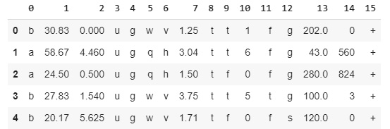


    Caption: Loading data into the Colab notebook

5.  Change the classes to `1` and `0`.

    If you notice in the dataset, the classes represented in column
    `15` are special characters: `+` for approved
    and `-` for not approved. You need to change this to
    numerical values of `1` for approved and `0` for
    not approved, as shown in the following code snippet:

    ```
    # Changing the Classes to 1 & 0
    credData.loc[credData[15] == '+' , 15] = 1
    credData.loc[credData[15] == '-' , 15] = 0
    credData.head()
    ```


    You should get the following output:

    
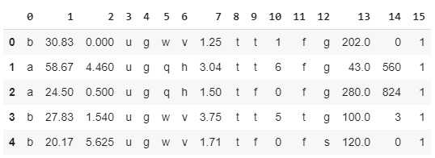


    Caption: Data frame after replacing special characters

    In the preceding code snippet, `.loc()` was used to locate
    the fifteenth column and replace the `+` and `-`
    values with `1` and `0`, respectively.

6.  Find the number of `null` values in the dataset.

    We\'ll now find the number of `null` values in each of the
    features using the `.isnull()` function. The
    `.sum()` function sums up all such null values across each
    of the columns in the dataset.

    This is represented in the following code snippet:

    ```
    # Finding number of null values in the data set
    credData.isnull().sum()
    ```


    You should get the following output:

    
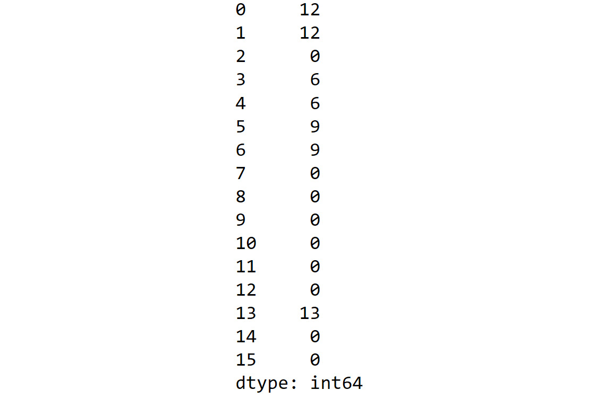


    Caption: Summarizing null values in the dataset

    As seen from the preceding output, there are many columns with
    `null` values.

7.  Now, print the shape and data types of each column:

    ```
    # Printing Shape and data types
    print('Shape of raw data set',credData.shape)
    print('Data types of data set',credData.dtypes)
    ```


    You should get the following output:

    
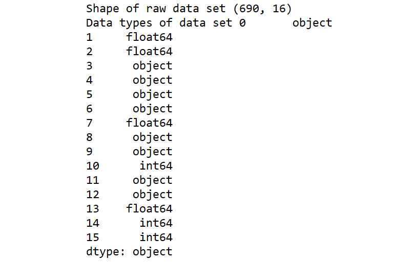


    Caption: Shape and data types of each column

8.  Remove the rows with `na` values.

    In order to clean the dataset, let\'s remove all the rows with
    `na` values using the `.dropna()` function with
    the following code snippet:

    ```
    # Dropping all the rows with na values
    newcred = credData.dropna(axis = 0)
    newcred.shape
    ```


    You should get the following output:

    ```
    (653, 16)
    ```


    As you can see, around 37 rows that, which had `na`
    values, were removed. In the code snippet, we define
    `axis = 0` in order to denote that the dropping of
    `na` values should be done along the rows.

9.  Verify that no `null` values exist:

    ```
    # Verifying no null values exist
    newcred.isnull().sum()
    ```


    You should get the following output:

    
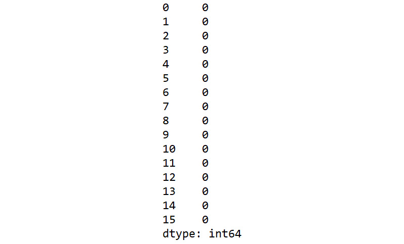


    Caption: Verifying that no null values are present

10. Next, make dummy values from the categorical variables.

    As you can see from the data types, there are many variables with
    categorical values. These have to be converted to dummy values using
    the `pd.get_dummies()` function. This is done using the
    following code snippet:

    ```
    """
    Separating the categorical variables to 
    make dummy variables
    """
    credCat = pd.get_dummies(newcred[[0,3,4,5,6,8,9,11,12]])
    ```


11. Separate the numerical variables.

    We will also be separating the numerical variables from the original
    dataset to concatenate them with the dummy variables. This step is
    done as follows:

    ```
    # Separating the numerical variables
    credNum = newcred[[1,2,7,10,13,14]]
    ```


    Note

    You can view these new DataFrames by running the commands
    `credCat` and `credNum`.

12. Create the `X` and `y` variables. The dummy
    variables and the numerical variables will now be concatenated to
    form the `X` variable. The `y` variable will be
    created separately by taking the labels of the dataset. Let\'s see
    these steps in action in the following code snippet:

    ```
    """
    Making the X variable which is a concatenation 
    of categorical and numerical data
    """
    X = pd.concat([credCat,credNum],axis = 1)
    print(X.shape)
    # Separating the label as y variable
    y = pd.Series(newcred[15], dtype="int")
    print(y.shape)
    ```


    You should get the following output:

    ```
    (653, 46)
    (653,)
    ```


13. Normalize the dataset using the `MinMaxScaler()` function:
    ```
    # Normalizing the data sets
    # Import library function
    from sklearn import preprocessing
    # Creating the scaling function
    minmaxScaler = preprocessing.MinMaxScaler()
    # Transforming with the scaler function
    X_tran = pd.DataFrame(minmaxScaler.fit_transform(X))
    ```


14. Split the dataset into training and test sets.

    As the final step of data preparation, we will now split the dataset
    into training and test sets using the `train_test_split()`
    function:

    ```
    from sklearn.model_selection import train_test_split
    # Splitting the data into train and test sets
    X_train, X_test, y_train, y_test = train_test_split\
                                       (X_tran, y, test_size=0.3,\
                                        random_state=123)
    ```


We now have the required dataset ready for further actions. As always,
let\'s start off by fitting a benchmark model using logistic regression
on the cleaned dataset. This will be achieved in the next activity.


Activity 15.01: Fitting a Logistic Regression Model on Credit Card Data
-----------------------------------------------------------------------

You have just cleaned the dataset that you received to predict the
creditworthiness of your customers. Before applying ensemble learning
methods, you want to fit a benchmark model on the dataset.

Perform the following steps to complete this activity:

1.  Open a new Colab notebook.

2.  Implement all the appropriate steps from *Exercise 15.01*, *Loading,
    Exploring, and Cleaning the Data*, until you have split the dataset
    into training and test sets.

3.  Fit a logistic regression model on the training set.

4.  Get the predictions on the test set.

5.  Print the confusion matrix and classification report for the
    benchmark model.

    You should get an output similar to the following after fitting the
    logistic regression model on the dataset:

    
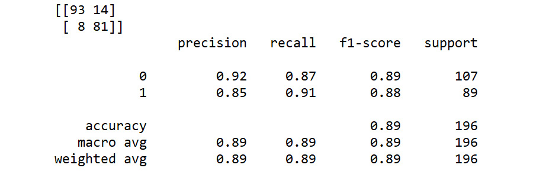


Caption: Expected output after fitting the logistic regression model


Exercise 15.02: Ensemble Model Using the Averaging Technique
------------------------------------------------------------

In this exercise, we will implement an ensemble model using the
averaging technique. The base models that we will use for this exercise
are the logistic regression model, which we used as our benchmark model,
and the KNN and random forest models, which were introduced in *Lab
4*, *Multiclass Classification with RandomForest*, and *Lab 8*,
*Hyperparameter Tuning*:

1.  Open a new Colab notebook.

2.  Execute all the appropriate steps from *Exercise 15.01*, *Loading,
    Exploring, and Cleaning the Data*, to split the dataset into train
    and test sets.

3.  Let\'s define the three base models. Import the selected
    classifiers, which we will use as base models:
    ```
    from sklearn.linear_model import LogisticRegression
    from sklearn.neighbors import KNeighborsClassifier
    from sklearn.ensemble import RandomForestClassifier
    model1 = LogisticRegression(random_state=123)
    model2 = KNeighborsClassifier(n_neighbors=5)
    model3 = RandomForestClassifier(n_estimators=500)
    ```


4.  Fit all three models on the training set:
    ```
    # Fitting all three models on the training data
    model1.fit(X_train,y_train)
    model2.fit(X_train,y_train)
    model3.fit(X_train,y_train)
    ```


5.  We will now predict the probabilities of each model using the
    `predict_proba()` function:
    ```
    """
    Predicting probabilities of each model 
    on the test set
    """
    pred1=model1.predict_proba(X_test)
    pred2=model2.predict_proba(X_test)
    pred3=model3.predict_proba(X_test)
    ```


6.  Average the predictions generated from all of the three models:
    ```
    """
    Calculating the ensemble prediction by 
    averaging three base model predictions
    """
    ensemblepred=(pred1+pred2+pred3)/3
    ```


7.  Display the first four rows of the ensemble prediction array:

    ```
    # Displaying first 4 rows of the ensemble predictions
    ensemblepred[0:4,:]
    ```


    You should get an output similar to the following:

    


    Caption: First four rows of ensemble predictions

    As you can see from the preceding output, we have two probabilities
    for each example corresponding to each class.

8.  Print the order of each class from the prediction output. As you can
    see from *Step 6*, the prediction output has two columns
    corresponding to each class. In order to find the order of the class
    prediction, we use a method called `.classes_`. This is
    implemented in the following code snippet:

    ```
    # Printing the order of classes for each model
    print(model1.classes_)
    print(model2.classes_)
    print(model3.classes_)
    ```


    You should get the following output:

    


    Caption: Order of classes

9.  We now have to get the final predictions for each example from the
    output probabilities. The final prediction will be the class with
    the highest probability. To get the class with the highest
    probability, we use the `numpy` function,
    `.argmax()`. This is executed as follows:

    ```
    import numpy as np
    pred = np.argmax(ensemblepred,axis = 1)
    pred
    ```


    From the preceding code, `axis = 1` means that we need to
    find the index of the maximum value across the columns.

    You should get the following output:

    
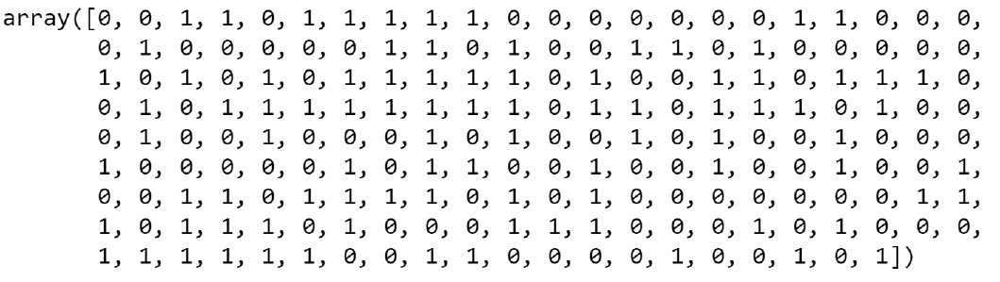


    Caption: Array output

10. Generate the confusion matrix for the predictions:

    ```
    # Generating confusion matrix
    from sklearn.metrics import confusion_matrix
    confusionMatrix = confusion_matrix(y_test, pred)
    print(confusionMatrix)
    ```


    You should get an output similar to the following:

    


    Caption: Confusion matrix

11. Generate a classification report:

    ```
    # Generating classification report
    from sklearn.metrics import classification_report
    print(classification_report(y_test, pred))
    ```


    You should get an output similar to the following:

    
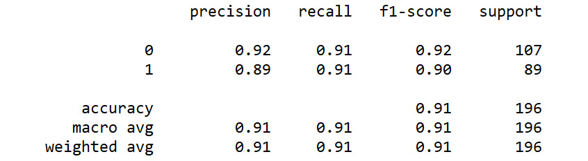


Exercise 15.03: Ensemble Model Using the Weighted Averaging Technique
---------------------------------------------------------------------

In this exercise, we will implement an ensemble model using the weighted
averaging technique. We will use the same base models, logistic
regression, KNN, and random forest, which were used in *Exercise 15.02*,
*Ensemble Model Using the Averaging Technique*:

1.  Open a new Colab notebook.

2.  Execute all the steps from *Exercise 15.02*, *Ensemble Model Using
    the Averaging Technique*, up until predicting the probabilities of
    the three models.

3.  Take the weighted average of the predictions. In the weighted
    averaging method, weights are assigned arbitrarily based on our
    judgment of each of the predictions. This is done as follows:

    ```
    """
    Calculating the ensemble prediction by applying 
    weights for each prediction
    """
    ensemblepred=(pred1 *0.60 + pred2 * 0.20 + pred3 * 0.20)
    ```


    Please note that the weights are assigned in such a way that the sum
    of all weights becomes `1`
    (`0.6 + 0.2 + 0.2 = 1`).

4.  Display the first four rows of the ensemble prediction array:

    ```
    # Displaying first 4 rows of the ensemble predictions
    ensemblepred[0:4,:]
    ```


    You should get an output similar to the following:

    


    Caption: Array output for ensemble prediction

    As you can see from the output, we have two probabilities for each
    example corresponding to each class.

5.  Print the order of each class from the prediction output:

    ```
    # Printing the order of classes for each model
    print(model1.classes_)
    print(model2.classes_)
    print(model3.classes_)
    ```


    You should get the following output:

    


    Caption: Order of class from prediction output

6.  Calculate the final predictions from the probabilities.

    We now have to get the final predictions for each example from the
    output probabilities using the `np.argmax()` function:

    ```
    import numpy as np
    pred = np.argmax(ensemblepred,axis = 1)
    pred
    ```


    You should get an output similar to the following:

    
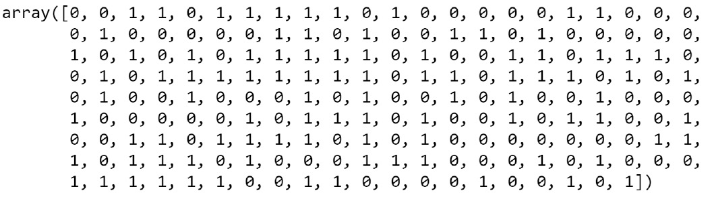


    Caption: Array for final predictions

7.  Generate the confusion matrix for the predictions:

    ```
    # Generating confusion matrix
    from sklearn.metrics import confusion_matrix
    confusionMatrix = confusion_matrix(y_test, pred)
    print(confusionMatrix)
    ```


    You should get an output similar to the following:

    


    Caption: Confusion matrix

8.  Generating a classification report:

    ```
    # Generating classification report
    from sklearn.metrics import classification_report
    print(classification_report(y_test, pred))
    ```


    You should get an output similar to the following:

    
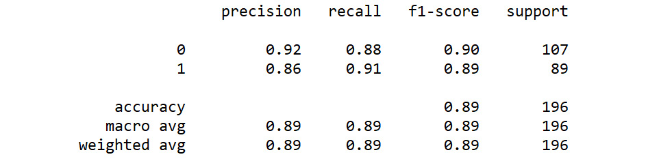


### Iteration 2 with Different Weights

From the first iteration, we saw that we got accuracy of
`89%`. This metric is a reflection of the weights that we
applied in the first iteration. Let\'s try to change the weights and see
what effect it has on the metrics. The process of trying out various
weights is based on our judgment of the dataset and the distribution of
data. Let\'s say we feel that the data distribution is more linear, and
therefore we decide to increase the weight for the linear regression
model and decrease the weights of the other two models. Let\'s now try
the new combination of weights in *iteration 2*:

1.  Take the weighted average of the predictions.

    In this iteration, we increase the weight of logistic regression
    prediction from `0.6` to `0.7` and decrease the
    other two from `0.2` to `0.15`:

    ```
    """
    Calculating the ensemble prediction by applying 
    weights for each prediction
    """
    ensemblepred=(pred1 *0.70+pred2 * 0.15+pred3 * 0.15)
    ```


2.  Calculate the final predictions from the probabilities.

    We now have to get the final predictions for each example from the
    output probabilities using the `np.argmax()` function:

    ```
    # Generating predictions from probabilities
    import numpy as np
    pred = np.argmax(ensemblepred,axis = 1)
    ```


3.  Generate the confusion matrix for the predictions:

    ```
    # Generating confusion matrix
    from sklearn.metrics import confusion_matrix
    confusionMatrix = confusion_matrix(y_test, pred)
    print(confusionMatrix)
    ```


    You should get an output similar to the following:

    


    Caption: Confusion matrix

4.  Generate a classification report:

    ```
    # Generating classification report
    from sklearn.metrics import classification_report
    print(classification_report(y_test, pred))
    ```


    You should get an output similar to the following:

    
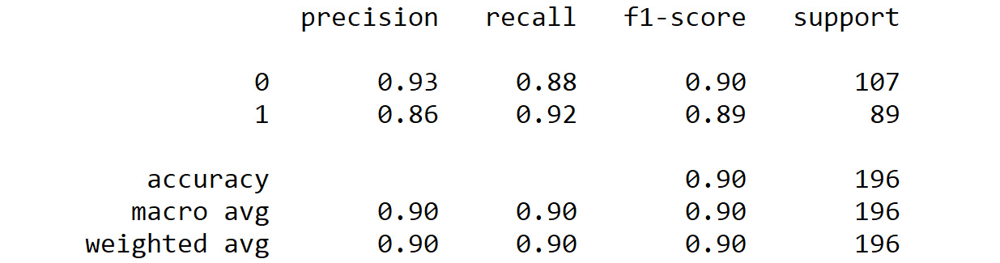


Exercise 15.04: Ensemble Model Using Max Voting
-----------------------------------------------

In this exercise, we will implement an ensemble model using the max
voting technique. The individual learners we will select are similar to
the ones that we chose in the previous exercises, that is, logistic
regression, KNN, and random forest:

1.  Open a new Colab notebook.

2.  Execute all the steps from *Exercise 15.01*, *Loading, Exploring,
    and Cleaning the Data*, up until the splitting of the dataset into
    train and test sets.

3.  We will now import the selected classifiers, which we will use as
    the individual learners:
    ```
    """
    Defining the voting classifier and three 
    individual learners
    """
    from sklearn.ensemble import VotingClassifier
    from sklearn.linear_model import LogisticRegression
    from sklearn.neighbors import KNeighborsClassifier
    from sklearn.ensemble import RandomForestClassifier
    # Defining the models
    model1 = LogisticRegression(random_state=123)
    model2 = KNeighborsClassifier(n_neighbors=5)
    model3 = RandomForestClassifier(n_estimators=500)
    ```


4.  Having defined the individual learners, we can now construct the
    ensemble model using the `VotingClassifier()` function.
    This is implemented by the following code snippet:

    ```
    # Defining the ensemble model using VotingClassifier
    model = VotingClassifier(estimators=[('lr', model1),\
                            ('knn', model2),('rf', model3)],\
                             voting= 'hard')
    ```


    As you can see from the code snippet, the individual learners are
    given as input using the `estimators` argument. Estimators
    take each of the defined individual learners along with the string
    value to denote which model it is. For example, `lr`
    denotes logistic regression. Also, note that the voting is \"hard,
    \" which means that the output will be class labels and not
    probabilities.

5.  Fit the training set on the ensemble model:
    ```
    # Fitting the model on the training set
    model.fit(X_train,y_train)
    ```


6.  Print the accuracy scores after training:

    ```
    """
    Predicting accuracy on the test set using 
    .score() function
    """
    model.score(X_test,y_test)
    ```


    You should get an output similar to the following:

    ```
    0.9081632653061225
    ```


7.  Generate the predictions from the ensemble model on the test set:
    ```
    # Generating the predictions on the test set
    preds = model.predict(X_test)
    ```


8.  Generate the confusion matrix for the predictions:

    ```
    # Printing the confusion matrix
    from sklearn.metrics import confusion_matrix
    # Confusion matrix for the test set
    print(confusion_matrix(y_test, preds))
    ```


    You should get an output similar to the following:

    


    Caption: Confusion matrix

9.  Generate the classification report:

    ```
    # Printing the classification report
    from sklearn.metrics import classification_report
    print(classification_report(y_test, preds))
    ```


    You should get an output similar to the following:

    
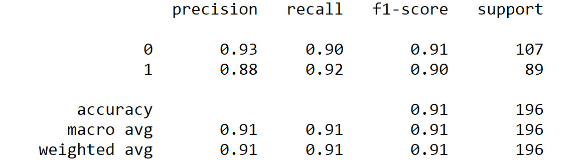


Exercise 15.05: Ensemble Learning Using Bagging
-----------------------------------------------

In this exercise, we will implement an ensemble model using bagging. The
individual learner we will select will be random forest:

1.  Open a new Colab notebook.

2.  Execute all the steps from *Exercise 15.01*, *Loading, Exploring,
    and Cleaning the Data*, up until the splitting of the dataset into
    train and test sets.

3.  Define the base learner, which will be a random forest classifier:
    ```
    # Defining the base learner
    from sklearn.ensemble import RandomForestClassifier
    bl1 = RandomForestClassifier(random_state=123)
    ```


4.  Having defined the individual learner, we can now construct the
    ensemble model using the `BaggingClassifier()` function.
    This is implemented by the following code snippet:

    ```
    # Creating the bagging meta learner
    from sklearn.ensemble import BaggingClassifier
    baggingLearner = \
    BaggingClassifier(base_estimator=bl1, n_estimators=10, \
                      max_samples=0.8, max_features=0.7)
    ```


    The arguments that we have given are arbitrary values. The optimal
    values have to be identified using experimentation.

5.  Fit the training set on the ensemble model:
    ```
    # Fitting the model using the meta learner
    model = baggingLearner.fit(X_train, y_train)
    ```


6.  Generate the predictions from the ensemble model on the test set:
    ```
    # Predicting on the test set using the model
    pred = model.predict(X_test)
    ```


7.  Generate a confusion matrix for the predictions:

    ```
    # Printing the confusion matrix
    from sklearn.metrics import confusion_matrix
    print(confusion_matrix(y_test, pred))
    ```


    You should get an output similar to the following:

    


    Caption: Confusion matrix

8.  Generate the classification report:

    ```
    # Printing the classification report
    from sklearn.metrics import classification_report
    print(classification_report(y_test, pred))
    ```


    You should get an output similar to the following:

    
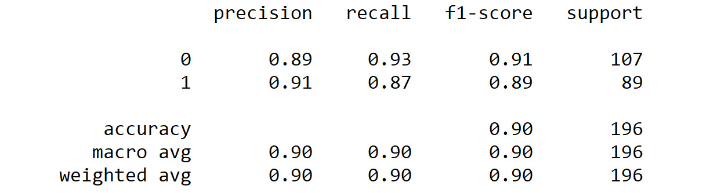


Exercise 15.06: Ensemble Learning Using Boosting
------------------------------------------------

In this exercise, we will implement an ensemble model using boosting.
The individual learner we will select will be the logistic regression
model. The steps for implementing this algorithm are very similar to the
bagging algorithm:

1.  Open a new Colab notebook file.

2.  Execute all of the steps from *Exercise 15.01*, *Loading, Exploring,
    and Cleaning the Data*, up until the splitting of the dataset into
    train and test sets.

3.  Define the base learner, which will be a logistic regression
    classifier:
    ```
    # Defining the base learner
    from sklearn.linear_model import LogisticRegression
    bl1 = LogisticRegression(random_state=123)
    ```


4.  Having defined the individual learner, we can now construct the
    ensemble model using the `AdaBoostClassifier()` function.
    This is implemented by the following code snippet:

    ```
    # Define the boosting meta learner
    from sklearn.ensemble import AdaBoostClassifier
    boosting = AdaBoostClassifier(base_estimator=bl1, \
                                  n_estimators=200)
    ```


    The arguments that we have given are arbitrary values. The optimal
    values have to be identified using experimentation.

5.  Fit the training set on the ensemble model:
    ```
    # Fitting the model on the training set
    model = boosting.fit(X_train, y_train)
    ```


6.  Generate the predictions from the ensemble model on the test set:
    ```
    # Getting the predictions from the boosting model
    pred = model.predict(X_test)
    ```


7.  Generate a confusion matrix for the predictions:

    ```
    # Printing the confusion matrix
    from sklearn.metrics import confusion_matrix
    print(confusion_matrix(y_test, pred))
    ```


    You should get a similar output to the following:

    


    Caption: Confusion matrix

8.  Generate the classification report:

    ```
    # Printing the classification report
    from sklearn.metrics import classification_report
    print(classification_report(y_test, pred))
    ```


    You should get an output similar to the following:

    
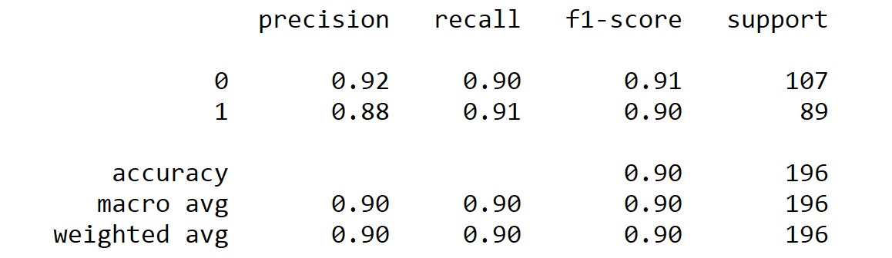


Exercise 15.07: Ensemble Learning Using Stacking
------------------------------------------------

In this exercise, we will implement an ensemble model using stacking.
The individual learners we will use are KNN and random forest. Our meta
learner will be logistic regression:

1.  Open a new Colab notebook.

2.  Execute all of the steps from *Exercise 15.01*, *Loading, Exploring,
    and Cleaning the Data*, up until the splitting of the dataset into
    train and test sets.

3.  Import the base learners and the meta learner. In this
    implementation, we will be using two base learners (KNN and random
    forest). The meta learner will be logistic regression:
    ```
    # Importing the meta learner and base learners
    from sklearn.linear_model import LogisticRegression
    from sklearn.neighbors import KNeighborsClassifier
    from sklearn.ensemble import RandomForestClassifier
    bl1 = KNeighborsClassifier(n_neighbors=5)
    bl2 = RandomForestClassifier(random_state=123)
    ml = LogisticRegression(random_state=123)
    ```


4.  Once the base learners and meta learner are defined, we will proceed
    to create the stacking classifier:

    ```
    # Creating the stacking classifier
    from mlxtend.classifier import StackingClassifier
    stackclf = StackingClassifier(classifiers=[bl1, bl2],\
                                  meta_classifier=ml)
    ```


    The arguments that we have been given are the two base learners and
    the meta learner.

5.  Fit the training set on the ensemble model:
    ```
    # Fitting the model on the training set
    model = stackclf.fit(X_train, y_train)
    ```


6.  Generate the predictions from the ensemble model on the test set:
    ```
    # Generating predictions on test set
    pred = model.predict(X_test)
    ```


7.  Generate the classification report:

    ```
    # Printing the classification report
    from sklearn.metrics import classification_report
    print(classification_report(y_test, pred))
    ```


    You should get a similar output to the following:

    
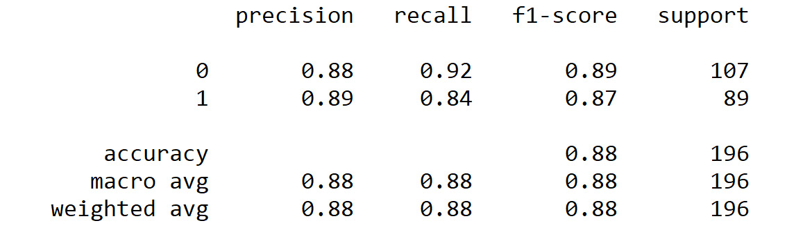


    Caption: Classification report

8.  Generate a confusion matrix for the predictions:

    ```
    # Printing the confusion matrix
    from sklearn.metrics import confusion_matrix
    print(confusion_matrix(y_test, pred))
    ```


    You should get a similar output to the following:

    


Caption: Confusion matrix


Activity 15.02: Comparison of Advanced Ensemble Techniques
----------------------------------------------------------

Scenario: You have tried the benchmark model on the credit card dataset
and have got some benchmark metrics. Having learned some advanced
ensemble techniques, you want to determine which technique to use for
the credit card approval dataset.

In this activity, you will use all three advanced techniques and compare
the results before selecting your final technique.

The steps are as follows:

1.  Open a new Colab notebook.

2.  Implement all steps from *Exercise 15.01*, *Loading, Exploring, and
    Cleaning the Data,* up until the splitting of the dataset into train
    and test sets.

3.  Implement the bagging technique with the base learner as the
    logistic regression model. In the bagging classifier, define
    `n_estimators = 15`, `max_samples = 0.7`, and
    `max_features = 0.8`. Fit the model on the training set,
    generate the predictions, and print the confusion matrix and the
    classification report.

4.  Implement boosting with random forest as the base learner. In the
    `AdaBoostClassifier`, define
    `n_estimators = 300`. Fit the model on the training set,
    generate the predictions, and print the confusion matrix and
    classification report.

5.  Implement the stacking technique. Make the KNN and logistic
    regression models base learners and random forest a meta learner.
    Fit the model on the training set, generate the predictions, and
    print the confusion matrix and classification report.

6.  Compare the results across all three techniques and select the best
    technique.

7.  Output: You should get an output similar to the following for all
    three methods. Please note you will not get exact values as output
    due to variability in the prediction process.

    The output for bagging would be as follows:

    
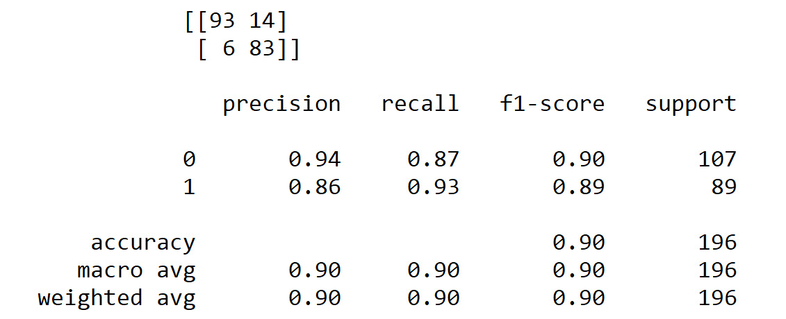


Caption: Output for bagging

The output for boosting would be as follows:

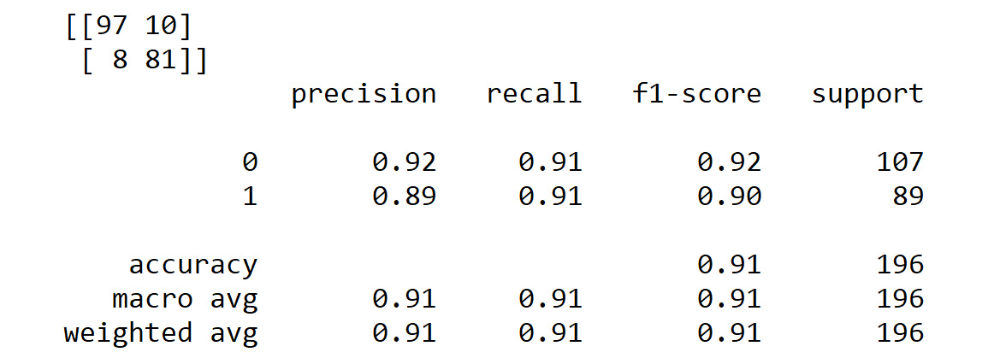

Caption: Output for boosting

The output for stacking would be as follows:

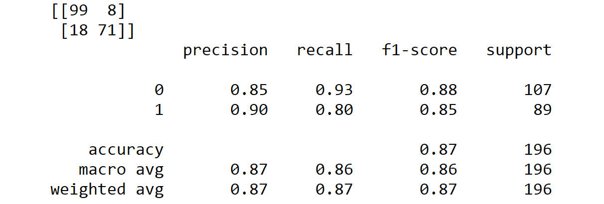


Summary
=======


In this lab, we learned about various techniques of ensemble
learning. Let\'s summarize our learning in this lab.

At the beginning of the lab, we were introduced to the concepts of
variance and bias and we learned that ensemble learning is a technique
that aims to combine individual models to create a superior model,
thereby reducing variance and bias and improving performance. To further
explore different techniques of ensemble learning, we downloaded the
credit card approval dataset. We also fitted a benchmark model using
logistic regression.
