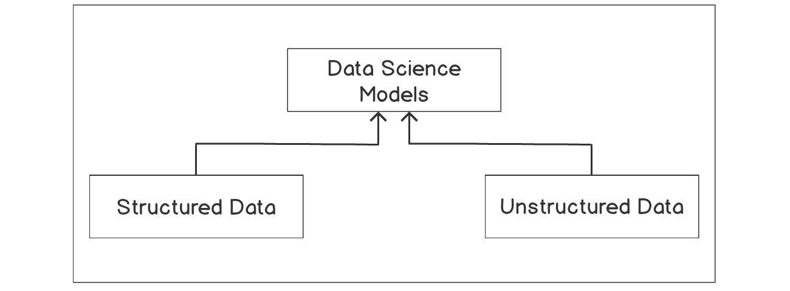
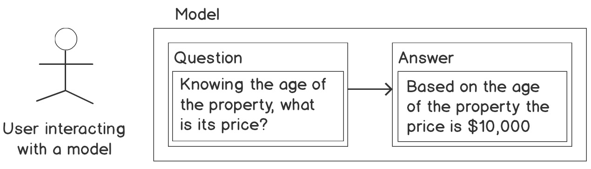
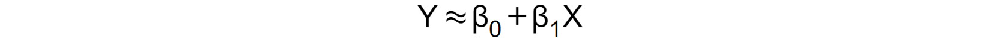
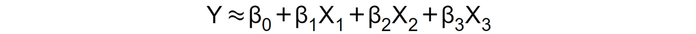
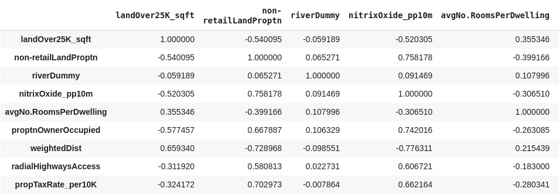
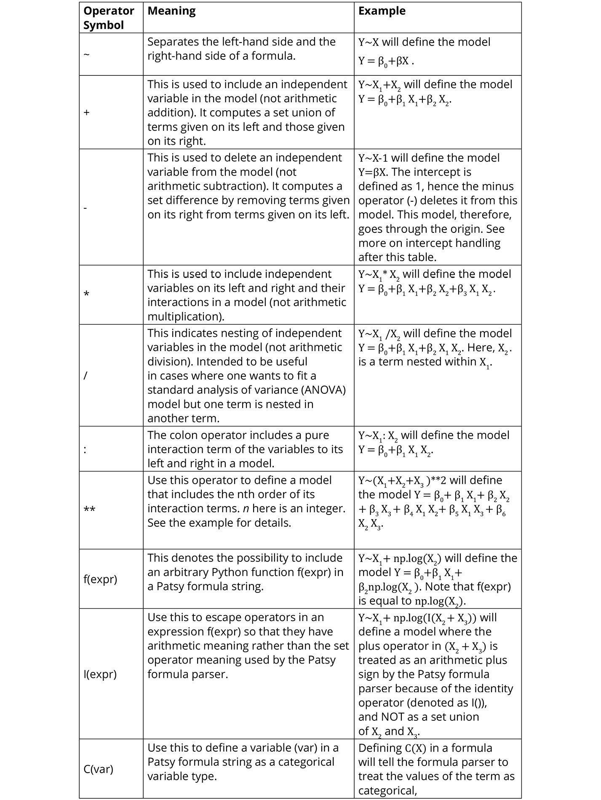

2. Regression
=============


Overview

This lab is an introduction to linear regression analysis and its
application to practical problem-solving in data science. You will learn
how to use Python, a versatile programming language, to carry out
regression analysis and examine the results. The use of the logarithm
function to transform inherently non-linear relationships between
variables and to enable the application of the linear regression method
of analysis will also be introduced.

By the end of this lab, you will be able to identify and import the
Python modules required for regression analysis; use the
`pandas` module to load a dataset and prepare it for
regression analysis; create a scatter plot of bivariate data and fit a
regression line through it; use the methods available in the Python
`statsmodels` module to fit a regression model to a dataset;
explain the results of simple and multiple linear regression analysis;
assess the goodness of fit of a linear regression model; and apply
linear regression analysis as a tool for practical problem-solving.


Introduction
============


The previous lab provided a primer to Python programming and an
overview of the data science field. Data science is a relatively young
multidisciplinary field of study. It draws its concepts and methods from
the traditional fields of statistics, computer science, and the broad
field of artificial intelligence (AI), especially the subfield of AI
called machine learning:



Caption: The data science models

As you can see in *Figure 2.1*, data science aims to make use of both
**structured** and **unstructured** data, develop models that can be
effectively used, make predictions, and also derive insights for
decision making.

A loose description of structured data will be any set of data that can
be conveniently arranged into a table that consists of rows and columns.
This kind of data is normally stored in database management systems.

Unstructured data, however, cannot be conveniently stored in tabular
form -- an example of such a dataset is a text document. To achieve the
objectives of data science, a flexible programming language that
effectively combines interactivity with computing power and speed is
necessary. This is where the Python programming language meets the needs
of data science and, as mentioned in *Lab 1*, *Introduction to Data
Science in Python*, we will be using Python in this course.

The need to develop models to make predictions and to gain insights for
decisionmaking cuts across many industries. Data science is, therefore,
finding uses in many industries, including healthcare, manufacturing and
the process industries in general, the banking and finance sectors,
marketing and e-commerce, the government, and education.

In this lab, we will be specifically be looking at regression, which
is one of the key methods that is used regularly in data science, in
order to model relationships between variables, where the **target
variable** (that is, the value you\'re looking for) is a real number.

Consider a situation where a real estate business wants to understand
and, if possible, model the relationship between the prices of property
in a city and knowing the key attributes of the properties. This is a
data science problem and it can be tackled using regression.

This is because the target variable of interest, which is the price of a
property, is a real number. Examples of the key attributes of a property
that can be used to predict its value are as follows:

- The age of the property
- The number of bedrooms in a property
- Whether the property has a pool or not
- The area of land the property covers
- The distance of the property from facilities such as railway
    stations and schools

Regression analysis can be employed to study this scenario, in which you
have to create a function that maps the key attributes of a property to
the target variable, which, in this case, is the price of a property.

Regression analysis is part of a family of machine learning techniques
called **supervised machine learning**. It is called supervised because
the machine learning algorithm that learns the model is provided a kind
of *question* and *answer* dataset to learn from. The *question* here is
the key attribute and the *answer* is the property price for each
property that is used in the study, as shown in the following figure:



Caption: Example of a supervised learning technique

Once a model has been learned by the algorithm, we can provide the model
with a question (that is, a set of attributes for a property whose price
we want to find) for it to tell us what the answer (that is, the price)
of that property will be.

This lab is an introduction to linear regression and how it can be
applied to solve practical problems like the one described previously in
data science. Python provides a rich set of modules (libraries) that can
be used to conduct rigorous regression analysis of various kinds. In
this lab, we will make use of the following Python modules, among
others: `pandas`, `statsmodels`,
`seaborn`, `matplotlib`, and
`scikit-learn`.


Simple Linear Regression
========================


In *Figure 2.3*, you can see the crime rate per capita and the median
value of owner-occupied homes for the city of Boston, which is the
largest city of the Commonwealth of Massachusetts. We seek to use
regression analysis to gain an insight into what drives crime rates in
the city.

Such analysis is useful to policy makers and society in general because
it can help with decision-making directed toward the reduction of the
crime rate, and hopefully the eradication of crime across communities.
This can make communities safer and increase the quality of life in
society.

This is a data science problem and is of the supervised machine learning
type. There is a dependent variable named `crime rate` (let\'s
denote it *Y*), whose variation we seek to understand in terms of an
independent variable, named
`Median value of owner-occupied homes` (let\'s denote it *X*).

In other words, we are trying to understand the variation in crime rate
based on different neighborhoods.

Regression analysis is about finding a function, under a given set of
assumptions, that best describes the relationship between the dependent
variable (*Y* in this case) and the independent variable (*X* in this
case).

When the number of independent variables is only one, and the
relationship between the dependent and the independent variable is
assumed to be a straight line, as shown in *Figure 2.3*, this type of
regression analysis is called **simple linear regression**. The
straight-line relationship is called the regression line or the line of
**best** fit:


Caption: A scatter plot of the crime rate against the median value of
owner-occupied homes

In *Figure 2.3*, the regression line is shown as a solid black line.
Ignoring the poor quality of the fit of the regression line to the data
in the figure, we can see a decline in crime rate per capita as the
median value of owner-occupied homes increases.

From a data science point of view, this observation may pose lots of
questions. For instance, what is driving the decline in crime rate per
capita as the median value of owner-occupier homes increases? Are richer
suburbs and towns receiving more policing resources than less fortunate
suburbs and towns? Unfortunately, these questions cannot be answered
with such a simple plot as we find in *Figure 2.3*. But the observed
trend may serve as a starting point for a discussion to review the
distribution of police and community-wide security resources.

Returning to the question of how well the regression line fits the data,
it is evident that almost one-third of the regression line has no data
points scattered around it at all. Many data points are simply clustered
on the horizontal axis around the zero (`0`) crime rate mark.
This is not what you expect of a good regression line that fits the data
well. A good regression line that fits the data well must sit amidst a
*cloud* of data points.

It appears that the relationship between the crime rate per capita and
the median value of owner-occupied homes is not as linear as you may
have thought initially.

In this lab, we will learn how to use the logarithm function (a
mathematical function for transforming values) to linearize the
relationship between the crime rate per capita and the median value of
owner-occupied homes, in order to improve the fit of the regression line
to the data points on the scatter graph.

We have ignored a very important question thus far. That is, *how can
you determine the regression line for a given set of data?*

A common method used to determine the regression line is called the
method of least squares, which is covered in the next section.


The Method of Least Squares
---------------------------

The simple linear regression line is generally of the form shown in
*Figure 2.4*, where β[0]{.subscript} and β[1]{.subscript} are unknown
constants, representing the intercept and the slope of the regression
line, respectively.

The intercept is the value of the dependent variable (Y) when the
independent variable (X) has a value of zero (0). The slope is a measure
of the rate at which the dependent variable (Y) changes when the
independent variable (X) changes by one (1). The unknown constants are
called the **model coefficients** or **parameters**. This form of the
regression line is sometimes known as the population regression line,
and, as a probabilistic model, it fits the dataset approximately, hence
the use of the symbol (`≈`) in *Figure 2.4*. The model is
called probabilistic because it does not model all the variability in
the dependent variable (Y) :



Caption: Simple linear regression equation

Calculating the difference between the actual dependent variable value
and the predicted dependent variable value gives an error that is
commonly termed as the residual (ϵ[i]{.subscript}).

Repeating this calculation for every data point in the sample, the
residual (ϵ[i]{.subscript}) for every data point can be squared, to
eliminate algebraic signs, and added together to obtain the **error sum
of squares** **(ESS)**.

The least squares method seeks to minimize the ESS.


Multiple Linear Regression
==========================


In the simple linear regression discussed previously, we only have one
independent variable. If we include multiple independent variables in
our analysis, we get a multiple linear regression model. Multiple linear
regression is represented in a way that\'s similar to simple linear
regression.

Let\'s consider a case where we want to fit a linear regression model
that has three independent variables, X[1]{.subscript},
X[2]{.subscript}, and X[3]{.subscript}. The formula for the multiple
linear regression equation will look like *Figure 2.5*:




Estimating the Regression Coefficients (β[0, ]{.subscript}β[1, ]{.subscript}β[2]{.subscript} and β[3]{.subscript})
------------------------------------------------------------------------------------------------------------------

The regression coefficients in *Figure 2.5* are estimated using the same
least squares approach that was discussed when simple linear regression
was introduced. To satisfy the least squares method, the chosen
coefficients must minimize the sum of squared residuals.

Later in the lab, we will make use of the Python programming
language to compute these coefficient estimates practically.


Logarithmic Transformations of Variables
----------------------------------------

As has been mentioned already, sometimes the relationship between the
dependent and independent variables is not linear. This limits the use
of linear regression. To get around this, depending on the nature of the
relationship, the logarithm function can be used to transform the
variable of interest. What happens then is that the transformed variable
tends to have a linear relationship with the other untransformed
variables, enabling the use of linear regression to fit the data. This
will be illustrated in practice on the dataset being analyzed later in
the exercises of the course.


Correlation Matrices
--------------------

In *Figure 2.3*, we saw how a linear relationship between two variables
can be analyzed using a straight-line graph. Another way of visualizing
the linear relationship between variables is with a correlation matrix.
A correlation matrix is a kind of cross-table of numbers showing the
correlation between pairs of variables, that is, how strongly the two
variables are connected (this can be thought of as how a change in one
variable will cause a change in the other variable). It is not easy
analyzing raw figures in a table. A correlation matrix can, therefore,
be converted to a form of \"heatmap\" so that the correlation between
variables can easily be observed using different colors. An example of
this is shown in *Exercise 2.01*, *Loading and Preparing the Data for
Analysis*.


Conducting Regression Analysis Using Python
===========================================


Having discussed the basics of regression analysis, it is now time to
get our hands dirty and actually do some regression analysis using
Python.

To begin with our analysis, we need to start a session in Python and
load the relevant modules and dataset required.

All of the regression analysis we will do in this lab will be based
on the Boston Housing dataset. The dataset is good for teaching and is
suitable for linear regression analysis. It presents the level of
challenge that necessitates the use of the logarithm function to
transform variables in order to achieve a better level of model fit to
the data. The dataset contains information on a collection of properties
in the Boston area and can be used to determine how the different
housing attributes of a specific property affect the property\'s value.

The column headings of the Boston Housing dataset CSV file can be
explained as follows:

- CRIM -- per capita crime rate by town
- ZN -- proportion of residential land zoned for lots over 25,000
    sq.ft.
- INDUS -- proportion of non-retail business acres per town
- CHAS -- Charles River dummy variable (= 1 if tract bounds river; 0
    otherwise)
- NOX -- nitric oxide concentration (parts per 10 million)
- RM -- average number of rooms per dwelling
- AGE -- proportion of owner-occupied units built prior to 1940
- DIS -- weighted distances to five Boston employment centers
- RAD -- index of accessibility to radial highways
- TAX -- full-value property-tax rate per \$10,000
- PTRATIO -- pupil-teacher ratio by town
- LSTAT -- % of lower status of the population
- MEDV -- median value of owner-occupied homes in \$1,000s


Exercise 2.01: Loading and Preparing the Data for Analysis
----------------------------------------------------------

In this exercise, we will learn how to load Python modules, and the
dataset we need for analysis, into our Python session and prepare the
data for analysis.


The following steps will help you to complete this exercise:

1.  Open a new Colab notebook file.

2.  Load the necessary Python modules by entering the following code
    snippet into a single Colab notebook cell. Press the **Shift** and
    **Enter** keys together to run the block of code:

    ```
    %matplotlib inline
    import matplotlib as mpl
    import seaborn as sns
    import matplotlib.pyplot as plt
    import statsmodels.formula.api as smf
    import statsmodels.graphics.api as smg
    import pandas as pd
    import numpy as np
    import patsy
    from statsmodels.graphics.correlation import plot_corr
    from sklearn.model_selection import train_test_split
    plt.style.use('seaborn')
    ```


    The first line of the preceding code enables `matplotlib`
    to display the graphical output of the code in the notebook
    environment. The lines of code that follow use the
    `import` keyword to load various Python modules into our
    programming environment. This includes `patsy`, which is a
    Python module. Some of the modules are given aliases for easy
    referencing, such as the `seaborn` module being given the
    alias `sns`. Therefore, whenever we refer to
    `seaborn` in subsequent code, we use the alias
    `sns`. The `patsy` module is imported without an
    alias. We, therefore, use the full name of the `patsy`
    module in our code where needed.

    The `plot_corr` and `train_test_split` functions
    are imported from the `statsmodels.graphics.correlation`
    and `sklearn.model_selection` modules respectively. The
    last statement is used to set the aesthetic look of the graphs that
    `matplotlib` generates to the type displayed by the
    `seaborn` module.

3.  Next, load the `Boston.CSV` file and assign the variable
    name `rawBostonData` to it by running the following code:
    ```
    rawBostonData = pd.read_csv\
                    ('https://raw.githubusercontent.com/'\
                     'fenago/The-Data-Science-'\
                     'Workshop/master/Lab02/'\
                     'Dataset/Boston.csv')
    ```


4.  Inspect the first five records in the DataFrame:

    ```
    rawBostonData.head()
    ```


    You should get the following output:

    


    Caption: First five rows of the dataset

5.  Check for missing values (*null* values) in the DataFrame and then
    drop them in order to get a clean dataset Use the pandas method
    `dropna()` to find and remove these missing values:
    ```
    rawBostonData = rawBostonData.dropna()
    ```


6.  Check for duplicate records in the DataFrame and then drop them in
    order to get a clean dataset. Use the `drop_duplicates()`
    method from pandas:
    ```
    rawBostonData = rawBostonData.drop_duplicates()
    ```


7.  List the column names of the DataFrame so that you can examine the
    fields in your dataset, and modify the names, if necessary, to names
    that are meaningful:

    ```
    list(rawBostonData.columns)
    ```


    You should get the following output:

    


    Caption: Listing all the column names

8.  Rename the DataFrame columns so that they are meaningful. Be mindful
    to match the column names exactly as leaving out even white spaces
    in the name strings will result in an error. For example, this
    string, `ZN`, has a white space before and after and it is
    different from `ZN`. After renaming, print the head of the
    new DataFrame as follows:

    ```
    renamedBostonData = rawBostonData.rename\
                        (columns = {\
                         'CRIM':'crimeRatePerCapita',\
                         ' ZN ':'landOver25K_sqft',\
                         'INDUS ':'non-retailLandProptn',\
                         'CHAS':'riverDummy',\
                         'NOX':'nitrixOxide_pp10m',\
                         'RM':'AvgNo.RoomsPerDwelling',\
                         'AGE':'ProptnOwnerOccupied',\
                         'DIS':'weightedDist',\
                         'RAD':'radialHighwaysAccess',\
                         'TAX':'propTaxRate_per10K',\
                         'PTRATIO':'pupilTeacherRatio',\
                         'LSTAT':'pctLowerStatus',\
                         'MEDV':'medianValue_Ks'})
    renamedBostonData.head()
    ```


    You should get the following output:

    


    Caption: DataFrames being renamed

    Note

    The preceding output is truncated. Please head to the GitHub
    repository to find the entire output.

9.  Inspect the data types of the columns in your DataFrame using the
    `.info()` function:

    ```
    renamedBostonData.info()
    ```


    You should get the following output:

    


    Caption: The different data types in the dataset

    The output shows that there are `506` rows
    (`Int64Index: 506 entries`) in the dataset. There are also
    `13` columns in total (`Data columns`). None of
    the `13` columns has a row with a missing value (all
    `506` rows are *non-null*). 10 of the columns have
    floating-point (decimal) type data and three have integer type data.

10. Now, calculate basic statistics for the numeric columns in the
    DataFrame:

    ```
    renamedBostonData.describe(include=[np.number]).T
    ```


    You should get the following output:

    


    Caption: Basic statistics of the numeric column

11. Divide the DataFrame into training and test sets, as shown in the
    following code snippet:

    ```
    X = renamedBostonData.drop('crimeRatePerCapita', axis = 1)
    y = renamedBostonData[['crimeRatePerCapita']]
    seed = 10 
    test_data_size = 0.3 
    X_train, X_test, \
    y_train, y_test = train_test_split(X, y, \
                                       test_size = test_data_size, \
                                       random_state = seed)
    train_data = pd.concat([X_train, y_train], axis = 1)
    test_data = pd.concat([X_test, y_test], axis = 1)
    ```


    We choose a test data size of 30%, which is `0.3`. The
    `train_test_split` function is used to achieve this. We
    set the seed of the random number generator so that we can obtain a
    reproducible split each time we run this code. An arbitrary value of
    `10` is used here. It is good model-building practice to
    divide a dataset being used to develop a model into at least two
    parts. One part is used to develop the model and it is called a
    training set (`X_train` and `y_train` combined).

    Note

    Splitting your data into training and test subsets allows you to use
    some of the data to train your model (that is, it lets you build a
    model that learns the relationships between the variables), and the
    rest of the data to test your model (that is, to see how well your
    new model can make predictions when given new data). You will use
    train-test splits throughout this course, and the concept will be
    explained in more detail in *Lab 7, The Generalization Of
    Machine Learning Models*.

12. Calculate and plot a correlation matrix for the
    `train_data` set:

    ```
    corrMatrix = train_data.corr(method = 'pearson')
    xnames=list(train_data.columns)
    ynames=list(train_data.columns)
    plot_corr(corrMatrix, xnames=xnames, ynames=ynames,\
              title=None, normcolor=False, cmap='RdYlBu_r')
    ```


    The use of the backslash character, `\`, on *line 4* in
    the preceding code snippet is to enforce the continuation of code on
    to a new line in Python. The `\` character is not required
    if you are entering the full line of code into a single line in
    your notebook.

    You should get the following output:

    


Caption: Output with the expected heatmap


The Correlation Coefficient
---------------------------

In the previous exercise, we have seen how a correlation matrix heatmap
can be used to visualize the relationships between pairs of variables.
We can also see these same relationships in numerical form using the raw
correlation coefficient numbers. These are values between -1 and 1,
which represent how closely two variables are linked.

Pandas provides a `corr` function, which when called on
DataFrame provides a matrix (table) of the correlation of all numeric
data types. In our case, running the code,
`train_data.corr (method = 'pearson')`, in the Colab notebook
provides the results in *Figure 2.12*.

Note

Pearson is the standard correlation coefficient for measuring the
relationship between variables.

It is important to note that *Figure 2.12* is symmetric along the left
diagonal. The left diagonal values are correlation coefficients for
features against themselves (and so all of them have a value of one
(1)), and therefore are not relevant to our analysis. The data in
*Figure 2.12* is what is presented as a plot in the output of *Step 12*
in *Exercise 2.01*, *Loading and Preparing the Data for Analysis*.

You should get the following output:



Caption: A correlation matrix of the training dataset

Note

The preceding output is truncated.

Data scientists use the correlation coefficient as a statistic in order
to measure the linear relationship between two numeric variables, X and
Y. The correlation coefficient for a sample of bivariate data is
commonly represented by r. In statistics, the common method to measure
the correlation between two numeric variables is by using the Pearson
correlation coefficient. Going forward in this lab, therefore, any
reference to the correlation coefficient means the Pearson correlation
coefficient.

To practically calculate the correlation coefficient statistic for the
variables in our dataset in this course, we use a Python function. What
is important to this discussion is the meaning of the values the
correlation coefficient we calculate takes. The correlation coefficient
(r) takes values between +1 and -1.

When r is equal to +1, the relationship between X and Y is such that
both X and Y increase or decrease in the same direction perfectly. When
r is equal to -1, the relationship between X and Y is such that an
increase in X is associated with a decrease in Y perfectly and vice
versa. When r is equal to zero (0), there is no linear relationship
between X and Y.

Having no linear relationship between X and Y does not mean that X and Y
are not related; instead, it means that if there is any relationship, it
cannot be described by a straight line. In practice, correlation
coefficient values around 0.6 or higher (or -0.6 or lower) is a sign of
a potentially exciting linear relationship between two variables, X and
Y.

The last column of the output of *Exercise 2.01*, *Loading and Preparing
the Data for Analysis*, *Step 12*, provides r values for crime rate per
capita against other features in color shades. Using the color bar, it
is obvious that `radialHighwaysAccess`,
`propTaxRate_per10K`, `nitrixOxide_pp10m`, and
`pctLowerStatus` have the strongest correlation with crime
rate per capita. This indicates that a possible linear relationship,
between crime rate per capita and any of these independent variables,
may be worth looking into.


Exercise 2.02: Graphical Investigation of Linear Relationships Using Python
---------------------------------------------------------------------------

Scatter graphs fitted with a regression line are a quick way by which a
data scientist can visualize a possible correlation between a dependent
variable and an independent variable.

The goal of the exercise is to use this technique to investigate any
linear relationship that may exist between crime rate per capita and the
median value of owner-occupied homes in towns in the city of Boston.

The following steps will help you complete the exercise:

1.  Open a new Colab notebook file and execute the steps up to and
    including *Step 11* from *Exercise 2.01*, *Loading and Preparing the
    Data for Analysis*. This is shown in the code blocks below, starting
    with the import statements:

    ```
    %matplotlib inline
    import matplotlib as mpl
    import seaborn as sns
    import matplotlib.pyplot as plt
    import statsmodels.formula.api as smf
    import statsmodels.graphics.api as smg
    import pandas as pd
    import numpy as np
    import patsy
    from statsmodels.graphics.correlation import plot_corr
    from sklearn.model_selection import train_test_split
    plt.style.use('seaborn')
    ```


    Loading and preprocessing the data:

    ```
    rawBostonData = pd.read_csv\
                    ('https://raw.githubusercontent.com/'\
                     'fenago/The-Data-Science-'\
                     'Workshop/master/Lab02/'
                     'Dataset/Boston.csv')
    rawBostonData = rawBostonData.dropna()
    rawBostonData = rawBostonData.drop_duplicates()
    renamedBostonData = rawBostonData.rename\
                        (columns = {\
                         'CRIM':'crimeRatePerCapita',\
                         ' ZN ':'landOver25K_sqft',\
                         'INDUS ':'non-retailLandProptn',\
                         'CHAS':'riverDummy',\
                         'NOX':'nitrixOxide_pp10m',\
                         'RM':'AvgNo.RoomsPerDwelling',\
                         'AGE':'ProptnOwnerOccupied',\
                         'DIS':'weightedDist',\
                         'RAD':'radialHighwaysAccess',\
                         'TAX':'propTaxRate_per10K',\
                         'PTRATIO':'pupilTeacherRatio',\
                         'LSTAT':'pctLowerStatus',\
                         'MEDV':'medianValue_Ks'})
    ```


    Setting up the test and train data:

    ```
    X = renamedBostonData.drop('crimeRatePerCapita', axis = 1)
    y = renamedBostonData[['crimeRatePerCapita']]
    seed = 10 
    test_data_size = 0.3 
    X_train, X_test, y_train, y_test = train_test_split\
                                       (X, y, \
                                        test_size = test_data_size,\
                                        random_state = seed)
    train_data = pd.concat([X_train, y_train], axis = 1)
    test_data = pd.concat([X_test, y_test], axis = 1)
    ```


2.  Now use the `subplots` function in `matplotlib`
    to define a canvas (assigned the variable name `fig` in
    the following code) and a graph object (assigned the variable name
    `ax` in the following code) in Python. You can set the
    size of the graph by setting the `figsize` (width =
    `10`, height = `6`) argument of the function:

    ```
    fig, ax = plt.subplots(figsize=(10, 6))
    ```


    Do not execute the code yet.

3.  Use the `seaborn` function `regplot` to create
    the scatter plot. Do not execute this code cell yet; we will add
    more code to style the plot in the next step:

    ```
    sns.regplot(x='medianValue_Ks', y='crimeRatePerCapita', \
                ci=None, data=train_data, ax=ax, color='k', \
                scatter_kws={"s": 20,"color": "royalblue", \
                "alpha":1})
    ```


    The function accepts arguments for the independent variable
    (`x`), the dependent variable (`y`), the
    confidence interval of the regression parameters (`ci`),
    which takes values from 0 to 100, the DataFrame that has
    `x` and `y` (`data`), a matplotlib
    graph object (`ax`), and others to control the aesthetics
    of the points on the graph. (In this case, the confidence interval
    is set to `None` -- we will see more on confidence
    intervals later in the lab.)

4.  In the same cell as step 3, set the `x` and `y`
    labels, the `fontsize` and `name` labels, the
    `x` and `y` limits, and the `tick`
    parameters of the matplotlib graph object (`ax`). Also,
    set the layout of the canvas to `tight`:

    ```
    ax.set_ylabel('Crime rate per Capita', fontsize=15, \
                   fontname='DejaVu Sans')
    ax.set_xlabel("Median value of owner-occupied homes "\
                  "in $1000's", fontsize=15, \
                  fontname='DejaVu Sans')
    ax.set_xlim(left=None, right=None)
    ax.set_ylim(bottom=None, top=30)
    ax.tick_params(axis='both', which='major', labelsize=12)
    fig.tight_layout()
    ```


    Now execute the cell. You should get the following output:


Exercise 2.03: Examining a Possible Log-Linear Relationship Using Python
------------------------------------------------------------------------

In this exercise, we will use the logarithm function to transform
variables and investigate whether this helps provide a better fit of the
regression line to the data. We will also look at how to use confidence
intervals by including a 95% confidence interval of the regression
coefficients on the plot.

The following steps will help you to complete this exercise:

1.  Open a new Colab notebook file and execute all the steps up to *Step
    11* from *Exercise 2.01*, *Loading and Preparing the Data for
    Analysis*.

2.  Use the `subplots` function in `matplotlib` to
    define a canvas and a graph object in Python:

    ```
    fig, ax = plt.subplots(figsize=(10, 6))
    ```


    Do not execute this code yet.

3.  In the same code cell, use the logarithm function in
    `numpy` (`np.log`) to transform the dependent
    variable (`y`). This essentially creates a new variable,
    `log(y)`:

    ```
    y = np.log(train_data['crimeRatePerCapita'])
    ```


    Do not execute this code yet.

4.  Use the seaborn `regplot` function to create the scatter
    plot. Set the `regplot` function confidence interval
    argument (`ci`) to `95%`. This will calculate a
    `95%` confidence interval for the regression coefficients
    and have them plotted on the graph as a shaded area along the
    regression line.

    Note

    A confidence interval gives an estimated range that is likely to
    contain the true value that you\'re looking for. So, a
    `95%` confidence interval indicates we can be
    `95%` certain that the true regression coefficients lie in
    that shaded area.

    Parse the `y` argument with the new variable we defined in
    the preceding step. The `x` argument is the original
    variable from the DataFrame without any transformation. Continue in
    the same code cell. Do not execute this cell yet; we will add in
    more styling code in the next step.

    ```
    sns.regplot(x='medianValue_Ks', y=y, ci=95, \
                data=train_data, ax=ax, color='k', \
                scatter_kws={"s": 20,"color": "royalblue", \
                "alpha":1})
    ```


5.  Continuing in the same cell, set the `x` and `y`
    labels, the `fontsize` and `name` labels, the
    `x` and `y` limits, and the `tick`
    parameters of the `matplotlib` graph object
    (`ax`). Also, set the layout of the canvas to
    `tight`:

    ```
    ax.set_ylabel('log of Crime rate per Capita', \
                  fontsize=15, fontname='DejaVu Sans')
    ax.set_xlabel("Median value of owner-occupied homes "\
                  "in $1000's", fontsize=15, \
                  fontname='DejaVu Sans')
    ax.set_xlim(left=None, right=None)
    ax.set_ylim(bottom=None, top=None)
    ax.tick_params(axis='both', which='major', labelsize=12)
    fig.tight_layout()
    ```


    Now execute this cell. The output is as follows:

    


The Statsmodels formula API
---------------------------

In *Figure 2.3*, a solid line represents the relationship between the
crime rate per capita and the median value of owner-occupied homes. But
how can we obtain the equation that describes this line? In other words,
how can we find the intercept and the slope of the straight-line
relationship?

Python provides a rich **Application Programming Interface** **(API)**
for doing this easily. The statsmodels formula API enables the data
scientist to use the formula language to define regression models that
can be found in statistics literature and many dedicated statistical
computer packages.


Exercise 2.04: Fitting a Simple Linear Regression Model Using the Statsmodels formula API
-----------------------------------------------------------------------------------------

In this exercise, we examine a simple linear regression model where the
crime rate per capita is the dependent variable and the median value of
owner-occupied homes is the independent variable. We use the statsmodels
formula API to create a linear regression model for Python to analyze.

The following steps will help you complete this exercise:

1.  Open a new Colab notebook file and import the required packages.
    ```
    import pandas as pd
    import statsmodels.formula.api as smf
    from sklearn.model_selection import train_test_split
    ```


2.  Execute *Step 2* to *11* from *Exercise 2.01*, *Loading and
    Preparing the Data for Analysis*.

3.  Define a linear regression model and assign it to a variable named
    `linearModel`:

    ```
    linearModel = smf.ols\
                  (formula='crimeRatePerCapita ~ medianValue_Ks',\
                   data=train_data)
    ```


    As you can see, we call the `ols` function of the
    statsmodels API and set its formula argument by defining a
    `patsy` formula string that uses the tilde (`~`)
    symbol to relate the dependent variable to the independent variable.
    Tell the function where to find the variables named, in the string,
    by assigning the data argument of the `ols` function to
    the DataFrame that contains your variables (`train_data`).

4.  Call the .`fit` method of the model instance and assign
    the results of the method to a `linearModelResult`
    variable, as shown in the following code snippet:
    ```
    linearModelResult = linearModel.fit()
    ```


5.  Print a summary of the results stored the
    `linearModelResult` variable by running the following
    code:

    ```
    print(linearModelResult.summary())
    ```


    You should get the following output:

    


The Model Formula Language
--------------------------

Python is a very powerful language liked by many developers. Since the
release of version 0.5.0 of statsmodels, Python now provides a very
competitive option for statistical analysis and modeling rivaling R and
SAS.

This includes what is commonly referred to as the R-style formula
language, by which statistical models can be easily defined. Statsmodels
implements the R-style formula language by using the `Patsy`
Python library internally to convert formulas and data to the matrices
that are used in model fitting.

*Figure 2.16* summarizes the operators used to construct the
`Patsy` formula strings and what they mean:



Caption: A summary of the Patsy formula syntax and examples


Activity 2.01: Fitting a Log-Linear Model Using the Statsmodels Formula API
---------------------------------------------------------------------------

You have seen how to use the statsmodels API to fit a linear regression
model. In this activity, you are asked to fit a log-linear model. Your
model should represent the relationship between the log-transformed
dependent variable (log of crime rate per capita) and the median value
of owner-occupied homes.

The steps to complete this activity are as follows:

1.  Define a linear regression model and assign it to a variable.
    Remember to use the `log` function to transform the
    dependent variable in the formula string.
2.  Call the `fit` method of the log-linear model instance and
    assign the results of the method to a variable.
3.  Print a summary of the results and analyze the output.

Your output should look like the following figure:


Caption: A log-linear regression of crime rate per capita on the
median value of owner-occupied homes


Exercise 2.05: Fitting a Multiple Linear Regression Model Using the Statsmodels Formula API
-------------------------------------------------------------------------------------------

In this exercise, we will be using the plus operator (`+`) in
the `patsy` formula string to define a linear regression model
that includes more than one independent variable.

To complete this activity, run the code in the following steps in your
Colab notebook:

1.  Open a new Colab notebook file and import the required packages.
    ```
    import statsmodels.formula.api as smf
    import pandas as pd
    from sklearn.model_selection import train_test_split
    ```

2.  Execute *Step 2* to *11* from *Exercise 2.01*, *Loading and
    Preparing the Data for Analysis*.
3.  Use the plus operator (`+`) of the Patsy formula language
    to define a linear model that regresses
    `crimeRatePerCapita` on `pctLowerStatus`,
    `radialHighwaysAccess`, `medianValue_Ks`, and
    `nitrixOxide_pp10m` and assign it to a variable named
    `multiLinearModel`. Use the Python line continuation
    symbol (`\`) to continue your code on a new line should
    you run out of space:
    ```
    multiLinearModel = smf.ols\
                       (formula = 'crimeRatePerCapita \
                                   ~ pctLowerStatus \
                                   + radialHighwaysAccess \
                                   + medianValue_Ks \
                                   + nitrixOxide_pp10m', \
                                   data=train_data)
    ```

4.  Call the `fit` method of the model instance and assign the
    results of the method to a variable:
    ```
    multiLinearModResult = multiLinearModel.fit()
    ```

5.  Print a summary of the results stored the variable created in *Step
    3*:

```
print(multiLinearModResult.summary())
```

The output is as follows:


Activity 2.02: Fitting a Multiple Log-Linear Regression Model
-------------------------------------------------------------

A log-linear regression model you developed earlier was able to explain
about 24% of the variability in the transformed crime rate per capita
variable (see the values in *Figure 2.17*). You are now asked to develop
a log-linear multiple regression model that will likely explain 80% or
more of the variability in the transformed dependent variable. You
should use independent variables from the Boston Housing dataset that
have a correlation coefficient of 0.4 or more.

You are also encouraged to include the interaction of these variables to
order two in your model. You should produce graphs and data that show
that your model satisfies the assumptions of linear regression.

The steps are as follows:

1.  Define a linear regression model and assign it to a variable.
    Remember to use the `log` function to transform the
    dependent variable in the formula string, and also include more than
    one independent variable in your analysis.

2.  Call the `fit` method of the model instance and assign the
    results of the method to a new variable.

3.  Print a summary of the results and analyze your model.

    Your output should appear as shown:

    


Summary
=======


This lab introduced the topic of linear regression analysis using
Python. We learned that regression analysis, in general, is a supervised
machine learning or data science problem. We learned about the
fundamentals of linear regression analysis, including the ideas behind
the method of least squares. We also learned about how to use the pandas
Python module to load and prepare data for exploration and analysis.
