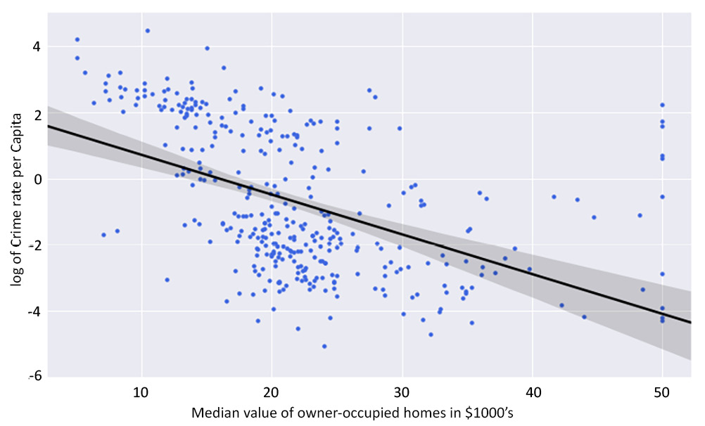

2. Regression
=============


Overview

This lab is an introduction to linear regression analysis and its
application to practical problem-solving in data science. You will learn
how to use Python, a versatile programming language, to carry out
regression analysis and examine the results. The use of the logarithm
function to transform inherently non-linear relationships between
variables and to enable the application of the linear regression method
of analysis will also be introduced.


Exercise 2.01: Loading and Preparing the Data for Analysis
----------------------------------------------------------

In this exercise, we will learn how to load Python modules, and the
dataset we need for analysis, into our Python session and prepare the
data for analysis.


The following steps will help you to complete this exercise:

1.  Open a new Jupyter notebook file.

2.  Load the necessary Python modules by entering the following code
    snippet into a single Jupyter notebook cell. Press the **Shift** and
    **Enter** keys together to run the block of code:

    ```
    %matplotlib inline
    import matplotlib as mpl
    import seaborn as sns
    import matplotlib.pyplot as plt
    import statsmodels.formula.api as smf
    import statsmodels.graphics.api as smg
    import pandas as pd
    import numpy as np
    import patsy
    from statsmodels.graphics.correlation import plot_corr
    from sklearn.model_selection import train_test_split
    plt.style.use('seaborn')
    ```


    The `plot_corr` and `train_test_split` functions
    are imported from the `statsmodels.graphics.correlation`
    and `sklearn.model_selection` modules respectively. The
    last statement is used to set the aesthetic look of the graphs that
    `matplotlib` generates to the type displayed by the
    `seaborn` module.

3.  Next, load the `Boston.CSV` file and assign the variable
    name `rawBostonData` to it by running the following code:
    ```
    rawBostonData = pd.read_csv\
                    ('https://raw.githubusercontent.com/'\
                     'fenago/The-Data-Science-'\
                     'Workshop/master/Lab02/'\
                     'Dataset/Boston.csv')
    ```


4.  Inspect the first five records in the DataFrame:

    ```
    rawBostonData.head()
    ```


    You should get the following output:

    


    Caption: First five rows of the dataset

5.  Check for missing values (*null* values) in the DataFrame and then
    drop them in order to get a clean dataset Use the pandas method
    `dropna()` to find and remove these missing values:
    ```
    rawBostonData = rawBostonData.dropna()
    ```


6.  Check for duplicate records in the DataFrame and then drop them in
    order to get a clean dataset. Use the `drop_duplicates()`
    method from pandas:
    ```
    rawBostonData = rawBostonData.drop_duplicates()
    ```


7.  List the column names of the DataFrame so that you can examine the
    fields in your dataset, and modify the names, if necessary, to names
    that are meaningful:

    ```
    list(rawBostonData.columns)
    ```


    You should get the following output:

    


    Caption: Listing all the column names

8.  Rename the DataFrame columns so that they are meaningful. Be mindful
    to match the column names exactly as leaving out even white spaces
    in the name strings will result in an error. For example, this
    string, `ZN`, has a white space before and after and it is
    different from `ZN`. After renaming, print the head of the
    new DataFrame as follows:

    ```
    renamedBostonData = rawBostonData.rename\
                        (columns = {\
                         'CRIM':'crimeRatePerCapita',\
                         ' ZN ':'landOver25K_sqft',\
                         'INDUS ':'non-retailLandProptn',\
                         'CHAS':'riverDummy',\
                         'NOX':'nitrixOxide_pp10m',\
                         'RM':'AvgNo.RoomsPerDwelling',\
                         'AGE':'ProptnOwnerOccupied',\
                         'DIS':'weightedDist',\
                         'RAD':'radialHighwaysAccess',\
                         'TAX':'propTaxRate_per10K',\
                         'PTRATIO':'pupilTeacherRatio',\
                         'LSTAT':'pctLowerStatus',\
                         'MEDV':'medianValue_Ks'})
    renamedBostonData.head()
    ```


    You should get the following output:

    


    Caption: DataFrames being renamed


9.  Inspect the data types of the columns in your DataFrame using the
    `.info()` function:

    ```
    renamedBostonData.info()
    ```


    You should get the following output:

    


    Caption: The different data types in the dataset

    The output shows that there are `506` rows
    (`Int64Index: 506 entries`) in the dataset. There are also
    `13` columns in total (`Data columns`). None of
    the `13` columns has a row with a missing value (all
    `506` rows are *non-null*). 10 of the columns have
    floating-point (decimal) type data and three have integer type data.

10. Now, calculate basic statistics for the numeric columns in the
    DataFrame:

    ```
    renamedBostonData.describe(include=[np.number]).T
    ```


    You should get the following output:

    


    Caption: Basic statistics of the numeric column

11. Divide the DataFrame into training and test sets, as shown in the
    following code snippet:

    ```
    X = renamedBostonData.drop('crimeRatePerCapita', axis = 1)
    y = renamedBostonData[['crimeRatePerCapita']]
    seed = 10 
    test_data_size = 0.3 
    X_train, X_test, \
    y_train, y_test = train_test_split(X, y, \
                                       test_size = test_data_size, \
                                       random_state = seed)
    train_data = pd.concat([X_train, y_train], axis = 1)
    test_data = pd.concat([X_test, y_test], axis = 1)
    ```


    We choose a test data size of 30%, which is `0.3`. The
    `train_test_split` function is used to achieve this. We
    set the seed of the random number generator so that we can obtain a
    reproducible split each time we run this code. An arbitrary value of
    `10` is used here. It is good model-building practice to
    divide a dataset being used to develop a model into at least two
    parts. One part is used to develop the model and it is called a
    training set (`X_train` and `y_train` combined).


12. Calculate and plot a correlation matrix for the
    `train_data` set:

    ```
    corrMatrix = train_data.corr(method = 'pearson')
    xnames=list(train_data.columns)
    ynames=list(train_data.columns)
    plot_corr(corrMatrix, xnames=xnames, ynames=ynames,\
              title=None, normcolor=False, cmap='RdYlBu_r')
    ```


    The use of the backslash character, `\`, on *line 4* in
    the preceding code snippet is to enforce the continuation of code on
    to a new line in Python. The `\` character is not required
    if you are entering the full line of code into a single line in
    your notebook.

    You should get the following output:

    


Exercise 2.02: Graphical Investigation of Linear Relationships Using Python
---------------------------------------------------------------------------

Scatter graphs fitted with a regression line are a quick way by which a
data scientist can visualize a possible correlation between a dependent
variable and an independent variable.

The goal of the exercise is to use this technique to investigate any
linear relationship that may exist between crime rate per capita and the
median value of owner-occupied homes in towns in the city of Boston.

The following steps will help you complete the exercise:

1.  Open a new Jupyter notebook file and execute the steps up to and
    including *Step 11* from *Exercise 2.01*, *Loading and Preparing the
    Data for Analysis*. This is shown in the code blocks below, starting
    with the import statements:

    ```
    %matplotlib inline
    import matplotlib as mpl
    import seaborn as sns
    import matplotlib.pyplot as plt
    import statsmodels.formula.api as smf
    import statsmodels.graphics.api as smg
    import pandas as pd
    import numpy as np
    import patsy
    from statsmodels.graphics.correlation import plot_corr
    from sklearn.model_selection import train_test_split
    plt.style.use('seaborn')
    ```


    Loading and preprocessing the data:

    ```
    rawBostonData = pd.read_csv\
                    ('https://raw.githubusercontent.com/'\
                     'fenago/The-Data-Science-'\
                     'Workshop/master/Lab02/'
                     'Dataset/Boston.csv')
    rawBostonData = rawBostonData.dropna()
    rawBostonData = rawBostonData.drop_duplicates()
    renamedBostonData = rawBostonData.rename\
                        (columns = {\
                         'CRIM':'crimeRatePerCapita',\
                         ' ZN ':'landOver25K_sqft',\
                         'INDUS ':'non-retailLandProptn',\
                         'CHAS':'riverDummy',\
                         'NOX':'nitrixOxide_pp10m',\
                         'RM':'AvgNo.RoomsPerDwelling',\
                         'AGE':'ProptnOwnerOccupied',\
                         'DIS':'weightedDist',\
                         'RAD':'radialHighwaysAccess',\
                         'TAX':'propTaxRate_per10K',\
                         'PTRATIO':'pupilTeacherRatio',\
                         'LSTAT':'pctLowerStatus',\
                         'MEDV':'medianValue_Ks'})
    ```


    Setting up the test and train data:

    ```
    X = renamedBostonData.drop('crimeRatePerCapita', axis = 1)
    y = renamedBostonData[['crimeRatePerCapita']]
    seed = 10 
    test_data_size = 0.3 
    X_train, X_test, y_train, y_test = train_test_split\
                                       (X, y, \
                                        test_size = test_data_size,\
                                        random_state = seed)
    train_data = pd.concat([X_train, y_train], axis = 1)
    test_data = pd.concat([X_test, y_test], axis = 1)
    ```


2.  Now use the `subplots` function in `matplotlib`
    to define a canvas (assigned the variable name `fig` in
    the following code) and a graph object (assigned the variable name
    `ax` in the following code) in Python. You can set the
    size of the graph by setting the `figsize` (width =
    `10`, height = `6`) argument of the function:

    ```
    fig, ax = plt.subplots(figsize=(10, 6))
    ```


    Do not execute the code yet.

3.  Use the `seaborn` function `regplot` to create
    the scatter plot. Do not execute this code cell yet; we will add
    more code to style the plot in the next step:

    ```
    sns.regplot(x='medianValue_Ks', y='crimeRatePerCapita', \
                ci=None, data=train_data, ax=ax, color='k', \
                scatter_kws={"s": 20,"color": "royalblue", \
                "alpha":1})
    ```


    The function accepts arguments for the independent variable
    (`x`), the dependent variable (`y`), the
    confidence interval of the regression parameters (`ci`),
    which takes values from 0 to 100, the DataFrame that has
    `x` and `y` (`data`), a matplotlib
    graph object (`ax`), and others to control the aesthetics
    of the points on the graph. (In this case, the confidence interval
    is set to `None` -- we will see more on confidence
    intervals later in the lab.)

4.  In the same cell as step 3, set the `x` and `y`
    labels, the `fontsize` and `name` labels, the
    `x` and `y` limits, and the `tick`
    parameters of the matplotlib graph object (`ax`). Also,
    set the layout of the canvas to `tight`:

    ```
    ax.set_ylabel('Crime rate per Capita', fontsize=15, \
                   fontname='DejaVu Sans')
    ax.set_xlabel("Median value of owner-occupied homes "\
                  "in $1000's", fontsize=15, \
                  fontname='DejaVu Sans')
    ax.set_xlim(left=None, right=None)
    ax.set_ylim(bottom=None, top=30)
    ax.tick_params(axis='both', which='major', labelsize=12)
    fig.tight_layout()
    ```


    Now execute the cell. You should get the following output:


Exercise 2.03: Examining a Possible Log-Linear Relationship Using Python
------------------------------------------------------------------------

In this exercise, we will use the logarithm function to transform
variables and investigate whether this helps provide a better fit of the
regression line to the data. We will also look at how to use confidence
intervals by including a 95% confidence interval of the regression
coefficients on the plot.

The following steps will help you to complete this exercise:

1.  Open a new Jupyter notebook file and execute all the steps up to *Step
    11* from *Exercise 2.01*, *Loading and Preparing the Data for
    Analysis*.

2.  Use the `subplots` function in `matplotlib` to
    define a canvas and a graph object in Python:

    ```
    fig, ax = plt.subplots(figsize=(10, 6))
    ```


    Do not execute this code yet.

3.  In the same code cell, use the logarithm function in
    `numpy` (`np.log`) to transform the dependent
    variable (`y`). This essentially creates a new variable,
    `log(y)`:

    ```
    y = np.log(train_data['crimeRatePerCapita'])
    ```


    Do not execute this code yet.

4.  Use the seaborn `regplot` function to create the scatter
    plot. Set the `regplot` function confidence interval
    argument (`ci`) to `95%`. This will calculate a
    `95%` confidence interval for the regression coefficients
    and have them plotted on the graph as a shaded area along the
    regression line.

    Note

    A confidence interval gives an estimated range that is likely to
    contain the true value that you\'re looking for. So, a
    `95%` confidence interval indicates we can be
    `95%` certain that the true regression coefficients lie in
    that shaded area.

    Parse the `y` argument with the new variable we defined in
    the preceding step. The `x` argument is the original
    variable from the DataFrame without any transformation. Continue in
    the same code cell. Do not execute this cell yet; we will add in
    more styling code in the next step.

    ```
    sns.regplot(x='medianValue_Ks', y=y, ci=95, \
                data=train_data, ax=ax, color='k', \
                scatter_kws={"s": 20,"color": "royalblue", \
                "alpha":1})
    ```


5.  Continuing in the same cell, set the `x` and `y`
    labels, the `fontsize` and `name` labels, the
    `x` and `y` limits, and the `tick`
    parameters of the `matplotlib` graph object
    (`ax`). Also, set the layout of the canvas to
    `tight`:

    ```
    ax.set_ylabel('log of Crime rate per Capita', \
                  fontsize=15, fontname='DejaVu Sans')
    ax.set_xlabel("Median value of owner-occupied homes "\
                  "in $1000's", fontsize=15, \
                  fontname='DejaVu Sans')
    ax.set_xlim(left=None, right=None)
    ax.set_ylim(bottom=None, top=None)
    ax.tick_params(axis='both', which='major', labelsize=12)
    fig.tight_layout()
    ```


    Now execute this cell. The output is as follows:

    



Exercise 2.04: Fitting a Simple Linear Regression Model Using the Statsmodels formula API
-----------------------------------------------------------------------------------------

In this exercise, we examine a simple linear regression model where the
crime rate per capita is the dependent variable and the median value of
owner-occupied homes is the independent variable. We use the statsmodels
formula API to create a linear regression model for Python to analyze.

The following steps will help you complete this exercise:

1.  Open a new Jupyter notebook file and import the required packages.
    ```
    import pandas as pd
    import statsmodels.formula.api as smf
    from sklearn.model_selection import train_test_split
    ```


2.  Execute *Step 2* to *11* from *Exercise 2.01*, *Loading and
    Preparing the Data for Analysis*.

3.  Define a linear regression model and assign it to a variable named
    `linearModel`:

    ```
    linearModel = smf.ols\
                  (formula='crimeRatePerCapita ~ medianValue_Ks',\
                   data=train_data)
    ```


    As you can see, we call the `ols` function of the
    statsmodels API and set its formula argument by defining a
    `patsy` formula string that uses the tilde (`~`)
    symbol to relate the dependent variable to the independent variable.
    Tell the function where to find the variables named, in the string,
    by assigning the data argument of the `ols` function to
    the DataFrame that contains your variables (`train_data`).

4.  Call the .`fit` method of the model instance and assign
    the results of the method to a `linearModelResult`
    variable, as shown in the following code snippet:
    ```
    linearModelResult = linearModel.fit()
    ```


5.  Print a summary of the results stored the
    `linearModelResult` variable by running the following
    code:

    ```
    print(linearModelResult.summary())
    ```


    You should get the following output:

    


Activity 2.01: Fitting a Log-Linear Model Using the Statsmodels Formula API
---------------------------------------------------------------------------

You have seen how to use the statsmodels API to fit a linear regression
model. In this activity, you are asked to fit a log-linear model. Your
model should represent the relationship between the log-transformed
dependent variable (log of crime rate per capita) and the median value
of owner-occupied homes.

The steps to complete this activity are as follows:

1.  Define a linear regression model and assign it to a variable.
    Remember to use the `log` function to transform the
    dependent variable in the formula string.
2.  Call the `fit` method of the log-linear model instance and
    assign the results of the method to a variable.
3.  Print a summary of the results and analyze the output.

Your output should look like the following figure:


Exercise 2.05: Fitting a Multiple Linear Regression Model Using the Statsmodels Formula API
-------------------------------------------------------------------------------------------

In this exercise, we will be using the plus operator (`+`) in
the `patsy` formula string to define a linear regression model
that includes more than one independent variable.

To complete this activity, run the code in the following steps in your
Jupyter notebook:

1.  Open a new Jupyter notebook file and import the required packages.
    ```
    import statsmodels.formula.api as smf
    import pandas as pd
    from sklearn.model_selection import train_test_split
    ```

2.  Execute *Step 2* to *11* from *Exercise 2.01*, *Loading and
    Preparing the Data for Analysis*.
3.  Use the plus operator (`+`) of the Patsy formula language
    to define a linear model that regresses
    `crimeRatePerCapita` on `pctLowerStatus`,
    `radialHighwaysAccess`, `medianValue_Ks`, and
    `nitrixOxide_pp10m` and assign it to a variable named
    `multiLinearModel`. Use the Python line continuation
    symbol (`\`) to continue your code on a new line should
    you run out of space:
    ```
    multiLinearModel = smf.ols\
                       (formula = 'crimeRatePerCapita \
                                   ~ pctLowerStatus \
                                   + radialHighwaysAccess \
                                   + medianValue_Ks \
                                   + nitrixOxide_pp10m', \
                                   data=train_data)
    ```

4.  Call the `fit` method of the model instance and assign the
    results of the method to a variable:
    ```
    multiLinearModResult = multiLinearModel.fit()
    ```

5.  Print a summary of the results stored the variable created in *Step
    3*:

```
print(multiLinearModResult.summary())
```

The output is as follows:


Activity 2.02: Fitting a Multiple Log-Linear Regression Model
-------------------------------------------------------------

A log-linear regression model you developed earlier was able to explain
about 24% of the variability in the transformed crime rate per capita
variable (see the values in *Figure 2.17*). You are now asked to develop
a log-linear multiple regression model that will likely explain 80% or
more of the variability in the transformed dependent variable. You
should use independent variables from the Boston Housing dataset that
have a correlation coefficient of 0.4 or more.

You are also encouraged to include the interaction of these variables to
order two in your model. You should produce graphs and data that show
that your model satisfies the assumptions of linear regression.

The steps are as follows:

1.  Define a linear regression model and assign it to a variable.
    Remember to use the `log` function to transform the
    dependent variable in the formula string, and also include more than
    one independent variable in your analysis.

2.  Call the `fit` method of the model instance and assign the
    results of the method to a new variable.

3.  Print a summary of the results and analyze your model.

    Your output should appear as shown:

    


Summary
=======


This lab introduced the topic of linear regression analysis using
Python. We learned that regression analysis, in general, is a supervised
machine learning or data science problem. We learned about the
fundamentals of linear regression analysis, including the ideas behind
the method of least squares. We also learned about how to use the pandas
Python module to load and prepare data for exploration and analysis.
