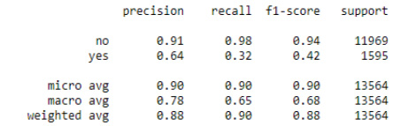

3. Binary Classification
========================


Overview

In this lab, we will be using a real-world dataset and a supervised
learning technique called classification to generate business outcomes.

By the end of this lab, you will be able to formulate a data science
problem statement from a business perspective; build hypotheses from
various business drivers influencing a use case and verify the
hypotheses using exploratory data analysis; derive features based on
intuitions that are derived from exploratory analysis through feature
engineering; build binary classification models using a logistic
regression function and analyze classification metrics and formulate
action plans for the improvement of the model.


Introduction
============


In previous labs, where an introduction to machine learning was
covered, you were introduced to two broad categories of machine
learning; supervised learning and unsupervised learning. Supervised
learning can be further divided into two types of problem cases,
regression and classification. In the last lab, we covered
regression problems. In this lab, we will peek into the world of
classification problems.

Take a look at the following *Figure 3.1*:


Caption: Overview of machine learning algorithms

Classification problems are the most prevalent use cases you will
encounter in the real world. Unlike regression problems, where a real
numbered value is predicted, classification problems deal with
associating an example to a category. Classification use cases will take
forms such as the following:

- Predicting whether a customer will buy the recommended product
- Identifying whether a credit transaction is fraudulent
- Determining whether a patient has a disease
- Analyzing images of animals and predicting whether the image is of a
    dog, cat, or panda
- Analyzing text reviews and capturing the underlying emotion such as
    happiness, anger, sorrow, or sarcasm

If you observe the preceding examples, there is a subtle difference
between the first three and the last two. The first three revolve around
binary decisions:

- Customers can either buy the product or not.
- Credit card transactions can be fraudulent or legitimate.
- Patients can be diagnosed as positive or negative for a disease.

Use cases that align with the preceding three genres where a binary
decision is made are called binary classification problems. Unlike the
first three, the last two associate an example with multiple classes or
categories. Such problems are called multiclass classification problems.
This lab will deal with binary classification problems. Multiclass
classification will be covered next in *Lab 4*, *Multiclass
Classification with RandomForest*.


Understanding the Business Context
==================================


The best way to work using a concept is with an example you can relate
to. To understand the business context, let\'s, for instance, consider
the following example.

The marketing head of the bank where you are a data scientist approaches
you with a problem they would like to be addressed. The marketing team
recently completed a marketing campaign where they have collated a lot
of information on existing customers. They require your help to identify
which of these customers are likely to buy a term deposit plan. Based on
your assessment of the customer base, the marketing team will chalk out
strategies for target marketing. The marketing team has provided access
to historical data of past campaigns and their outcomes---that is,
whether the targeted customers really bought the term deposits or not.
Equipped with the historical data, you have set out on the task to
identify the customers with the highest propensity (an inclination) to
buy term deposits.


Business Discovery
------------------

The first process when embarking on a data science problem like the
preceding is the business discovery process. This entails understanding
various drivers influencing the business problem. Getting to know the
business drivers is important as it will help in formulating hypotheses
about the business problem, which can be verified during the
**exploratory data analysis** (**EDA**). The verification of hypotheses
will help in formulating intuitions for feature engineering, which will
be critical for the veracity of the models that we build.

Let\'s understand this process in detail from the context of our use
case. The problem statement is to identify those customers who have a
propensity to buy term deposits. As you might be aware, term deposits
are bank instruments where your money will be locked for a certain
period, assuring higher interest rates than saving accounts or
interest-bearing checking accounts. From an investment propensity
perspective, term deposits are generally popular among risk-averse
customers. Equipped with the business context, let\'s look at some
questions on business factors influencing a propensity to buy term
deposits:

- Would age be a factor, with more propensity shown by the elderly?
- Is there any relationship between employment status and the
    propensity to buy term deposits?
- Would the asset portfolio of a customer---that is, house, loan, or
    higher bank balance---influence the propensity to buy?
- Will demographics such as marital status and education influence the
    propensity to buy term deposits? If so, how are demographics
    correlated to a propensity to buy?

Formulating questions on the business context is critical as this will
help in arriving at various trails that we can take when we do
exploratory analysis. We will deal with that in the next section. First,
let\'s explore the data related to the preceding business problem.


Exercise 3.01: Loading and Exploring the Data from the Dataset
--------------------------------------------------------------

In this exercise, we will load the dataset in our Colab notebook and do
some basic explorations such as printing the dimensions of the dataset
using the `.shape()` function and generating summary
statistics of the dataset using the `.describe()` function.


The following steps will help you to complete this exercise:

1.  Open a new Colab notebook.

2.  Now, `import` `pandas` as `pd` in your
    Colab notebook:
    ```
    import pandas as pd
    ```


3.  Assign the link to the dataset to a variable called
    `file_url`
    ```
    file_url = 'https://raw.githubusercontent.com/fenago'\
               '/data-science/master/Lab03'\
               '/bank-full.csv'
    ```


4.  Now, read the file using the `pd.read_csv()` function from
    the pandas DataFrame:

    ```
    # Loading the data using pandas
    bankData = pd.read_csv(file_url, sep=";")
    bankData.head()
    ```


    Note

    The `#` symbol in the code snippet above denotes a code
    comment. Comments are added into code to help explain specific bits
    of logic.

    The `pd.read_csv()` function\'s arguments are the filename
    as a string and the limit separator of a CSV, which is
    `";"`. After reading the file, the DataFrame is printed
    using the `.head()` function. Note that the `#`
    symbol in the code above denotes a comment. Comments are added into
    code to help explain specific bits of logic.

    You should get the following output:

    


    Caption: Loading data into a Colab notebook

    Here, we loaded the `CSV` file and then stored it as a
    pandas DataFrame for further analysis.

5.  Next, print the shape of the dataset, as mentioned in the following
    code snippet:

    ```
    # Printing the shape of the data 
    print(bankData.shape)
    ```


    The `.shape` function is used to find the overall shape of
    the dataset.

    You should get the following output:

    ```
    (45211, 17)
    ```


6.  Now, find the summary of the numerical raw data as a table output
    using the `.describe()` function in pandas, as mentioned
    in the following code snippet:

    ```
    # Summarizing the statistics of the numerical raw data
    bankData.describe()
    ```


    You should get the following output:

    


Testing Business Hypotheses Using Exploratory Data Analysis
-----------------------------------------------------------

In the previous section, you approached the problem statement from a
domain perspective, thereby identifying some of the business drivers.
Once business drivers are identified, the next step is to evolve some
hypotheses about the relationship of these business drivers and the
business outcome you have set out to achieve. These hypotheses need to
be verified using the data you have. This is where **exploratory data
analysis** (**EDA**) plays a big part in the data science life cycle.

Let\'s return to the problem statement we are trying to analyze. From
the previous section, we identified some business drivers such as age,
demographics, employment status, and asset portfolio, which we feel will
influence the propensity for buying a term deposit. Let\'s go ahead and
formulate our hypotheses on some of these business drivers and then
verify them using EDA.


Visualization for Exploratory Data Analysis
-------------------------------------------

Visualization is imperative for EDA. Effective visualization helps in
deriving business intuitions from the data. In this section, we will
introduce some of the visualization techniques that will be used for
EDA:

- **Line graphs**: Line graphs are one of the simplest forms of
    visualization. Line graphs are the preferred method for revealing
    trends in the data. These types of graphs are mostly used for
    continuous data. We will be generating this graph in *Exercise
    3.02*, *Business Hypothesis Testing for Age versus Propensity for a
    Term Loan*.

    Here is what a line graph looks like:

    


Caption: Example of a line graph

- **Histograms**: Histograms are plots of the proportion of data along
    with some specified intervals. They are mostly used for visualizing
    the distribution of data. Histograms are very effective for
    identifying whether data distribution is symmetric and for
    identifying outliers in data. We will be looking at histograms in
    much more detail later in this lab.

    Here is what a histogram looks like:

    


Caption: Example of a histogram

- **Density plots**: Like histograms, density plots are also used for
    visualizing the distribution of data. However, density plots give a
    smoother representation of the distribution. We will be looking at
    this later in this lab.

    Here is what a density plot looks like:

    


Caption: Example of a density plot

- **Stacked bar charts**: A stacked bar chart helps you to visualize
    the various categories of data, one on top of the other, in order to
    give you a sense of proportion of the categories; for instance, if
    you want to plot a bar chart showing the values, `Yes` and
    `No`, on a single bar. This can be done using the stacked
    bar chart, which cannot be done on the other charts.

    Let\'s create some dummy data and generate a stacked bar chart to
    check the proportion of jobs in different sectors.

    Note

    Do not execute any of the following code snippets until the final
    step. Enter all the code in the same cell.

    Import the library files required for the task:

    ```
    # Importing library files
    import matplotlib.pyplot as plt
    import numpy as np
    ```


    Next, create some sample data detailing a list of jobs:

    ```
    # Create a simple list of categories
    jobList = ['admin','scientist','doctor','management']
    ```


    Each job will have two categories to be plotted, `yes` and
    `No`, with some proportion between `yes` and
    `No`. These are detailed as follows:

    ```
    # Getting two categories ( 'yes','No') for each of jobs
    jobYes = [20,60,70,40]
    jobNo = [80,40,30,60]
    ```


    In the next steps, the length of the job list is taken for plotting
    `xlabels` and then they are arranged using the
    `np.arange()` function:

    ```
    # Get the length of x axis labels and arranging its indexes
    xlabels = len(jobList)
    ind = np.arange(xlabels)
    ```


    Next, let\'s define the width of each bar and do the plotting. In
    the plot, `p2`, we define that when stacking,
    `yes` will be at the bottom and `No` at top:

    ```
    # Get width of each bar
    width = 0.35
    # Getting the plots
    p1 = plt.bar(ind, jobYes, width)
    p2 = plt.bar(ind, jobNo, width, bottom=jobYes)
    ```


    Define the labels for the *Y* axis and the title of the plot:

    ```
    # Getting the labels for the plots
    plt.ylabel('Proportion of Jobs')
    plt.title('Job')
    ```


    The indexes for the *X* and *Y* axes are defined next. For the *X*
    axis, the list of jobs are given, and, for the *Y* axis, the indices
    are in proportion from `0` to `100` with an
    increment of `10` (0, 10, 20, 30, and so on):

    ```
    # Defining the x label indexes and y label indexes
    plt.xticks(ind, jobList)
    plt.yticks(np.arange(0, 100, 10))
    ```


    The last step is to define the legends and to rotate the axis labels
    to `90` degrees. The plot is finally displayed:

    ```
    # Defining the legends
    plt.legend((p1[0], p2[0]), ('Yes', 'No'))
    # To rotate the axis labels 
    plt.xticks(rotation=90)
    plt.show()
    ```


Here is what a stacked bar chart looks like based on the preceding
example:


Caption: Example of a stacked bar plot

Let\'s use these graphs in the following exercises and activities.


Exercise 3.02: Business Hypothesis Testing for Age versus Propensity for a Term Loan
------------------------------------------------------------------------------------

The goal of this exercise is to define a hypothesis to check the
propensity for an individual to purchase a term deposit plan against
their age. We will be using a line graph for this exercise.

The following steps will help you to complete this exercise:

1.  Begin by defining the hypothesis.

    The first step in the verification process will be to define a
    hypothesis about the relationship. A hypothesis can be based on your
    experiences, domain knowledge, some published pieces of knowledge,
    or your business intuitions.

    Let\'s first define our hypothesis on age and propensity to buy term
    deposits:

    *The propensity to buy term deposits is more with elderly customers
    compared to younger ones*. This is our hypothesis.

    Now that we have defined our hypothesis, it is time to verify its
    veracity with the data. One of the best ways to get business
    intuitions from data is by taking cross-sections of our data and
    visualizing them.

2.  Import the pandas and altair packages:
    ```
    import pandas as pd
    import altair as alt
    ```


3.  Next, you need to load the dataset, just like you loaded the dataset
    in *Exercise 3.01*, *Loading and Exploring the Data from the
    Dataset*:

    ```
    file_url = 'https://raw.githubusercontent.com/'\
               'fenago/data-science/'\
               'master/Lab03/bank-full.csv'
    bankData = pd.read_csv(file_url, sep=";")
    ```


    Note

    *Steps 2-3* will be repeated in the following exercises for this
    lab.

    We will be verifying how the purchased term deposits are distributed
    by age.

4.  Next, we will count the number of records for each age group. We
    will be using the combination of `.groupby()`,
    `.agg()`, `.reset_index()` methods
    from `pandas`.

    Note

    You will see further details of these methods in *Lab 12*,
    *Feature Engineering*.

    ```
    filter_mask = bankData['y'] == 'yes'
    bankSub1 = bankData[filter_mask]\
               .groupby('age')['y'].agg(agegrp='count')\
               .reset_index()
    ```


    We first take the pandas `DataFrame`,
    `bankData`, which we loaded in *Exercise 3.01*, *Loading
    and Exploring the Data from the Dataset* and then filter it for all
    cases where the term deposit is yes using the mask
    `bankData['y'] == 'yes'`. These cases are grouped through
    the `groupby()` method and then aggregated according to
    age through the `agg()` method. Finally we need to use
    `.reset_index()` to get a well-structure DataFrame that
    will be stored in a new `DataFrame` called
    `bankSub1`.

5.  Now, plot a line chart using altair and the
    `.Chart().mark_line().encode()` methods and we will define
    the `x` and `y` variables, as shown in the
    following code snippet:

    ```
    # Visualising the relationship using altair
    alt.Chart(bankSub1).mark_line().encode(x='age', y='agegrp')
    ```


    You should get the following output:

    


    Caption: Relationship between age and propensity to purchase

    From the plot, we can see that the highest number of term deposit
    purchases are done by customers within an age range between 25 and
    40, with the propensity to buy tapering off with age.

    This relationship is quite counterintuitive from our assumptions in
    the hypothesis, right? But, wait a minute, aren\'t we missing an
    important point here? We are taking the data based on the absolute
    count of customers in each age range. If the proportion of banking
    customers is higher within the age range of 25 to 40, then we are
    very likely to get a plot like the one that we have got. What we
    really should plot is the proportion of customers, within each age
    group, who buy a term deposit.

    Let\'s look at how we can represent the data by taking the
    proportion of customers. Just like you did in the earlier steps, we
    will aggregate the customer propensity with respect to age, and then
    divide each category of buying propensity by the total number of
    customers in that age group to get the proportion.

6.  Group the data per age using the `groupby()` method and
    find the total number of customers under each age group using the
    `agg()` method:

    ```
    # Getting another perspective
    ageTot = bankData.groupby('age')['y']\
             .agg(ageTot='count').reset_index()
    ageTot.head()
    ```


    The output is as follows:

    


    Caption: Customers per age group

7.  Now, group the data by both age and propensity of purchase and find
    the total counts under each category of propensity, which are
    `yes` and `no`:

    ```
    # Getting all the details in one place
    ageProp = bankData.groupby(['age','y'])['y']\
              .agg(ageCat='count').reset_index()
    ageProp.head()
    ```


    The output is as follows:

    


    Caption: Propensity by age group

8.  Merge both of these DataFrames based on the `age` variable
    using the `pd.merge()` function, and then divide each
    category of propensity within each age group by the total customers
    in the respective age group to get the proportion of customers, as
    shown in the following code snippet:

    ```
    # Merging both the data frames
    ageComb = pd.merge(ageProp, ageTot,left_on = ['age'], \
                       right_on = ['age'])
    ageComb['catProp'] = (ageComb.ageCat/ageComb.ageTot)*100
    ageComb.head()
    ```


    The output is as follows:

    


    Caption: Merged DataFrames with proportion of customers by age
    group

9.  Now, display the proportion where you plot both categories (yes and
    no) as separate plots. This can be achieved through a method within
    `altair` called `facet()`:

    ```
    # Visualising the relationship using altair
    alt.Chart(ageComb).mark_line()\
       .encode(x='age', y='catProp').facet(column='y')
    ```


    This function makes as many plots as there are categories within the
    variable. Here, we give the `'y'` variable, which is the
    variable name for the `yes` and `no` categories
    to the `facet()` function, and we get two different plots:
    one for `yes` and another for `no`.

    You should get the following output:

    


Caption: Visualizing normalized relationships


Activity 3.01: Business Hypothesis Testing to Find Employment Status versus Propensity for Term Deposits
--------------------------------------------------------------------------------------------------------

You are working as a data scientist for a bank. You are provided with
historical data from the management of the bank and are asked to try to
formulate a hypothesis between employment status and the propensity to
buy term deposits.

In *Exercise 3.02*, *Business Hypothesis Testing for Age versus
Propensity for a Term Loan* we worked on a problem to find the
relationship between age and the propensity to buy term deposits. In
this activity, we will use a similar route and verify the relationship
between employment status and term deposit purchase propensity.

The steps are as follows:

1.  Formulate the hypothesis between employment status and the
    propensity for term deposits. Let the hypothesis be as follows:
    *High paying employees prefer term deposits than other categories of
    employees*.

2.  Open a Colab notebook file similar to what was used in *Exercise
    3.02*, *Business Hypothesis Testing for Age versus Propensity for a
    Term Loan* and install and import the necessary libraries such as
    `pandas` and `altair`.

3.  From the banking DataFrame, `bankData`, find the
    distribution of employment status using the `.groupby()`,
    `.agg()` and `.reset_index()` methods.

    Group the data with respect to employment status using the
    `.groupby()` method and find the total count of
    propensities for each employment status using the `.agg()`
    method.

4.  Now, merge both DataFrames using the `pd.merge()` function
    and then find the propensity count by calculating the proportion of
    propensity for each type of employment status. When creating the new
    variable for finding the propensity proportion.

5.  Plot the data and summarize intuitions from the plot using
    `matplotlib`. Use the stacked bar chart for this activity.


Expected output: The final plot of the propensity to buy with respect to
employment status will be similar to the following plot:


Feature Engineering
===================


In the previous section, we traversed the process of EDA. As part of the
earlier process, we tested our business hypotheses by slicing and dicing
the data and through visualizations. You might be wondering where we
will use the intuitions that we derived from all of the analysis we did.
The answer to that question will be addressed in this section.

Feature engineering is the process of transforming raw variables to
create new variables and this will be covered later in the lab.
Feature engineering is one of the most important steps that influence
the accuracy of the models that we build.

There are two broad types of feature engineering:

1.  Here, we transform raw variables based on intuitions from a business
    perspective. These intuitions are what we build during the
    exploratory analysis.
2.  The transformation of raw variables is done from a statistical and
    data normalization perspective.

We will look into each type of feature engineering next.

Note

Feature engineering will be covered in much more detail in *Lab 12*,
*Feature Engineering*. In this section you will see the purpose of
learning about classification.


Business-Driven Feature Engineering
-----------------------------------

Business-driven feature engineering is the process of transforming raw
variables based on business intuitions that were derived during the
exploratory analysis. It entails transforming data and creating new
variables based on business factors or drivers that influence a business
problem.

In the previous exercises on exploratory analysis, we explored the
relationship of a single variable with the dependent variable. In this
exercise, we will combine multiple variables and then derive new
features. We will explore the relationship between an asset portfolio
and the propensity for term deposit purchases. An asset portfolio is the
combination of all assets and liabilities the customer has with the
bank. We will combine assets and liabilities such as bank balance, home
ownership, and loans to get a new feature called an **asset** index.

These feature engineering steps will be split into two exercises. In
*Exercise 3.03*, *Feature Engineering -- Exploration of Individual
Features*, we explore individual variables such as balance, housing, and
loans to understand their relationship to a propensity for term
deposits.

In *Exercise 3.04*, *Feature Engineering -- Creating New Features from
Existing Ones,* we will transform individual variables and then combine
them to form a new feature.


Exercise 3.03: Feature Engineering -- Exploration of Individual Features
------------------------------------------------------------------------

In this exercise, we will explore the relationship between two
variables, which are whether an individual owns a house and whether an
individual has a loan, to the propensity for term deposit purchases by
these individuals.

The following steps will help you to complete this exercise:

1.  Open a new Colab notebook.

2.  Import the `pandas` package.
    ```
    import pandas as pd
    ```


3.  Assign the link to the dataset to a variable called
    `file_url`:
    ```
    file_url = 'https://raw.githubusercontent.com'\
               '/fenago/data-science'\
               '/master/Lab03/bank-full.csv'
    ```


4.  Read the banking dataset using the `.read_csv()` function:
    ```
    # Reading the banking data
    bankData = pd.read_csv(file_url, sep=";")
    ```


5.  Next, we will find a relationship between housing and the propensity
    for term deposits, as mentioned in the following code snippet:

    ```
    # Relationship between housing and propensity for term deposits
    bankData.groupby(['housing', 'y'])['y']\
            .agg(houseTot='count').reset_index()
    ```


    You should get the following output:

    


    Caption: Housing status versus propensity to buy term deposits

    The first part of the code is to group customers based on whether
    they own a house or not. The count of customers under each category
    is calculated with the `.agg()` method. From the values,
    we can see that the propensity to buy term deposits is much higher
    for people who do not own a house compared with those who do own
    one:
    `( 3354 / ( 3354 + 16727) = 17% to  1935 / ( 1935 + 23195) = 8%)`.

6.  Explore the `'loan'` variable to find its relationship
    with the propensity for a term deposit, as mentioned in the
    following code snippet:

    ```
    """
    Relationship between having a loan and propensity for term 
    deposits
    """
    bankData.groupby(['loan', 'y'])['y']\
            .agg(loanTot='count').reset_index()
    ```


    Note

    The triple-quotes ( `"""` ) shown in the code snippet
    above are used to denote the start and end points of a multi-line
    code comment. This is an alternative to using the `#`
    symbol.

    You should get the following output:

    


    Caption: Loan versus term deposit propensity

    In the case of loan portfolios, the propensity to buy term deposits
    is higher for customers without loans:
    `( 4805 / ( 4805 + 33162) = 12 % to  484/ ( 484 + 6760) =  6%)`.

    Housing and loans were categorical data and finding a relationship
    was straightforward. However, bank balance data is numerical and to
    analyze it, we need to have a different strategy. One common
    strategy is to convert the continuous numerical data into ordinal
    data and look at how the propensity varies across each category.

7.  To convert numerical values into ordinal values, we first find the
    quantile values and take them as threshold values. The quantiles are
    obtained using the following code snippet:

    ```
    #Taking the quantiles for 25%, 50% and 75% of the balance data
    import numpy as np
    np.quantile(bankData['balance'],[0.25,0.5,0.75])
    ```


    You should get the following output:

    


    Caption: Quantiles for bank balance data


8.  Now, convert the numerical values of bank balances into categorical
    values, as mentioned in the following code snippet:

    ```
    bankData['balanceClass'] = 'Quant1'
    bankData.loc[(bankData['balance'] > 72) \
                  & (bankData['balance'] < 448), \
                  'balanceClass'] = 'Quant2'
    bankData.loc[(bankData['balance'] > 448) \
                  & (bankData['balance'] < 1428), \
                  'balanceClass'] = 'Quant3'
    bankData.loc[bankData['balance'] > 1428, \
                 'balanceClass'] = 'Quant4'
    bankData.head()
    ```


    You should get the following output:

    


    Caption: New features from bank balance data

    We did this is by looking at the quantile thresholds we took in the
    *Step 4*, and categorizing the numerical data into the corresponding
    quantile class. For example, all values lower than the
    25[th] quantile value, 72, were classified as
    `Quant1`, values between 72 and 448 were classified as
    `Quant2`, and so on. To store the quantile categories, we
    created a new feature in the bank dataset called
    `balanceClass` and set its default value to
    `Quan1`. After this, based on each value threshold, the
    data points were classified to the respective quantile class.

9.  Next, we need to find the propensity of term deposit purchases based
    on each quantile the customers fall into. This task is similar to
    what we did in *Exercise 3.02*, *Business Hypothesis Testing for Age
    versus Propensity for a Term Loan*:

    ```
    # Calculating the customers under each quantile 
    balanceTot = bankData.groupby(['balanceClass'])['y']\
                         .agg(balanceTot='count').reset_index()
    balanceTot
    ```


    You should get the following output:

    


    Caption: Classification based on quantiles

10. Calculate the total number of customers categorized by quantile and
    propensity classification, as mentioned in the following code
    snippet:

    ```
    """
    Calculating the total customers categorised as per quantile 
    and propensity classification
    """
    balanceProp = bankData.groupby(['balanceClass', 'y'])['y']\
                          .agg(balanceCat='count').reset_index()
    balanceProp
    ```


    You should get the following output:

    


    Caption: Total number of customers categorized by quantile and
    propensity classification

11. Now, `merge` both DataFrames:

    ```
    # Merging both the data frames
    balanceComb = pd.merge(balanceProp, balanceTot, \
                           on = ['balanceClass'])
    balanceComb['catProp'] = (balanceComb.balanceCat \
                              / balanceComb.balanceTot)*100
    balanceComb
    ```


    You should get the following output:

    


Caption: Propensity versus balance category


In the next exercise, we will use these intuitions to derive a new
feature.


Exercise 3.04: Feature Engineering -- Creating New Features from Existing Ones
------------------------------------------------------------------------------

In this exercise, we will combine the individual variables we analyzed
in *Exercise 3.03*, *Feature Engineering -- Exploration of Individual
Features* to derive a new feature called an asset index. One methodology
to create an asset index is by assigning weights based on the asset or
liability of the customer.

For instance, a higher bank balance or home ownership will have a
positive bearing on the overall asset index and, therefore, will be
assigned a higher weight. In contrast, the presence of a loan will be a
liability and, therefore, will have to have a lower weight. Let\'s give
a weight of 5 if the customer has a house and 1 in its absence.
Similarly, we can give a weight of 1 if the customer has a loan and 5 in
case of no loans:

1.  Open a new Colab notebook.

2.  Import the pandas and numpy package:
    ```
    import pandas as pd
    import numpy as np
    ```


3.  Assign the link to the dataset to a variable called \'file\_url\'.
    ```
    file_url = 'https://raw.githubusercontent.com'\
               '/fenago/data-science'\
               '/master/Lab03/bank-full.csv'
    ```


4.  Read the banking dataset using the `.read_csv()` function:
    ```
    # Reading the banking data
    bankData = pd.read_csv(file_url,sep=";")
    ```


5.  The first step we will follow is to normalize the numerical
    variables. This is implemented using the following code snippet:
    ```
    # Normalizing data
    from sklearn import preprocessing
    x = bankData[['balance']].values.astype(float)
    ```


6.  As the bank balance dataset contains numerical values, we need to
    first normalize the data. The purpose of normalization is to bring
    all of the variables that we are using to create the new feature
    into a common scale. One effective method we can use here for the
    normalizing function is called `MinMaxScaler()`, which
    converts all of the numerical data between a scaled range of 0 to 1.
    The `MinMaxScaler` function is available within the
    `preprocessing` method in `sklearn`:
    ```
    minmaxScaler = preprocessing.MinMaxScaler()
    ```


7.  Transform the balance data by normalizing it with
    `minmaxScaler`:

    ```
    bankData['balanceTran'] = minmaxScaler.fit_transform(x)
    ```


    In this step, we created a new feature called
    `'balanceTran'` to store the normalized bank balance
    values.

8.  Print the head of the data using the `.head()` function:

    ```
    bankData.head()
    ```


    You should get the following output:

    


    Caption: Normalizing the bank balance data

9.  After creating the normalized variable, add a small value of
    `0.001` so as to eliminate the 0 values in the variable.
    This is mentioned in the following code snippet:

    ```
    # Adding a small numerical constant to eliminate 0 values
    bankData['balanceTran'] = bankData['balanceTran'] + 0.00001
    ```


    The purpose of adding this small value is because, in the subsequent
    steps, we will be multiplying three transformed variables together
    to form a composite index. The small value is added to avoid the
    variable values becoming 0 during the multiplying operation.

10. Now, add two additional columns for introducing the transformed
    variables for loans and housing, as per the weighting approach
    discussed at the start of this exercise:

    ```
    # Let us transform values for loan data
    bankData['loanTran'] = 1
    # Giving a weight of 5 if there is no loan
    bankData.loc[bankData['loan'] == 'no', 'loanTran'] = 5
    bankData.head()
    ```


    You should get the following output:

    


    Caption: Additional columns with the transformed variables

    We transformed values for the loan data as per the weighting
    approach. When a customer has a loan, it is given a weight of
    `1`, and when there\'s no loan, the weight assigned is
    `5`. The value of `1` and `5` are
    intuitive weights we are assigning. What values we assign can vary
    based on the business context you may be provided with.

11. Now, transform values for the `Housing data`, as mentioned
    here:
    ```
    # Let us transform values for Housing data
    bankData['houseTran'] = 5
    ```


12. Give a weight of `1` if the customer has a house and print
    the results, as mentioned in the following code snippet:

    ```
    bankData.loc[bankData['housing'] == 'no', 'houseTran'] = 1
    print(bankData.head())
    ```


    You should get the following output:

    


    Caption: Transforming loan and housing data

    Once all the transformed variables are created, we can multiply all
    of the transformed variables together to create a new index called
    `assetIndex`. This is a composite index that represents
    the combined effect of all three variables.

13. Now, create a new variable, which is the product of all of the
    transformed variables:

    ```
    """ 
    Let us now create the new variable which is a product of all 
    these
    """
    bankData['assetIndex'] = bankData['balanceTran'] \
                             * bankData['loanTran'] \
                             * bankData['houseTran']
    bankData.head()
    ```


    You should get the following output:

    


    Caption: Creating a composite index

14. Explore the propensity with respect to the composite index.

    We observe the relationship between the asset index and the
    propensity of term deposit purchases. We adopt a similar strategy of
    converting the numerical values of the asset index into ordinal
    values by taking the quantiles and then mapping the quantiles to the
    propensity of term deposit purchases, as mentioned in *Exercise
    3.03*, *Feature Engineering -- Exploration of Individual Features*:

    ```
    # Finding the quantile
    np.quantile(bankData['assetIndex'],[0.25,0.5,0.75])
    ```


    You should get the following output:

    


    Caption: Conversion of numerical values into ordinal values

15. Next, create quantiles from the `assetindex` data, as
    mentioned in the following code snippet:

    ```
    bankData['assetClass'] = 'Quant1'
    bankData.loc[(bankData['assetIndex'] > 0.38) \
                  & (bankData['assetIndex'] < 0.57), \
                  'assetClass'] = 'Quant2'
    bankData.loc[(bankData['assetIndex'] > 0.57) \
                  & (bankData['assetIndex'] < 1.9), \
                  'assetClass'] = 'Quant3'
    bankData.loc[bankData['assetIndex'] > 1.9, \
                 'assetClass'] = 'Quant4'
    bankData.head()
    bankData.assetClass[bankData['assetIndex'] > 1.9] = 'Quant4'
    bankData.head()
    ```


    You should get the following output:

    


    Caption: Quantiles for the asset index

16. Calculate the total of each asset class and the category-wise
    counts, as mentioned in the following code snippet:
    ```
    # Calculating total of each asset class
    assetTot = bankData.groupby('assetClass')['y']\
                       .agg(assetTot='count').reset_index()
    # Calculating the category wise counts
    assetProp = bankData.groupby(['assetClass', 'y'])['y']\
                        .agg(assetCat='count').reset_index()
    ```


17. Next, merge both DataFrames:

    ```
    # Merging both the data frames
    assetComb = pd.merge(assetProp, assetTot, on = ['assetClass'])
    assetComb['catProp'] = (assetComb.assetCat \
                            / assetComb.assetTot)*100
    assetComb
    ```


    You should get the following output:

    


Caption: Composite index relationship mapping


A Quick Peek at Data Types and a Descriptive Summary
----------------------------------------------------

Looking at the data types such as categorical or numeric and then
deriving summary statistics is a good way to take a quick peek into data
before you do some of the downstream feature engineering steps. Let\'s
take a look at an example from our dataset:

```
# Looking at Data types
print(bankData.dtypes)
# Looking at descriptive statistics
print(bankData.describe())
```
You should get the following output:


Caption: Output showing the different data types in the dataset

In the preceding output, you see the different types of information in
the dataset and its corresponding data types. For instance,
`age` is an integer and so is `day`.

The following output is that of a descriptive summary statistic, which
displays some of the basic measures such as `mean`,
`standard deviation`, `count`, and the
`quantile values` of the respective features:


Caption: Data types and a descriptive summary

The purpose of a descriptive summary is to get a quick feel of the data
with respect to the distribution and some basic statistics such as mean
and standard deviation. Getting a perspective on the summary statistics
is critical for thinking about what kind of transformations are required
for each variable.

For instance, in the earlier exercises, we converted the numerical data
into categorical variables based on the quantile values. Intuitions for
transforming variables would come from the quick summary statistics that
we can derive from the dataset.

In the following sections, we will be looking at the correlation matrix
and visualization.


Correlation Matrix and Visualization
====================================


Correlation, as you know, is a measure that indicates how two variables
fluctuate together. Any correlation value of 1, or near 1, indicates
that those variables are highly correlated. Highly correlated variables
can sometimes be damaging for the veracity of models and, in many
circumstances, we make the decision to eliminate such variables or to
combine them to form composite or interactive variables.

Let\'s look at how data correlation can be generated and then visualized
in the following exercise.


Exercise 3.05: Finding the Correlation in Data to Generate a Correlation Plot Using Bank Data
---------------------------------------------------------------------------------------------

In this exercise, we will be creating a correlation plot and analyzing
the results of the bank dataset.

The following steps will help you to complete the exercise:

1.  Open a new Colab notebook, install the `pandas` packages
    and load the banking data:
    ```
    import pandas as pd
    file_url = 'https://raw.githubusercontent.com'\
               '/fenago/data-science'\
               '/master/Lab03/bank-full.csv'
    bankData = pd.read_csv(file_url, sep=";")
    ```


2.  Now, `import` the `set_option` library from
    `pandas`, as mentioned here:

    ```
    from pandas import set_option
    ```


    The `set_option` function is used to define the display
    options for many operations.

3.  Next, create a variable that would store numerical variables such as
    `'age','balance','day','duration','campaign','pdays','previous', `as
    mentioned in the following code snippet. A correlation plot can be
    extracted only with numerical data. This is why the numerical data
    has to be extracted separately:
    ```
    bankNumeric = bankData[['age','balance','day','duration',\
                            'campaign','pdays','previous']]
    ```


4.  Now, use the `.corr()` function to find the correlation
    matrix for the dataset:

    ```
    set_option('display.width',150)
    set_option('precision',3)
    bankCorr = bankNumeric.corr(method = 'pearson')
    bankCorr
    ```


    You should get the following output:

    


    Caption: Correlation matrix

    The method we use for correlation is the **Pearson** correlation
    coefficient. We can see from the correlation matrix that the
    diagonal elements have a correlation of 1. This is because the
    diagonals are a correlation of a variable with itself, which will
    always be 1. This is the Pearson correlation coefficient.

5.  Now, plot the data:

    ```
    from matplotlib import pyplot
    corFig = pyplot.figure()
    figAxis = corFig.add_subplot(111)
    corAx = figAxis.matshow(bankCorr,vmin=-1,vmax=1)
    corFig.colorbar(corAx)
    pyplot.show()
    ```


    You should get the following output:

    


Caption: Correlation plot


Skewness of Data
----------------

Another area for feature engineering is skewness. Skewed data means data
that is shifted in one direction or the other. Skewness can cause
machine learning models to underperform. Many machine learning models
assume normally distributed data or data structures to follow the
Gaussian structure. Any deviation from the assumed Gaussian structure,
which is the popular bell curve, can affect model performance. A very
effective area where we can apply feature engineering is by looking at
the skewness of data and then correcting the skewness through
normalization of the data. Skewness can be visualized by plotting the
data using histograms and density plots. We will investigate each of
these techniques.

Let\'s take a look at the following example. Here, we use the
`.skew()` function to find the skewness in data. For instance,
to find the skewness of data in our `bank-full.csv` dataset,
we perform the following:

```
# Skewness of numeric attributes
bankNumeric.skew()
```
Note

This code refers to the `bankNumeric` data, so you should
ensure you are working in the same notebook as the previous exercise.

You should get the following output:


Caption: Degree of skewness

The preceding matrix is the skewness index. Any value closer to 0
indicates a low degree of skewness. Positive values indicate right skew
and negative values, left skew. Variables that show higher values of
right skew and left skew are candidates for further feature engineering
by normalization. Let\'s now visualize the skewness by plotting
histograms and density plots.


Histograms
----------

Histograms are an effective way to plot the distribution of data and to
identify skewness in data, if any. The histogram outputs of two columns
of `bankData` are listed here. The histogram is plotted with
the `pyplot` package from `matplotlib` using the
`.hist()` function. The number of subplots we want to include
is controlled by the `.subplots()` function. `(1,2)`
in subplots would mean one row and two columns. The titles are set by
the `set_title()` function:

```
# Histograms
from matplotlib import pyplot as plt
fig, axs = plt.subplots(1,2)
axs[0].hist(bankNumeric['age'])
axs[0].set_title('Distribution of age')
axs[1].hist(bankNumeric['balance'])
axs[1].set_title('Distribution of Balance')
# Ensure plots do not overlap
plt.tight_layout()
```
You should get the following output:


Caption: Code showing the generation of histograms

From the histogram, we can see that the `age` variable has a
distribution closer to the bell curve with a lower degree of skewness.
In contrast, the asset index shows a relatively higher right skew, which
makes it a more probable candidate for normalization.


Density Plots
-------------

Density plots help in visualizing the distribution of data. A density
plot can be created using the `kind = 'density'` parameter:

```
from matplotlib import pyplot as plt
# Density plots
bankNumeric['age'].plot(kind = 'density', subplots = False, \
                        layout = (1,1))
plt.title('Age Distribution')
plt.xlabel('Age')
plt.ylabel('Normalised age distribution')
pyplot.show()
```
You should get the following output:


Caption: Code showing the generation of a density plot

Density plots help in getting a smoother visualization of the
distribution of the data. From the density plot of Age, we can see that
it has a distribution similar to a bell curve.


Other Feature Engineering Methods
---------------------------------

So far, we were looking at various descriptive statistics and
visualizations that are precursors for applying many feature engineering
techniques on data structures. We investigated one such feature
engineering technique in *Exercise 3.02*, *Business Hypothesis Testing
for Age versus Propensity for a Term Loan* where we applied the **min
max** scaler for normalizing data.

We will now look into two other similar data transformation techniques,
namely, standard scaler and normalizer. Standard scaler standardizes
data to a mean of 0 and standard deviation of 1. The mean is the average
of the data and the standard deviation is a measure of the spread of
data. By standardizing to the same mean and standard deviation,
comparison across different distributions of data is enabled.

The normalizer function normalizes the length of data. This means that
each value in a row is divided by the normalization of the row vector to
normalize the row. The normalizer function is applied on the rows while
standard scaler is applied columnwise. The normalizer and standard
scaler functions are important feature engineering steps that are
applied to the data before downstream modeling steps. Let\'s look at
both of these techniques:

```
# Standardize data (0 mean, 1 stdev)
from sklearn.preprocessing import StandardScaler
from numpy import set_printoptions
scaling = StandardScaler().fit(bankNumeric)
rescaledNum = scaling.transform(bankNumeric)
set_printoptions(precision = 3)
print(rescaledNum)
```
You should get the following output:


Caption: Output from standardizing the data

The following code uses the normalizer data transmission techniques:

```
# Normalizing Data (Length of 1)
from sklearn.preprocessing import Normalizer
normaliser = Normalizer().fit(bankNumeric)
normalisedNum = normaliser.transform(bankNumeric)
set_printoptions(precision = 3)
print(normalisedNum)
```
You should get the following output:


Figure 3.36 Output by the normalizer

The output from standard scaler is normalized along the columns. The
output would have 11 columns corresponding to 11 numeric columns (age,
balance, day, duration, and so on). If we observe the output, we can see
that each value along a column is normalized so as to have a mean of 0
and standard deviation of 1. By transforming data in this way, we can
easily compare across columns.

For instance, in the `age` variable, we have data ranging from
18 up to 95. In contrast, for the balance data, we have data ranging
from -8,019 to 102,127. We can see that both of these variables have
different ranges of data that cannot be compared. The standard scaler
function converts these data points at very different scales into a
common scale so as to compare the distribution of data. Normalizer
rescales each row so as to have a vector with a length of 1.

The big question we have to think about is why do we have to standardize
or normalize data? Many machine learning algorithms converge faster when
the features are of a similar scale or are normally distributed.
Standardizing is more useful in algorithms that assume input variables
to have a Gaussian structure. Algorithms such as linear regression,
logistic regression, and linear discriminate analysis fall under this
genre. Normalization techniques would be more congenial for sparse
datasets (datasets with lots of zeros) when using algorithms such as
k-nearest neighbor or neural networks.


Summarizing Feature Engineering
-------------------------------

In this section, we investigated the process of feature engineering from
a business perspective and data structure perspective. Feature
engineering is a very important step in the life cycle of a data science
project and helps determine the veracity of the models that we build. As
seen in *Exercise 3.02*, *Business Hypothesis Testing for Age versus
Propensity for a Term Loan* we translated our understanding of the
domain and our intuitions to build intelligent features. Let\'s
summarize the processes that we followed:

1.  We obtain intuitions from a business perspective through EDA
2.  Based on the business intuitions, we devised a new feature that is a
    combination of three other variables.
3.  We verified the influence of constituent variables of the new
    feature and devised an approach for weights to be applied.
4.  Converted ordinal data into corresponding weights.
5.  Transformed numerical data by normalizing them using an
    appropriate normalizer.
6.  Combined all three variables into a new feature.
7.  Observed the relationship between the composite index and the
    propensity to purchase term deposits and derived our intuitions.
8.  Explored techniques for visualizing and extracting summary
    statistics from data.
9.  Identified techniques for transforming data into feature engineered
    data structures.

Now that we have completed the feature engineering step, the next
question is where do we go from here and what is the relevance of the
new feature we created? As you will see in the subsequent sections, the
new features that we created will be used for the modeling process. The
preceding exercises are an example of a trail we can follow in creating
new features. There will be multiple trails like these, which should be
thought of as based on more domain knowledge and understanding. The
veracity of the models that we build will be dependent on all such
intelligent features we can build by translating business knowledge into
data.


Building a Binary Classification Model Using the Logistic Regression Function
-----------------------------------------------------------------------------

The essence of data science is about mapping a business problem into its
data elements and then transforming those data elements to get our
desired business outcomes. In the previous sections, we discussed how we
do the necessary transformation on the data elements. The right
transformation of the data elements can highly influence the generation
of the right business outcomes by the downstream modeling process.

Let\'s look at the business outcome generation process from the
perspective of our use case. The desired business outcome, in our use
case, is to identify those customers who are likely to buy a term
deposit. To correctly identify which customers are likely to buy a term
deposit, we first need to learn the traits or features that, when
present in a customer, helps in the identification process. This
learning of traits is what is achieved through machine learning.

By now, you may have realized that the goal of machine learning is to
estimate a mapping function (*f*) between an output variable and input
variables. In mathematical form, this can be written as follows:


Caption: A mapping function in mathematical form

Let\'s look at this equation from the perspective of our use case.

*Y* is the dependent variable, which is our prediction as to whether a
customer has the probability to buy a term deposit or not.

*X* is the independent variable(s), which are those attributes such as
age, education, and marital status and are part of the dataset.

*f()* is a function that connects various attributes of the data to the
probability or whether a customer will buy a term deposit or not. This
function is learned during the machine learning process. This function
is a combination of different coefficients or parameters applied to each
of the attributes to get the probability of term deposit purchases.
Let\'s unravel this concept using a simple example of our bank data
use case.

For simplicity, let\'s assume that we have only two attributes, age and
bank balance. Using these, we have to predict whether a customer is
likely to buy a term deposit or not. Let the age be 40 years and the
balance \$1,000. With all of these attribute values, let\'s assume that
the mapping equation is as follows:


Caption: Updated mapping equation

Using the preceding equation, we get the following:

*Y = 0.1 + 0.4 \* 40 + 0.002 \* 1000*

*Y = 18.1*

Now, you might be wondering, we are getting a real number and how does
this represent a decision of whether a customer will buy a term deposit
or not? This is where the concept of a decision boundary comes in.
Let\'s also assume that, on analyzing the data, we have also identified
that if the value of *Y* goes above 15 (an assumed value in this case),
then the customer is likely to buy the term deposit, otherwise they will
not buy a term deposit. This means that, as per this example, the
customer is likely to buy a term deposit.

Let\'s now look at the dynamics in this example and try to decipher the
concepts. The values such as 0.1, 0.4, and 0.002, which are applied to
each of the attributes, are the coefficients. These coefficients, along
with the equation connecting the coefficients and the variables, are the
functions that we are learning from the data. The essence of machine
learning is to learn all of these from the provided data. All of these
coefficients along with the functions can also be called by another
common name called the **model**. A model is an approximation of the
data generation process. During machine learning, we are trying to get
as close to the real model that has generated the data we are analyzing.
To learn or estimate the data generating models, we use different
machine learning algorithms.

Machine learning models can be broadly classified into two types,
parametric models and non-parametric models. Parametric models are where
we assume the form of the function we are trying to learn and then learn
the coefficients from the training data. By assuming a form for the
function, we simplify the learning process.

To understand the concept better, let\'s take the example of a linear
model. For a linear model, the mapping function takes the following
form:


Caption: Linear model mapping function

The terms *C0*, *M1*, and *M2* are the coefficients of the line that
influences the intercept and slope of the line. *X1* and *X2* are the
input variables. What we are doing here is that we assume that the data
generating model is a linear model and then, using the data, we estimate
the coefficients, which will enable the generation of the predictions.
By assuming the data generating model, we have simplified the whole
learning process. However, these simple processes also come with their
pitfalls. Only if the underlying function is linear or similar to linear
will we get good results. If the assumptions about the form are wrong,
we are bound to get bad results.

Some examples of parametric models include:

- Linear and logistic regression
- Naïve Bayes
- Linear support vector machines
- Perceptron

Machine learning models that do not make strong assumptions on the
function are called non-parametric models. In the absence of an assumed
form, non-parametric models are free to learn any functional form from
the data. Non-parametric models generally require a lot of training data
to estimate the underlying function. Some examples of non-parametric
models include the following:

- Decision trees
- K --nearest neighbors
- Neural networks
- Support vector machines with Gaussian kernels


Logistic Regression Demystified
-------------------------------

Logistic regression is a linear model similar to the linear regression
that was covered in the previous lab. At the core of logistic
regression is the sigmoid function, which quashes any real-valued number
to a value between 0 and 1, which renders this function ideal for
predicting probabilities. The mathematical equation for a logistic
regression function can be written as follows:


Caption: Logistic regression function

Here, *Y* is the probability of whether a customer is likely to buy a
term deposit or not.

The terms *C0 + M1 \* X1 + M2 \* X2* are very similar to the ones we
have seen in the linear regression function, covered in an earlier
lab. As you would have learned by now, a linear regression function
gives a real-valued output. To transform the real-valued output into a
probability, we use the logistic function, which has the following form:


Caption: An expression to transform the real-valued output to a
probability

Here, *e* is the natural logarithm. We will not dive deep into the math
behind this; however, let\'s realize that, using the logistic function,
we can transform the real-valued output into a probability function.

Let\'s now look at the logistic regression function from the business
problem that we are trying to solve. In the business problem, we are
trying to predict the probability of whether a customer would buy a term
deposit or not. To do that, let\'s return to the example we derived from
the problem statement:


Caption: The logistic regression function updated with the business
problem statement

Adding the following values, we get *Y = 0.1 + 0.4 \* 40 + 0.002 \*
100*.

To get the probability, we must transform this problem statement using
the logistic function, as follows:


Caption: Transformed problem statement to find the probability of
using the logistic function

In applying this, we get a value of *Y = 1*, which is a 100% probability
that the customer will buy the term deposit. As discussed in the
previous example, the coefficients of the model such as 0.1, 0.4, and
0.002 are what we learn using the logistic regression algorithm during
the training process.


Metrics for Evaluating Model Performance
----------------------------------------

As a data scientist, you always have to make decisions on the models you
build. These evaluations are done based on various metrics on the
predictions. In this section, we introduce some of the important metrics
that are used for evaluating the performance of models.

Note

Model performance will be covered in much more detail in *Lab 6*,
*How to Assess Performance*. This section provides you with an
introduction to work with classification models.


Confusion Matrix
----------------

As you will have learned, we evaluate a model based on its performance
on a test set. A test set will have its labels, which we call the ground
truth, and, using the model, we also generate predictions for the test
set. The evaluation of model performance is all about comparison of the
ground truth and the predictions. Let\'s see this in action with a dummy
test set:


Caption: Confusion matrix generation

The preceding table shows a dummy dataset with seven examples. The
second column is the ground truth, which are the actual labels, and the
third column contains the results of our predictions. From the data, we
can see that four have been correctly classified and three were
misclassified.

A confusion matrix generates the resultant comparison between prediction
and ground truth, as represented in the following table:


Caption: Confusion matrix

As you can see from the table, there are five examples whose labels
(ground truth) are` Yes` and the balance is two examples that
have the labels of` No`.

The first row of the confusion matrix is the evaluation of the label
`Yes`. `True positive` shows those examples whose
ground truth and predictions are `Yes` (examples 1, 3, and 5).
`False negative` shows those examples whose ground truth is
`Yes` and who have been wrongly predicted as `No`
(examples 2 and 7).

Similarly, the second row of the confusion matrix evaluates the
performance of the label `No`. `False positive` are
those examples whose ground truth is `No` and who have been
wrongly classified as `Yes` (example 6).
`True negative` examples are those examples whose ground truth
and predictions are both `No` (example 4).

The generation of a confusion matrix is used for calculating many of the
matrices such as accuracy and classification reports, which are
explained later. It is based on metrics such as accuracy or other
detailed metrics shown in the classification report such as precision or
recall the models for testing. We generally pick models where these
metrics are the highest.


Accuracy
--------

Accuracy is the first level of evaluation, which we will resort to in
order to have a quick check on model performance. Referring to the
preceding table, accuracy can be represented as follows:


Caption: A function that represents accuracy

Accuracy is the proportion of correct predictions out of all of the
predictions.


Classification Report
---------------------

A classification report outputs three key metrics: **precision**,
**recall**, and the **F1 score**.

Precision is the ratio of true positives to the sum of true positives
and false positives:


Caption: The precision ratio

Precision is the indicator that tells you, out of all of the positives
that were predicted, how many were true positives.

Recall is the ratio of true positives to the sum of true positives and
false negatives:


Caption: The recall ratio

Recall manifests the ability of the model to identify all true
positives.

The F1 score is a weighted score of both precision and recall. An F1
score of 1 indicates the best performance and 0 indicates the worst
performance.

In the next section, let\'s take a look at data preprocessing, which is
an important process to work with data and come to conclusions in data
analysis.


Data Preprocessing
------------------

Data preprocessing has an important role to play in the life cycle of
data science projects. These processes are often the most time-consuming
part of the data science life cycle. Careful implementation of the
preprocessing steps is critical and will have a strong bearing on the
results of the data science project.

The various preprocessing steps include the following:

- **Data loading**: This involves loading the data from different
    sources into the notebook.

- **Data cleaning**: Data cleaning process entails removing anomalies,
    for instance, special characters, duplicate data, and identification
    of missing data from the available dataset. Data cleaning is one of
    the most time-consuming steps in the data science process.

- **Data imputation**: Data imputation is filling missing data with
    new data points.

- **Converting data types**: Datasets will have different types of
    data such as numerical data, categorical data, and character data.
    Running models will necessitate the transformation of data types.

    Note

    Data processing will be covered in depth in the following labs
    of this book.

We will implement some of these preprocessing steps in the subsequent
sections and in *Exercise 3.06*, *A Logistic Regression Model for
Predicting the Propensity of Term Deposit Purchases in a Bank*.


Exercise 3.06: A Logistic Regression Model for Predicting the Propensity of Term Deposit Purchases in a Bank
------------------------------------------------------------------------------------------------------------

In this exercise, we will build a logistic regression model, which will
be used for predicting the propensity of term deposit purchases. This
exercise will have three parts. The first part will be the preprocessing
of the data, the second part will deal with the training process, and
the last part will be spent on prediction, analysis of metrics, and
deriving strategies for further improvement of the model.

You begin with data preprocessing.

In this part, we will first load the data, convert the ordinal data into
dummy data, and then split the data into training and test sets for the
subsequent training phase:

1.  Open a Colab notebook, mount the drives, install necessary packages,
    and load the data, as in previous exercises:
    ```
    import pandas as pd
    import altair as alt
    file_url = 'https://raw.githubusercontent.com'\
               '/fenago/data-science'\
               '/master/Lab03/bank-full.csv'
    bankData = pd.read_csv(file_url, sep=";")
    ```


2.  Now, load the library functions and data:
    ```
    from sklearn.linear_model import LogisticRegression
    from sklearn.model_selection import train_test_split
    ```


3.  Now, find the data types:

    ```
    bankData.dtypes
    ```


    You should get the following output:

    


    Caption: Data types

4.  Convert the ordinal data into dummy data.

    As you can see in the dataset, we have two types of data: the
    numerical data and the ordinal data. Machine learning algorithms
    need numerical representation of data and, therefore, we must
    convert the ordinal data into a numerical form by creating dummy
    variables. The dummy variable will have values of either 1 or 0
    corresponding to whether that category is present or not. The
    function we use for converting ordinal data into numerical form is
    `pd.get_dummies()`. This function converts the data
    structure into a long form or horizontal form. So, if there are
    three categories in a variable, there will be three new variables
    created as dummy variables corresponding to each of the categories.

    The value against each variable would be either 1 or 0, depending on
    whether that category was present in the variable as an example.
    Let\'s look at the code for doing that:

    ```
    """
    Converting all the categorical variables to dummy variables
    """
    bankCat = pd.get_dummies\
              (bankData[['job','marital',\
                         'education','default','housing',\
                         'loan','contact','month','poutcome']])
    bankCat.shape
    ```


    You should get the following output:

    ```
    (45211, 44)
    ```


    We now have a new subset of the data corresponding to the
    categorical data that was converted into numerical form. Also, we
    had some numerical variables in the original dataset, which did not
    need any transformation. The transformed categorical data and the
    original numerical data have to be combined to get all of the
    original features. To combine both, let\'s first extract the
    numerical data from the original DataFrame.

5.  Now, separate the numerical variables:

    ```
    bankNum = bankData[['age','balance','day','duration',\
                        'campaign','pdays','previous']]
    bankNum.shape
    ```


    You should get the following output:

    ```
    (45211, 7)
    ```


6.  Now, prepare the `X` and `Y` variables and print
    the `Y` shape. The `X` variable is the
    concatenation of the transformed categorical variable and the
    separated numerical data:

    ```
    # Preparing the X variables
    X = pd.concat([bankCat, bankNum], axis=1)
    print(X.shape)
    # Preparing the Y variable
    Y = bankData['y']
    print(Y.shape)
    X.head()
    ```


    The output shown below is truncated:

    


    Figure 3.50 Combining categorical and numerical DataFrames

    Once the DataFrame is created, we can split the data into training
    and test sets. We specify the proportion in which the DataFrame must
    be split into training and test sets.

7.  Split the data into training and test sets:

    ```
    # Splitting the data into train and test sets
    X_train, X_test, y_train, y_test = train_test_split\
                                       (X, Y, test_size=0.3, \
                                        random_state=123)
    ```


    Now, the data is all prepared for the modeling task. Next, we begin
    with modeling.

    In this part, we will train the model using the training set we
    created in the earlier step. First, we call the
    `logistic regression `function and then fit the model with
    the training set data.

8.  Define the `LogisticRegression` function:

    ```
    bankModel = LogisticRegression()
    bankModel.fit(X_train, y_train)
    ```


    You should get the following output:

    


    Caption: Parameters of the model that fits

9.  Now, that the model is created, use it for predicting on the test
    sets and then getting the accuracy level of the predictions:

    ```
    pred = bankModel.predict(X_test)
    print('Accuracy of Logistic regression model' \
          'prediction on test set: {:.2f}'\
          .format(bankModel.score(X_test, y_test)))
    ```


    You should get the following output:

    


    Caption: Prediction with the model

10. From an initial look, an accuracy metric of 90% gives us the
    impression that the model has done a decent job of approximating the
    data generating process. Or is it otherwise? Let\'s take a closer
    look at the details of the prediction by generating the metrics for
    the model. We will use two metric-generating functions, the
    confusion matrix and classification report:

    ```
    # Confusion Matrix for the model
    from sklearn.metrics import confusion_matrix
    confusionMatrix = confusion_matrix(y_test, pred)
    print(confusionMatrix)
    ```


    You should get the following output in the following format;
    however, the values can vary as the modeling task will involve
    variability:

    


    Caption: Generation of the confusion matrix

    Note

    The end results that you get will be different from what you see
    here as it depends on the system you are using. This is because the
    modeling part is stochastic in nature and there will always be
    differences.

11. Next, let\'s generate a `classification_report`:

    ```
    from sklearn.metrics import classification_report
    print(classification_report(y_test, pred))
    ```


    You should get a similar output; however, with different values due
    to variability in the modeling process:

    


From the metrics, we can see that, out of the total 11,998 examples of
`no`, 11,754 were correctly classified as `no` and
the balance, 244, were classified as `yes`. This gives a
recall value of *11,754/11,998*, which is nearly 98%. From a precision
perspective, out of the total 12,996 examples that were predicted as
`no`, only 11,754 of them were really `no`, which
takes our precision to 11,754/12,996 or 90%.

However, the metrics for `yes` give a different picture. Out
of the total 1,566 cases of `yes`, only 324 were correctly
identified as `yes`. This gives us a recall of *324/1,566 =
21%*. The precision is *324 / (324 + 244) = 57%*.

From an overall accuracy level, this can be calculated as follows:
correctly classified *examples / total examples = (11754 + 324) / 13564
= 89%*.

The metrics might seem good when you look only at the accuracy level.
However, looking at the details, we can see that the classifier, in
fact, is doing a poor job of classifying the `yes` cases. The
classifier has been trained to predict mostly `no` values,
which from a business perspective is useless. From a business
perspective, we predominantly want the `yes` estimates, so
that we can target those cases for focused marketing to try to sell term
deposits. However, with the results we have, we don\'t seem to have done
a good job in helping the business to increase revenue from term deposit
sales.

In this exercise, we have preprocessed data, then we performed the
training process, and finally, we found useful prediction, analysis of
metrics, and deriving strategies for further improvement of the model.

What we have now built is the first model or a benchmark model. The next
step is to try to improve on the benchmark model through different
strategies. One such strategy is to feature engineer variables and build
new models with new features. Let\'s achieve that in the next activity.


Activity 3.02: Model Iteration 2 -- Logistic Regression Model with Feature Engineered Variables
-----------------------------------------------------------------------------------------------

As the data scientist of the bank, you created a benchmark model to
predict which customers are likely to buy a term deposit. However,
management wants to improve the results you got in the benchmark model.
In *Exercise 3.04*, *Feature Engineering -- Creating New Features from
Existing Ones,* you discussed the business scenario with the marketing
and operations teams and created a new variable, `assetIndex`,
by feature engineering three raw variables. You are now fitting another
logistic regression model on the feature engineered variables and are
trying to improve the results.

In this activity, you will be feature engineering some of the variables
to verify their effects on the predictions.

The steps are as follows:

1.  Open the Colab notebook used for the feature engineering in
    *Exercise 3.04*, *Feature Engineering -- Creating New Features from
    Existing Ones,* and execute all of the steps from that exercise.

2.  Create dummy variables for the categorical variables using the
    `pd.get_dummies()` function. Exclude original raw
    variables such as loan and housing, which were used to create the
    new variable, `assetIndex`.

3.  Select the numerical variables including the new feature engineered
    variable, `assetIndex`, that was created.

4.  Transform some of the numerical variables by normalizing them using
    the `MinMaxScaler()` function.

5.  Concatenate the numerical variables and categorical variables using
    the `pd.concat()` function and then create `X`
    and `Y` variables.

6.  Split the dataset using the `train_test_split()` function
    and then fit a new model using the `LogisticRegression()`
    model on the new features.

7.  Analyze the results after generating the confusion matrix and
    classification report.

    You should get the following output:

    



Caption: Expected output with the classification report


Summary
=======


In this lab, we learned about binary classification using logistic
regression from the perspective of solving a use case. Let\'s summarize
our learnings in this lab. We were introduced to classification
problems and specifically binary classification problems. We also looked
at the classification problem from the perspective of predicting term
deposit propensity through a business discovery process. In the business
discovery process, we identified different business drivers that
influence business outcomes.