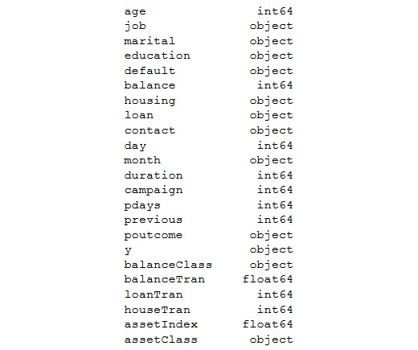

Lab 3. Binary Classification
========================


Overview

In this lab, we will be using a real-world dataset and a supervised
learning technique called classification to generate business outcomes.

By the end of this lab, you will be able to formulate a data science
problem statement from a business perspective; build hypotheses from
various business drivers influencing a use case and verify the
hypotheses using exploratory data analysis; derive features based on
intuitions that are derived from exploratory analysis through feature
engineering; build binary classification models using a logistic
regression function and analyze classification metrics and formulate
action plans for the improvement of the model.


Understanding the Business Context
==================================


The marketing head of the bank where you are a data scientist approaches
you with a problem they would like to be addressed. The marketing team
recently completed a marketing campaign where they have collated a lot
of information on existing customers. They require your help to identify
which of these customers are likely to buy a term deposit plan. Based on
your assessment of the customer base, the marketing team will chalk out
strategies for target marketing. The marketing team has provided access
to historical data of past campaigns and their outcomes---that is,
whether the targeted customers really bought the term deposits or not.
Equipped with the historical data, you have set out on the task to
identify the customers with the highest propensity (an inclination) to
buy term deposits.


Exercise 3.01: Loading and Exploring the Data from the Dataset
--------------------------------------------------------------

In this exercise, we will load the dataset in our Jupyter notebook and do
some basic explorations such as printing the dimensions of the dataset
using the `.shape()` function and generating summary
statistics of the dataset using the `.describe()` function.


The following steps will help you to complete this exercise:

1.  Open a new Jupyter notebook.

2.  Now, `import` `pandas` as `pd` in your
    Jupyter notebook:
    ```
    import pandas as pd
    ```


3.  Assign the link to the dataset to a variable called
    `file_url`
    ```
    file_url = 'https://raw.githubusercontent.com/fenago'\
               '/data-science/master/Lab03'\
               '/bank-full.csv'
    ```


4.  Now, read the file using the `pd.read_csv()` function from
    the pandas DataFrame:

    ```
    # Loading the data using pandas
    bankData = pd.read_csv(file_url, sep=";")
    bankData.head()
    ```


    Note

    The `#` symbol in the code snippet above denotes a code
    comment. Comments are added into code to help explain specific bits
    of logic.

    The `pd.read_csv()` function\'s arguments are the filename
    as a string and the limit separator of a CSV, which is
    `";"`. After reading the file, the DataFrame is printed
    using the `.head()` function. Note that the `#`
    symbol in the code above denotes a comment. Comments are added into
    code to help explain specific bits of logic.

    You should get the following output:

    


    Caption: Loading data into a Jupyter notebook

    Here, we loaded the `CSV` file and then stored it as a
    pandas DataFrame for further analysis.

5.  Next, print the shape of the dataset, as mentioned in the following
    code snippet:

    ```
    # Printing the shape of the data 
    print(bankData.shape)
    ```


    The `.shape` function is used to find the overall shape of
    the dataset.

    You should get the following output:

    ```
    (45211, 17)
    ```


6.  Now, find the summary of the numerical raw data as a table output
    using the `.describe()` function in pandas, as mentioned
    in the following code snippet:

    ```
    # Summarizing the statistics of the numerical raw data
    bankData.describe()
    ```


    You should get the following output:

    


Visualization for Exploratory Data Analysis
-------------------------------------------

In this section, we will
introduce some of the visualization techniques that will be used for
EDA:

- **Line graphs**:  Here is what a line graph looks like:

    


Caption: Example of a line graph

- **Histograms**: Here is what a histogram looks like:

    


Caption: Example of a histogram

- **Density plots**: Like histograms, density plots are also used for
    visualizing the distribution of data. However, density plots give a
    smoother representation of the distribution. We will be looking at
    this later in this lab.

    Here is what a density plot looks like:

    


- **Stacked bar charts**: Let\'s create some dummy data and generate a stacked bar chart to
    check the proportion of jobs in different sectors.

    Note

    Do not execute any of the following code snippets until the final
    step. Enter all the code in the same cell.

    Import the library files required for the task:

    ```
    # Importing library files
    import matplotlib.pyplot as plt
    import numpy as np
    ```


    Next, create some sample data detailing a list of jobs:

    ```
    # Create a simple list of categories
    jobList = ['admin','scientist','doctor','management']
    ```


    Each job will have two categories to be plotted, `yes` and
    `No`, with some proportion between `yes` and
    `No`. These are detailed as follows:

    ```
    # Getting two categories ( 'yes','No') for each of jobs
    jobYes = [20,60,70,40]
    jobNo = [80,40,30,60]
    ```


    In the next steps, the length of the job list is taken for plotting
    `xlabels` and then they are arranged using the
    `np.arange()` function:

    ```
    # Get the length of x axis labels and arranging its indexes
    xlabels = len(jobList)
    ind = np.arange(xlabels)
    ```


    Next, let\'s define the width of each bar and do the plotting. In
    the plot, `p2`, we define that when stacking,
    `yes` will be at the bottom and `No` at top:

    ```
    # Get width of each bar
    width = 0.35
    # Getting the plots
    p1 = plt.bar(ind, jobYes, width)
    p2 = plt.bar(ind, jobNo, width, bottom=jobYes)
    ```


    Define the labels for the *Y* axis and the title of the plot:

    ```
    # Getting the labels for the plots
    plt.ylabel('Proportion of Jobs')
    plt.title('Job')
    ```


    The indexes for the *X* and *Y* axes are defined next. For the *X*
    axis, the list of jobs are given, and, for the *Y* axis, the indices
    are in proportion from `0` to `100` with an
    increment of `10` (0, 10, 20, 30, and so on):

    ```
    # Defining the x label indexes and y label indexes
    plt.xticks(ind, jobList)
    plt.yticks(np.arange(0, 100, 10))
    ```


    The last step is to define the legends and to rotate the axis labels
    to `90` degrees. The plot is finally displayed:

    ```
    # Defining the legends
    plt.legend((p1[0], p2[0]), ('Yes', 'No'))
    # To rotate the axis labels 
    plt.xticks(rotation=90)
    plt.show()
    ```


Here is what a stacked bar chart looks like based on the preceding
example:


Caption: Example of a stacked bar plot

Let\'s use these graphs in the following exercises and activities.


Exercise 3.02: Business Hypothesis Testing for Age versus Propensity for a Term Loan
------------------------------------------------------------------------------------

The goal of this exercise is to define a hypothesis to check the
propensity for an individual to purchase a term deposit plan against
their age. We will be using a line graph for this exercise.

The following steps will help you to complete this exercise:

1.  Begin by defining the hypothesis.

    The first step in the verification process will be to define a
    hypothesis about the relationship. A hypothesis can be based on your
    experiences, domain knowledge, some published pieces of knowledge,
    or your business intuitions.

    Let\'s first define our hypothesis on age and propensity to buy term
    deposits:

    *The propensity to buy term deposits is more with elderly customers
    compared to younger ones*. This is our hypothesis.

    Now that we have defined our hypothesis, it is time to verify its
    veracity with the data. One of the best ways to get business
    intuitions from data is by taking cross-sections of our data and
    visualizing them.

2.  Import the pandas and altair packages:
    ```
    import pandas as pd
    import altair as alt
    ```


3.  Next, you need to load the dataset, just like you loaded the dataset
    in *Exercise 3.01*, *Loading and Exploring the Data from the
    Dataset*:

    ```
    file_url = 'https://raw.githubusercontent.com/'\
               'fenago/data-science/'\
               'master/Lab03/bank-full.csv'
    bankData = pd.read_csv(file_url, sep=";")
    ```


    Note

    *Steps 2-3* will be repeated in the following exercises for this
    lab.

    We will be verifying how the purchased term deposits are distributed
    by age.

4.  Next, we will count the number of records for each age group. We
    will be using the combination of `.groupby()`,
    `.agg()`, `.reset_index()` methods
    from `pandas`.

    Note

    You will see further details of these methods in *Lab 12*,
    *Feature Engineering*.

    ```
    filter_mask = bankData['y'] == 'yes'
    bankSub1 = bankData[filter_mask]\
               .groupby('age')['y'].agg(agegrp='count')\
               .reset_index()
    ```


5.  Now, plot a line chart using altair and the
    `.Chart().mark_line().encode()` methods and we will define
    the `x` and `y` variables, as shown in the
    following code snippet:

    ```
    # Visualising the relationship using altair
    alt.Chart(bankSub1).mark_line().encode(x='age', y='agegrp')
    ```


    You should get the following output:

    


6.  Group the data per age using the `groupby()` method and
    find the total number of customers under each age group using the
    `agg()` method:

    ```
    # Getting another perspective
    ageTot = bankData.groupby('age')['y']\
             .agg(ageTot='count').reset_index()
    ageTot.head()
    ```


    The output is as follows:

    


    Caption: Customers per age group

7.  Now, group the data by both age and propensity of purchase and find
    the total counts under each category of propensity, which are
    `yes` and `no`:

    ```
    # Getting all the details in one place
    ageProp = bankData.groupby(['age','y'])['y']\
              .agg(ageCat='count').reset_index()
    ageProp.head()
    ```


    The output is as follows:

    


    Caption: Propensity by age group

8.  Merge both of these DataFrames based on the `age` variable
    using the `pd.merge()` function, and then divide each
    category of propensity within each age group by the total customers
    in the respective age group to get the proportion of customers, as
    shown in the following code snippet:

    ```
    # Merging both the data frames
    ageComb = pd.merge(ageProp, ageTot,left_on = ['age'], \
                       right_on = ['age'])
    ageComb['catProp'] = (ageComb.ageCat/ageComb.ageTot)*100
    ageComb.head()
    ```


    The output is as follows:

    


9.  Now, display the proportion where you plot both categories (yes and
    no) as separate plots. This can be achieved through a method within
    `altair` called `facet()`:

    ```
    # Visualising the relationship using altair
    alt.Chart(ageComb).mark_line()\
       .encode(x='age', y='catProp').facet(column='y')
    ```


    This function makes as many plots as there are categories within the
    variable. Here, we give the `'y'` variable, which is the
    variable name for the `yes` and `no` categories
    to the `facet()` function, and we get two different plots:
    one for `yes` and another for `no`.

    You should get the following output:

    


Caption: Visualizing normalized relationships


Activity 3.01: Business Hypothesis Testing to Find Employment Status versus Propensity for Term Deposits
--------------------------------------------------------------------------------------------------------

You are working as a data scientist for a bank. You are provided with
historical data from the management of the bank and are asked to try to
formulate a hypothesis between employment status and the propensity to
buy term deposits.

In *Exercise 3.02*, *Business Hypothesis Testing for Age versus
Propensity for a Term Loan* we worked on a problem to find the
relationship between age and the propensity to buy term deposits. In
this activity, we will use a similar route and verify the relationship
between employment status and term deposit purchase propensity.

The steps are as follows:

1.  Formulate the hypothesis between employment status and the
    propensity for term deposits. Let the hypothesis be as follows:
    *High paying employees prefer term deposits than other categories of
    employees*.

2.  Open a Jupyter notebook file similar to what was used in *Exercise
    3.02*, *Business Hypothesis Testing for Age versus Propensity for a
    Term Loan* and install and import the necessary libraries such as
    `pandas` and `altair`.

3.  From the banking DataFrame, `bankData`, find the
    distribution of employment status using the `.groupby()`,
    `.agg()` and `.reset_index()` methods.

    Group the data with respect to employment status using the
    `.groupby()` method and find the total count of
    propensities for each employment status using the `.agg()`
    method.

4.  Now, merge both DataFrames using the `pd.merge()` function
    and then find the propensity count by calculating the proportion of
    propensity for each type of employment status. When creating the new
    variable for finding the propensity proportion.

5.  Plot the data and summarize intuitions from the plot using
    `matplotlib`. Use the stacked bar chart for this activity.


Expected output: The final plot of the propensity to buy with respect to
employment status will be similar to the following plot:


Exercise 3.03: Feature Engineering -- Exploration of Individual Features
------------------------------------------------------------------------

In this exercise, we will explore the relationship between two
variables, which are whether an individual owns a house and whether an
individual has a loan, to the propensity for term deposit purchases by
these individuals.

The following steps will help you to complete this exercise:

1.  Open a new Jupyter notebook.

2.  Import the `pandas` package.
    ```
    import pandas as pd
    ```


3.  Assign the link to the dataset to a variable called
    `file_url`:
    ```
    file_url = 'https://raw.githubusercontent.com'\
               '/fenago/data-science'\
               '/master/Lab03/bank-full.csv'
    ```


4.  Read the banking dataset using the `.read_csv()` function:
    ```
    # Reading the banking data
    bankData = pd.read_csv(file_url, sep=";")
    ```


5.  Next, we will find a relationship between housing and the propensity
    for term deposits, as mentioned in the following code snippet:

    ```
    # Relationship between housing and propensity for term deposits
    bankData.groupby(['housing', 'y'])['y']\
            .agg(houseTot='count').reset_index()
    ```


    You should get the following output:

    


6.  Explore the `'loan'` variable to find its relationship
    with the propensity for a term deposit, as mentioned in the
    following code snippet:

    ```
    """
    Relationship between having a loan and propensity for term 
    deposits
    """
    bankData.groupby(['loan', 'y'])['y']\
            .agg(loanTot='count').reset_index()
    ```


    Note

    The triple-quotes ( `"""` ) shown in the code snippet
    above are used to denote the start and end points of a multi-line
    code comment. This is an alternative to using the `#`
    symbol.

    You should get the following output:

    


    Caption: Loan versus term deposit propensity

    In the case of loan portfolios, the propensity to buy term deposits
    is higher for customers without loans:
    `( 4805 / ( 4805 + 33162) = 12 % to  484/ ( 484 + 6760) =  6%)`.

    Housing and loans were categorical data and finding a relationship
    was straightforward. However, bank balance data is numerical and to
    analyze it, we need to have a different strategy. One common
    strategy is to convert the continuous numerical data into ordinal
    data and look at how the propensity varies across each category.

7.  To convert numerical values into ordinal values, we first find the
    quantile values and take them as threshold values. The quantiles are
    obtained using the following code snippet:

    ```
    #Taking the quantiles for 25%, 50% and 75% of the balance data
    import numpy as np
    np.quantile(bankData['balance'],[0.25,0.5,0.75])
    ```


    You should get the following output:

    


    Caption: Quantiles for bank balance data


8.  Now, convert the numerical values of bank balances into categorical
    values, as mentioned in the following code snippet:

    ```
    bankData['balanceClass'] = 'Quant1'
    bankData.loc[(bankData['balance'] > 72) \
                  & (bankData['balance'] < 448), \
                  'balanceClass'] = 'Quant2'
    bankData.loc[(bankData['balance'] > 448) \
                  & (bankData['balance'] < 1428), \
                  'balanceClass'] = 'Quant3'
    bankData.loc[bankData['balance'] > 1428, \
                 'balanceClass'] = 'Quant4'
    bankData.head()
    ```


    You should get the following output:

    


    Caption: New features from bank balance data


9.  Next, we need to find the propensity of term deposit purchases based
    on each quantile the customers fall into. This task is similar to
    what we did in *Exercise 3.02*, *Business Hypothesis Testing for Age
    versus Propensity for a Term Loan*:

    ```
    # Calculating the customers under each quantile 
    balanceTot = bankData.groupby(['balanceClass'])['y']\
                         .agg(balanceTot='count').reset_index()
    balanceTot
    ```


    You should get the following output:

    


    Caption: Classification based on quantiles

10. Calculate the total number of customers categorized by quantile and
    propensity classification, as mentioned in the following code
    snippet:

    ```
    """
    Calculating the total customers categorised as per quantile 
    and propensity classification
    """
    balanceProp = bankData.groupby(['balanceClass', 'y'])['y']\
                          .agg(balanceCat='count').reset_index()
    balanceProp
    ```


    You should get the following output:

    


    Caption: Total number of customers categorized by quantile and
    propensity classification

11. Now, `merge` both DataFrames:

    ```
    # Merging both the data frames
    balanceComb = pd.merge(balanceProp, balanceTot, \
                           on = ['balanceClass'])
    balanceComb['catProp'] = (balanceComb.balanceCat \
                              / balanceComb.balanceTot)*100
    balanceComb
    ```


    You should get the following output:

    


Caption: Propensity versus balance category


In the next exercise, we will use these intuitions to derive a new
feature.


Exercise 3.04: Feature Engineering -- Creating New Features from Existing Ones
------------------------------------------------------------------------------

In this exercise, we will combine the individual variables we analyzed
in *Exercise 3.03*, *Feature Engineering -- Exploration of Individual
Features* to derive a new feature called an asset index. One methodology
to create an asset index is by assigning weights based on the asset or
liability of the customer.

For instance, a higher bank balance or home ownership will have a
positive bearing on the overall asset index and, therefore, will be
assigned a higher weight. In contrast, the presence of a loan will be a
liability and, therefore, will have to have a lower weight. Let\'s give
a weight of 5 if the customer has a house and 1 in its absence.
Similarly, we can give a weight of 1 if the customer has a loan and 5 in
case of no loans:

1.  Open a new Jupyter notebook.

2.  Import the pandas and numpy package:
    ```
    import pandas as pd
    import numpy as np
    ```


3.  Assign the link to the dataset to a variable called \'file\_url\'.
    ```
    file_url = 'https://raw.githubusercontent.com'\
               '/fenago/data-science'\
               '/master/Lab03/bank-full.csv'
    ```


4.  Read the banking dataset using the `.read_csv()` function:
    ```
    # Reading the banking data
    bankData = pd.read_csv(file_url,sep=";")
    ```


5.  The first step we will follow is to normalize the numerical
    variables. This is implemented using the following code snippet:
    ```
    # Normalizing data
    from sklearn import preprocessing
    x = bankData[['balance']].values.astype(float)
    ```


6.  As the bank balance dataset contains numerical values, we need to
    first normalize the data. The purpose of normalization is to bring
    all of the variables that we are using to create the new feature
    into a common scale. One effective method we can use here for the
    normalizing function is called `MinMaxScaler()`, which
    converts all of the numerical data between a scaled range of 0 to 1.
    The `MinMaxScaler` function is available within the
    `preprocessing` method in `sklearn`:
    ```
    minmaxScaler = preprocessing.MinMaxScaler()
    ```


7.  Transform the balance data by normalizing it with
    `minmaxScaler`:

    ```
    bankData['balanceTran'] = minmaxScaler.fit_transform(x)
    ```


    In this step, we created a new feature called
    `'balanceTran'` to store the normalized bank balance
    values.

8.  Print the head of the data using the `.head()` function:

    ```
    bankData.head()
    ```


    You should get the following output:

    


    Caption: Normalizing the bank balance data

9.  After creating the normalized variable, add a small value of
    `0.001` so as to eliminate the 0 values in the variable.
    This is mentioned in the following code snippet:

    ```
    # Adding a small numerical constant to eliminate 0 values
    bankData['balanceTran'] = bankData['balanceTran'] + 0.00001
    ```


    The purpose of adding this small value is because, in the subsequent
    steps, we will be multiplying three transformed variables together
    to form a composite index. The small value is added to avoid the
    variable values becoming 0 during the multiplying operation.

10. Now, add two additional columns for introducing the transformed
    variables for loans and housing, as per the weighting approach
    discussed at the start of this exercise:

    ```
    # Let us transform values for loan data
    bankData['loanTran'] = 1
    # Giving a weight of 5 if there is no loan
    bankData.loc[bankData['loan'] == 'no', 'loanTran'] = 5
    bankData.head()
    ```


    You should get the following output:

    


11. Now, transform values for the `Housing data`, as mentioned
    here:
    ```
    # Let us transform values for Housing data
    bankData['houseTran'] = 5
    ```


12. Give a weight of `1` if the customer has a house and print
    the results, as mentioned in the following code snippet:

    ```
    bankData.loc[bankData['housing'] == 'no', 'houseTran'] = 1
    print(bankData.head())
    ```


    You should get the following output:

    


13. Now, create a new variable, which is the product of all of the
    transformed variables:

    ```
    """ 
    Let us now create the new variable which is a product of all 
    these
    """
    bankData['assetIndex'] = bankData['balanceTran'] \
                             * bankData['loanTran'] \
                             * bankData['houseTran']
    bankData.head()
    ```


    You should get the following output:

    


    Caption: Creating a composite index

14. Explore the propensity with respect to the composite index.

    We observe the relationship between the asset index and the
    propensity of term deposit purchases. We adopt a similar strategy of
    converting the numerical values of the asset index into ordinal
    values by taking the quantiles and then mapping the quantiles to the
    propensity of term deposit purchases, as mentioned in *Exercise
    3.03*, *Feature Engineering -- Exploration of Individual Features*:

    ```
    # Finding the quantile
    np.quantile(bankData['assetIndex'],[0.25,0.5,0.75])
    ```


    You should get the following output:

    


    Caption: Conversion of numerical values into ordinal values

15. Next, create quantiles from the `assetindex` data, as
    mentioned in the following code snippet:

    ```
    bankData['assetClass'] = 'Quant1'
    bankData.loc[(bankData['assetIndex'] > 0.38) \
                  & (bankData['assetIndex'] < 0.57), \
                  'assetClass'] = 'Quant2'
    bankData.loc[(bankData['assetIndex'] > 0.57) \
                  & (bankData['assetIndex'] < 1.9), \
                  'assetClass'] = 'Quant3'
    bankData.loc[bankData['assetIndex'] > 1.9, \
                 'assetClass'] = 'Quant4'
    bankData.head()
    bankData.assetClass[bankData['assetIndex'] > 1.9] = 'Quant4'
    bankData.head()
    ```


    You should get the following output:

    


    Caption: Quantiles for the asset index

16. Calculate the total of each asset class and the category-wise
    counts, as mentioned in the following code snippet:
    ```
    # Calculating total of each asset class
    assetTot = bankData.groupby('assetClass')['y']\
                       .agg(assetTot='count').reset_index()
    # Calculating the category wise counts
    assetProp = bankData.groupby(['assetClass', 'y'])['y']\
                        .agg(assetCat='count').reset_index()
    ```


17. Next, merge both DataFrames:

    ```
    # Merging both the data frames
    assetComb = pd.merge(assetProp, assetTot, on = ['assetClass'])
    assetComb['catProp'] = (assetComb.assetCat \
                            / assetComb.assetTot)*100
    assetComb
    ```


    You should get the following output:

    


Caption: Composite index relationship mapping


A Quick Peek at Data Types and a Descriptive Summary
----------------------------------------------------

Looking at the data types such as categorical or numeric and then
deriving summary statistics is a good way to take a quick peek into data
before you do some of the downstream feature engineering steps. Let\'s
take a look at an example from our dataset:

```
# Looking at Data types
print(bankData.dtypes)
# Looking at descriptive statistics
print(bankData.describe())
```

You should get the following output:




The following output is that of a descriptive summary statistic, which
displays some of the basic measures such as `mean`,
`standard deviation`, `count`, and the
`quantile values` of the respective features:


Correlation Matrix and Visualization
====================================


Let\'s look at how data correlation can be generated and then visualized
in the following exercise.


Exercise 3.05: Finding the Correlation in Data to Generate a Correlation Plot Using Bank Data
---------------------------------------------------------------------------------------------

In this exercise, we will be creating a correlation plot and analyzing
the results of the bank dataset.

The following steps will help you to complete the exercise:

1.  Open a new Jupyter notebook, install the `pandas` packages
    and load the banking data:
    ```
    import pandas as pd
    file_url = 'https://raw.githubusercontent.com'\
               '/fenago/data-science'\
               '/master/Lab03/bank-full.csv'
    bankData = pd.read_csv(file_url, sep=";")
    ```


2.  Now, `import` the `set_option` library from
    `pandas`, as mentioned here:

    ```
    from pandas import set_option
    ```


    The `set_option` function is used to define the display
    options for many operations.

3.  Next, create a variable that would store numerical variables such as
    `'age','balance','day','duration','campaign','pdays','previous', `as
    mentioned in the following code snippet. A correlation plot can be
    extracted only with numerical data. This is why the numerical data
    has to be extracted separately:
    ```
    bankNumeric = bankData[['age','balance','day','duration',\
                            'campaign','pdays','previous']]
    ```


4.  Now, use the `.corr()` function to find the correlation
    matrix for the dataset:

    ```
    set_option('display.width',150)
    set_option('precision',3)
    bankCorr = bankNumeric.corr(method = 'pearson')
    bankCorr
    ```


    You should get the following output:

    


5.  Now, plot the data:

    ```
    from matplotlib import pyplot
    corFig = pyplot.figure()
    figAxis = corFig.add_subplot(111)
    corAx = figAxis.matshow(bankCorr,vmin=-1,vmax=1)
    corFig.colorbar(corAx)
    pyplot.show()
    ```


    You should get the following output:

    


Caption: Correlation plot


Skewness of Data
----------------


Let\'s take a look at the following example. Here, we use the
`.skew()` function to find the skewness in data. For instance,
to find the skewness of data in our `bank-full.csv` dataset,
we perform the following:

```
# Skewness of numeric attributes
bankNumeric.skew()
```

Note

This code refers to the `bankNumeric` data, so you should
ensure you are working in the same notebook as the previous exercise.

You should get the following output:


Histograms
----------

Histograms are an effective way to plot the distribution of data and to
identify skewness in data, if any. The histogram outputs of two columns
of `bankData` are listed here. The histogram is plotted with
the `pyplot` package from `matplotlib` using the
`.hist()` function. The number of subplots we want to include
is controlled by the `.subplots()` function. `(1,2)`
in subplots would mean one row and two columns. The titles are set by
the `set_title()` function:

```
# Histograms
from matplotlib import pyplot as plt
fig, axs = plt.subplots(1,2)
axs[0].hist(bankNumeric['age'])
axs[0].set_title('Distribution of age')
axs[1].hist(bankNumeric['balance'])
axs[1].set_title('Distribution of Balance')
# Ensure plots do not overlap
plt.tight_layout()
```

You should get the following output:


Density Plots
-------------

Density plots help in visualizing the distribution of data. A density
plot can be created using the `kind = 'density'` parameter:

```
from matplotlib import pyplot as plt
# Density plots
bankNumeric['age'].plot(kind = 'density', subplots = False, \
                        layout = (1,1))
plt.title('Age Distribution')
plt.xlabel('Age')
plt.ylabel('Normalised age distribution')
pyplot.show()
```

You should get the following output:


Caption: Code showing the generation of a density plot


Other Feature Engineering Methods
---------------------------------


We will now look into two other similar data transformation techniques,
namely, standard scaler and normalizer. Standard scaler standardizes
data to a mean of 0 and standard deviation of 1. The mean is the average
of the data and the standard deviation is a measure of the spread of
data. By standardizing to the same mean and standard deviation,
comparison across different distributions of data is enabled.

The normalizer function normalizes the length of data. This means that
each value in a row is divided by the normalization of the row vector to
normalize the row. The normalizer function is applied on the rows while
standard scaler is applied columnwise. The normalizer and standard
scaler functions are important feature engineering steps that are
applied to the data before downstream modeling steps. Let\'s look at
both of these techniques:

```
# Standardize data (0 mean, 1 stdev)
from sklearn.preprocessing import StandardScaler
from numpy import set_printoptions
scaling = StandardScaler().fit(bankNumeric)
rescaledNum = scaling.transform(bankNumeric)
set_printoptions(precision = 3)
print(rescaledNum)
```

You should get the following output:


Caption: Output from standardizing the data

The following code uses the normalizer data transmission techniques:

```
# Normalizing Data (Length of 1)
from sklearn.preprocessing import Normalizer
normaliser = Normalizer().fit(bankNumeric)
normalisedNum = normaliser.transform(bankNumeric)
set_printoptions(precision = 3)
print(normalisedNum)
```

You should get the following output:


Exercise 3.06: A Logistic Regression Model for Predicting the Propensity of Term Deposit Purchases in a Bank
------------------------------------------------------------------------------------------------------------

In this exercise, we will build a logistic regression model, which will
be used for predicting the propensity of term deposit purchases. This
exercise will have three parts. The first part will be the preprocessing
of the data, the second part will deal with the training process, and
the last part will be spent on prediction, analysis of metrics, and
deriving strategies for further improvement of the model.

You begin with data preprocessing.

In this part, we will first load the data, convert the ordinal data into
dummy data, and then split the data into training and test sets for the
subsequent training phase:

1.  Open a Jupyter notebook, mount the drives, install necessary packages,
    and load the data, as in previous exercises:
    ```
    import pandas as pd
    import altair as alt
    file_url = 'https://raw.githubusercontent.com'\
               '/fenago/data-science'\
               '/master/Lab03/bank-full.csv'
    bankData = pd.read_csv(file_url, sep=";")
    ```


2.  Now, load the library functions and data:
    ```
    from sklearn.linear_model import LogisticRegression
    from sklearn.model_selection import train_test_split
    ```


3.  Now, find the data types:

    ```
    bankData.dtypes
    ```


    You should get the following output:

    


    Caption: Data types

4.  Convert the ordinal data into dummy data.

    The value against each variable would be either 1 or 0, depending on
    whether that category was present in the variable as an example.
    Let\'s look at the code for doing that:

    ```
    """
    Converting all the categorical variables to dummy variables
    """
    bankCat = pd.get_dummies\
              (bankData[['job','marital',\
                         'education','default','housing',\
                         'loan','contact','month','poutcome']])
    bankCat.shape
    ```


    You should get the following output:

    ```
    (45211, 44)
    ```


5.  Now, separate the numerical variables:

    ```
    bankNum = bankData[['age','balance','day','duration',\
                        'campaign','pdays','previous']]
    bankNum.shape
    ```


    You should get the following output:

    ```
    (45211, 7)
    ```


6.  Now, prepare the `X` and `Y` variables and print
    the `Y` shape. The `X` variable is the
    concatenation of the transformed categorical variable and the
    separated numerical data:

    ```
    # Preparing the X variables
    X = pd.concat([bankCat, bankNum], axis=1)
    print(X.shape)
    # Preparing the Y variable
    Y = bankData['y']
    print(Y.shape)
    X.head()
    ```


    The output shown below is truncated:

    


7.  Split the data into training and test sets:

    ```
    # Splitting the data into train and test sets
    X_train, X_test, y_train, y_test = train_test_split\
                                       (X, Y, test_size=0.3, \
                                        random_state=123)
    ```


    Now, the data is all prepared for the modeling task. Next, we begin
    with modeling.

    In this part, we will train the model using the training set we
    created in the earlier step. First, we call the
    `logistic regression `function and then fit the model with
    the training set data.

8.  Define the `LogisticRegression` function:

    ```
    bankModel = LogisticRegression()
    bankModel.fit(X_train, y_train)
    ```


    You should get the following output:

    


    Caption: Parameters of the model that fits

9.  Now, that the model is created, use it for predicting on the test
    sets and then getting the accuracy level of the predictions:

    ```
    pred = bankModel.predict(X_test)
    print('Accuracy of Logistic regression model' \
          'prediction on test set: {:.2f}'\
          .format(bankModel.score(X_test, y_test)))
    ```


    You should get the following output:

    


    Caption: Prediction with the model

10. From an initial look, an accuracy metric of 90% gives us the
    impression that the model has done a decent job of approximating the
    data generating process. Or is it otherwise? Let\'s take a closer
    look at the details of the prediction by generating the metrics for
    the model. We will use two metric-generating functions, the
    confusion matrix and classification report:

    ```
    # Confusion Matrix for the model
    from sklearn.metrics import confusion_matrix
    confusionMatrix = confusion_matrix(y_test, pred)
    print(confusionMatrix)
    ```


    You should get the following output in the following format;
    however, the values can vary as the modeling task will involve
    variability:

    


    Caption: Generation of the confusion matrix

    Note

    The end results that you get will be different from what you see
    here as it depends on the system you are using. This is because the
    modeling part is stochastic in nature and there will always be
    differences.

11. Next, let\'s generate a `classification_report`:

    ```
    from sklearn.metrics import classification_report
    print(classification_report(y_test, pred))
    ```


    You should get a similar output; however, with different values due
    to variability in the modeling process:

    


Activity 3.02: Model Iteration 2 -- Logistic Regression Model with Feature Engineered Variables
-----------------------------------------------------------------------------------------------

As the data scientist of the bank, you created a benchmark model to
predict which customers are likely to buy a term deposit. However,
management wants to improve the results you got in the benchmark model.
In *Exercise 3.04*, *Feature Engineering -- Creating New Features from
Existing Ones,* you discussed the business scenario with the marketing
and operations teams and created a new variable, `assetIndex`,
by feature engineering three raw variables. You are now fitting another
logistic regression model on the feature engineered variables and are
trying to improve the results.

In this activity, you will be feature engineering some of the variables
to verify their effects on the predictions.

The steps are as follows:

1.  Open the Jupyter notebook used for the feature engineering in
    *Exercise 3.04*, *Feature Engineering -- Creating New Features from
    Existing Ones,* and execute all of the steps from that exercise.

2.  Create dummy variables for the categorical variables using the
    `pd.get_dummies()` function. Exclude original raw
    variables such as loan and housing, which were used to create the
    new variable, `assetIndex`.

3.  Select the numerical variables including the new feature engineered
    variable, `assetIndex`, that was created.

4.  Transform some of the numerical variables by normalizing them using
    the `MinMaxScaler()` function.

5.  Concatenate the numerical variables and categorical variables using
    the `pd.concat()` function and then create `X`
    and `Y` variables.

6.  Split the dataset using the `train_test_split()` function
    and then fit a new model using the `LogisticRegression()`
    model on the new features.

7.  Analyze the results after generating the confusion matrix and
    classification report.

    You should get the following output:

    


Summary
=======


In this lab, we learned about binary classification using logistic
regression from the perspective of solving a use case. Let\'s summarize
our learnings in this lab. We were introduced to classification
problems and specifically binary classification problems. We also looked
at the classification problem from the perspective of predicting term
deposit propensity through a business discovery process. In the business
discovery process, we identified different business drivers that
influence business outcomes.