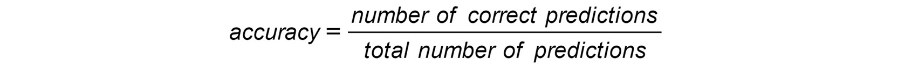
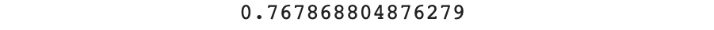

Lab 4. Multiclass Classification with RandomForest
==============================================


Overview

This lab will show you how to train a multiclass classifier using
the Random Forest algorithm. You will also see how to evaluate the
performance of multiclass models.

By the end of the lab, you will be able to implement a Random Forest
classifier, as well as tune hyperparameters in order to improve model
performance.


Training a Random Forest Classifier
===================================


Let\'s see how we can train a Random Forest classifier on this dataset.
First, we need to load the data from the GitHub repository using
`pandas` and then we will print its first five rows using the
`head()` method.


```
import pandas as pd
file_url = 'https://raw.githubusercontent.com/fenago'\
           '/data-science/master/Lab04/'\
           'Dataset/activity.csv'
df = pd.read_csv(file_url)
df.head()
```

The output will be as follows:


Caption: First five rows of the dataset

Each row represents an activity that was performed by a person and the
name of the activity is stored in the `Activity` column. There
are seven different activities in this variable: `bending1`,
`bending2`, `cycling`, `lying`,
`sitting`, `standing`, and `Walking`. The
other six columns are different measurements taken from sensor data.

In this example, you will accurately predict the target variable
(`'Activity'`) from the features (the six other columns) using
Random Forest. For example, for the first row of the preceding example,
the model will receive the following features as input and will predict
the `'bending1'` class:


Caption: Features for the first row of the dataset

But before that, we need to do a bit of data preparation. The
`sklearn` package (we will use it to train Random Forest
model) requires the target variable and the features to be separated.
So, we need to extract the response variable using the
`.pop()` method from `pandas`. The
`.pop()` method extracts the specified column and removes it
from the DataFrame:

```
target = df.pop('Activity')
```
Now the response variable is contained in the variable called
`target` and all the features are in the DataFrame called
`df`.

Now we are going to split the dataset into training and testing sets.
The model uses the training set to learn relevant parameters in
predicting the response variable. The test set is used to check whether
a model can accurately predict unseen data. We say the model is
overfitting when it has learned the patterns relevant only to the
training set and makes incorrect predictions about the testing set. In
this case, the model performance will be much higher for the training
set compared to the testing one. Ideally, we want to have a very similar
level of performance for the training and testing sets. This topic will
be covered in more depth in *Lab 7*, *The Generalization of Machine
Learning Models*.

The `sklearn` package provides a function called
`train_test_split()` to randomly split the dataset into two
different sets. We need to specify the following parameters for this
function: the feature and target variables, the ratio of the testing set
(`test_size`), and `random_state` in order to get
reproducible results if we have to run the code again:

```
from sklearn.model_selection import train_test_split
X_train, X_test, y_train, y_test = train_test_split\
                                   (df, target, test_size=0.33, \
                                    random_state=42)
```

There are four different outputs to the `train_test_split()`
function: the features for the training set, the target variable for the
training set, the features for the testing set, and its target variable.

Now that we have got our training and testing sets, we are ready for
modeling. Let\'s first import the `RandomForestClassifier`
class from `sklearn.ensemble`:

```
from sklearn.ensemble import RandomForestClassifier
```
Now we can instantiate the Random Forest classifier with some
hyperparameters. Remember from *Lab 1, Introduction to Data Science
in Python*, a hyperparameter is a type of parameter the model can\'t
learn but is set by data scientists to tune the model\'s learning
process. This topic will be covered more in depth in *Lab 8,
Hyperparameter Tuning*. For now, we will just specify the
`random_state` value. We will walk you through some of the key
hyperparameters in the following sections:

```
rf_model = RandomForestClassifier(random_state=1, \
                                  n_estimators=10)
```

The next step is to train (also called fit) the model with the training
data. During this step, the model will try to learn the relationship
between the response variable and the independent variables and save the
parameters learned. We need to specify the features and target variables
as parameters:

```
rf_model.fit(X_train, y_train)
```

The output will be as follows:


Caption: Logs of the trained RandomForest

Now that the model has completed its training, we can use the parameters
it learned to make predictions on the input data we will provide. In the
following example, we are using the features from the training set:

```
preds = rf_model.predict(X_train)
```
Now we can print these predictions:

```
preds
```

The output will be as follows:


Evaluating the Model\'s Performance
===================================


In this lab, we will use a metric called **accuracy score**. It
calculates the ratio between the number of correct predictions and the
total number of predictions made by the model:



Caption: Formula for accuracy score

For instance, if your model made 950 correct predictions out of 1,000
cases, then the accuracy score would be 950/1000 = 0.95. This would mean
that your model was 95% accurate on that dataset. The
`sklearn` package provides a function to calculate this score
automatically and it is called `accuracy_score()`. We need to
import it first:

```
from sklearn.metrics import accuracy_score
```

Then, we just need to provide the list of predictions for some
observations and the corresponding true value for the target variable.
Using the previous example, we will use the `y_train` and
`preds` variables, which respectively contain the response
variable (also known as the target) for the training set and the
corresponding predictions made by the Random Forest model. We will reuse
the predictions from the previous section -- `preds`:

```
accuracy_score(y_train, preds)
```

The output will be as follows:


Caption: Accuracy score on the training set


Remember, in the last section, we split the dataset into training and
testing sets. We used the training set to fit the model and assess its
predictive power on it. But it hasn\'t seen the observations from the
testing set at all, so we can use it to assess whether our model is
capable of generalizing unseen data. Let\'s calculate the accuracy score
for the testing set:

```
test_preds = rf_model.predict(X_test)
accuracy_score(y_test, test_preds)
```

The output will be as follows:



Caption: Accuracy score on the testing set

OK. Now the accuracy has dropped drastically to `0.77`. The
difference between the training and testing sets is quite big. This
tells us our model is actually overfitting and learned only the patterns
relevant to the training set. In an ideal case, the performance of your
model should be equal or very close to equal for those two sets.

In the next sections, we will look at tuning some Random Forest
hyperparameters in order to reduce overfitting.


Exercise 4.01: Building a Model for Classifying Animal Type and Assessing Its Performance
-----------------------------------------------------------------------------------------

In this exercise, we will train a Random Forest classifier to predict
the type of an animal based on its attributes and check its accuracy
score:


1.  Open a new Jupyter notebook.

2.  Import the `pandas` package:
    ```
    import pandas as pd
    ```


3.  Create a variable called `file_url` that contains the URL
    of the dataset:
    ```
    file_url = 'https://raw.githubusercontent.com'\
               '/fenago/data-science'\
               '/master/Lab04/Dataset'\
               '/openml_phpZNNasq.csv'
    ```


4.  Load the dataset into a DataFrame using the `.read_csv()`
    method from pandas:
    ```
    df = pd.read_csv(file_url)
    ```


5.  Print the first five rows of the DataFrame:

    ```
    df.head()
    ```


    You should get the following output:

    


    Caption: First five rows of the DataFrame

    We will be using the `type` column as our target variable.
    We will need to remove the `animal` column from the
    DataFrame and only use the remaining columns as features.

6.  Remove the `'animal'` column using the `.drop()`
    method from `pandas` and specify the
    `columns='animal'` and `inplace=True` parameters
    (to directly update the original DataFrame):
    ```
    df.drop(columns='animal', inplace=True)
    ```


7.  Extract the `'type'` column using the `.pop()`
    method from `pandas`:
    ```
    y = df.pop('type')
    ```


8.  Print the first five rows of the updated DataFrame:

    ```
    df.head()
    ```


    You should get the following output:

    


    Caption: First five rows of the DataFrame

9.  Import the `train_test_split` function from
    `sklearn.model_selection`:
    ```
    from sklearn.model_selection import train_test_split
    ```


10. Split the dataset into training and testing sets with the
    `df`, `y`, `test_size=0.4`, and
    `random_state=188` parameters:
    ```
    X_train, X_test, y_train, y_test = train_test_split\
                                       (df, y, test_size=0.4, \
                                        random_state=188)
    ```


11. Import `RandomForestClassifier` from
    `sklearn.ensemble`:
    ```
    from sklearn.ensemble import RandomForestClassifier
    ```


12. Instantiate the `RandomForestClassifier` object with
    `random_state` equal to `42`. Set the
    `n-estimators` value to an initial default value of
    `10`. We\'ll discuss later how changing this value affects
    the result.
    ```
    rf_model = RandomForestClassifier(random_state=42, \
                                      n_estimators=10)
    ```


13. Fit `RandomForestClassifier` with the training set:

    ```
    rf_model.fit(X_train, y_train)
    ```


    You should get the following output:

    


    Caption: Logs of RandomForestClassifier

14. Predict the outcome of the training set with the
    `.predict()`method, save the results in a variable called
    \'`train_preds`\', and print its value:

    ```
    train_preds = rf_model.predict(X_train)
    train_preds
    ```


    You should get the following output:

    


    Caption: Predictions on the training set

15. Import the `accuracy_score` function from
    `sklearn.metrics`:
    ```
    from sklearn.metrics import accuracy_score
    ```


16. Calculate the accuracy score on the training set, save the result in
    a variable called `train_acc`, and print its value:

    ```
    train_acc = accuracy_score(y_train, train_preds)
    print(train_acc)
    ```


    You should get the following output:

    


    Caption: Accuracy score on the training set

    Our model achieved an accuracy of `1` on the training set,
    which means it perfectly predicted the target variable on all of
    those observations. Let\'s check the performance on the testing set.

17. Predict the outcome of the testing set with the
    `.predict()` method and save the results into a variable
    called `test_preds`:
    ```
    test_preds = rf_model.predict(X_test)
    ```


18. Calculate the accuracy score on the testing set, save the result in
    a variable called `test_acc`, and print its value:

    ```
    test_acc = accuracy_score(y_test, test_preds)
    print(test_acc)
    ```


    You should get the following output:

    


Number of Trees Estimator
-------------------------

Now that we know how to fit a Random Forest classifier and assess its
performance, it is time to dig into the details. In the coming sections,
we will learn how to tune some of the most important hyperparameters for
this algorithm. As mentioned in *Lab 1, Introduction to Data Science
in Python*, hyperparameters are parameters that are not learned
automatically by machine learning algorithms. Their values have to be
set by data scientists. These hyperparameters can have a huge impact on
the performance of a model, its ability to generalize to unseen data,
and the time taken to learn patterns from the data.

The first hyperparameter you will look at in this section is called
`n_estimators`. This hyperparameter is responsible for
defining the number of trees that will be trained by the
`RandomForest` algorithm.

Before looking at how to tune this hyperparameter, we need to understand
what a tree is and why it is so important for the
`RandomForest` algorithm.

A tree is a logical graph that maps a decision and its outcomes at each
of its nodes. Simply speaking, it is a series of yes/no (or true/false)
questions that lead to different outcomes.

A leaf is a special type of node where the model will make a prediction.
There will be no split after a leaf. A single node split of a tree may
look like this:


Caption: Example of a single tree node

A tree node is composed of a question and two outcomes depending on
whether the condition defined by the question is met or not. In the
preceding example, the question is `is avg_rss12 > 41?` If the
answer is yes, the outcome is the `bending_1` leaf and if not,
it will be the `sitting` leaf.

A tree is just a series of nodes and leaves combined together:


Caption: Example of a tree

In the preceding example, the tree is composed of three nodes with
different questions. Now, for an observation to be predicted as
`sitting`, it will need to meet the conditions:
`avg_rss13 <= 41`, `var_rss > 0.7`, and
`avg_rss13 <= 16.25`.

The `RandomForest` algorithm will build this kind of tree
based on the training data it sees. We will not go through the
mathematical details about how it defines the split for each node but,
basically, it will go through every column of the dataset and see which
split value will best help to separate the data into two groups of
similar classes. Taking the preceding example, the first node with the
`avg_rss13 > 41` condition will help to get the group of data
on the left-hand side with mostly the `bending_1` class. The
`RandomForest` algorithm usually builds several of this kind
of tree and this is the reason why it is called a forest.

As you may have guessed now, the `n_estimators` hyperparameter
is used to specify the number of trees the `RandomForest`
algorithm will build. For example (as in the previous exercise), say we
ask it to build 10 trees. For a given observation, it will ask each tree
to make a prediction. Then, it will average those predictions and use
the result as the final prediction for this input. For instance, if, out
of 10 trees, 8 of them predict the outcome `sitting`, then the
`RandomForest` algorithm will use this outcome as the final
prediction.

Note

If you don\'t pass in a specific `n_estimators`
hyperparameter, it will use the default value. The default depends on
the version of scikit-learn you\'re using. In early versions, the
default value is 10. From version 0.22 onwards, the default is 100. You
can find out which version you are using by executing the following
code:

`import sklearn`

`sklearn.__version__`

For more information, see here:
<https://scikit-learn.org/stable/modules/generated/sklearn.ensemble.RandomForestClassifier.html>

In general, the higher the number of trees is, the better the
performance you will get. Let\'s see what happens with
`n_estimators = 2` on the Activity Recognition dataset:

```
rf_model2 = RandomForestClassifier(random_state=1, \
                                   n_estimators=2)
rf_model2.fit(X_train, y_train)
preds2 = rf_model2.predict(X_train)
test_preds2 = rf_model2.predict(X_test)
print(accuracy_score(y_train, preds2))
print(accuracy_score(y_test, test_preds2))
```

The output will be as follows:


Caption: Accuracy of RandomForest with n\_estimators = 2

As expected, the accuracy is significantly lower than the previous
example with `n_estimators = 10`. Let\'s now try with
`50` trees:

```
rf_model3 = RandomForestClassifier(random_state=1, \
                                   n_estimators=50)
rf_model3.fit(X_train, y_train)
preds3 = rf_model3.predict(X_train)
test_preds3 = rf_model3.predict(X_test)
print(accuracy_score(y_train, preds3))
print(accuracy_score(y_test, test_preds3))
```

The output will be as follows:


Caption: Accuracy of RandomForest with n\_estimators = 50

With `n_estimators = 50`, we respectively gained
`1%` and `2%` on the accuracy scored for the
training and testing sets, which is great. But the main drawback of
increasing the number of trees is that it requires more computational
power. So, it will take more time to train a model. In a real project,
you will need to find the right balance between performance and training
duration.


Exercise 4.02: Tuning n\_estimators to Reduce Overfitting
---------------------------------------------------------

In this exercise, we will train a Random Forest classifier to predict
the type of an animal based on its attributes and will try two different
values for the `n_estimators` hyperparameter:

We will be using the same zoo dataset as in the previous exercise.

1.  Open a new Jupyter notebook.

2.  Import the `pandas `package, `train_test_split`,
    `RandomForestClassifier`, and `accuracy_score`
    from `sklearn`:
    ```
    import pandas as pd
    from sklearn.model_selection import train_test_split
    from sklearn.ensemble import RandomForestClassifier
    from sklearn.metrics import accuracy_score
    ```


3.  Create a variable called `file_url` that contains the URL
    to the dataset:
    ```
    file_url = 'https://raw.githubusercontent.com'\
               '/fenago/data-science'\
               '/master/Lab04/Dataset'\
               '/openml_phpZNNasq.csv'
    ```


4.  Load the dataset into a DataFrame using the `.read_csv()`
    method from `pandas`:
    ```
    df = pd.read_csv(file_url)
    ```


5.  Remove the `animal` column using `.drop()` and
    then extract the `type` target variable into a new
    variable called `y` using `.pop()`:
    ```
    df.drop(columns='animal', inplace=True)
    y = df.pop('type')
    ```


6.  Split the data into training and testing sets with
    `train_test_split()` and the `test_size=0.4` and
    `random_state=188` parameters:
    ```
    X_train, X_test, y_train, y_test = train_test_split\
                                       (df, y, test_size=0.4, \
                                        random_state=188)
    ```


7.  Instantiate `RandomForestClassifier` with
    `random_state=42` and `n_estimators=1`, and then
    fit the model with the training set:

    ```
    rf_model = RandomForestClassifier(random_state=42, \
                                      n_estimators=1)
    rf_model.fit(X_train, y_train)
    ```


    You should get the following output:

    


    Caption: Logs of RandomForestClassifier

8.  Make predictions on the training and testing sets with
    `.predict()` and save the results into two new variables
    called `train_preds` and `test_preds`:
    ```
    train_preds = rf_model.predict(X_train)
    test_preds = rf_model.predict(X_test)
    ```


9.  Calculate the accuracy score for the training and testing sets and
    save the results in two new variables called `train_acc`
    and `test_acc`:
    ```
    train_acc = accuracy_score(y_train, train_preds)
    test_acc = accuracy_score(y_test, test_preds)
    ```


10. Print the accuracy scores: `train_acc` and
    `test_acc`:

    ```
    print(train_acc)
    print(test_acc)
    ```


    You should get the following output:

    


    Caption: Accuracy scores for the training and testing sets

    The accuracy score decreased for both the training and testing sets.
    But now the difference is smaller compared to the results from
    *Exercise 4.01*, *Building a Model for Classifying Animal Type and
    Assessing Its Performance*.

11. Instantiate another `RandomForestClassifier` with
    `random_state=42` and `n_estimators=30`, and
    then fit the model with the training set:

    ```
    rf_model2 = RandomForestClassifier(random_state=42, \
                                       n_estimators=30)
    rf_model2.fit(X_train, y_train)
    ```


    You should get the following output:

    


    Caption: Logs of RandomForest with n\_estimators = 30

12. Make predictions on the training and testing sets with
    `.predict()` and save the results into two new variables
    called `train_preds2` and `test_preds2`:
    ```
    train_preds2 = rf_model2.predict(X_train)
    test_preds2 = rf_model2.predict(X_test)
    ```


13. Calculate the accuracy score for the training and testing sets and
    save the results in two new variables called `train_acc2`
    and `test_acc2`:
    ```
    train_acc2 = accuracy_score(y_train, train_preds2)
    test_acc2 = accuracy_score(y_test, test_preds2)
    ```


14. Print the accuracy scores: `train_acc` and
    `test_acc`:

    ```
    print(train_acc2)
    print(test_acc2)
    ```


    You should get the following output:

    


Caption: Accuracy scores for the training and testing sets


Maximum Depth
=============


In the previous section, we learned how Random Forest builds multiple
trees to make predictions. Increasing the number of trees does improve
model performance but it usually doesn\'t help much to decrease the risk
of overfitting. Our model in the previous example is still performing
much better on the training set (data it has already seen) than on the
testing set (unseen data).

So, we are not confident enough yet to say the model will perform well
in production. There are different hyperparameters that can help to
lower the risk of overfitting for Random Forest and one of them is
called `max_depth`.

This hyperparameter defines the depth of the trees built by Random
Forest. Basically, it tells Random Forest model, how many nodes
(questions) it can create before making predictions. But how will that
help to reduce overfitting, you may ask. Well, let\'s say you built a
single tree and set the `max_depth` hyperparameter to
`50`. This would mean that there would be some cases where you
could ask 49 different questions (the value `c` includes the
final leaf node) before making a prediction. So, the logic would be
`IF X1 > value1 AND X2 > value2 AND X1 <= value3 AND … AND X3 > value49 THEN predict class A`.

As you can imagine, this is a very specific rule. In the end, it may
apply to only a few observations in the training set, with this case
appearing very infrequently. Therefore, your model would be overfitting.
By default, the value of this `max_depth` parameter is
`None`, which means there is no limit set for the depth of the
trees.

What you really want is to find some rules that are generic enough to be
applied to bigger groups of observations. This is why it is recommended
to not create deep trees with Random Forest. Let\'s try several values
for this hyperparameter on the Activity Recognition dataset:
`3`, `10`, and `50`:

```
rf_model4 = RandomForestClassifier(random_state=1, \
                                   n_estimators=50, max_depth=3)
rf_model4.fit(X_train, y_train)
preds4 = rf_model4.predict(X_train)
test_preds4 = rf_model4.predict(X_test)
print(accuracy_score(y_train, preds4))
print(accuracy_score(y_test, test_preds4))
```

You should get the following output:


Caption: Accuracy scores for the training and testing sets and a
max\_depth of 3

For a `max_depth` of `3`, we got extremely similar
results for the training and testing sets but the overall performance
decreased drastically to `0.61`. Our model is not overfitting
anymore, but it is now underfitting; that is, it is not predicting the
target variable very well (only in `61%` of cases). Let\'s
increase `max_depth` to `10`:

```
rf_model5 = RandomForestClassifier(random_state=1, \
                                   n_estimators=50, \
                                   max_depth=10)
rf_model5.fit(X_train, y_train)
preds5 = rf_model5.predict(X_train)
test_preds5 = rf_model5.predict(X_test)
print(accuracy_score(y_train, preds5))
print(accuracy_score(y_test, test_preds5))
```


Caption: Accuracy scores for the training and testing sets and a
max\_depth of 10

The accuracy of the training set increased and is relatively close to
the testing set. We are starting to get some good results, but the model
is still slightly overfitting. Now we will see the results for
`max_depth = 50`:

```
rf_model6 = RandomForestClassifier(random_state=1, \
                                   n_estimators=50, \
                                   max_depth=50)
rf_model6.fit(X_train, y_train)
preds6 = rf_model6.predict(X_train)
test_preds6 = rf_model6.predict(X_test)
print(accuracy_score(y_train, preds6))
print(accuracy_score(y_test, test_preds6))
```

The output will be as follows:


Caption: Accuracy scores for the training and testing sets and a
max\_depth of 50

The accuracy jumped to `0.99` for the training set but it
didn\'t improve much for the testing set. So, the model is overfitting
with `max_depth = 50`. It seems the sweet spot to get good
predictions and not much overfitting is around `10` for the
`max_depth` hyperparameter in this dataset.


Exercise 4.03: Tuning max\_depth to Reduce Overfitting
------------------------------------------------------

In this exercise, we will keep tuning our RandomForest classifier that
predicts animal type by trying two different values for the
`max_depth` hyperparameter:

We will be using the same zoo dataset as in the previous exercise.

1.  Open a new Jupyter notebook.

2.  Import the `pandas` package, `train_test_split`,
    `RandomForestClassifier`, and `accuracy_score`
    from `sklearn`:
    ```
    import pandas as pd
    from sklearn.model_selection import train_test_split
    from sklearn.ensemble import RandomForestClassifier
    from sklearn.metrics import accuracy_score
    ```


3.  Create a variable called `file_url` that contains the URL
    to the dataset:
    ```
    file_url = 'https://raw.githubusercontent.com'\
               'fenago/data-science'\
               '/master/Lab04/Dataset'\
               '/openml_phpZNNasq.csv'
    ```


4.  Load the dataset into a DataFrame using the `.read_csv()`
    method from `pandas`:
    ```
    df = pd.read_csv(file_url)
    ```


5.  Remove the `animal` column using `.drop()` and
    then extract the `type` target variable into a new
    variable called `y` using `.pop()`:
    ```
    df.drop(columns='animal', inplace=True)
    y = df.pop('type')
    ```


6.  Split the data into training and testing sets with
    `train_test_split()` and the parameters
    `test_size=0.4` and `random_state=188`:
    ```
    X_train, X_test, y_train, y_test = train_test_split\
                                       (df, y, test_size=0.4, \
                                        random_state=188)
    ```


7.  Instantiate `RandomForestClassifier` with
    `random_state=42`, `n_estimators=30`, and
    `max_depth=5`, and then fit the model with the training
    set:

    ```
    rf_model = RandomForestClassifier(random_state=42, \
                                      n_estimators=30, \
                                      max_depth=5)
    rf_model.fit(X_train, y_train)
    ```


    You should get the following output:

    


    Caption: Logs of RandomForest

8.  Make predictions on the training and testing sets with
    `.predict()` and save the results into two new variables
    called `train_preds` and `test_preds`:
    ```
    train_preds = rf_model.predict(X_train)
    test_preds = rf_model.predict(X_test)
    ```


9.  Calculate the accuracy score for the training and testing sets and
    save the results in two new variables called `train_acc`
    and `test_acc`:
    ```
    train_acc = accuracy_score(y_train, train_preds)
    test_acc = accuracy_score(y_test, test_preds)
    ```


10. Print the accuracy scores: `train_acc` and
    `test_acc`:

    ```
    print(train_acc)
    print(test_acc)
    ```


    You should get the following output:

    


    Caption: Accuracy scores for the training and testing sets

    We got the exact same accuracy scores as for the best result we
    obtained in the previous exercise. This value for the
    `max_depth` hyperparameter hasn\'t impacted the model\'s
    performance.

11. Instantiate another `RandomForestClassifier` with
    `random_state=42`, `n_estimators=30`, and
    `max_depth=2`, and then fit the model with the training
    set:

    ```
    rf_model2 = RandomForestClassifier(random_state=42, \
                                       n_estimators=30, \
                                       max_depth=2)
    rf_model2.fit(X_train, y_train)
    ```


    You should get the following output:

    


    Caption: Logs of RandomForestClassifier with max\_depth = 2

12. Make predictions on the training and testing sets with
    `.predict()` and save the results into two new variables
    called `train_preds2 `and `test_preds2`:
    ```
    train_preds2 = rf_model2.predict(X_train)
    test_preds2 = rf_model2.predict(X_test)
    ```


13. Calculate the accuracy scores for the training and testing sets and
    save the results in two new variables called `train_acc2`
    and `test_acc2`:
    ```
    train_acc2 = accuracy_score(y_train, train_preds2)
    test_acc2 = accuracy_score(y_test, test_preds2)
    ```


14. Print the accuracy scores: `train_acc` and
    `test_acc`:

    ```
    print(train_acc2)
    print(test_acc2)
    ```


    You should get the following output:

    


Minimum Sample in Leaf
======================


It would be great if we could let the model know to not create such
specific rules that happen quite infrequently. Luckily,
`RandomForest` has such a hyperparameter and, you guessed it,
it is `min_samples_leaf`. This hyperparameter will specify the
minimum number of observations (or samples) that will have to fall under
a leaf node to be considered in the tree. For instance, if we set
`min_samples_leaf` to `3`, then
`RandomForest` will only consider a split that leads to at
least three observations on both the left and right leaf nodes. If this
condition is not met for a split, the model will not consider it and
will exclude it from the tree. The default value in `sklearn`
for this hyperparameter is `1`. Let\'s try to find the optimal
value for `min_samples_leaf` for the Activity Recognition
dataset:

```
rf_model7 = RandomForestClassifier(random_state=1, \
                                   n_estimators=50, \
                                   max_depth=10, \
                                   min_samples_leaf=3)
rf_model7.fit(X_train, y_train)
preds7 = rf_model7.predict(X_train)
test_preds7 = rf_model7.predict(X_test)
print(accuracy_score(y_train, preds7))
print(accuracy_score(y_test, test_preds7))
```

The output will be as follows:


Caption: Accuracy scores for the training and testing sets for
min\_samples\_leaf=3

With `min_samples_leaf=3`, the accuracy for both the training
and testing sets didn\'t change much compared to the best model we found
in the previous section. Let\'s try increasing it to `10`:

```
rf_model8 = RandomForestClassifier(random_state=1, \
                                   n_estimators=50, \
                                   max_depth=10, \
                                   min_samples_leaf=10)
rf_model8.fit(X_train, y_train)
preds8 = rf_model8.predict(X_train)
test_preds8 = rf_model8.predict(X_test)
print(accuracy_score(y_train, preds8))
print(accuracy_score(y_test, test_preds8))
```

The output will be as follows:


Caption: Accuracy scores for the training and testing sets for
min\_samples\_leaf=10

Now the accuracy of the training set dropped a bit but increased for the
testing set and their difference is smaller now. So, our model is
overfitting less. Let\'s try another value for this hyperparameter --
`25`:

```
rf_model9 = RandomForestClassifier(random_state=1, \
                                   n_estimators=50, \
                                   max_depth=10, \
                                   min_samples_leaf=25)
rf_model9.fit(X_train, y_train)
preds9 = rf_model9.predict(X_train)
test_preds9 = rf_model9.predict(X_test)
print(accuracy_score(y_train, preds9))
print(accuracy_score(y_test, test_preds9))
```

The output will be as follows:


Caption: Accuracy scores for the training and testing sets for
min\_samples\_leaf=25

Both accuracies for the training and testing sets decreased but they are
quite close to each other now. So, we will keep this value
(`25`) as the optimal one for this dataset as the performance
is still OK and we are not overfitting too much.

When choosing the optimal value for this hyperparameter, you need to be
careful: a value that\'s too low will increase the chance of the model
overfitting, but on the other hand, setting a very high value will lead
to underfitting (the model will not accurately predict the right
outcome).

For instance, if you have a dataset of `1000` rows, if you set
`min_samples_leaf` to `400`, then the model will not
be able to find good splits to predict `5` different classes.
In this case, the model can only create one single split and the model
will only be able to predict two different classes instead of
`5`. It is good practice to start with low values first and
then progressively increase them until you reach satisfactory
performance.


Exercise 4.04: Tuning min\_samples\_leaf
----------------------------------------

In this exercise, we will keep tuning our Random Forest classifier that
predicts animal type by trying two different values for the
`min_samples_leaf` hyperparameter:

We will be using the same zoo dataset as in the previous exercise.

1.  Open a new Jupyter notebook.

2.  Import the `pandas` package, `train_test_split`,
    `RandomForestClassifier`, and `accuracy_score`
    from `sklearn`:
    ```
    import pandas as pd
    from sklearn.model_selection import train_test_split
    from sklearn.ensemble import RandomForestClassifier
    from sklearn.metrics import accuracy_score
    ```


3.  Create a variable called `file_url` that contains the URL
    to the dataset:
    ```
    file_url = 'https://raw.githubusercontent.com'\
               '/fenago/data-science'\
               '/master/Lab04/Dataset/openml_phpZNNasq.csv'
    ```


4.  Load the dataset into a DataFrame using the `.read_csv()`
    method from `pandas`:
    ```
    df = pd.read_csv(file_url)
    ```


5.  Remove the `animal` column using `.drop()` and
    then extract the `type` target variable into a new
    variable called `y` using `.pop()`:
    ```
    df.drop(columns='animal', inplace=True)
    y = df.pop('type')
    ```


6.  Split the data into training and testing sets with
    `train_test_split()` and the parameters
    `test_size=0.4` and `random_state=188`:
    ```
    X_train, X_test, \
    y_train, y_test = train_test_split(df, y, test_size=0.4, \
                                       random_state=188)
    ```


7.  Instantiate `RandomForestClassifier` with
    `random_state=42`, `n_estimators=30`,
    `max_depth=2`, and `min_samples_leaf=3`, and
    then fit the model with the training set:

    ```
    rf_model = RandomForestClassifier(random_state=42, \
                                      n_estimators=30, \
                                      max_depth=2, \
                                      min_samples_leaf=3)
    rf_model.fit(X_train, y_train)
    ```


    You should get the following output:

    


    Caption: Logs of RandomForest

8.  Make predictions on the training and testing sets with
    `.predict()` and save the results into two new variables
    called `train_preds` and `test_preds`:
    ```
    train_preds = rf_model.predict(X_train)
    test_preds = rf_model.predict(X_test)
    ```


9.  Calculate the accuracy score for the training and testing sets and
    save the results in two new variables called `train_acc`
    and `test_acc`:
    ```
    train_acc = accuracy_score(y_train, train_preds)
    test_acc = accuracy_score(y_test, test_preds)
    ```


10. Print the accuracy score -- `train_acc` and
    `test_acc`:

    ```
    print(train_acc)
    print(test_acc)
    ```


    You should get the following output:

    


    Caption: Accuracy scores for the training and testing sets

    The accuracy score decreased for both the training and testing sets
    compared to the best result we got in the previous exercise. Now the
    difference between the training and testing sets\' accuracy scores
    is much smaller so our model is overfitting less.

11. Instantiate another `RandomForestClassifier` with
    `random_state=42`, `n_estimators=30`,
    `max_depth=2`, and `min_samples_leaf=7`, and
    then fit the model with the training set:

    ```
    rf_model2 = RandomForestClassifier(random_state=42, \
                                       n_estimators=30, \
                                       max_depth=2, \
                                       min_samples_leaf=7)
    rf_model2.fit(X_train, y_train)
    ```


    You should get the following output:

    


    Caption: Logs of RandomForest with max\_depth=2

12. Make predictions on the training and testing sets with
    `.predict()` and save the results into two new variables
    called `train_preds2` and `test_preds2`:
    ```
    train_preds2 = rf_model2.predict(X_train)
    test_preds2 = rf_model2.predict(X_test)
    ```


13. Calculate the accuracy score for the training and testing sets and
    save the results in two new variables called `train_acc2`
    and `test_acc2`:
    ```
    train_acc2 = accuracy_score(y_train, train_preds2)
    test_acc2 = accuracy_score(y_test, test_preds2)
    ```


14. Print the accuracy scores: `train_acc` and
    `test_acc`:

    ```
    print(train_acc2)
    print(test_acc2)
    ```


    You should get the following output:

    


Maximum Features
================


Let\'s try three different values on the activity dataset. First, we
will specify the maximum number of features as two:

```
rf_model10 = RandomForestClassifier(random_state=1, \
                                    n_estimators=50, \
                                    max_depth=10, \
                                    min_samples_leaf=25, \
                                    max_features=2)
rf_model10.fit(X_train, y_train)
preds10 = rf_model10.predict(X_train)
test_preds10 = rf_model10.predict(X_test)
print(accuracy_score(y_train, preds10))
print(accuracy_score(y_test, test_preds10))
```

The output will be as follows:


Caption: Accuracy scores for the training and testing sets for
max\_features=2

We got results similar to those of the best model we trained in the
previous section. This is not really surprising as we were using the
default value of `max_features` at that time, which is
`sqrt`. The square root of `2` equals
`1.45`, which is quite close to `2`. This time,
let\'s try with the ratio `0.7`:

```
rf_model11 = RandomForestClassifier(random_state=1, \
                                    n_estimators=50, \
                                    max_depth=10, \
                                    min_samples_leaf=25, \
                                    max_features=0.7)
rf_model11.fit(X_train, y_train)
preds11 = rf_model11.predict(X_train)
test_preds11 = rf_model11.predict(X_test)
print(accuracy_score(y_train, preds11))
print(accuracy_score(y_test, test_preds11))
```

The output will be as follows:


Caption: Accuracy scores for the training and testing sets for
max\_features=0.7

With this ratio, both accuracy scores increased for the training and
testing sets and the difference between them is less. Our model is
overfitting less now and has slightly improved its predictive power.
Let\'s give it a shot with the `log2` option:

```
rf_model12 = RandomForestClassifier(random_state=1, \
                                    n_estimators=50, \
                                    max_depth=10, \
                                    min_samples_leaf=25, \
                                    max_features='log2')
rf_model12.fit(X_train, y_train)
preds12 = rf_model12.predict(X_train)
test_preds12 = rf_model12.predict(X_test)
print(accuracy_score(y_train, preds12))
print(accuracy_score(y_test, test_preds12))
```

The output will be as follows:


Caption: Accuracy scores for the training and testing sets for
max\_features=\'log2\'

We got similar results as for the default value (`sqrt`) and
`2`. Again, this is normal as the `log2` of
`6` equals `2.58`. So, the optimal value we found
for the `max_features` hyperparameter is `0.7` for
this dataset.


Exercise 4.05: Tuning max\_features
-----------------------------------

In this exercise, we will keep tuning our RandomForest classifier that
predicts animal type by trying two different values for the
`max_features` hyperparameter:

We will be using the same zoo dataset as in the previous exercise.

1.  Open a new Jupyter notebook.

2.  Import the `pandas` package, `train_test_split`,
    `RandomForestClassifier`, and `accuracy_score`
    from `sklearn`:
    ```
    import pandas as pd
    from sklearn.model_selection import train_test_split
    from sklearn.ensemble import RandomForestClassifier
    from sklearn.metrics import accuracy_score
    ```


3.  Create a variable called `file_url` that contains the URL
    to the dataset:
    ```
    file_url = 'https://raw.githubusercontent.com'\
               '/fenago/data-science'\
               '/master/Lab04/Dataset/openml_phpZNNasq.csv'
    ```


4.  Load the dataset into a DataFrame using the `.read_csv()`
    method from `pandas`:
    ```
    df = pd.read_csv(file_url)
    ```


5.  Remove the `animal` column using `.drop()` and
    then extract the `type` target variable into a new
    variable called `y` using `.pop()`:
    ```
    df.drop(columns='animal', inplace=True)
    y = df.pop('type')
    ```


6.  Split the data into training and testing sets with
    `train_test_split()` and the parameters
    `test_size=0.4` and `random_state=188`:
    ```
    X_train, X_test, \
    y_train, y_test = train_test_split(df, y, test_size=0.4, \
                                       random_state=188)
    ```


7.  Instantiate `RandomForestClassifier` with
    `random_state=42`, `n_estimators=30`,
    `max_depth=2`, `min_samples_leaf=7`, and
    `max_features=10`, and then fit the model with the
    training set:

    ```
    rf_model = RandomForestClassifier(random_state=42, \
                                      n_estimators=30, \
                                      max_depth=2, \
                                      min_samples_leaf=7, \
                                      max_features=10)
    rf_model.fit(X_train, y_train)
    ```


    You should get the following output:

    


    Caption: Logs of RandomForest

8.  Make predictions on the training and testing sets with
    `.predict()` and save the results into two new variables
    called `train_preds` and `test_preds`:
    ```
    train_preds = rf_model.predict(X_train)
    test_preds = rf_model.predict(X_test)
    ```


9.  Calculate the accuracy scores for the training and testing sets and
    save the results in two new variables called `train_acc`
    and `test_acc`:
    ```
    train_acc = accuracy_score(y_train, train_preds)
    test_acc = accuracy_score(y_test, test_preds)
    ```


10. Print the accuracy scores: `train_acc` and
    `test_acc`:

    ```
    print(train_acc)
    print(test_acc)
    ```


    You should get the following output:

    


    Caption: Accuracy scores for the training and testing sets

11. Instantiate another `RandomForestClassifier` with
    `random_state=42`, `n_estimators=30`,
    `max_depth=2`, `min_samples_leaf=7`, and
    `max_features=0.2`, and then fit the model with the
    training set:

    ```
    rf_model2 = RandomForestClassifier(random_state=42, \
                                       n_estimators=30, \
                                       max_depth=2, \
                                       min_samples_leaf=7, \
                                       max_features=0.2)
    rf_model2.fit(X_train, y_train)
    ```


    You should get the following output:

    


    Caption: Logs of RandomForest with max\_features = 0.2

12. Make predictions on the training and testing sets with
    `.predict()` and save the results into two new variables
    called `train_preds2` and `test_preds2`:
    ```
    train_preds2 = rf_model2.predict(X_train)
    test_preds2 = rf_model2.predict(X_test)
    ```


13. Calculate the accuracy score for the training and testing sets and
    save the results in two new variables called `train_acc2`
    and `test_acc2`:
    ```
    train_acc2 = accuracy_score(y_train, train_preds2)
    test_acc2 = accuracy_score(y_test, test_preds2)
    ```


14. Print the accuracy scores: `train_acc` and
    `test_acc`:

    ```
    print(train_acc2)
    print(test_acc2)
    ```


    You should get the following output:

    


Activity 4.01: Train a Random Forest Classifier on the ISOLET Dataset
---------------------------------------------------------------------

You are working for a technology company and they are planning to launch
a new voice assistant product. You have been tasked with building a
classification model that will recognize the letters spelled out by a
user based on the signal frequencies captured. Each sound can be
captured and represented as a signal composed of multiple frequencies.


The following steps will help you to complete this activity:

1.  Download and load the dataset using `.read_csv()` from
    `pandas`.
2.  Extract the response variable using `.pop()` from
    `pandas`.
3.  Split the dataset into training and test sets using
    `train_test_split()` from
    `sklearn.model_selection`.
4.  Create a function that will instantiate and fit a
    `RandomForestClassifier` using `.fit()` from
    `sklearn.ensemble`.
5.  Create a function that will predict the outcome for the training and
    testing sets using `.predict()`.
6.  Create a function that will print the accuracy score for the
    training and testing sets using `accuracy_score()` from
    `sklearn.metrics`.
7.  Train and get the accuracy score for a range of different
    hyperparameters. Here are some options you can try:
    - `n_estimators = 20` and `50`
    - `max_depth = 5` and `10`
    - `min_samples_leaf = 10` and `50`
    - `max_features = 0.5` and `0.3`
8.  Select the best hyperparameter value.

These are the accuracy scores for the best model we trained:


Summary
=======


We have finally reached the end of this lab on multiclass
classification with Random Forest. We learned that multiclass
classification is an extension of binary classification: instead of
predicting only two classes, target variables can have many more values.
We saw how we can train a Random Forest model in just a few lines of
code and assess its performance by calculating the accuracy score for
the training and testing sets. Finally, we learned how to tune some of
its most important hyperparameters: `n_estimators`,
`max_depth`, `min_samples_leaf`, and
`max_features`. We also saw how their values can have a
significant impact on the predictive power of a model but also on its
ability to generalize to unseen data.
