5. Performing Your First Cluster Analysis
=========================================


Overview

This lab will introduce you to unsupervised learning tasks, where
algorithms have to automatically learn patterns from data by themselves
as no target variables are defined beforehand. We will focus
specifically on the k-means algorithm, and see how to standardize and
process data for use in cluster analysis.


Exercise 5.01: Performing Your First Clustering Analysis on the ATO Dataset
---------------------------------------------------------------------------

In this exercise, we will be using k-means clustering on the ATO dataset
and observing the different clusters that the dataset divides itself
into, after which we will conclude by analyzing the output:

1.  Open a new Jupyter notebook.

2.  Next, load the required Python packages: `pandas` and
    `KMeans` from `sklearn.cluster`.

    We will be using the `import` function from Python:

    Note

    You can create short aliases for the packages you will be calling
    quite often in your script with the function mentioned in the
    following code snippet.

    ```
    import pandas as pd
    from sklearn.cluster import KMeans
    ```


    Note

    We will be looking into `KMeans` (from
    `sklearn.cluster`), which you have used in the code here,
    later in the lab for a more detailed explanation of it.

3.  Next, create a variable containing the link to the file. We will
    call this variable `file_url`:

    ```
    file_url = 'https://raw.githubusercontent.com'\
               '/fenago/data-science'\
               '/master/Lab05/DataSet/taxstats2015.csv'
    ```


    In the next step, we will use the `pandas` package to load
    our data into a DataFrame (think of it as a table, like on an Excel
    spreadsheet, with a row index and column names).

    Our input file is in `CSV` format, and `pandas`
    has a method that can directly read this format, which is
    `.read_csv()`.

4.  Use the `usecols` parameter to subset only the columns we
    need rather than loading the entire dataset. We just need to provide
    a list of the column names we are interested in, which are mentioned
    in the following code snippet:

    ```
    df = pd.read_csv(file_url, \
                     usecols=['Postcode', \
                              'Average net tax', \
                              'Average total deductions'])
    ```


    Now we have loaded the data into a `pandas` DataFrame.

5.  Next, let\'s display the first 5 rows of this DataFrame , using the
    method `.head()`:

    ```
    df.head()
    ```


    You should get the following output:

    
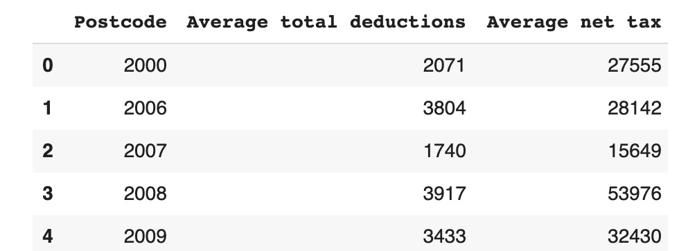


    Caption: The first five rows of the ATO DataFrame

6.  Now, to output the last 5 rows, we use `.tail()`:

    ```
    df.tail()
    ```


    You should get the following output:

    
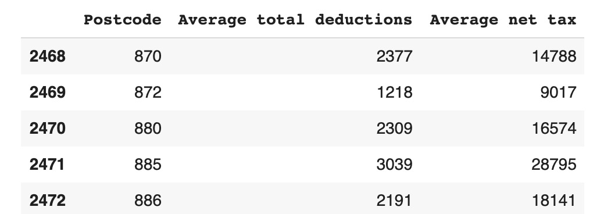


7.  Instantiate k-means with a random state of `42` and save
    it into a variable called `kmeans`:
    ```
    kmeans = KMeans(random_state=42)
    ```


8.  Now feed k-means with our training data. To do so, we need to get
    only the variables (or columns) used for fitting the model. In our
    case, the variables are `'Average net tax'` and
    `'Average total deductions'`, and they are saved in a new
    variable called `X`:
    ```
    X = df[['Average net tax', 'Average total deductions']]
    ```


9.  Now fit `kmeans` with this training data:

    ```
    kmeans.fit(X)
    ```


    You should get the following output:

    
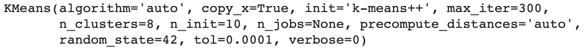


10. See which cluster each data point belongs to by using the
    `.predict()` method:

    ```
    y_preds = kmeans.predict(X)
    y_preds
    ```


    You should get the following output:

    


    `import sklearn`

    `sklearn.__version__`

11. Now, add these predictions into the original DataFrame and take a
    look at the first five postcodes:

    ```
    df['cluster'] = y_preds
    df.head()
    ```


    Note

    The predictions from the sklearn `predict()` method are in
    the exact same order as the input data. So, the first prediction
    will correspond to the first row of your DataFrame.

    You should get the following output:

    
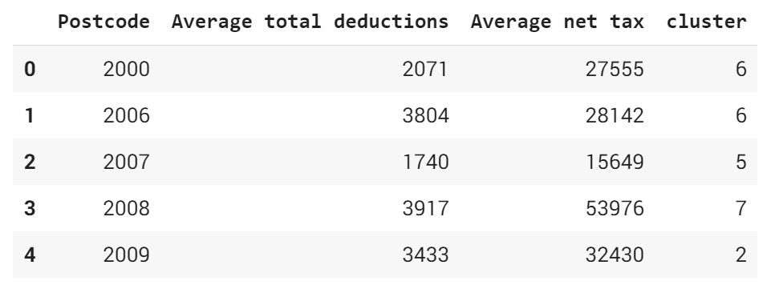


Caption: Cluster number assigned to the first five postcodes


Interpreting k-means Results
============================

To create a pivot table similar to an Excel one, we will be using the
`pivot_table()` method from `pandas`. Run the code below in the same notebook as you used for the previous exercise.

```
import numpy as np
df.pivot_table(values=['Average net tax', \
                       'Average total deductions'], \
               index='cluster', aggfunc=np.mean)
```

Note

We will be using the `numpy` implementation of
`mean()` as it is more optimized for pandas DataFrames.

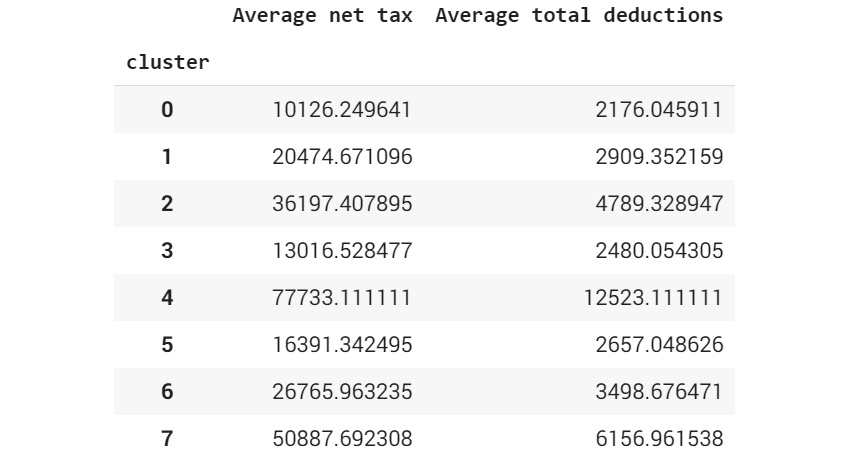

Caption: Output of the pivot\_table function


You may have heard of different visualization packages, such as
`matplotlib`, `seaborn`, and `bokeh`, but
in this lab, we will be using the `altair` package because
it is quite simple to use (its API is very similar to
`sklearn`). Let\'s import it first:

```
import altair as alt
```

Then, we will instantiate a `Chart()` object with our
DataFrame and save it into a variable called `chart`:

```
chart = alt.Chart(df)
```
Now we will specify the type of graph we want, a scatter plot, with the
`.mark_circle()` method and will save it into a new variable
called `scatter_plot`:

```
scatter_plot = chart.mark_circle()
```
Finally, we need to configure our scatter plot by specifying the names
of the columns that will be our `x`- and `y`-axes on
the graph. We also tell the scatter plot to color each point according
to its cluster value with the `color` option:

```
scatter_plot.encode(x='Average net tax', \
                    y='Average total deductions', \
                    color='cluster:N')
```

Note

You may have noticed that we added `:N` at the end of the
`cluster` column name. This extra parameter is used in
`altair` to specify the type of value for this column.
`:N` means the information contained in this column is
categorical. `altair` automatically defines the color scheme
to be used depending on the type of a column.

You should get the following output:

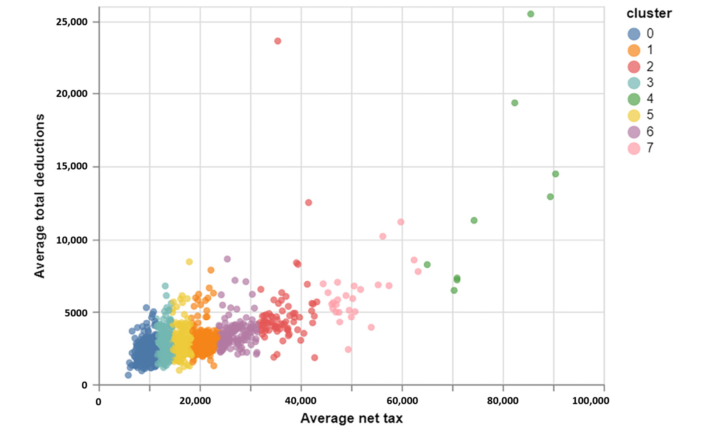

Caption: Scatter plot of the clusters


Let\'s say we want to add a tooltip that will display the values for the
two columns of interest: the postcode and the assigned cluster. With
`altair`, we just need to add a parameter called
`tooltip` in the `encode()` method with a list of
corresponding column names and call the `interactive()` method
just after, as seen in the following code snippet:

```
scatter_plot.encode(x='Average net tax', \
                    y='Average total deductions', \
                    color='cluster:N', \
                    tooltip=['Postcode', \
                             'cluster', 'Average net tax', \
                             'Average total deductions'])\
                    .interactive()
```

You should get the following output:

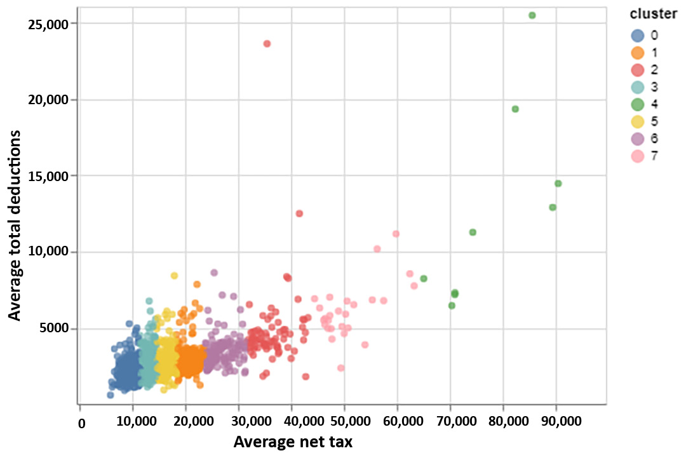

Caption: Interactive scatter plot of the clusters with tooltip

Now we can easily hover over and inspect the data points near the
cluster boundaries and find out that the threshold used to differentiate
the purple cluster (6) from the red one (2) is close to 32,000 in
`'Average Net Tax'`.


Exercise 5.02: Clustering Australian Postcodes by Business Income and Expenses
------------------------------------------------------------------------------

In this exercise, we will learn how to perform clustering analysis with
k-means and visualize its results based on postcode values sorted by
business income and expenses. The following steps will help you complete
this exercise:

1.  Open a new Jupyter notebook for this exercise.

2.  Now `import` the required packages (`pandas`,
    `sklearn`, `altair`, and `numpy`):
    ```
    import pandas as pd
    from sklearn.cluster import KMeans
    import altair as alt
    import numpy as np
    ```


3.  Assign the link to the ATO dataset to a variable called
    `file_url`:
    ```
    file_url = 'https://raw.githubusercontent.com'\
               '/fenago/data-science'\
               '/master/Lab05/DataSet/taxstats2015.csv'
    ```


4.  Using the `read_csv` method from the pandas package, load
    the dataset with only the following columns with the
    `use_cols` parameter: `'Postcode'`,
    `'Average total business income'`, and
    `'Average total business expenses'`:
    ```
    df = pd.read_csv(file_url, \
                     usecols=['Postcode', \
                              'Average total business income', \
                              'Average total business expenses'])
    ```


5.  Display the last 10 rows from the ATO dataset using the
    `.tail()` method from pandas:

    ```
    df.tail(10)
    ```


    You should get the following output:

    
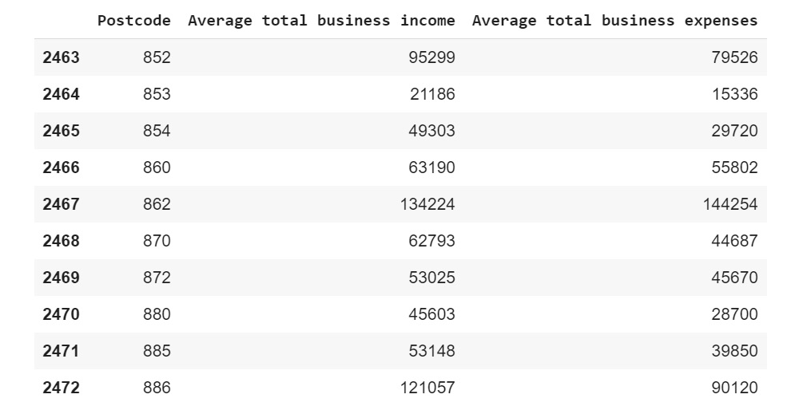


    Caption: The last 10 rows of the ATO dataset

6.  Extract the `'Average total business income'` and
    `'Average total business expenses'` columns using the
    following pandas column subsetting syntax:
    `dataframe_name[<list_of_columns>]`. Then, save them into
    a new variable called `X`:
    ```
    X = df[['Average total business income', \
            'Average total business expenses']]
    ```


7.  Now fit `kmeans` with this new variable using a value of
    `8` for the `random_state` hyperparameter:

    ```
    kmeans = KMeans(random_state=8)
    kmeans.fit(X)
    ```


    You should get the following output:

    
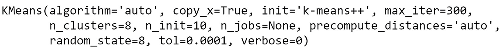


    Caption: Summary of the fitted kmeans and its hyperparameters

8.  Using the `predict` method from the `sklearn`
    package, predict the clustering assignment from the input variable,
    `(X)`, save the results into a new variable called
    `y_preds`, and display the last `10`
    predictions:

    ```
    y_preds = kmeans.predict(X)
    y_preds[-10:]
    ```


    You should get the following output:

    


9.  Save the predicted clusters back to the DataFrame by creating a new
    column called `'cluster'` and print the last
    `10` rows of the DataFrame using the `.tail()`
    method from the `pandas` package:

    ```
    df['cluster'] = y_preds
    df.tail(10)
    ```


    You should get the following output:

    
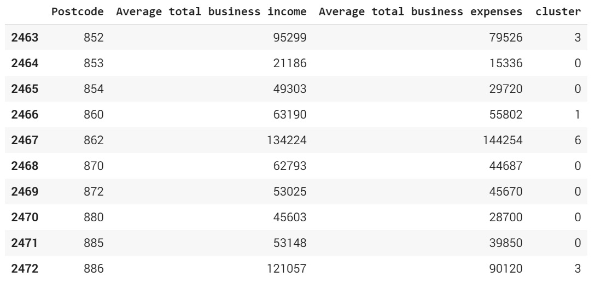


10. Generate a pivot table with the averages of the two columns for each
    cluster value using the `pivot_table` method from the
    `pandas` package with the following parameters:

    Provide the names of the columns to be aggregated,
    `'Average total business income'`
    and` 'Average total business expenses'`, to the parameter
    values.

    Provide the name of the column to be grouped, `'cluster'`,
    to the parameter index.

    Use the `.mean` method from NumPy (`np`) as the
    aggregation function for the `aggfunc` parameter:

    ```
    df.pivot_table(values=['Average total business income', \
                           'Average total business expenses'], \
                   index='cluster', aggfunc=np.mean)
    ```


    You should get the following output:

    
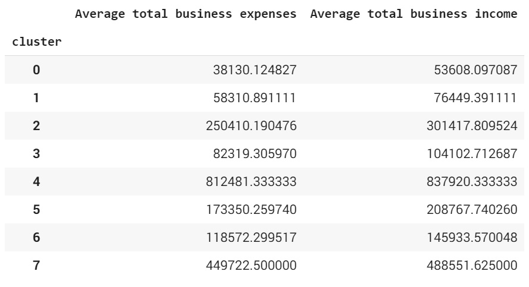


    Caption: Output of the pivot\_table function

11. Now let\'s plot the clusters using an interactive scatter plot.
    First, use `Chart()` and `mark_circle()` from
    the `altair` package to instantiate a scatter plot graph:
    ```
    scatter_plot = alt.Chart(df).mark_circle()
    ```


12. Use the `encode` and `interactive` methods from
    `altair` to specify the display of the scatter plot and
    its interactivity options with the following parameters:

    Provide the name of the `'Average total business income'`
    column to the `x` parameter (the x-axis).

    Provide the name of the
    `'Average total business expenses'` column to the
    `y` parameter (the y-axis).

    Provide the name of the `cluster:N` column to the
    `color` parameter (providing a different color for each
    group).

    Provide these column names -- `'Postcode'`,
    `'cluster'`, `'Average total business income'`,
    and `'Average total business expenses'` -- to the
    `'tooltip'` parameter (this being the information
    displayed by the tooltip):

    ```
    scatter_plot.encode(x='Average total business income', \
                        y='Average total business expenses', \
                        color='cluster:N', tooltip = ['Postcode', \
                                                      'cluster', \
                        'Average total business income', \
                        'Average total business expenses'])\
                        .interactive()
    ```


    You should get the following output:

    
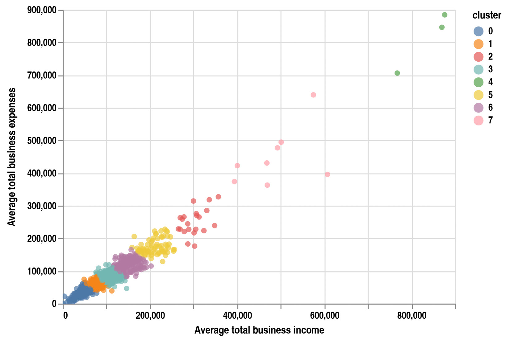


Caption: Interactive scatter plot of the clusters


Choosing the Number of Clusters
===============================


Note

Open the notebook you were using for *Exercise 5.01*, *Performing Your
First Clustering Analysis on the ATO Dataset*, execute the code you
already entered, and then continue at the end of the notebook with the
following code.

```
clusters = pd.DataFrame()
clusters['cluster_range'] = range(1, 10)
inertia = []
```
Next, we will create a `for` loop that will iterate over the
range, fit a k-means model with the specified number of
`clusters`, extract the `inertia` value, and store
it in our list, as in the following code snippet:

```
for k in clusters['cluster_range']:
    kmeans = KMeans(n_clusters=k, random_state=8).fit(X)
    inertia.append(kmeans.inertia_)
```
Now we can use our list of `inertia` values in the
`clusters` DataFrame:

```
clusters['inertia'] = inertia
clusters
```

You should get the following output:

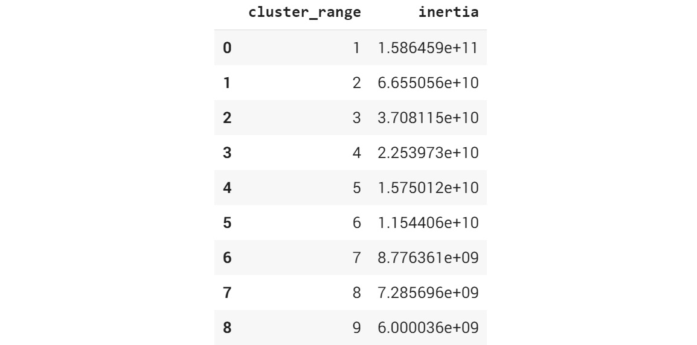

Caption: Dataframe containing inertia values for our clusters

Then, we need to plot a line chart using `altair` with the
`mark_line()` method. We will specify the
`'cluster_range'` column as our x-axis and
`'inertia'` as our y-axis, as in the following code snippet:

```
alt.Chart(clusters).mark_line()\
                   .encode(x='cluster_range', y='inertia')
```

You should get the following output:

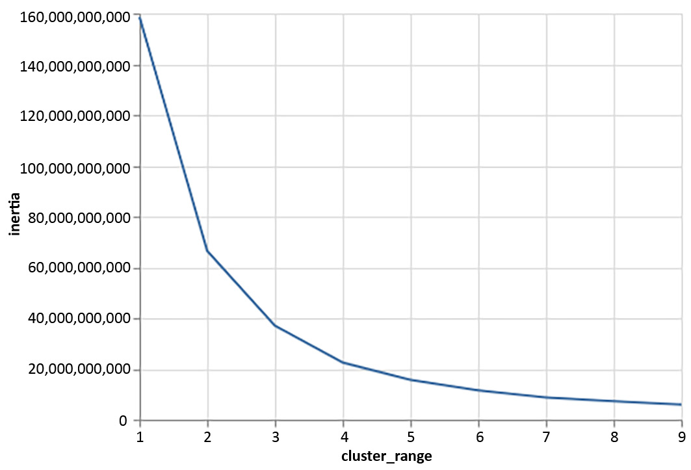

Caption: Plotting the Elbow method

Note

You don\'t have to save each of the `altair` objects in a
separate variable; you can just append the methods one after the other
with \"`.".`


Now let\'s retrain our `Kmeans` with this hyperparameter and
plot the clusters as shown in the following code snippet:

```
kmeans = KMeans(random_state=42, n_clusters=3)
kmeans.fit(X)
df['cluster2'] = kmeans.predict(X)
scatter_plot.encode(x='Average net tax', \
                    y='Average total deductions', \
                    color='cluster2:N', \
                    tooltip=['Postcode', 'cluster', \
                             'Average net tax', \
                             'Average total deductions'])\
                    .interactive()
```

You should get the following output:

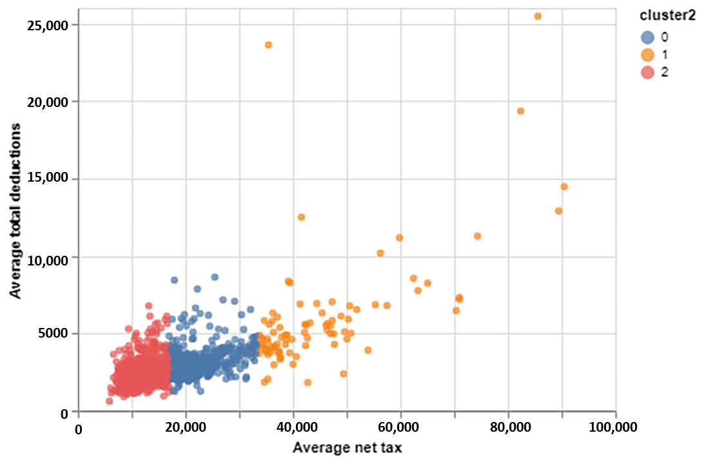


Exercise 5.03: Finding the Optimal Number of Clusters
-----------------------------------------------------

In this exercise, we will apply the Elbow method to the same data as in
*Exercise 5.02*, *Clustering Australian Postcodes by Business Income and
Expenses*, to find the optimal number of clusters, before fitting a
k-means model:

1.  Open a new Jupyter notebook for this exercise.

2.  Now `import` the required packages (`pandas`,
    `sklearn`, and `altair`):

    ```
    import pandas as pd
    from sklearn.cluster import KMeans
    import altair as alt
    ```


    Next, we will load the dataset and select the same columns as in
    *Exercise 5.02*, *Clustering Australian Postcodes by Business Income
    and Expenses*, and print the first five rows.

3.  Assign the link to the ATO dataset to a variable called
    `file_url`:
    ```
    file_url = 'https://raw.githubusercontent.com'\
               '/fenago/data-science'\
               '/master/Lab05/DataSet/taxstats2015.csv'
    ```


4.  Using the `.read_csv()` method from the pandas package,
    load the dataset with only the following columns using the
    `use_cols` parameter: `'Postcode'`,
    `'Average total business income'`, and
    `'Average total business expenses'`:
    ```
    df = pd.read_csv(file_url, \
                     usecols=['Postcode', \
                              'Average total business income', \
                              'Average total business expenses'])
    ```


5.  Display the first five rows of the DataFrame with the
    `.head()` method from the pandas package:

    ```
    df.head()
    ```


    You should get the following output:

    
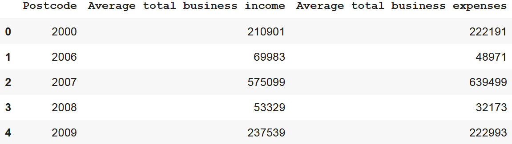


    Caption: The first five rows of the ATO DataFrame

6.  Assign the `'Average total business income'` and
    `'Average total business expenses'` columns to a new
    variable called `X`:
    ```
    X = df[['Average total business income', \
            'Average total business expenses']]
    ```


7.  Create an empty pandas DataFrame called `clusters` and an
    empty list called `inertia`:

    ```
    clusters = pd.DataFrame()
    inertia = []
    ```


    Now, use the `range` function to generate a list
    containing the range of cluster numbers, from `1` to
    `15`, and assign it to a new column called
    `'cluster_range'` from the `'clusters'`
    DataFrame:

    ```
    clusters['cluster_range'] = range(1, 15)
    ```


8.  Create a `for` loop to go through each cluster number and
    fit a k-means model accordingly, then append the `inertia`
    values using the `'inertia_'` parameter with the
    `'inertia'` list:
    ```
    for k in clusters['cluster_range']:
        kmeans = KMeans(n_clusters=k).fit(X)
        inertia.append(kmeans.inertia_)
    ```


9.  Assign the `inertia` list to a new column called
    `'inertia'` from the `clusters` DataFrame and
    display its content:

    ```
    clusters['inertia'] = inertia
    clusters
    ```


    You should get the following output:

    
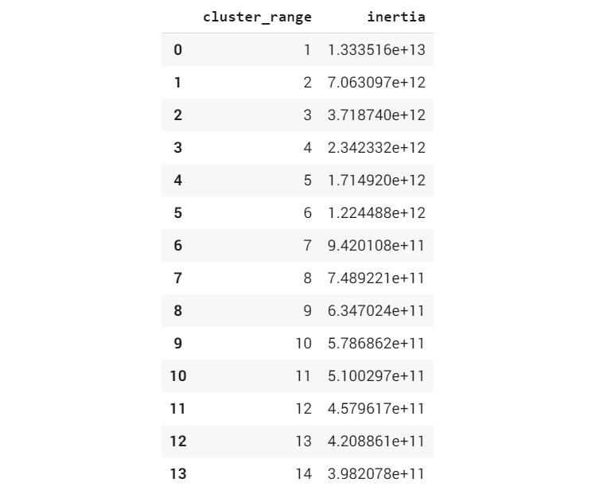


    Caption: Plotting the Elbow method

10. Now use `mark_line()` and `encode()` from the
    `altair` package to plot the Elbow graph with
    `'cluster_range'` as the x-axis and `'inertia'`
    as the y-axis:

    ```
    alt.Chart(clusters).mark_line()\
       .encode(alt.X('cluster_range'), alt.Y('inertia'))
    ```


    You should get the following output:

    
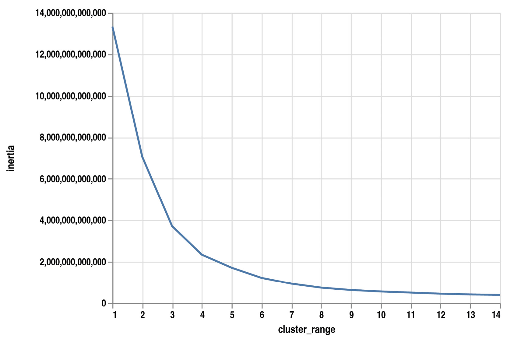


    Caption: Plotting the Elbow method

11. Looking at the Elbow plot, identify the optimal number of clusters,
    and assign this value to a variable called
    `optim_cluster`:
    ```
    optim_cluster = 4
    ```


12. Train a k-means model with this number of clusters and a
    `random_state` value of `42` using the
    `fit` method from `sklearn`:
    ```
    kmeans = KMeans(random_state=42, n_clusters=optim_cluster)
    kmeans.fit(X)
    ```


13. Now, using the `predict` method from `sklearn`,
    get the predicted assigned cluster for each data point contained in
    the `X` variable and save the results into a new column
    called `'cluster2'` from the `df` DataFrame:
    ```
    df['cluster2'] = kmeans.predict(X)
    ```


14. Display the first five rows of the `df` DataFrame using
    the `head` method from the `pandas` package:

    ```
    df.head()
    ```


    You should get the following output:

    
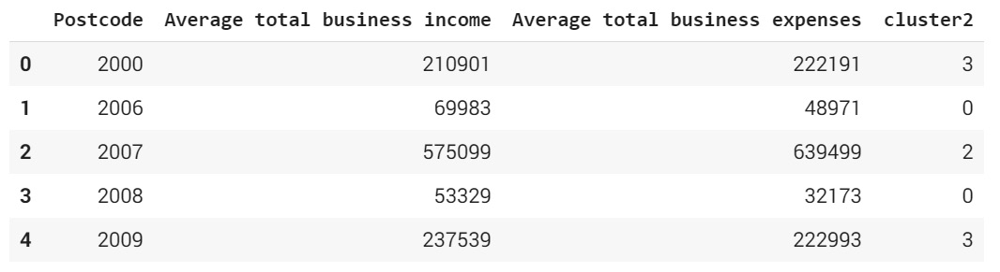


    Caption: The first five rows with the cluster predictions

15. Now plot the scatter plot using the `mark_circle()` and
    `encode()` methods from the `altair` package.
    Also, to add interactiveness, use the `tooltip` parameter
    and the `interactive()` method from the `altair`
    package as shown in the following code snippet:

    ```
    alt.Chart(df).mark_circle()\
                 .encode\
                  (x='Average total business income', \
                   y='Average total business expenses', \
                   color='cluster2:N', \
                   tooltip=['Postcode', 'cluster2', \
                            'Average total business income',\
                            'Average total business expenses'])\
                 .interactive()
    ```


    You should get the following output:

    
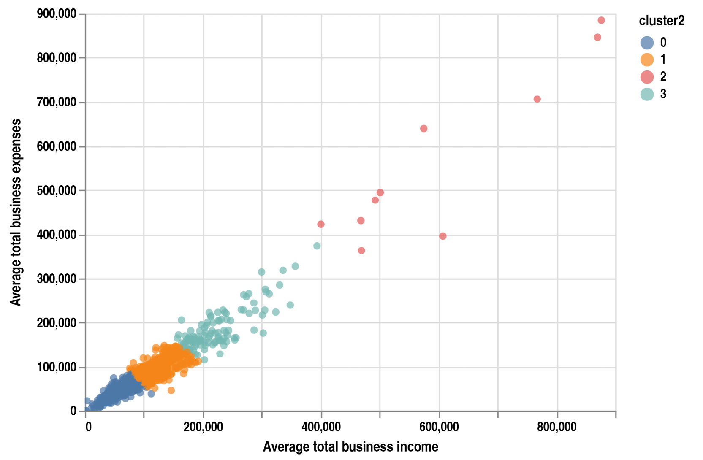


Initializing Clusters
=====================


Let\'s try this out on our ATO dataset by having a look at the following
example.

Note

Open the notebook you were using for *Exercise 5.01*, *Performing Your
First Clustering Analysis on the ATO Dataset,* and earlier examples.
Execute the code you already entered, and then continue at the end of
the notebook with the following code.

First, let\'s run only one iteration using random initialization:

```
kmeans = KMeans(random_state=14, n_clusters=3, \
                init='random', n_init=1)
kmeans.fit(X)
```
As usual, we want to visualize our clusters with a scatter plot, as
defined in the following code snippet:

```
df['cluster3'] = kmeans.predict(X)
alt.Chart(df).mark_circle()\
             .encode(x='Average net tax', \
                     y='Average total deductions', \
                     color='cluster3:N', \
                     tooltip=['Postcode', 'cluster', \
                              'Average net tax', \
                              'Average total deductions']) \
             .interactive()
```

You should get the following output:

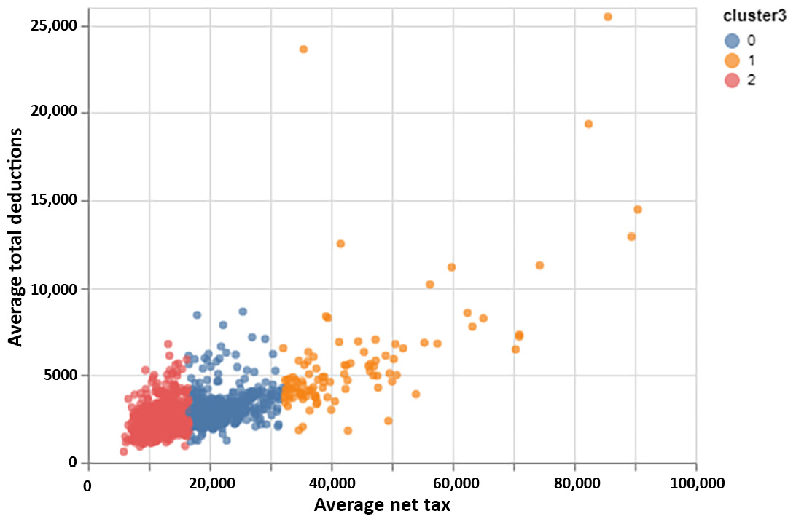

Caption: Clustering results with n\_init as 1 and init as random

Overall, the result is very close to that of our previous run. It is
worth noticing that the boundaries between the clusters are slightly
different.

Now let\'s try with five iterations (using the `n_init`
hyperparameter) and k-means++ initialization (using the `init`
hyperparameter):

```
kmeans = KMeans(random_state=14, n_clusters=3, \
                init='k-means++', n_init=5)
kmeans.fit(X)
df['cluster4'] = kmeans.predict(X)
alt.Chart(df).mark_circle()\
             .encode(x='Average net tax', \
                     y='Average total deductions', \
                     color='cluster4:N', \
                     tooltip=['Postcode', 'cluster', \
                              'Average net tax', \
                              'Average total deductions'])\
                    .interactive()
```

You should get the following output:


Caption: Clustering results with n\_init as 5 and init as k-means++

Here, the results are very close to the original run with 10 iterations.
This means that we didn\'t have to run so many iterations for k-means to
converge and could have saved some time with a lower number.


Exercise 5.04: Using Different Initialization Parameters to Achieve a Suitable Outcome
--------------------------------------------------------------------------------------

In this exercise, we will use the same data as in *Exercise 5.02*,
*Clustering Australian Postcodes by Business Income and Expenses*, and
try different values for the `init` and `n_init`
hyperparameters and see how they affect the final clustering result:

1.  Open a new Jupyter notebook.

2.  Import the required packages, which are `pandas`,
    `sklearn`, and `altair`:
    ```
    import pandas as pd
    from sklearn.cluster import KMeans
    import altair as alt
    ```


3.  Assign the link to the ATO dataset to a variable called
    `file_url`:
    ```
    file_url = 'https://raw.githubusercontent.com'\
               '/fenago/data-science'\
               '/master/Lab05/DataSet/taxstats2015.csv'
    ```


4.  Load the dataset and select the same columns as in *Exercise 5.02*,
    *Clustering Australian Postcodes by Business Income and Expenses*,
    and *Exercise 5.03*, *Finding the Optimal Number of Clusters*, using
    the `read_csv()` method from the `pandas`
    package:
    ```
    df = pd.read_csv(file_url, \
                     usecols=['Postcode', \
                              'Average total business income', \
                              'Average total business expenses'])
    ```


5.  Assign the `'Average total business income'` and
    `'Average total business expenses'` columns to a new
    variable called `X`:
    ```
    X = df[['Average total business income', \
            'Average total business expenses']]
    ```


6.  Fit a k-means model with `n_init` equal to `1`
    and a random `init`:
    ```
    kmeans = KMeans(random_state=1, n_clusters=4, \
                    init='random', n_init=1)
    kmeans.fit(X)
    ```


7.  Using the `predict` method from the `sklearn`
    package, predict the clustering assignment from the input variable,
    `(X)`, and save the results into a new column called
    `'cluster3'` in the DataFrame:
    ```
    df['cluster3'] = kmeans.predict(X)
    ```


8.  Plot the clusters using an interactive scatter plot. First, use
    `Chart()` and `mark_circle()` from the
    `altair` package to instantiate a scatter plot graph, as
    shown in the following code snippet:
    ```
    scatter_plot = alt.Chart(df).mark_circle()
    ```


9.  Use the `encode` and `interactive` methods from
    `altair` to specify the display of the scatter plot and
    its interactivity options with the following parameters:

    Provide the name of the `'Average total business income'`
    column to the `x` parameter (x-axis).

    Provide the name of the
    `'Average total business expenses'` column to the
    `y` parameter (y-axis).

    Provide the name of the `'cluster3:N'` column to the
    `color` parameter (which defines the different colors for
    each group).

    Provide these column names -- `'Postcode'`,
    `'cluster3'`, `'Average total business income'`,
    and `'Average total business expenses'` -- to the
    `tooltip` parameter:

    ```
    scatter_plot.encode(x='Average total business income', \
                        y='Average total business expenses', \
                        color='cluster3:N', \
                        tooltip=['Postcode', 'cluster3', \
                                 'Average total business income', \
                                 'Average total business expenses'])\
                       .interactive()
    ```


    You should get the following output:

    


    Caption: Clustering results with n\_init as 1 and init as random

10. Repeat *Steps 5* to *8* but with different k-means hyperparameters,
    `n_init=10` and random `init`, as shown in the
    following code snippet:

    ```
    kmeans = KMeans(random_state=1, n_clusters=4, \
                    init='random', n_init=10)
    kmeans.fit(X)
    df['cluster4'] = kmeans.predict(X)
    scatter_plot = alt.Chart(df).mark_circle()
    scatter_plot.encode(x='Average total business income', \
                        y='Average total business expenses', \
                        color='cluster4:N',
                        tooltip=['Postcode', 'cluster4', \
                                 'Average total business income', \
                                 'Average total business expenses'])\
                       .interactive()
    ```


    You should get the following output:

    


    Caption: Clustering results with n\_init as 10 and init as
    random

11. Again, repeat *Steps 5* to *8* but with different k-means
    hyperparameters -- `n_init=100` and random
    `init`:

    ```
    kmeans = KMeans(random_state=1, n_clusters=4, \
                    init='random', n_init=100)
    kmeans.fit(X)
    df['cluster5'] = kmeans.predict(X)
    scatter_plot = alt.Chart(df).mark_circle()
    scatter_plot.encode(x='Average total business income', \
                        y='Average total business expenses', \
                        color='cluster5:N', \
                        tooltip=['Postcode', 'cluster5', \
                        'Average total business income', \
                        'Average total business expenses'])\
                .interactive()
    ```


    You should get the following output:

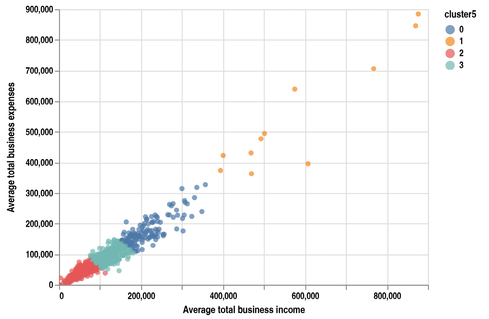

Caption: Clustering results with n\_init as 10 and init as random


Calculating the Distance to the Centroid
========================================


Note

Open the notebook you were using for *Exercise 5.01*, *Performing Your
First Clustering Analysis on the ATO Dataset*, and earlier examples.
Execute the code you already entered, and then continue at the end of
the notebook with the following code.

```
x = X.iloc[0,].values
y = X.iloc[1,].values
print(x)
print(y)
```

You should get the following output:


The coordinates for `x` are `(27555, 2071)` and the
coordinates for `y` are `(28142, 3804)`. Here, the
formula is telling us to calculate the squared difference between each
axis of the two data points and sum them:

```
squared_euclidean = (x[0] - y[0])**2 + (x[1] - y[1])**2
print(squared_euclidean)
```

You should get the following output:

```
3347858
```


Let\'s see how we can plot the centroids in an example.

First, we fit a k-means model as shown in the following code snippet:

```
kmeans = KMeans(random_state=42, n_clusters=3, \
                init='k-means++', n_init=5)
kmeans.fit(X)
df['cluster6'] = kmeans.predict(X)
```
Now extract the `centroids` into a DataFrame and print them:

```
centroids = kmeans.cluster_centers_
centroids = pd.DataFrame(centroids, \
                         columns=['Average net tax', \
                                  'Average total deductions'])
print(centroids)
```

You should get the following output:

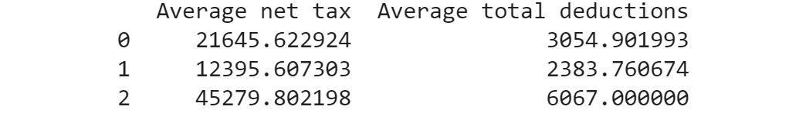

Caption: Coordinates of the three centroids

We will plot the usual scatter plot but will assign it to a variable
called `chart1`:

```
chart1 = alt.Chart(df).mark_circle()\
            .encode(x='Average net tax', \
                    y='Average total deductions', \
                    color='cluster6:N', \
                    tooltip=['Postcode', 'cluster6', \
                             'Average net tax', \
                             'Average total deductions'])\
                   .interactive()
chart1
```

You should get the following output:

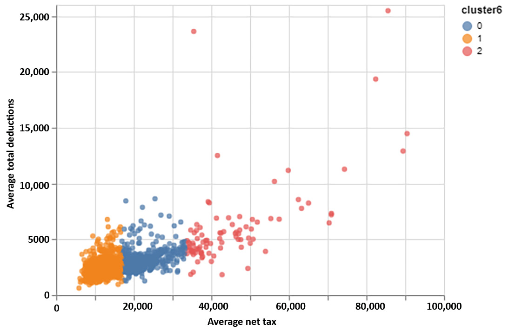

Caption: Scatter plot of the clusters

Now, to create a second scatter plot only for the centroids called
`chart2`:

```
chart2 = alt.Chart(centroids).mark_circle(size=100)\
            .encode(x='Average net tax', \
                    y='Average total deductions', \
                    color=alt.value('black'), \
                    tooltip=['Average net tax', \
                             'Average total deductions'])\
                   .interactive()
chart2
```

You should get the following output:

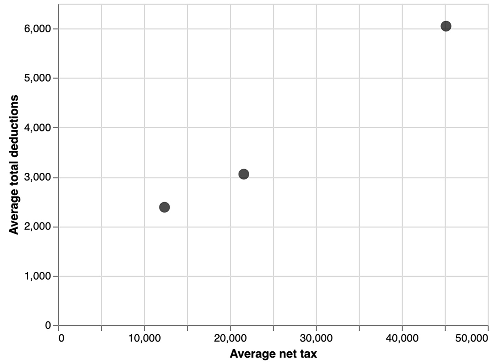

Caption: Scatter plot of the centroids

And now we combine the two charts, which is extremely easy with
`altair`:

```
chart1 + chart2
```

You should get the following output:

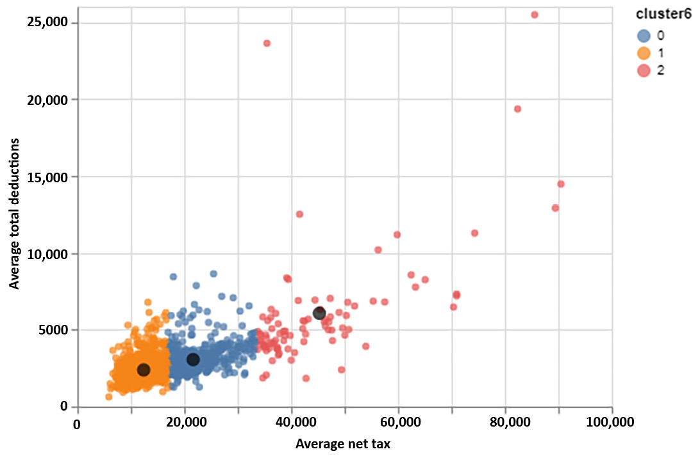

Caption: Scatter plot of the clusters and their centroids

Now we can easily see which centroids the observations are closest to.


Exercise 5.05: Finding the Closest Centroids in Our Dataset
-----------------------------------------------------------

In this exercise, we will be coding the first iteration of k-means in
order to assign data points to their closest cluster centroids. The
following steps will help you complete the exercise:

1.  Open a new Jupyter notebook.

2.  Now `import` the required packages, which are
    `pandas`, `sklearn`, and `altair`:
    ```
    import pandas as pd
    from sklearn.cluster import KMeans
    import altair as alt
    ```


3.  Load the dataset and select the same columns as in *Exercise 5.02*,
    *Clustering Australian Postcodes by Business Income and Expenses*,
    using the `read_csv()` method from the `pandas`
    package:
    ```
    file_url = 'https://raw.githubusercontent.com/'\
               'fenago/data-science/'\
               'master/Lab05/DataSet/taxstats2015.csv'
    df = pd.read_csv(file_url, \
                     usecols=['Postcode', \
                              'Average total business income', \
                              'Average total business expenses'])
    ```


4.  Assign the `'Average total business income'` and
    `'Average total business expenses'` columns to a new
    variable called `X`:
    ```
    X = df[['Average total business income', \
            'Average total business expenses']]
    ```


5.  Now, calculate the minimum and maximum using the `min()`
    and `max()` values of the
    `'Average total business income'` and
    `'Average total business income'` variables, as shown in
    the following code snippet:
    ```
    business_income_min = df['Average total business income'].min()
    business_income_max = df['Average total business income'].max()
    business_expenses_min = df['Average total business expenses']\
                            .min()
    business_expenses_max = df['Average total business expenses']\
                            .max()
    ```


6.  Print the values of these four variables, which are the minimum and
    maximum values of the two variables:

    ```
    print(business_income_min)
    print(business_income_max)
    print(business_expenses_min)
    print(business_expenses_max)
    ```


    You should get the following output:

    ```
    0
    876324
    0
    884659
    ```


7.  Now import the `random` package and use the
    `seed()` method to set a seed of `42`, as shown
    in the following code snippet:
    ```
    import random
    random.seed(42)
    ```


8.  Create an empty pandas DataFrame and assign it to a variable called
    `centroids`:
    ```
    centroids = pd.DataFrame()
    ```


9.  Generate four random values using the `sample()` method
    from the `random` package with possible values between the
    minimum and maximum values of the
    `'Average total business expenses'` column using
    `range()` and store the results in a new column called
    `'Average total business income'` from the
    `centroids` DataFrame:
    ```
    centroids\
    ['Average total business income'] = random.sample\
                                        (range\
                                        (business_income_min, \
                                         business_income_max), 4)
    ```


10. Repeat the same process to generate `4` random values for
    `'Average total business expenses'`:
    ```
    centroids\
    ['Average total business expenses'] = random.sample\
                                          (range\
                                          (business_expenses_min,\
                                           business_expenses_max), 4)
    ```


11. Create a new column called `'cluster'` from the
    `centroids` DataFrame using the
    `.index `attributes from the pandas package and print this
    DataFrame:

    ```
    centroids['cluster'] = centroids.index
    centroids
    ```


    You should get the following output:

    
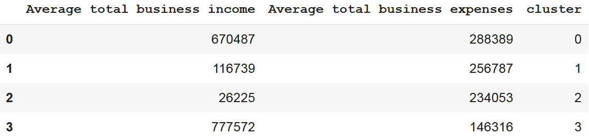


    Caption: Coordinates of the four random centroids

12. Create a scatter plot with the `altair` package to display
    the data contained in the `df` DataFrame and save it in a
    variable called `'chart1'`:
    ```
    chart1 = alt.Chart(df.head()).mark_circle()\
                .encode(x='Average total business income', \
                        y='Average total business expenses', \
                        color=alt.value('orange'), \
                        tooltip=['Postcode', \
                                 'Average total business income', \
                                 'Average total business expenses'])\
                       .interactive()
    ```


13. Now create a second scatter plot using the `altair`
    package to display the centroids and save it in a variable called
    `'chart2'`:
    ```
    chart2 = alt.Chart(centroids).mark_circle(size=100)\
                .encode(x='Average total business income', \
                        y='Average total business expenses', \
                        color=alt.value('black'), \
                        tooltip=['cluster', \
                                 'Average total business income',\
                                 'Average total business expenses'])\
                       .interactive()
    ```


14. Display the two charts together using the altair syntax:
    `<chart> + <chart>`:

    ```
    chart1 + chart2
    ```


    You should get the following output:

    


    Caption: Scatter plot of the random centroids and the first five
    observations

15. Define a function that will calculate the
    `squared_euclidean` distance and return its value. This
    function will take the `x` and `y` coordinates
    of a data point and a centroid:
    ```
    def squared_euclidean(data_x, data_y, \
                          centroid_x, centroid_y, ):
        return (data_x - centroid_x)**2 + (data_y - centroid_y)**2
    ```


16. Using the `.at` method from the pandas package, extract
    the first row\'s `x` and `y` coordinates and
    save them in two variables called `data_x` and
    `data_y`:
    ```
    data_x = df.at[0, 'Average total business income']
    data_y = df.at[0, 'Average total business expenses']
    ```


17. Using a `for` loop or list comprehension, calculate the
    `squared_euclidean` distance of the first observation
    (using its `data_x` and `data_y` coordinates)
    against the `4` different centroids contained in
    `centroids`, save the result in a variable called
    `distance`, and display it:

    ```
    distances = [squared_euclidean\
                 (data_x, data_y, centroids.at\
                  [i, 'Average total business income'], \
                  centroids.at[i, \
                  'Average total business expenses']) \
                  for i in range(4)]
    distances
    ```


    You should get the following output:

    ```
    [215601466600, 10063365460, 34245932020, 326873037866]
    ```


18. Use the `index` method from the list containing the
    `squared_euclidean` distances to find the cluster with the
    shortest distance, as shown in the following code snippet:
    ```
    cluster_index = distances.index(min(distances))
    ```


19. Save the `cluster` index in a column called
    `'cluster'` from the `df` DataFrame for the
    first observation using the `.at` method from the pandas
    package:
    ```
    df.at[0, 'cluster'] = cluster_index
    ```


20. Display the first five rows of `df` using the
    `head()` method from the `pandas` package:

    ```
    df.head()
    ```


    You should get the following output:

    
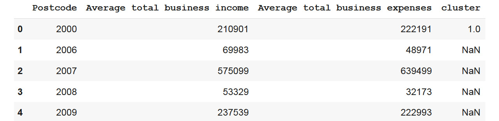


21. Repeat *Steps 15* to *19* for the next `4` rows to
    calculate their distances from the centroids and find the cluster
    with the smallest distance value:

    ```
    distances = [squared_euclidean\
                 (df.at[1, 'Average total business income'], \
                  df.at[1, 'Average total business expenses'], \
                  centroids.at[i, 'Average total business income'],\
                  centroids.at[i, \
                               'Average total business expenses'])\
                 for i in range(4)]
    df.at[1, 'cluster'] = distances.index(min(distances))
    distances = [squared_euclidean\
                 (df.at[2, 'Average total business income'], \
                  df.at[2, 'Average total business expenses'], \
                  centroids.at[i, 'Average total business income'],\
                  centroids.at[i, \
                               'Average total business expenses'])\
                 for i in range(4)]
    df.at[2, 'cluster'] = distances.index(min(distances))
    distances = [squared_euclidean\
                 (df.at[3, 'Average total business income'], \
                  df.at[3, 'Average total business expenses'], \
                  centroids.at[i, 'Average total business income'],\
                  centroids.at[i, \
                               'Average total business expenses'])\
                 for i in range(4)]
    df.at[3, 'cluster'] = distances.index(min(distances))
    distances = [squared_euclidean\
                 (df.at[4, 'Average total business income'], \
                  df.at[4, 'Average total business expenses'], \
                  centroids.at[i, \
                  'Average total business income'], \
                  centroids.at[i, \
                  'Average total business expenses']) \
                 for i in range(4)]
    df.at[4, 'cluster'] = distances.index(min(distances))
    df.head()
    ```


    You should get the following output:

    
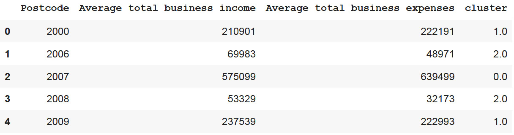


    Caption: The first five rows of the ATO DataFrame and their
    assigned clusters

22. Finally, plot the centroids and the first `5` rows of the
    dataset using the `altair` package as in *Steps 12* to
    *13*:

    ```
    chart1 = alt.Chart(df.head()).mark_circle()\
                .encode(x='Average total business income', \
                        y='Average total business expenses', \
                        color='cluster:N', \
                        tooltip=['Postcode', 'cluster', \
                                 'Average total business income', \
                                 'Average total business expenses'])\
                       .interactive()
    chart2 = alt.Chart(centroids).mark_circle(size=100)\
                .encode(x='Average total business income', \
                        y='Average total business expenses', \
                        color=alt.value('black'), \
                        tooltip=['cluster', \
                                 'Average total business income',\
                                 'Average total business expenses'])\
                       .interactive()
    chart1 + chart2
    ```


    You should get the following output:

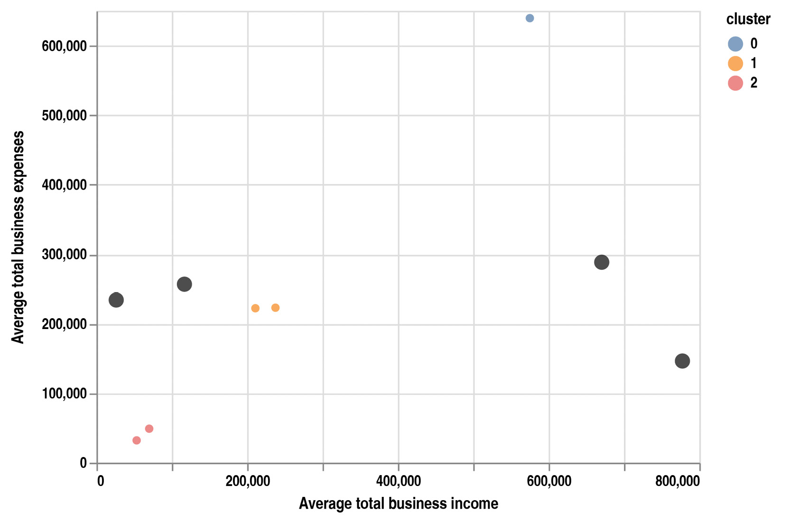


**Note:** Open the notebook you were using for *Exercise 5.01*, *Performing Your
First Clustering Analysis on the ATO Dataset*, and earlier examples.
Execute the code you already entered, and then continue at the end of
the notebook with the following code.

First, we import the relevant class and instantiate an object:

```
from sklearn.preprocessing import MinMaxScaler
min_max_scaler = MinMaxScaler()
```

Then, we fit it to our dataset:

```
min_max_scaler.fit(X)
```

You should get the following output:

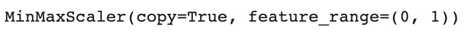

Caption: Min-max scaling summary

And finally, call the `transform()` method to standardize the
data:

```
X_min_max = min_max_scaler.transform(X)
X_min_max
```

You should get the following output:

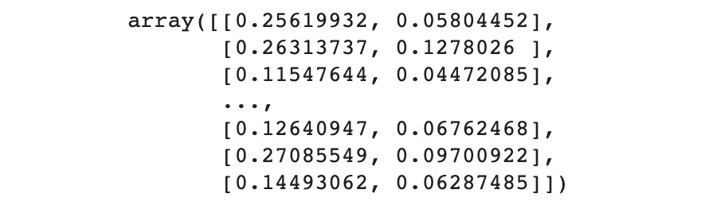

Caption: Min-max-scaled data

Now we print the minimum and maximum values of the min-max-scaled data
for both axes:

```
X_min_max[:,0].min(), X_min_max[:,0].max(), \
X_min_max[:,1].min(), X_min_max[:,1].max()
```

You should get the following output:


Caption: Minimum and maximum values of the min-max-scaled data

We can see that both axes now have their values sitting between 0 and 1.

The **z-score** is calculated by removing the overall average from the
data point and dividing the result by the standard deviation for each
axis. The distribution of the standardized data will have a mean of 0
and a standard deviation of 1:


Caption: Z-score formula

To apply it with `sklearn`, first, we have to import the
relevant `StandardScaler` class and instantiate an object:

```
from sklearn.preprocessing import StandardScaler
standard_scaler = StandardScaler()
```
This time, instead of calling `fit()` and then
`transform()`, we use the `fit_transform()` method:

```
X_scaled = standard_scaler.fit_transform(X)
X_scaled
```

You should get the following output:

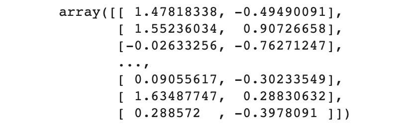

Caption: Z-score-standardized data

Now we\'ll look at the minimum and maximum values for each axis:

```
X_scaled[:,0].min(), X_scaled[:,0].max(), \
X_scaled[:,1].min(), X_scaled[:,1].max()
```

You should get the following output:


Caption: Minimum and maximum values of the z-score-standardized data

The value ranges for both axes are much lower now and we can see that
their maximum values are around 9 and 18, which indicates that there are
some extreme outliers in the data.

Now, to fit a k-means model and plot a scatter plot on the
z-score-standardized data with the following code snippet:

```
kmeans = KMeans(random_state=42, n_clusters=3, \
                init='k-means++', n_init=5)
kmeans.fit(X_scaled)
df['cluster7'] = kmeans.predict(X_scaled)
alt.Chart(df).mark_circle()\
             .encode(x='Average net tax', \
                     y='Average total deductions', \
                     color='cluster7:N', \
                     tooltip=['Postcode', 'cluster7', \
                              'Average net tax', \
                              'Average total deductions'])\
                    .interactive()
```

You should get the following output:

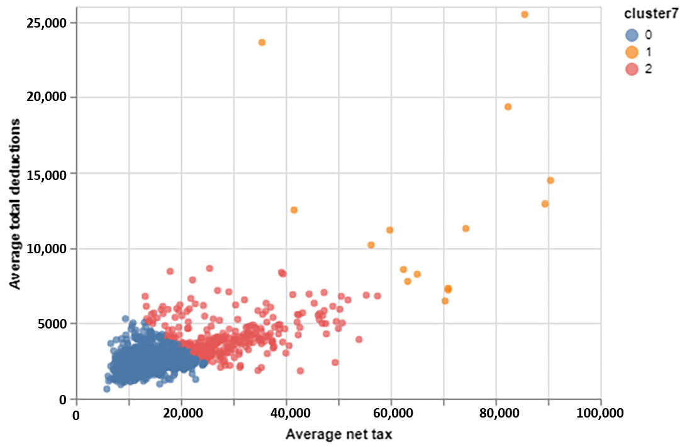

Caption: Scatter plot of the standardized data


Exercise 5.06: Standardizing the Data from Our Dataset
------------------------------------------------------

In this final exercise, we will standardize the data using min-max
scaling and the z-score and fit a k-means model for each method and see
their impact on k-means:

1.  Open a new Jupyter notebook.

2.  Now import the required `pandas`, `sklearn`, and
    `altair` packages:
    ```
    import pandas as pd
    from sklearn.cluster import KMeans
    import altair as alt 
    ```


3.  Load the dataset and select the same columns as in *Exercise 5.02*,
    *Clustering Australian Postcodes by Business Income and Expenses*,
    using the `read_csv()` method from the `pandas`
    package:
    ```
    file_url = 'https://raw.githubusercontent.com'\
               '/fenago/data-science'\
               '/master/Lab05/DataSet/taxstats2015.csv'
    df = pd.read_csv(file_url, \
                     usecols=['Postcode', \
                              'Average total business income', \
                              'Average total business expenses'])
    ```


4.  Assign the `'Average total business income'` and
    `'Average total business expenses'` columns to a new
    variable called `X`:
    ```
    X = df[['Average total business income', \
            'Average total business expenses']]
    ```


5.  Import the `MinMaxScaler` and `StandardScaler`
    classes from `sklearn`:
    ```
    from sklearn.preprocessing import MinMaxScaler
    from sklearn.preprocessing import StandardScaler
    ```


6.  Instantiate and fit `MinMaxScaler` with the data:

    ```
    min_max_scaler = MinMaxScaler()
    min_max_scaler.fit(X)
    ```


    You should get the following output:

    


    Caption: Summary of the min-max scaler

7.  Perform the min-max scaling transformation and save the data into a
    new variable called `X_min_max`:

    ```
    X_min_max = min_max_scaler.transform(X)
    X_min_max
    ```


    You should get the following output:

    
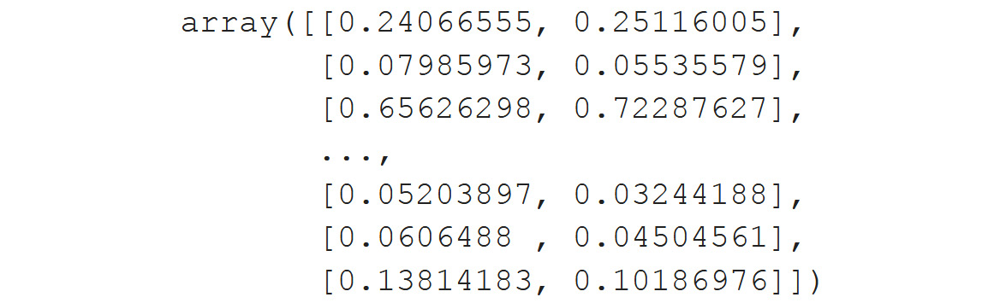


    Caption: Min-max-scaled data

8.  Fit a k-means model on the scaled data with the following
    hyperparameters: `random_state=1`,
    `n_clusters=4, init='k-means++', n_init=5`, as shown in
    the following code snippet:
    ```
    kmeans = KMeans(random_state=1, n_clusters=4, \
                    init='k-means++', n_init=5)
    kmeans.fit(X_min_max)
    ```


9.  Assign the k-means predictions of each value of `X` in a
    new column called `'cluster8'` in the `df`
    DataFrame:
    ```
    df['cluster8'] = kmeans.predict(X_min_max)
    ```


10. Plot the k-means results into a scatter plot using the
    `altair` package:

    ```
    scatter_plot = alt.Chart(df).mark_circle()
    scatter_plot.encode(x='Average total business income', \
                        y='Average total business expenses',\
                        color='cluster8:N',\
                        tooltip=['Postcode', 'cluster8', \
                                 'Average total business income',\
                                 'Average total business expenses'])\
                       .interactive()
    ```


    You should get the following output:

    


    Caption: Scatter plot of k-means results using the
    min-max-scaled data

11. Re-train the k-means model but on the z-score-standardized data with
    the same hyperparameter values,
    `random_state=1, n_clusters=4, init='k-means++', n_init=5`:
    ```
    standard_scaler = StandardScaler()
    X_scaled = standard_scaler.fit_transform(X)
    kmeans = KMeans(random_state=1, n_clusters=4, \
                    init='k-means++', n_init=5)
    kmeans.fit(X_scaled)
    ```


12. Assign the k-means predictions of each value of `X_scaled`
    in a new column called `'cluster9' `in the `df`
    DataFrame:
    ```
    df['cluster9'] = kmeans.predict(X_scaled)
    ```


13. Plot the k-means results in a scatter plot using the
    `altair` package:

    ```
    scatter_plot = alt.Chart(df).mark_circle()
    scatter_plot.encode(x='Average total business income', \
                        y='Average total business expenses', \
                        color='cluster9:N', \
                        tooltip=['Postcode', 'cluster9', \
                                 'Average total business income',\
                                 'Average total business expenses'])\
                       .interactive()
    ```


    You should get the following output:

    
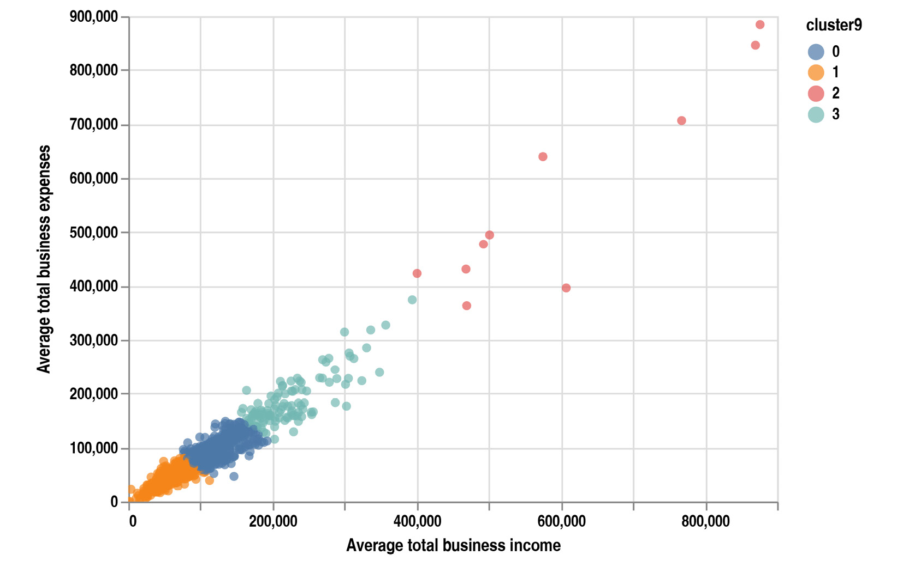


Activity 5.01: Perform Customer Segmentation Analysis in a Bank Using k-means
-----------------------------------------------------------------------------

You are working for an international bank. The credit department is
reviewing its offerings and wants to get a better understanding of its
current customers. You have been tasked with performing customer
segmentation analysis. You will perform cluster analysis with k-means to
identify groups of similar customers.

The following steps will help you complete this activity:

1.  Download the dataset and load it into Python.

2.  Read the CSV file using the `read_csv()` method.

    Note

    This dataset is in the `.dat` file format. You can still
    load the file using `read_csv()` but you will need to
    specify the following parameter:
    `header=None, sep= '\s\s+' and prefix='X'`.

3.  You will be using the fourth and tenth columns (`X3` and
    `X9`). Extract these.

4.  Perform data standardization by instantiating a
    `StandardScaler` object.

5.  Analyze and define the optimal number of clusters.

6.  Fit a k-means algorithm with the number of clusters you\'ve defined.

7.  Create a scatter plot of the clusters.

    Note

    This is the German Credit Dataset from the UCI Machine Learning
    Repository.Even though all the columns in this
    dataset are integers, most of them are actually categorical
    variables. The data in these columns is not continuous. Only two
    variables are really numeric. Those are the ones you will use for
    your clustering.

You should get something similar to the following output:

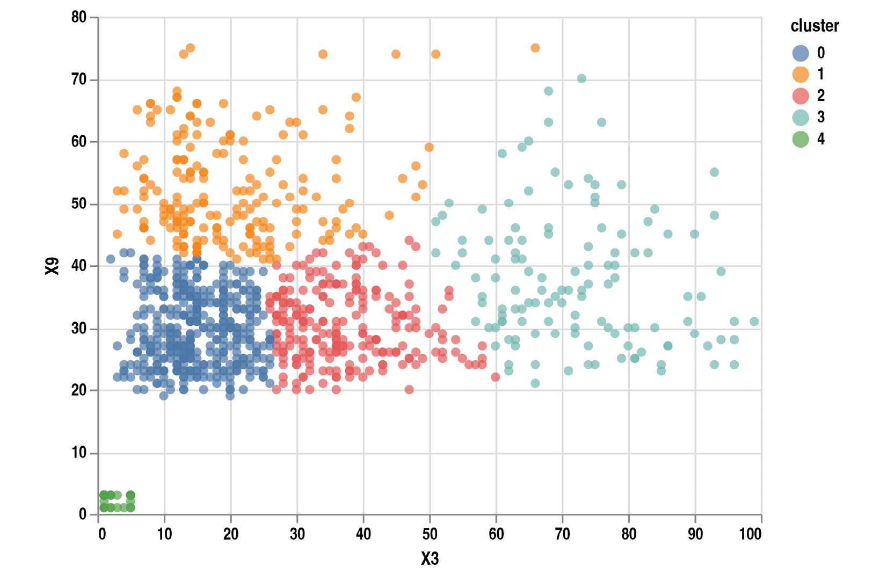

Caption: Scatter plot of the four clusters found


Summary
=======

We learned about a lot of different concepts, such as centroids and
squared Euclidean distance. We went through the main k-means
hyperparameters: `init` (initialization method),
`n_init` (number of initialization runs),
`n_clusters` (number of clusters), and
`random_state` (specified seed). We also discussed the
importance of choosing the optimal number of clusters, initializing
centroids properly, and standardizing data. You have learned how to use
the following Python packages: `pandas`, `altair`,
`sklearn`, and `KMeans`.

Next, you will see how we can assess the performance of these models and
what tools can be used to make them even better.
