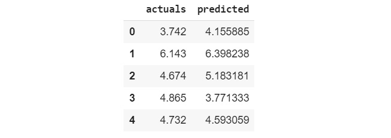

Lab 6. How to Assess Performance
============================


Overview

This lab will introduce you to model evaluation, where you evaluate
or assess the performance of each model that you train before you decide
to put it into production. By the end of this lab, you will be able
to create an evaluation dataset. You will be equipped to assess the
performance of linear regression models using **mean absolute error**
(**MAE**) and **mean squared error** (**MSE**). You will also be able to
evaluate the performance of logistic regression models using accuracy,
precision, recall, and F1 score.


Exercise 6.01: Importing and Splitting Data
-------------------------------------------

In this exercise, you will import data from a repository and split it
into a training and an evaluation set to train a model. Splitting your
data is required so that you can evaluate the model later. This exercise
will get you familiar with the process of splitting data; this is
something you will be doing frequently.

**Note:** The Car dataset that you will be using in this lab was taken from the UCI Machine Learning Repository.

The following steps will help you complete the exercise:

1.  Open a new Jupyter notebook.

2.  Import the required libraries:

    ```
    import pandas as pd
    from sklearn.model_selection import train_test_split
    ```


3.  Create a Python list:

    ```
    # data doesn't have headers, so let's create headers
    _headers = ['buying', 'maint', 'doors', 'persons', \
                'lug_boot', 'safety', 'car']
    ```


    The data that you are reading in is stored as a CSV file.

    The browser will download the file to your computer. You can open
    the file using a text editor. If you do, you will see something
    similar to the following:

    


    `CSV` files normally have the name of each column written
    in the first row of the data. For instance, have a look at this
    dataset\'s CSV file, which you used in *Lab 3, Binary
    Classification*:

    


4.  Read the data:

    ```
    df = pd.read_csv('https://raw.githubusercontent.com/'\
                     'fenago/data-science/'\
                     'master/Lab06/Dataset/car.data', \
                     names=_headers, index_col=None)
    ```


5.  Print out the top five records:

    ```
    df.head()
    ```


    The code in this step is used to print the top five rows of the
    DataFrame. The output from that operation is shown in the following
    screenshot:

    


    Caption: The top five rows of the DataFrame

6.  Create a training and an evaluation DataFrame:

    ```
    training, evaluation = train_test_split(df, test_size=0.3, \
                                            random_state=0)
    ```

    Note

    The third parameter random\_state is set to 0 to ensure
    reproducibility of results.

7.  Create a validation and test dataset:

    ```
    validation, test = train_test_split(evaluation, test_size=0.5, \
                                        random_state=0)
    ```


    This code is similar to the code in *Step 6*. In this step, the code
    splits our evaluation data into two equal parts because we specified
    `0.5`, which means `50%`.


Data Structures -- Vectors and Matrices
---------------------------------------

In this section, we will look at different data structures, as follows.


### Scalars

You assign them to variables, such as in the following expression:

```
temperature = 23
```

If you had to store the temperature for 5 days, you would need to store
the values in 5 different values, such as in the following code snippet:

```
temp_1 = 23
temp_2 = 24
temp_3 = 23
temp_4 = 22
temp_5 = 22
```


### Vectors

Consider the following code snippet for creating a Python list:

```
temps_list = [23, 24, 23, 22, 22]
```

You can create a vector from the list using the `.array()`
method from `numpy` by first importing `numpy` and
then using the following snippet:

```
import numpy as np
temps_ndarray = np.array(temps_list)
```

You can proceed to verify the data type using the following code
snippet:

```
print(type(temps_ndarray))
```

The code snippet will cause the compiler to print out the following:


Caption: The temps\_ndarray vector data type

You may inspect the contents of the vector using the following code
snippet:

```
print(temps_ndarray)
```
This generates the following output:


Caption: The temps\_ndarray vector


```
print(temps_list)
```

The code snippet yields the following output:


Caption: List of elements in temps\_list


Vectors have a shape and a dimension. Both of these can be determined by
using the following code snippet:

```
print(temps_ndarray.shape)
```

The output is a Python data structure called a **tuple** and looks like
this:


Caption: Shape of the temps\_ndarray vector


### Matrices


To convert `temps_ndarray` into
a matrix with five rows and one column, you would use the following
snippet:

```
temps_matrix = temps_ndarray.reshape(-1, 1)
```

To see the new shape, use the following snippet:


```
print(temps_matrix.shape)
```

You will get the following output:


Caption: Shape of the matrix


You can print out the value of the matrix using the following snippet:

```
print(temps_matrix)
```

The output of the code is as follows:


Caption: Elements of the matrix


You may reshape the matrix to contain `1` row and
`5` columns and print out the value using the following code
snippet:

```
print(temps_matrix.reshape(1,5))
```

The output will be as follows:


Caption: Reshaping the matrix


Finally, you can convert the matrix back into a vector by dropping the
column using the following snippet:

```
vector = temps_matrix.reshape(-1)
```

You can print out the value of the vector to confirm that you get the
following:


Exercise 6.02: Computing the R[2] Score of a Linear Regression Model
----------------------------------------------------------------------------------

As mentioned in the preceding sections, R[2] score is an
important factor in evaluating the performance of a model. Thus, in this
exercise, we will be creating a linear regression model and then
calculating the R[2] score for it.


The following attributes are useful for our task:

- CIC0: information indices
- SM1\_Dz(Z): 2D matrix-based descriptors
- GATS1i: 2D autocorrelations
- NdsCH: Pimephales promelas
- NdssC: atom-type counts
- MLOGP: molecular properties
- Quantitative response, LC50 \[-LOG(mol/L)\]: This attribute
    represents the concentration that causes death in 50% of test fish
    over a test duration of 96 hours.

The following steps will help you to complete the exercise:

1.  Open a new Jupyter notebook to write and execute your code.

2.  Next, import the libraries mentioned in the following code snippet:

    ```
    # import libraries
    import pandas as pd
    from sklearn.model_selection import train_test_split
    from sklearn.linear_model import LinearRegression
    ```


    In this step, you import `pandas`, which you will use to
    read your data. You also import `train_test_split()`,
    which you will use to split your data into training and validation
    sets, and you import `LinearRegression`, which you will
    use to train your model.

3.  Now, read the data from the dataset:

    ```
    # column headers
    _headers = ['CIC0', 'SM1', 'GATS1i', 'NdsCH', 'Ndssc', \
                'MLOGP', 'response']
    # read in data
    df = pd.read_csv('https://raw.githubusercontent.com/'\
                     'fenago/data-science/'\
                     'master/Lab06/Dataset/'\
                     'qsar_fish_toxicity.csv', \
                     names=_headers, sep=';')
    ```


    In this step, you create a Python list to hold the names of the
    columns in your data. You do this because the CSV file containing
    the data does not have a first row that contains the column headers.
    You proceed to read in the file and store it in a variable called
    `df` using the `read_csv()` method in pandas.
    You specify the list containing column headers by passing it into
    the `names` parameter. This CSV uses semi-colons as column
    separators, so you specify that using the `sep` parameter.
    You can use `df.head()` to see what the DataFrame looks
    like:

    


    Caption: The first five rows of the DataFrame

4.  Split the data into features and labels and into training and
    evaluation datasets:

    ```
    # Let's split our data
    features = df.drop('response', axis=1).values
    labels = df[['response']].values
    X_train, X_eval, y_train, y_eval = train_test_split\
                                       (features, labels, \
                                        test_size=0.2, \
                                        random_state=0)
    X_val, X_test, y_val, y_test = train_test_split(X_eval, y_eval,\
                                                    random_state=0)
    ```


    In this step, you create two `numpy` arrays called
    `features` and `labels`. You then proceed to
    split them twice. The first split produces a `training`
    set and an `evaluation` set. The second split creates a
    `validation` set and a `test` set.

5.  Create a linear regression model:

    ```
    model = LinearRegression()
    ```


    In this step, you create an instance of `LinearRegression`
    and store it in a variable called `model`. You will make
    use of this to train on the training dataset.

6.  Train the model:

    ```
    model.fit(X_train, y_train)
    ```


    You should get an output similar to the following:

    


    Caption: Training the model

7.  Make a prediction, as shown in the following code snippet:

    ```
    y_pred = model.predict(X_val)
    ```


    In this step, you make use of the validation dataset to make a
    prediction. This is stored in `y_pred`.

8.  Compute the R[2] score:

    ```
    r2 = model.score(X_val, y_val)
    print('R^2 score: {}'.format(r2))
    ```


    In this step, you compute `r2`, which is the
    R[2] score of the model. The R[2] score
    is computed using the `score()` method of the model. The
    next line causes the interpreter to print out the R[2]
    score.

    The output is similar to the following:

    


    Caption: R2 score


9.  You see that the R[2] score we achieved is
    `0.56238`, which is not close to 1. In the next step, we
    will be making comparisons.

10. Compare the predictions to the actual ground truth:

    ```
    _ys = pd.DataFrame(dict(actuals=y_val.reshape(-1), \
                            predicted=y_pred.reshape(-1)))
    _ys.head()
    ```


    The output looks similar to the following:

    



Exercise 6.03: Computing the MAE of a Model
-------------------------------------------

The goal of this exercise is to find the score and loss of a model using
the same dataset as *Exercise 6.02*, *Computing the R2 Score of a Linear
Regression Model*.

In this exercise, we will be calculating the MAE of a model.

The following steps will help you with this exercise:

1.  Open a new Jupyter notebook file.

2.  Import the necessary libraries:

    ```
    # Import libraries
    import pandas as pd
    from sklearn.model_selection import train_test_split
    from sklearn.linear_model import LinearRegression
    from sklearn.metrics import mean_absolute_error
    ```


    In this step, you import the function called
    `mean_absolute_error` from `sklearn.metrics`.

3.  Import the data:

    ```
    # column headers
    _headers = ['CIC0', 'SM1', 'GATS1i', 'NdsCH', 'Ndssc', \
                'MLOGP', 'response']
    # read in data
    df = pd.read_csv('https://raw.githubusercontent.com/'\
                     'fenago/data-science/'\
                     'master/Lab06/Dataset/'\
                     'qsar_fish_toxicity.csv', \
                     names=_headers, sep=';')
    ```


    In the preceding code, you read in your data. This data is hosted
    online and contains some information about fish toxicity. The data
    is stored as a CSV but does not contain any headers. Also, the
    columns in this file are not separated by a comma, but rather by a
    semi-colon. The Python list called `_headers` contains the
    names of the column headers.

4.  Split the data into `features` and `labels` and
    into training and evaluation sets:

    ```
    # Let's split our data
    features = df.drop('response', axis=1).values
    labels = df[['response']].values
    X_train, X_eval, y_train, y_eval = train_test_split\
                                       (features, labels, \
                                        test_size=0.2, \
                                        random_state=0)
    X_val, X_test, y_val, y_test = train_test_split(X_eval, y_eval,\
                                                    random_state=0)
    ```


5.  Create a simple linear regression model and train it:

    ```
    # create a simple Linear Regression model
    model = LinearRegression()
    # train the model
    model.fit(X_train, y_train)
    ```


    In this step, you make use of your training data to train a model.
    In the first line, you create an instance of
    `LinearRegression`, which you call `model`. In
    the second line, you train the model using `X_train` and
    `y_train`. `X_train` contains the
    `features`, while `y_train` contains the
    `labels`.

6.  Now predict the values of our validation dataset:

    ```
    # let's use our model to predict on our validation dataset
    y_pred = model.predict(X_val)
    ```


7.  Compute the MAE:

    ```
    # Let's compute our MEAN ABSOLUTE ERROR
    mae = mean_absolute_error(y_val, y_pred)
    print('MAE: {}'.format(mae))
    ```


    In this step, you compute the MAE of the model by using the
    `mean_absolute_error` function and passing in
    `y_val` and `y_pred`. `y_val` is the
    label that was provided with your training data, and
    `y_pred `is the prediction from the model. The preceding
    code should give you an MAE value of \~ 0.72434:

    


    Figure 6.17 MAE score


8.  Compute the R[2] score of the model:

    ```
    # Let's get the R2 score
    r2 = model.score(X_val, y_val)
    print('R^2 score: {}'.format(r2))
    ```


    You should get an output similar to the following:

    


In this exercise, we have calculated the MAE, which is a significant
parameter when it comes to evaluating models.

You will now train a second model and compare its R[2]
score and MAE to the first model to evaluate which is a better
performing model.


Exercise 6.04: Computing the Mean Absolute Error of a Second Model
------------------------------------------------------------------

In this exercise, we will be engineering new features and finding the
score and loss of a new model.

The following steps will help you with this exercise:

1.  Open a new Jupyter notebook file.

2.  Import the required libraries:

    ```
    # Import libraries
    import pandas as pd
    from sklearn.model_selection import train_test_split
    from sklearn.linear_model import LinearRegression
    from sklearn.metrics import mean_absolute_error
    # pipeline
    from sklearn.pipeline import Pipeline
    # preprocessing
    from sklearn.preprocessing import MinMaxScaler
    from sklearn.preprocessing import StandardScaler
    from sklearn.preprocessing import PolynomialFeatures
    ```


3.  Read in the data from the dataset:

    ```
    # column headers
    _headers = ['CIC0', 'SM1', 'GATS1i', 'NdsCH', 'Ndssc', \
                'MLOGP', 'response']
    # read in data
    df = pd.read_csv('https://raw.githubusercontent.com/'\
                     'fenago/data-science/'\
                     'master/Lab06/Dataset/'\
                     'qsar_fish_toxicity.csv', \
                     names=_headers, sep=';')
    ```


4.  Split the data into training and evaluation sets:

    ```
    # Let's split our data
    features = df.drop('response', axis=1).values
    labels = df[['response']].values
    X_train, X_eval, y_train, y_eval = train_test_split\
                                       (features, labels, \
                                        test_size=0.2, \
                                        random_state=0)
    X_val, X_test, y_val, y_test = train_test_split(X_eval, y_eval,\
                                                    random_state=0)
    ```


    In this step, you begin by splitting the DataFrame called
    `df` into two. The first DataFrame is called
    `features` and contains all of the independent variables
    that you will use to make your predictions. The second is called
    `labels` and contains the values that you are trying to
    predict.

    In the third line, you split `features` and
    `labels` into four sets using
    `train_test_split`. `X_train` and
    `y_train` contain 80% of the data and are used for
    training your model. `X_eval` and `y_eval`
    contain the remaining 20%.

    In the fourth line, you split `X_eval` and
    `y_eval` into two additional sets. `X_val` and
    `y_val` contain 75% of the data because you did not
    specify a ratio or size. `X_test` and `y_test`
    contain the remaining 25%.

5.  Create a pipeline:

    ```
    # create a pipeline and engineer quadratic features
    steps = [('scaler', MinMaxScaler()),\
             ('poly', PolynomialFeatures(2)),\
             ('model', LinearRegression())]
    ```

6.  Create a pipeline:

    ```
    # create a simple Linear Regression model with a pipeline
    model = Pipeline(steps)
    ```


7.  Train the model:

    ```
    # train the model
    model.fit(X_train, y_train)
    ```


    On the next line, you call the `fit` method and provide
    `X_train` and `y_train` as parameters. Because
    the model is a pipeline, three operations will happen. First,
    `X_train` will be scaled. Next, additional features will
    be engineered. Finally, training will happen using the
    `LinearRegression` model. The output from this step is
    similar to the following:

    


    Caption: Training the model

8.  Predict using the validation dataset:
    ```
    # let's use our model to predict on our validation dataset
    y_pred = model.predict(X_val)
    ```


9.  Compute the MAE of the model:

    ```
    # Let's compute our MEAN ABSOLUTE ERROR
    mae = mean_absolute_error(y_val, y_pred)
    print('MAE: {}'.format(mae))
    ```


    In the first line, you make use of `mean_absolute_error`
    to compute the mean absolute error. You supply `y_val` and
    `y_pred`, and the result is stored in the `mae`
    variable. In the following line, you print out `mae`:

    


    Caption: MAE score

    The loss that you compute at this step is called a validation loss
    because you make use of the validation dataset. This is different
    from a training loss that is computed using the training dataset.
    This distinction is important to note as you study other
    documentation or books, which might refer to both.

10. Compute the R[2] score:

    ```
    # Let's get the R2 score
    r2 = model.score(X_val, y_val)
    print('R^2 score: {}'.format(r2))
    ```


    In the final two lines, you compute the R[2] score and
    also display it, as shown in the following screenshot:

    


Exercise 6.05: Creating a Classification Model for Computing Evaluation Metrics
-------------------------------------------------------------------------------

In this exercise, you will create a classification model that you will
make use of later on for model assessment.

You will make use of the cars dataset from the UCI Machine Learning
Repository. You will use this dataset to classify cars as either
acceptable or unacceptable based on the following categorical features:

- `buying`: the purchase price of the car
- `maint`: the maintenance cost of the car
- `doors`: the number of doors on the car
- `persons`: the carrying capacity of the vehicle
- `lug_boot`: the size of the luggage boot
- `safety`: the estimated safety of the car


The following steps will help you achieve the task:

1.  Open a new Jupyter notebook.

2.  Import the libraries you will need:

    ```
    # import libraries
    import pandas as pd
    from sklearn.model_selection import train_test_split
    from sklearn.linear_model import LogisticRegression
    ```

3.  Import your data:

    ```
    # data doesn't have headers, so let's create headers
    _headers = ['buying', 'maint', 'doors', 'persons', \
                'lug_boot', 'safety', 'car']
    # read in cars dataset
    df = pd.read_csv('https://raw.githubusercontent.com/'\
                     'fenago/data-science/'\
                     'master/Lab06/Dataset/car.data', \
                     names=_headers, index_col=None)
    df.head()
    ```


    You should get an output similar to the following:

    


    Caption: Inspecting the DataFrame

4.  Encode categorical variables as shown in the following code snippet:

    ```
    # encode categorical variables
    _df = pd.get_dummies(df, columns=['buying', 'maint', 'doors',\
                                      'persons', 'lug_boot', \
                                      'safety'])
    _df.head()
    ```


    The output should now resemble the following screenshot:

    


    Caption: Encoding categorical variables


5.  Split the data into training and validation sets:

    ```
    # split data into training and evaluation datasets
    features = _df.drop('car', axis=1).values
    labels = _df['car'].values
    X_train, X_eval, y_train, y_eval = train_test_split\
                                       (features, labels, \
                                        test_size=0.3, \
                                        random_state=0)
    X_val, X_test, y_val, y_test = train_test_split(X_eval, y_eval,\
                                                    test_size=0.5, \
                                                    random_state=0)
    ```


6.  Train a logistic regression model:

    ```
    # train a Logistic Regression model
    model = LogisticRegression()
    model.fit(X_train, y_train)
    ```


    In this step, you create an instance of
    `LogisticRegression` and train the model on your training
    data by passing in `X_train` and `y_train` to
    the `fit` method.

    You should get an output that looks similar to the following:

    


    Caption: Training a logistic regression model

7.  Make a prediction:

    ```
    # make predictions for the validation set
    y_pred = model.predict(X_val)
    ```


    In this step, you make a prediction on the validation dataset,
    `X_val`, and store the result in `y_pred`. A
    look at the first 10 predictions (by executing
    `y_pred[0:9]`) should provide an output similar to the
    following:

    


Caption: Prediction for the validation set


Exercise 6.06: Generating a Confusion Matrix for the Classification Model
-------------------------------------------------------------------------

The goal of this exercise is to create a confusion matrix for the
classification model you trained in *Exercise 6.05*, *Creating a
Classification Model for Computing Evaluation Metrics*.

Note

You should continue this exercise in the same notebook as that used in
*Exercise 6.05, Creating a Classification Model for Computing Evaluation
Metrics.* If you wish to use a new notebook, make sure you copy and run
the entire code from *Exercise 6.05*, *Creating a Classification Model
for Computing Evaluation Metrics*, and then begin with the execution of
the code of this exercise.

The following steps will help you achieve the task:

1.  Open a new Jupyter notebook file.

2.  Import `confusion_matrix`:

    ```
    from sklearn.metrics import confusion_matrix
    ```


    In this step, you import `confusion_matrix` from
    `sklearn.metrics`. This function will let you generate a
    confusion matrix.

3.  Generate a confusion matrix:

    ```
    confusion_matrix(y_val, y_pred)
    ```


    In this step, you generate a confusion matrix by supplying
    `y_val`, the actual classes, and `y_pred`, the
    predicted classes.

    The output should look similar to the following:

    


Exercise 6.07: Computing Precision for the Classification Model
---------------------------------------------------------------

In this exercise, you will be computing the precision for the
classification model you trained in *Exercise 6.05*, *Creating a
Classification Model for Computing Evaluation Metrics*.


The following steps will help you achieve the task:

1.  Import the required libraries:

    ```
    from sklearn.metrics import precision_score
    ```


    In this step, you import `precision_score` from
    `sklearn.metrics`.

2.  Next, compute the precision score as shown in the following code
    snippet:

    ```
    precision_score(y_val, y_pred, average='macro')
    ```


    In this step, you compute the precision score using
    `precision_score`.

    The output is a floating-point number between 0 and 1. It might look
    like this:

    


Exercise 6.08: Computing Recall for the Classification Model
------------------------------------------------------------

The goal of this exercise is to compute the recall for the
classification model you trained in *Exercise 6.05*, *Creating a
Classification Model for Computing Evaluation Metrics*.


The following steps will help you accomplish the task:

1.  Open a new Jupyter notebook file.

2.  Now, import the required libraries:

    ```
    from sklearn.metrics import recall_score
    ```


    In this step, you import `recall_score` from
    `sklearn.metrics`. This is the function that you will make
    use of in the second step.

3.  Compute the recall:

    ```
    recall_score(y_val, y_pred, average='macro')
    ```


    You should get an output that looks like the following:

    


Exercise 6.09: Computing the F1 Score for the Classification Model
------------------------------------------------------------------

In this exercise, you will compute the F1 score for the classification
model you trained in *Exercise 6.05*, *Creating a Classification Model
for Computing Evaluation Metrics*.

Note

You should continue this exercise in the same notebook as that used in
*Exercise 6.05, Creating a Classification Model for Computing Evaluation
Metrics.* If you wish to use a new notebook, make sure you copy and run
the entire code from *Exercise 6.05*, *Creating a Classification Model
for Computing Evaluation Metrics*, and then begin with the execution of
the code of this exercise.

The following steps will help you accomplish the task:

1.  Open a new Jupyter notebook file.

2.  Import the necessary modules:

    ```
    from sklearn.metrics import f1_score
    ```


    In this step, you import the `f1_score` method from
    `sklearn.metrics`. This score will let you compute
    evaluation metrics.

3.  Compute the F1 score:

    ```
    f1_score(y_val, y_pred, average='macro')
    ```


    In this step, you compute the F1 score by passing in
    `y_val` and `y_pred`. You also specify
    `average='macro'` because this is not binary
    classification.

    You should get an output similar to the following:

    


Exercise 6.10: Computing Model Accuracy for the Classification Model
--------------------------------------------------------------------

The goal of this exercise is to compute the accuracy score of the model
trained in *Exercise 6.04*, *Computing the Mean Absolute Error of a
Second Model*.


The following steps will help you accomplish the task:

1.  Continue from where the code for *Exercise 6.05*, *Creating a
    Classification Model for Computing Evaluation Metrics*, ends in your
    notebook.

2.  Import `accuracy_score()`:

    ```
    from sklearn.metrics import accuracy_score
    ```


    In this step, you import `accuracy_score()`, which you
    will use to compute the model accuracy.

3.  Compute the accuracy:

    ```
    _accuracy = accuracy_score(y_val, y_pred)
    print(_accuracy)
    ```


    In this step, you compute the model accuracy by passing in
    `y_val` and `y_pred` as parameters to
    `accuracy_score()`. The interpreter assigns the result to
    a variable called `c`. The `print()` method
    causes the interpreter to render the value of `_accuracy`.

    The result is similar to the following:

    


Exercise 6.11: Computing the Log Loss for the Classification Model
------------------------------------------------------------------

The goal of this exercise is to predict the log loss of the model
trained in *Exercise 6.05*, *Creating a Classification Model for
Computing Evaluation Metrics*.

Note

You should continue this exercise in the same notebook as that used in
*Exercise 6.05, Creating a Classification Model for Computing Evaluation
Metrics.* If you wish to use a new notebook, make sure you copy and run
the entire code from *Exercise 6.05* and then begin with the execution
of the code of this exercise.

The following steps will help you accomplish the task:

1.  Open your Jupyter notebook and continue from where *Exercise 6.05*,
    *Creating a Classification Model for Computing Evaluation Metrics*,
    stopped.

2.  Import the required libraries:

    ```
    from sklearn.metrics import log_loss
    ```


    In this step, you import `log_loss()` from
    `sklearn.metrics`.

3.  Compute the log loss:

    ```
    _loss = log_loss(y_val, model.predict_proba(X_val))
    print(_loss)
    ```


Exercise 6.12: Computing and Plotting ROC Curve for a Binary Classification Problem
-----------------------------------------------------------------------------------

The goal of this exercise is to plot the ROC curve for a binary
classification problem. The data for this problem is used to predict
whether or not a mother will require a caesarian section to give birth.

From the UCI Machine Learning Repository, the abstract for this dataset
follows: \"This dataset contains information about caesarian section
results of 80 pregnant women with the most important characteristics of
delivery problems in the medical field.\" The attributes of interest are
age, delivery number, delivery time, blood pressure, and heart status.

The following steps will help you accomplish this task:

1.  Open a Jupyter notebook file.

2.  Import the required libraries:

    ```
    # import libraries
    import pandas as pd
    from sklearn.model_selection import train_test_split
    from sklearn.linear_model import LogisticRegression
    from sklearn.metrics import roc_curve
    from sklearn.metrics import auc
    ```


    In this step, you import `pandas`, which you will use to
    read in data. You also import `train_test_split` for
    creating training and validation datasets, and
    `LogisticRegression` for creating a model.

3.  Read in the data:

    ```
    # data doesn't have headers, so let's create headers
    _headers = ['Age', 'Delivery_Nbr', 'Delivery_Time', \
                'Blood_Pressure', 'Heart_Problem', 'Caesarian']
    # read in cars dataset
    df = pd.read_csv('https://raw.githubusercontent.com/'\
                     'fenago/data-science/'\
                     'master/Lab06/Dataset/caesarian.csv.arff',\
                     names=_headers, index_col=None, skiprows=15)
    df.head()
    # target column is 'Caesarian'
    ```


    The `head()` method will print out the top five rows and
    should look similar to the following:

    


    Caption: The top five rows of the DataFrame

4.  Split the data:

    ```
    # target column is 'Caesarian'
    features = df.drop(['Caesarian'], axis=1).values
    labels = df[['Caesarian']].values
    # split 80% for training and 20% into an evaluation set
    X_train, X_eval, y_train, y_eval = train_test_split\
                                       (features, labels, \
                                        test_size=0.2, \
                                        random_state=0)
    """
    further split the evaluation set into validation and test sets 
    of 10% each
    """
    X_val, X_test, y_val, y_test = train_test_split(X_eval, y_eval,\
                                                    test_size=0.5, \
                                                    random_state=0)
    ```


    In this step, you begin by creating two `numpy` arrays,
    which you call `features` and `labels`. You then
    split these arrays into a `training` and an
    `evaluation` dataset. You further split the
    `evaluation` dataset into `validation` and
    `test` datasets.

5.  Now, train and fit a logistic regression model:

    ```
    model = LogisticRegression()
    model.fit(X_train, y_train)
    ```


    In this step, you begin by creating an instance of a logistic
    regression model. You then proceed to train or fit the model on the
    training dataset.

    The output should be similar to the following:

    


    Caption: Training a logistic regression model

6.  Predict the probabilities, as shown in the following code snippet:

    ```
    y_proba = model.predict_proba(X_val)
    ```


    In this step, the model predicts the probabilities for each entry in
    the validation dataset. It stores the results in
    `y_proba`.

7.  Compute the true positive rate, the false positive rate, and the
    thresholds:

    ```
    _false_positive, _true_positive, _thresholds = roc_curve\
                                                   (y_val, \
                                                    y_proba[:, 0])
    ```


    In this step, you make a call to `roc_curve()` and specify
    the ground truth and the first column of the predicted
    probabilities. The result is a tuple of false positive rate, true
    positive rate, and thresholds.

8.  Explore the false positive rates:

    ```
    print(_false_positive)
    ```


    In this step, you instruct the interpreter to print out the false
    positive rate. The output should be similar to the following:

    


    Caption: False positive rates

    Note

    The false positive rates can vary, depending on the data.

9.  Explore the true positive rates:

    ```
    print(_true_positive)
    ```


    In this step, you instruct the interpreter to print out the true
    positive rates. This should be similar to the following:

    


    Caption: True positive rates

10. Explore the thresholds:

    ```
    print(_thresholds)
    ```


    In this step, you instruct the interpreter to display the
    thresholds. The output should be similar to the following:

    


    Caption: Thresholds

11. Now, plot the ROC curve:

    ```
    # Plot the RoC
    import matplotlib.pyplot as plt
    %matplotlib inline
    plt.plot(_false_positive, _true_positive, lw=2, \
             label='Receiver Operating Characteristic')
    plt.xlim(0.0, 1.2)
    plt.ylim(0.0, 1.2)
    plt.xlabel('False Positive Rate')
    plt.ylabel('True Positive Rate')
    plt.title('Receiver Operating Characteristic')
    plt.show()
    ```

    The output should look similar to the following:

    


Caption: ROC curve


Exercise 6.13: Computing the ROC AUC for the Caesarian Dataset
--------------------------------------------------------------

The goal of this exercise is to compute the ROC AUC for the binary
classification model that you trained in *Exercise 6.12*, *Computing and
Plotting ROC Curve for a Binary Classification Problem*.

Note

You should continue this exercise in the same notebook as that used in
*Exercise 6.12, Computing and Plotting ROC Curve for a Binary
Classification Problem.* If you wish to use a new notebook, make sure
you copy and run the entire code from *Exercise 6.12* and then begin
with the execution of the code of this exercise.

The following steps will help you accomplish the task:

1.  Open a Jupyter notebook to the code for *Exercise 6.12*, *Computing
    and Plotting ROC Curve for a Binary Classification Problem,* and
    continue writing your code.

2.  Predict the probabilities:

    ```
    y_proba = model.predict_proba(X_val)
    ```


    In this step, you compute the probabilities of the classes in the
    validation dataset. You store the result in `y_proba`.

3.  Compute the ROC AUC:

    ```
    from sklearn.metrics import roc_auc_score
    _auc = roc_auc_score(y_val, y_proba[:, 0])
    print(_auc)
    ```


    In this step, you compute the ROC AUC and store the result in
    `_auc`. You then proceed to print this value out. The
    result should look similar to the following:

    


Caption: Computing the ROC AUC

Note

The AUC can be different, depending on the data.


Saving and Loading Models
=========================


You will eventually need to transfer some of the models you have trained
to a different computer so they can be put into production. There are
various utilities for doing this, but the one we will discuss is called
`joblib`.

`joblib` supports saving and loading models, and it saves the
models in a format that is supported by other machine learning
architectures, such as `ONNX`.

`joblib` is found in the `sklearn.externals` module.


Exercise 6.14: Saving and Loading a Model
-----------------------------------------

In this exercise, you will train a simple model and use it for
prediction. You will then proceed to save the model and then load it
back in. You will use the loaded model for a second prediction, and then
compare the predictions from the first model to those from the second
model. You will make use of the car dataset for this exercise.

The following steps will guide you toward the goal:

1.  Open a Jupyter notebook.

2.  Import the required libraries:
    ```
    import pandas as pd
    from sklearn.model_selection import train_test_split
    from sklearn.linear_model import LinearRegression
    ```


3.  Read in the data:
    ```
    _headers = ['CIC0', 'SM1', 'GATS1i', 'NdsCH', 'Ndssc', \
                'MLOGP', 'response']
    # read in data
    df = pd.read_csv('https://raw.githubusercontent.com/'\
                     'fenago/data-science/'\
                     'master/Lab06/Dataset/'\
                     'qsar_fish_toxicity.csv', \
                     names=_headers, sep=';')
    ```


4.  Inspect the data:

    ```
    df.head()
    ```


    The output should be similar to the following:

    


    Caption: Inspecting the first five rows of the DataFrame

5.  Split the data into `features` and `labels`, and
    into training and validation sets:
    ```
    features = df.drop('response', axis=1).values
    labels = df[['response']].values
    X_train, X_eval, y_train, y_eval = train_test_split\
                                       (features, labels, \
                                        test_size=0.2, \
                                        random_state=0)
    X_val, X_test, y_val, y_test = train_test_split(X_eval, y_eval,\
                                                    random_state=0)
    ```


6.  Create a linear regression model:

    ```
    model = LinearRegression()
    print(model)
    ```


    The output will be as follows:

    


    Caption: Training a linear regression model

7.  Fit the training data to the model:
    ```
    model.fit(X_train, y_train)
    ```


8.  Use the model for prediction:
    ```
    y_pred = model.predict(X_val)
    ```


9.  Import `joblib`:
    ```
    from sklearn.externals import joblib
    ```


10. Save the model:

    ```
    joblib.dump(model, './model.joblib')
    ```


    The output should be similar to the following:

    


    Caption: Saving the model

11. Load it as a new model:
    ```
    m2 = joblib.load('./model.joblib')
    ```


12. Use the new model for predictions:
    ```
    m2_preds = m2.predict(X_val)
    ```


13. Compare the predictions:

    ```
    ys = pd.DataFrame(dict(predicted=y_pred.reshape(-1), \
                           m2=m2_preds.reshape(-1)))
    ys.head()
    ```


    The output should be similar to the following:

    


Caption: Comparing predictions


Activity 6.01: Train Three Different Models and Use Evaluation Metrics to Pick the Best Performing Model
--------------------------------------------------------------------------------------------------------

You work as a data scientist at a bank. The bank would like to implement
a model that predicts the likelihood of a customer purchasing a term
deposit. The bank provides you with a dataset, which is the same as the
one in *Lab 3*, *Binary Classification*. You have previously learned
how to train a logistic regression model for binary classification.
You have also heard about other non-parametric modeling techniques and
would like to try out a decision tree as well as a random forest to see
how well they perform against the logistic regression models you have
been training.

In this activity, you will train a logistic regression model and compute
a classification report. You will then proceed to train a decision tree
classifier and compute a classification report. You will compare the
models using the classification reports. Finally, you will train a
random forest classifier and generate the classification report. You
will then compare the logistic regression model with the random forest
using the classification reports to determine which model you should put
into production.

The steps to accomplish this task are:

1.  Open a Jupyter notebook.

2.  Load the necessary libraries.

3.  Read in the data.

4.  Explore the data.

5.  Convert categorical variables using
    `pandas.get_dummies()`.

6.  Prepare the `X` and `y` variables.

7.  Split the data into training and evaluation sets.

8.  Create an instance of `LogisticRegression`.

9.  Fit the training data to the `LogisticRegression` model.

10. Use the evaluation set to make a prediction.

11. Use the prediction from the `LogisticRegression` model to
    compute the classification report.

12. Create an instance of `DecisionTreeClassifier`:
    ```
    dt_model = DecisionTreeClassifier(max_depth= 6)
    ```


13. Fit the training data to the `DecisionTreeClassifier`
    model:
    ```
    dt_model.fit(train_X, train_y)
    ```


14. Using the `DecisionTreeClassifier` model, make a
    prediction on the evaluation dataset:
    ```
    dt_preds = dt_model.predict(val_X)
    ```


15. Use the prediction from the `DecisionTreeClassifier` model
    to compute the classification report:

    ```
    dt_report = classification_report(val_y, dt_preds)
    print(dt_report)
    ```


    Note

    We will be studying decision trees in detail in *Lab 7, The
    Generalization of Machine Learning Models*.

16. Compare the classification report from the linear regression model
    and the classification report from the decision tree classifier to
    determine which is the better model.

17. Create an instance of `RandomForestClassifier`.

18. Fit the training data to the `RandomForestClassifier`
    model.

19. Using the `RandomForestClassifier` model, make a
    prediction on the evaluation dataset.

20. Using the prediction from the random forest classifier, compute the
    classification report.

21. Compare the classification report from the linear regression model
    with the classification report from the random forest classifier to
    decide which model to keep or improve upon.

22. Compare the R[2] scores of all three models. The
    output should be similar to the following:
    


Summary
=======

In this lab we observed that some of the evaluation metrics for
classification models require a binary classification model. We saw that
when we worked with more than two classes, we were required to use the
one-versus-all approach. The one-versus-all approach builds one model
for each class and tries to predict the probability that the input
belongs to a specific class. We saw that once this was done, we then
predicted that the input belongs to the class where the model has the
highest prediction probability. We also split our evaluation dataset
into two, it\'s because `X_test` and `y_test` are
used once for a final evaluation of the model\'s performance. You
can make use of them before putting your model into production to see
how the model would perform in a production environment.
