7. The Generalization of Machine Learning Models
================================================


Overview

This lab will teach you how to make use of the data you have to
train better models by either splitting your data if it is sufficient or
making use of cross-validation if it is not. By the end of this lab,
you will know how to split your data into training, validation, and test
datasets. You will be able to identify the ratio in which data has to be
split and also consider certain features while splitting. You will also
be able to implement cross-validation to use limited data for testing
and use regularization to reduce overfitting in models.


Exercise 7.01: Importing and Splitting Data
-------------------------------------------

The goal of this exercise is to import data from a repository and to
split it into a training and an evaluation set.
We will be using the Cars dataset from the UCI Machine Learning
Repository.

This dataset is about the cost of owning cars with certain attributes.
The abstract from the website states: \"*Derived from simple
hierarchical decision model, this database may be useful for testing
constructive induction and structure discovery methods*.\" Here are some
of the key attributes of this dataset:

```
CAR car acceptability
. PRICE overall price
. . buying buying price
. . maint price of the maintenance
. TECH technical characteristics
. . COMFORT comfort
. . . doors number of doors
. . . persons capacity in terms of persons to carry
. . . lug_boot the size of luggage boot
. . safety estimated safety of the car
```

The following steps will help you complete the exercise:

1.  Open a new Jupyter notebook file.

2.  Import the necessary libraries:

    ```
    # import libraries
    import pandas as pd
    from sklearn.model_selection import train_test_split
    ```


    In this step, you have imported `pandas` and aliased it as
    `pd`. As you know, `pandas` is required to read
    in the file. You also import `train_test_split` from
    `sklearn.model_selection` to split the data into two
    parts.

3.  Before reading the file into your notebook, open and inspect the
    file (`car.data`) with an editor. You should see an output
    similar to the following:

    
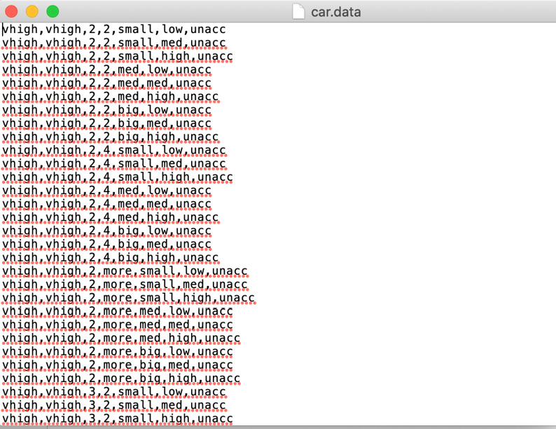


    Caption: Car data

    You will notice from the preceding screenshot that the file doesn\'t
    have a first row containing the headers.

4.  Create a Python list to hold the headers for the data:
    ```
    # data doesn't have headers, so let's create headers
    _headers = ['buying', 'maint', 'doors', 'persons', \
                'lug_boot', 'safety', 'car']
    ```


5.  Now, import the data as shown in the following code snippet:

    ```
    # read in cars dataset
    df = pd.read_csv('https://raw.githubusercontent.com/'\
                     'fenago/data-science/'\
                     'master/Lab07/Dataset/car.data', \
                     names=_headers, index_col=None)
    ```


    You then proceed to import the data into a variable called
    `df` by using `pd.read_csv`. You specify the
    location of the data file, as well as the list of column headers.
    You also specify that the data does not have a column index.

6.  Show the top five records:

    ```
    df.info()
    ```


    In order to get information about the columns in the data as well as
    the number of records, you make use of the `info()`
    method. You should get an output similar to the following:

    
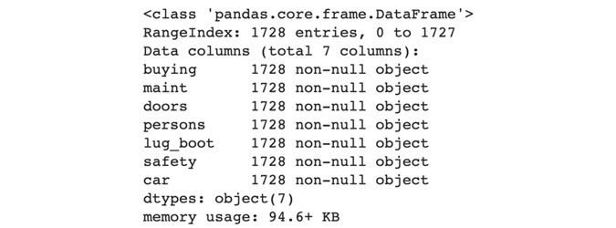


    Caption: The top five records of the DataFrame

    The `RangeIndex` value shows the number of records, which
    is `1728`.

7.  Now, you need to split the data contained in `df` into a
    training dataset and an evaluation dataset:

    ```
    #split the data into 80% for training and 20% for evaluation
    training_df, eval_df = train_test_split(df, train_size=0.8, \
                                            random_state=0)
    ```


    In this step, you make use of `train_test_split` to create
    two new DataFrames called `training_df` and
    `eval_df`.

8.  Check the information of `training_df`:

    ```
    training_df.info()
    ```


    In this step, you make use of `.info()` to get the details
    of `training_df`. This will print out the column names as
    well as the number of records.

    You should get an output similar to the following:

    
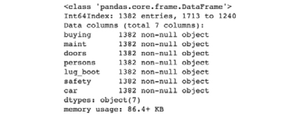


    Caption: Information on training\_df

    You should observe that the column names match those in
    `df`, but you should have `80%` of the records
    that you did in `df`, which is `1382` out of
    `1728`.

9.  Check the information on `eval_df`:

    ```
    eval_df.info()
    ```


    In this step, you print out the information about
    `eval_df`. This will give you the column names and the
    number of records. The output should be similar to the following:

    
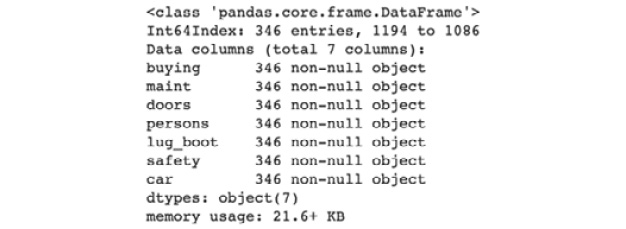


Caption: Information on eval\_df


**Random State**

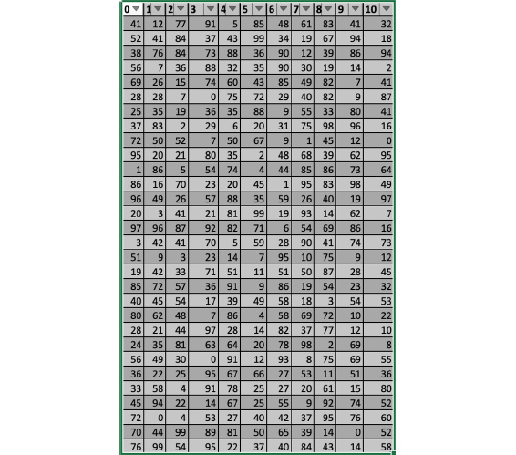

Caption: Numbers generated using random state


Exercise 7.02: Setting a Random State When Splitting Data
---------------------------------------------------------

The goal of this exercise is to have a reproducible way of splitting the
data that you imported in *Exercise 7.01*, *Importing and Splitting
Data*.

Note

We going to refactor the code from the previous exercise. Hence, if you
are using a new Jupyter notebook then make sure you copy the code from the
previous exercise. Alternatively, you can make a copy of the notebook
used in *Exercise 7.01* and use the revised the code as suggested in the
following steps.

The following steps will help you complete the exercise:

1.  Continue from the previous *Exercise 7.01* notebook.

2.  Set the random state as `1` and split the data:

    ```
    """
    split the data into 80% for training and 20% for evaluation 
    using a random state
    """
    training_df, eval_df = train_test_split(df, train_size=0.8, \
                                            random_state=1)
    ```


    In this step, you specify a `random_state` value of 1 to
    the `train_test_split` function.

3.  Now, view the top five records in `training_df`:

    ```
    #view the head of training_eval
    training_df.head()
    ```


    In this step, you print out the first five records in
    `training_df`.

    The output should be similar to the following:

    
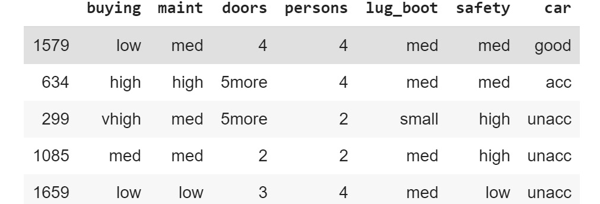


    Caption: The top five rows for the training evaluation set

4.  View the top five records in `eval_df`:

    ```
    #view the top of eval_df
    eval_df.head()
    ```


    In this step, you print out the first five records in
    `eval_df`.

    The output should be similar to the following:

    
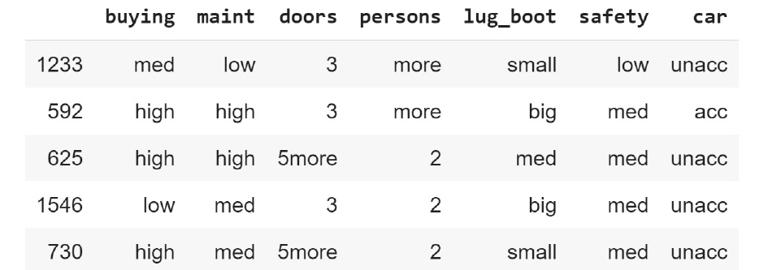


Exercise 7.03: Creating a Five-Fold Cross-Validation Dataset
------------------------------------------------------------

The goal of this exercise is to create a five-fold cross-validation
dataset from the data that you imported in *Exercise 7.01*, *Importing
and Splitting Data*.

Note

If you are using a new Jupyter notebook then make sure you copy the code
from *Exercise 7.01*, *Importing and Splitting Data*. Alternatively, you
can make a copy of the notebook used in *Exercise 7.01* and then use the
code as suggested in the following steps.

The following steps will help you complete the exercise:

1.  Continue from the notebook file of *Exercise 7.01.*

2.  Import all the necessary libraries:

    ```
    from sklearn.model_selection import KFold
    ```


    In this step, you import `KFold` from
    `sklearn.model_selection`.

3.  Now create an instance of the class:

    ```
    _kf = KFold(n_splits=5)
    ```


    In this step, you create an instance of `KFold` and assign
    it to a variable called `_kf`. You specify a value of
    `5` for the `n_splits` parameter so that it
    splits the dataset into five parts.

4.  Now split the data as shown in the following code snippet:

    ```
    indices = _kf.split(df)
    ```


    In this step, you call the `split` method, which is
    `.split()` on `_kf`. The result is stored in a
    variable called `indices`.

5.  Find out what data type `indices` has:

    ```
    print(type(indices))
    ```


    In this step, you inspect the call to split the output returns.

    The output should be a `generator`, as seen in the
    following output:

    


    Caption: Data type for indices

6.  Get the first set of indices:

    ```
    #first set
    train_indices, val_indices = next(indices)
    ```

7.  Create a training dataset as shown in the following code snippet:

    ```
    train_df = df.drop(val_indices)
    train_df.info()
    ```


    In this step, you create a new DataFrame called `train_df`
    by dropping the validation indices from `df`, the
    DataFrame that contains all of the data. This is a subtractive
    operation similar to what is done in set theory. The `df`
    set is a union of `train` and `val`. Once you
    know what `val` is, you can work backward to determine
    `train` by subtracting `val` from
    `df`. If you consider `df` to be a set called
    `A`, `val` to be a set called `B`, and
    train to be a set called `C`, then the following holds
    true:

    


    Caption: Dataframe A

    Similarly, set `C` can be the difference between set
    `A` and set `B`, as depicted in the following:

    


    Caption: Dataframe C

    The way to accomplish this with a pandas DataFrame is to drop the
    rows with the indices of the elements of `B` from
    `A`, which is what you see in the preceding code snippet.

    You can see the result of this by calling the `info()`
    method on the new DataFrame.

    The result of that call should be similar to the following
    screenshot:

    
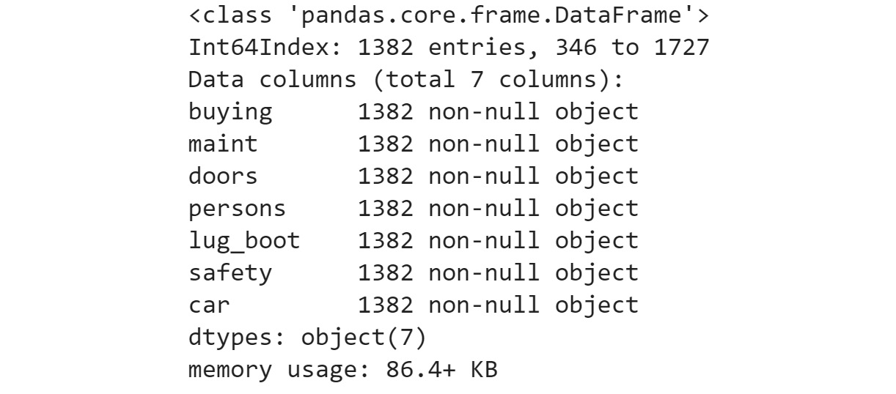


    Caption: Information on the new dataframe

8.  Create a validation dataset:

    ```
    val_df = df.drop(train_indices)
    val_df.info()
    ```


    In this step, you create the `val_df` validation dataset
    by dropping the training indices from the `df` DataFrame.
    Again, you can see the details of this new DataFrame by calling the
    `info()` method.

    The output should be similar to the following:

    
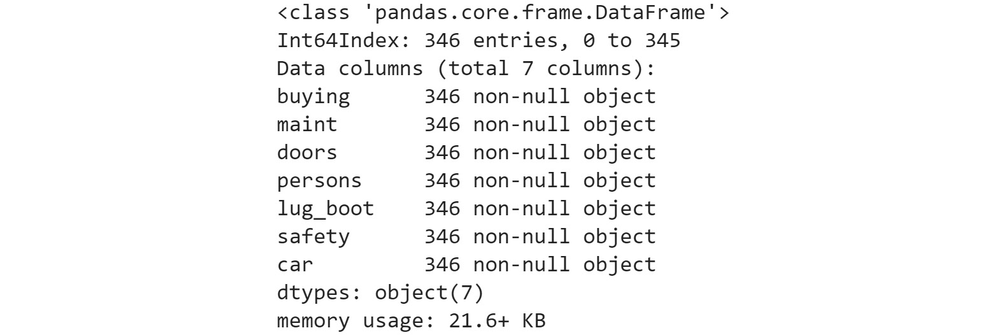


Caption: Information for the validation dataset


Exercise 7.04: Creating a Five-Fold Cross-Validation Dataset Using a Loop for Calls
-----------------------------------------------------------------------------------

The goal of this exercise is to create a five-fold cross-validation
dataset from the data that you imported in *Exercise 7.01*, *Importing
and Splitting Data*. You will make use of a loop for calls to the
generator function.


The following steps will help you complete this exercise:

1.  Open a new Jupyter notebook and repeat the steps you used to import
    data in *Exercise 7.01*, *Importing and Splitting Data*.

2.  Define the number of splits you would like:

    ```
    from sklearn.model_selection import KFold
    #define number of splits
    n_splits = 5
    ```


    In this step, you set the number of splits to `5`. You
    store this in a variable called `n_splits`.

3.  Create an instance of `Kfold`:

    ```
    #create an instance of KFold
    _kf = KFold(n_splits=n_splits)
    ```


    In this step, you create an instance of `Kfold`. You
    assign this instance to a variable called `_kf`.

4.  Generate the split indices:

    ```
    #create splits as _indices
    _indices = _kf.split(df)
    ```


    In this step, you call the `split()` method on
    `_kf`, which is the instance of `KFold` that you
    defined earlier. You provide `df` as a parameter so that
    the splits are performed on the data contained in the DataFrame
    called `df`. The resulting generator is stored as
    `_indices`.

5.  Create two Python lists:

    ```
    _t, _v = [], []
    ```


    In this step, you create two Python lists. The first is called
    `_t` and holds the training DataFrames, and the second is
    called `_v` and holds the validation DataFrames.

6.  Iterate over the generator and create DataFrames called
    `train_idx`, `val_idx`, `_train_df`
    and `_val_df`:

    ```
    #iterate over _indices
    for i in range(n_splits):
        train_idx, val_idx = next(_indices)
        _train_df = df.drop(val_idx)
        _t.append(_train_df)
        _val_df = df.drop(train_idx)
        _v.append(_val_df)
    ```


    In this step, you create a loop using `range` to determine
    the number of iterations. You specify the number of iterations by
    providing `n_splits` as a parameter to
    `range()`. On every iteration, you execute
    `next()` on the `_indices` generator and store
    the results in `train_idx` and `val_idx`. You
    then proceed to create `_train_df` by dropping the
    validation indices, `val_idx`, from `df`. You
    also create `_val_df` by dropping the training indices
    from `df`.

7.  Iterate over the training list:

    ```
    for d in _t:
        print(d.info())
    ```


    In this step, you verify that the compiler created the DataFrames.
    You do this by iterating over the list and using the
    `.info()` method to print out the details of each element.
    The output is similar to the following screenshot, which is
    incomplete due to the size of the output. Each element in the list
    is a DataFrame with 1,382 entries:

    
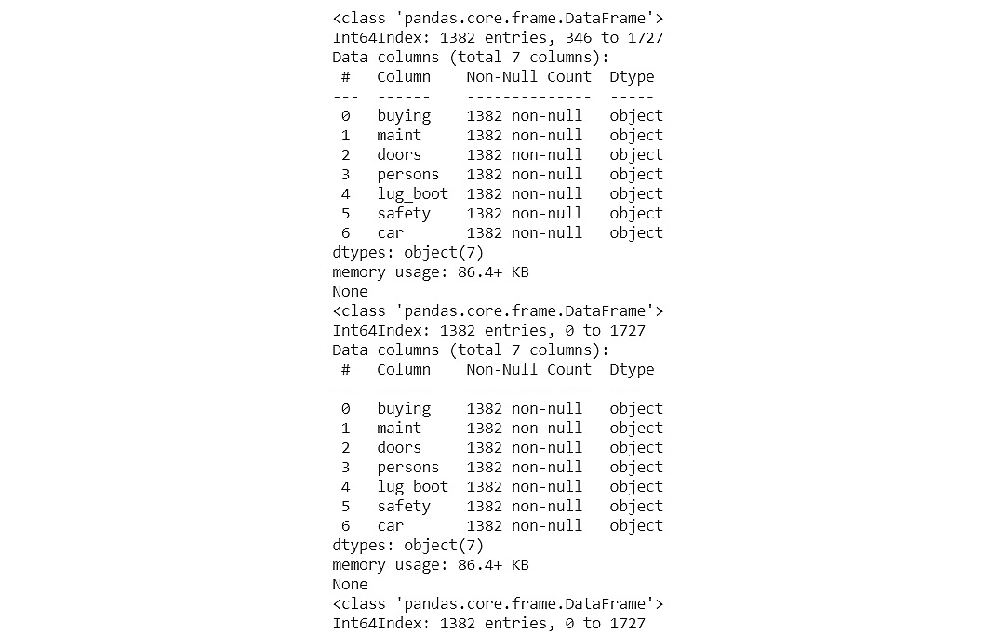


    Caption: Iterating over the training list

    Note

    The preceding output is a truncated version of the actual output.

8.  Iterate over the validation list:

    ```
    for d in _v:
        print(d.info())
    ```


    In this step, you iterate over the validation list and make use of
    `.info()` to print out the details of each element. The
    output is similar to the following screenshot, which is incomplete
    due to the size. Each element is a DataFrame with 346 entries:

    
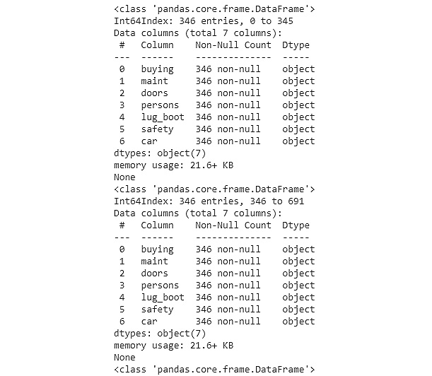


Exercise 7.05: Getting the Scores from Five-Fold Cross-Validation
-----------------------------------------------------------------

The goal of this exercise is to create a five-fold cross-validation
dataset from the data that you imported in *Exercise 7.01*, *Importing
and Splitting Data*. You will then use `cross_val_score` to
get the scores of models trained on those datasets.


The following steps will help you complete the exercise:

1.  Open a new Jupyter notebook and repeat *steps 1-6* that you took to
    import data in *Exercise 7.01*, *Importing and Splitting Data*.

2.  Encode the categorical variables in the dataset:

    ```
    # encode categorical variables
    _df = pd.get_dummies(df, columns=['buying', 'maint', 'doors', \
                                      'persons', 'lug_boot', \
                                      'safety'])
    _df.head()
    ```


    In this step, you make use of `pd.get_dummies()` to
    convert categorical variables into an encoding. You store the result
    in a new DataFrame variable called `_df`. You then proceed
    to take a look at the first five records.

    The result should look similar to the following:

    
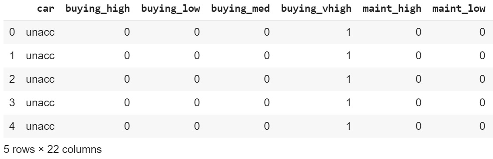


    Caption: Encoding categorical variables

3.  Split the data into features and labels:

    ```
    # separate features and labels DataFrames
    features = _df.drop(['car'], axis=1).values
    labels = _df[['car']].values
    ```


    In this step, you create a `features` DataFrame by
    dropping `car` from `_df`. You also create
    `labels` by selecting only `car` in a new
    DataFrame. Here, a feature and a label are similar in the Cars
    dataset.

4.  Create an instance of the `LogisticRegression` class to be
    used later:

    ```
    from sklearn.linear_model import LogisticRegression
    # create an instance of LogisticRegression
    _lr = LogisticRegression()
    ```


    In this step, you import `LogisticRegression` from
    `sklearn.linear_model`. We use
    `LogisticRegression` because it lets us create a
    classification model, as you learned in *Lab 3, Binary
    Classification*. You then proceed to create an instance and store it
    as `_lr`.

5.  Import the `cross_val_score` function:

    ```
    from sklearn.model_selection import cross_val_score
    ```


    In this step now, you import `cross_val_score`, which you
    will make use of to compute the scores of the models.

6.  Compute the cross-validation scores:

    ```
    _scores = cross_val_score(_lr, features, labels, cv=5)
    ```


7.  Now, display the scores as shown in the following code snippet:

    ```
    print(_scores)
    ```


    In this step, you display the scores using `print()`.

    The output should look similar to the following:

    


Caption: Printing the cross-validation scores


Exercise 7.06: Training a Logistic Regression Model Using Cross-Validation
--------------------------------------------------------------------------

The goal of this exercise is to train a logistic regression model using
cross-validation and get the optimal R2 result. We will be making use of
the Cars dataset that you worked with previously.

The following steps will help you complete the exercise:

1.  Open a new Jupyter notebook.

2.  Import the necessary libraries:

    ```
    # import libraries
    import pandas as pd
    from sklearn.model_selection import train_test_split
    ```


    In this step, you import `pandas` and alias it as
    `pd`. You will make use of pandas to read in the file you
    will be working with.

3.  Create headers for the data:

    ```
    # data doesn't have headers, so let's create headers
    _headers = ['buying', 'maint', 'doors', 'persons', \
                'lug_boot', 'safety', 'car']
    ```


    In this step, you start by creating a Python list to hold the
    `headers` column for the file you will be working with.
    You store this list as `_headers`.

4.  Read the data:

    ```
    # read in cars dataset
    df = pd.read_csv('https://raw.githubusercontent.com/'\
                     'fenago/data-science/'\
                     'master/Lab07/Dataset/car.data', \
                     names=_headers, index_col=None)
    ```


    You then proceed to read in the file and store it as `df`.
    This is a DataFrame.

5.  Print out the top five records:

    ```
    df.info()
    ```


    Finally, you look at the summary of the DataFrame using
    `.info()`.

    The output looks similar to the following:

    
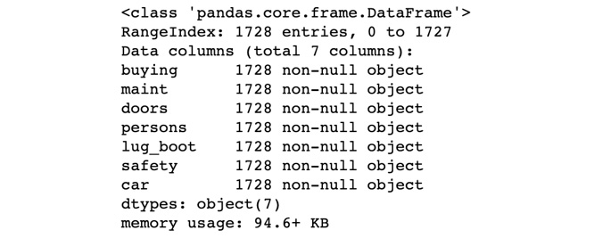


    Caption: The top five records of the dataframe

6.  Encode the categorical variables as shown in the following code
    snippet:

    ```
    # encode categorical variables
    _df = pd.get_dummies(df, columns=['buying', 'maint', 'doors', \
                                      'persons', 'lug_boot', \
                                      'safety'])
    _df.head()
    ```


    In this step, you convert categorical variables into encodings using
    the `get_dummies()` method from pandas. You supply the
    original DataFrame as a parameter and also specify the columns you
    would like to encode.

    Finally, you take a peek at the top five rows. The output looks
    similar to the following:

    
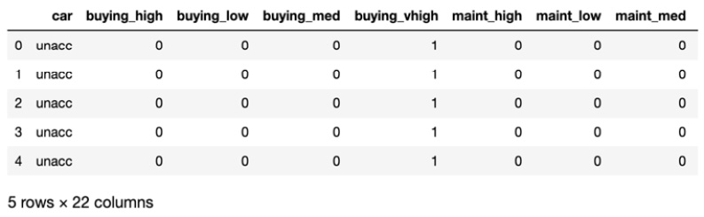


    Caption: Encoding categorical variables

7.  Split the DataFrame into features and labels:

    ```
    # separate features and labels DataFrames
    features = _df.drop(['car'], axis=1).values
    labels = _df[['car']].values
    ```


    In this step, you create two NumPy arrays. The first, called
    `features`, contains the independent variables. The
    second, called `labels`, contains the values that the
    model learns to predict. These are also called `targets`.

8.  Import logistic regression with cross-validation:

    ```
    from sklearn.linear_model import LogisticRegressionCV
    ```


    In this step, you import the `LogisticRegressionCV` class.

9.  Instantiate `LogisticRegressionCV` as shown in the
    following code snippet:

    ```
    model = LogisticRegressionCV(max_iter=2000, multi_class='auto',\
                                 cv=5)
    ```


    In this step, you create an instance of
    `LogisticRegressionCV`. You specify the following
    parameters:

    `max_iter` : You set this to `2000` so that the
    trainer continues training for `2000` iterations to find
    better weights.

    `multi_class`: You set this to `auto` so that
    the model automatically detects that your data has more than two
    classes.

    `cv`: You set this to `5`, which is the number
    of cross-validation sets you would like to train on.

10. Now fit the model:

    ```
    model.fit(features, labels.ravel())
    ```


    In this step, you train the model. You pass in `features`
    and `labels`. Because `labels` is a 2D array,
    you make use of `ravel()` to convert it into a 1D array
    or vector.

    The interpreter produces an output similar to the following:

    
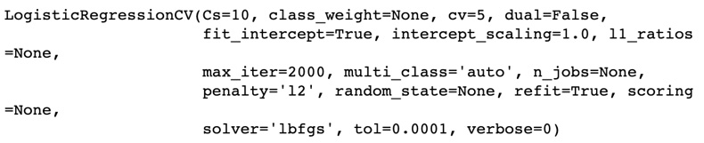


    Caption: Fitting the model

    In the preceding output, you see that the model fits the training
    data. The output shows you the parameters that were used in
    training, so you are not taken by surprise. Notice, for example,
    that `max_iter` is `2000`, which is the value
    that you set. Other parameters you didn\'t set make use of default
    values, which you can find out more about from the documentation.

11. Evaluate the training R2:

    ```
    print(model.score(features, labels.ravel()))
    ```


    In this step, we make use of the training dataset to compute the R2
    score. While we didn\'t set aside a specific validation dataset, it
    is important to note that the model only saw 80% of our training
    data, so it still has new data to work with for this evaluation.

    The output looks similar to the following:

    


Exercise 7.07: Using Grid Search with Cross-Validation to Find the Best Parameters for a Model
----------------------------------------------------------------------------------------------

The goal of this exercise is to make use of grid search to find the best
parameters for a `DecisionTree` classifier. We will be making
use of the Cars dataset that you worked with previously.

The following steps will help you complete the exercise:

1.  Open a Jupyter notebook file.

2.  Import `pandas`:

    ```
    import pandas as pd
    ```


    In this step, you import `pandas`. You alias it as
    `pd`. `Pandas` is used to read in the data you
    will work with subsequently.

3.  Create `headers`:
    ```
    _headers = ['buying', 'maint', 'doors', 'persons', \
                'lug_boot', 'safety', 'car']
    ```


4.  Read in the `headers`:
    ```
    # read in cars dataset
    df = pd.read_csv('https://raw.githubusercontent.com/'\
                     'fenago/data-science/'\
                     'master/Lab07/Dataset/car.data', \
                     names=_headers, index_col=None)
    ```


5.  Inspect the top five records:

    ```
    df.info()
    ```


    The output looks similar to the following:

    
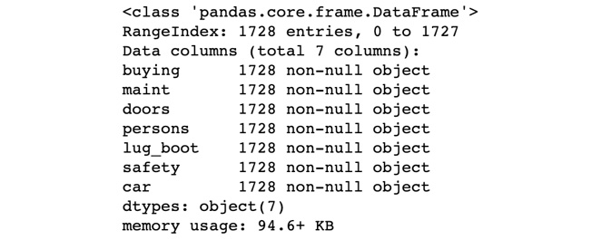


    Caption: The top five records of the dataframe

6.  Encode the categorical variables:

    ```
    _df = pd.get_dummies(df, columns=['buying', 'maint', 'doors',\
                                      'persons', 'lug_boot', \
                                      'safety'])
    _df.head()
    ```


    In this step, you utilize `.get_dummies()` to convert the
    categorical variables into encodings. The `.head()` method
    instructs the Python interpreter to output the top five columns.

    The output is similar to the following:

    
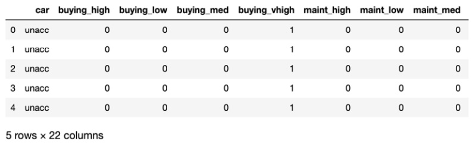


    Caption: Encoding categorical variables

7.  Separate `features` and `labels`:

    ```
    features = _df.drop(['car'], axis=1).values
    labels = _df[['car']].values
    ```


    In this step, you create two `numpy` arrays,
    `features` and `labels`, the first containing
    independent variables or predictors, and the second containing
    dependent variables or targets.

8.  Import more libraries -- `numpy`,
    `DecisionTreeClassifier`, and `GridSearchCV`:

    ```
    import numpy as np
    from sklearn.tree import DecisionTreeClassifier
    from sklearn.model_selection import GridSearchCV
    ```


9.  Instantiate the decision tree:

    ```
    clf = DecisionTreeClassifier()
    ```


    In this step, you create an instance of
    `DecisionTreeClassifier` as `clf`. This instance
    will be used repeatedly by the grid search.

10. Create parameters -- `max_depth`:

    ```
    params = {'max_depth': np.arange(1, 8)}
    ```


    In this step, you create a dictionary of parameters. There are two
    parts to this dictionary:

    The key of the dictionary is a parameter that is passed into the
    model. In this case, `max_depth` is a parameter that
    `DecisionTreeClassifier` takes.

    The value is a Python list that grid search iterates over and passes
    to the model. In this case, we create an array that starts at 1 and
    ends at 7, inclusive.

11. Instantiate the grid search as shown in the following code snippet:

    ```
    clf_cv = GridSearchCV(clf, param_grid=params, cv=5)
    ```


    In this step, you create an instance of `GridSearchCV`.
    The first parameter is the model to train. The second parameter is
    the parameters to search over. The third parameter is the number of
    cross-validation splits to create.

12. Now train the models:

    ```
    clf_cv.fit(features, labels)
    ```


    In this step, you train the models using the features and labels.
    Depending on the type of model, this could take a while. Because we
    are using a decision tree, it trains quickly.

    The output is similar to the following:

    
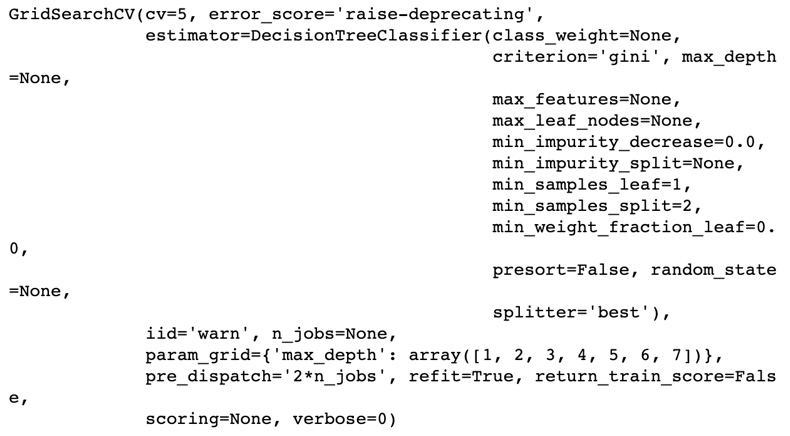


    Caption: Training the model

    You can learn a lot by reading the output, such as the number of
    cross-validation datasets created (called `cv` and equal
    to `5`), the estimator used
    (`DecisionTreeClassifier`), and the parameter search space
    (called `param_grid`).

13. Print the best parameter:

    ```
    print("Tuned Decision Tree Parameters: {}"\
          .format(clf_cv.best_params_))
    ```


    In this step, you print out what the best parameter is. In this
    case, what we were looking for was the best `max_depth`.
    The output looks like the following:

    


    Caption: Printing the best parameter

    In the preceding output, you see that the best performing model is
    one with a `max_depth` of `2`.

    Accessing `best_params_` lets you train another model with
    the best-known parameters using a larger training dataset.

14. Print the best `R2`:

    ```
    print("Best score is {}".format(clf_cv.best_score_))
    ```


    In this step, you print out the `R2` score of the best
    performing model.

    The output is similar to the following:

    ```
    Best score is 0.7777777777777778
    ```


    In the preceding output, you see that the best performing model has
    an `R2` score of `0.778`.

15. Access the best model:

    ```
    model = clf_cv.best_estimator_
    model
    ```


    In this step, you access the best model (or estimator) using
    `best_estimator_`. This will let you analyze the model, or
    optionally use it to make predictions and find other metrics.
    Instructing the Python interpreter to print the best estimator will
    yield an output similar to the following:

    
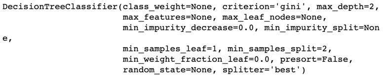


Caption: Accessing the model

In the preceding output, you see that the best model is
`DecisionTreeClassifier` with a `max_depth` of
`2`.


Hyperparameter Tuning with RandomizedSearchCV
=============================================


Grid search goes over the entire search space and trains a model or
estimator for every combination of parameters. Randomized search goes
over only some of the combinations. This is a more optimal use of
resources and still provides the benefits of hyperparameter tuning and
cross-validation. You will be looking at this in depth in *Lab 8,
Hyperparameter Tuning*.

Have a look at the following exercise.


Exercise 7.08: Using Randomized Search for Hyperparameter Tuning
----------------------------------------------------------------

The goal of this exercise is to perform hyperparameter tuning using
randomized search and cross-validation.

The following steps will help you complete this exercise:

1.  Open a new Jupyter notebook file.

2.  Import `pandas`:

    ```
    import pandas as pd
    ```


    In this step, you import `pandas`. You will make use of it
    in the next step.

3.  Create `headers`:
    ```
    _headers = ['buying', 'maint', 'doors', 'persons', \
                'lug_boot', 'safety', 'car']
    ```


4.  Read in the data:
    ```
    # read in cars dataset
    df = pd.read_csv('https://raw.githubusercontent.com/'\
                     'fenago/data-science/'\
                     'master/Lab07/Dataset/car.data', \
                     names=_headers, index_col=None)
    ```


5.  Check the first five rows:

    ```
    df.info()
    ```


    You need to provide a Python list of column headers because the data
    does not contain column headers. You also inspect the DataFrame that
    you created.

    The output is similar to the following:

    
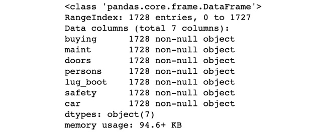


    Caption: The top five rows of the DataFrame

6.  Encode categorical variables as shown in the following code snippet:

    ```
    _df = pd.get_dummies(df, columns=['buying', 'maint', 'doors',\
                                      'persons', 'lug_boot', \
                                      'safety'])
    _df.head()
    ```


    In this step, you find a numerical representation of text data using
    one-hot encoding. The operation results in a new DataFrame. You will
    see that the resulting data structure looks similar to the
    following:

    
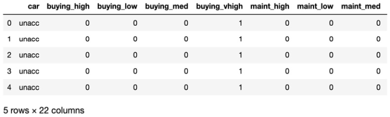


    Caption: Encoding categorical variables

7.  Separate the data into independent and dependent variables, which
    are the `features` and `labels`:

    ```
    features = _df.drop(['car'], axis=1).values
    labels = _df[['car']].values
    ```


    In this step, you separate the DataFrame into two `numpy`
    arrays called `features` and `labels`.
    `Features` contains the independent variables, while
    `labels` contains the target or dependent variables.

8.  Import additional libraries -- `numpy`,
    `RandomForestClassifier`, and
    `RandomizedSearchCV`:

    ```
    import numpy as np
    from sklearn.ensemble import RandomForestClassifier
    from sklearn.model_selection import RandomizedSearchCV
    ```


    In this step, you import `numpy` for numerical
    computations, `RandomForestClassifier` to create an
    ensemble of estimators, and `RandomizedSearchCV` to
    perform a randomized search with cross-validation.

9.  Create an instance of `RandomForestClassifier`:

    ```
    clf = RandomForestClassifier()
    ```


    In this step, you instantiate `RandomForestClassifier`. A
    random forest classifier is a voting classifier. It makes use of
    multiple decision trees, which are trained on different subsets of
    the data. The results from the trees contribute to the output of the
    random forest by using a voting mechanism.

10. Specify the parameters:

    ```
    params = {'n_estimators':[500, 1000, 2000], \
              'max_depth': np.arange(1, 8)}
    ```


    `RandomForestClassifier` accepts many parameters, but we
    specify two: the number of trees in the forest, called
    `n_estimators`, and the depth of the nodes in each tree,
    called `max_depth`.

11. Instantiate a randomized search:

    ```
    clf_cv = RandomizedSearchCV(clf, param_distributions=params, \
                                cv=5)
    ```


    In this step, you specify three parameters when you instantiate the
    `clf` class, the estimator, or model to use, which is a
    random forest classifier, `param_distributions`, the
    parameter search space, and `cv`, the number of
    cross-validation datasets to create.

12. Perform the search:

    ```
    clf_cv.fit(features, labels.ravel())
    ```


    In this step, you perform the search by calling `fit()`.
    This operation trains different models using the cross-validation
    datasets and various combinations of the hyperparameters. The output
    from this operation is similar to the following:

    
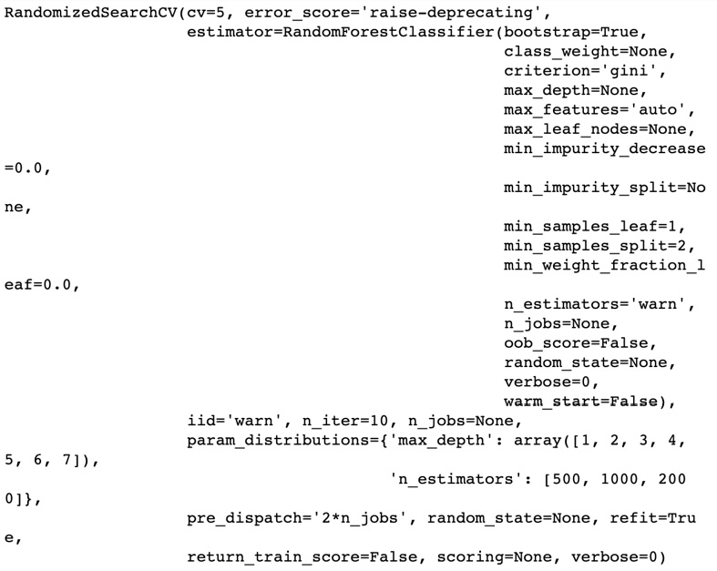


    Caption: Output of the search operation

    In the preceding output, you see that the randomized search will be
    carried out using cross-validation with five splits
    (`cv=5`). The estimator to be used is
    `RandomForestClassifier`.

13. Print the best parameter combination:

    ```
    print("Tuned Random Forest Parameters: {}"\
          .format(clf_cv.best_params_))
    ```


    In this step, you print out the best hyperparameters.

    The output is similar to the following:

    
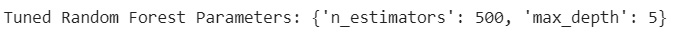


    Caption: Printing the best parameter combination

    In the preceding output, you see that the best estimator is a Random
    Forest classifier with 1,000 trees (`n_estimators=1000`)
    and `max_depth=5`. You can print the best score by
    executing
    `print("Best score is {}".format(clf_cv.best_score_))`.
    For this exercise, this value is \~ `0.76`.

14. Inspect the best model:

    ```
    model = clf_cv.best_estimator_
    model
    ```


    In this step, you find the best performing estimator (or model) and
    print out its details. The output is similar to the following:

    
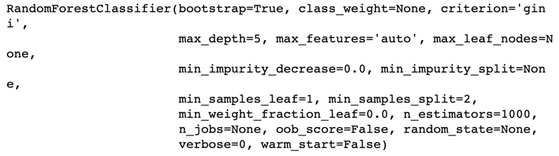


Caption: Inspecting the model

In the preceding output, you see that the best estimator is
`RandomForestClassifier` with `n_estimators=1000`
and `max_depth=5`.


Exercise 7.09: Fixing Model Overfitting Using Lasso Regression
--------------------------------------------------------------

The goal of this exercise is to teach you how to identify when your
model starts overfitting, and to use lasso regression to fix overfitting
in your model.


The attribute information states \"Features consist of hourly average
ambient variables:

- Temperature (T) in the range 1.81°C and 37.11°C,
- Ambient Pressure (AP) in the range 992.89-1033.30 millibar,
- Relative Humidity (RH) in the range 25.56% to 100.16%
- Exhaust Vacuum (V) in the range 25.36-81.56 cm Hg
- Net hourly electrical energy output (EP) 420.26-495.76 MW

The averages are taken from various sensors located around the plant
that record the ambient variables every second. The variables are given
without normalization.\"

The following steps will help you complete the exercise:

1.  Open a Jupyter notebook.

2.  Import the required libraries:
    ```
    import pandas as pd
    from sklearn.model_selection import train_test_split
    from sklearn.linear_model import LinearRegression, Lasso
    from sklearn.metrics import mean_squared_error
    from sklearn.pipeline import Pipeline
    from sklearn.preprocessing import MinMaxScaler, \
    PolynomialFeatures
    ```


3.  Read in the data:
    ```
    _df = pd.read_csv('https://raw.githubusercontent.com/'\
                      'fenago/data-science/'\
                      'master/Lab07/Dataset/ccpp.csv')
    ```


4.  Inspect the DataFrame:

    ```
    _df.info()
    ```


    The `.info()` method prints out a summary of the
    DataFrame, including the names of the columns and the number of
    records. The output might be similar to the following:

    
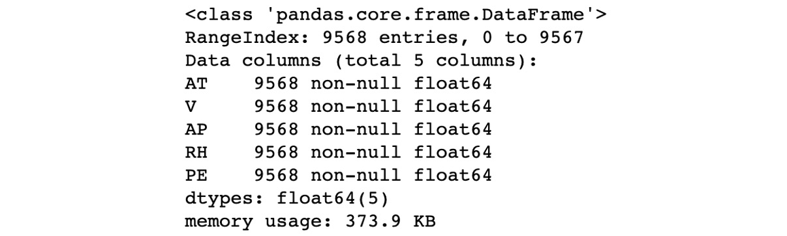


    Caption: Inspecting the dataframe

    You can see from the preceding figure that the DataFrame has 5
    columns and 9,568 records. You can see that all columns contain
    numeric data and that the columns have the following names:
    `AT`, `V`, `AP`, `RH`, and
    `PE`.

5.  Extract features into a column called `X`:
    ```
    X = _df.drop(['PE'], axis=1).values
    ```


6.  Extract labels into a column called `y`:
    ```
    y = _df['PE'].values
    ```


7.  Split the data into training and evaluation sets:
    ```
    train_X, eval_X, train_y, eval_y = train_test_split\
                                       (X, y, train_size=0.8, \
                                        random_state=0)
    ```


8.  Create an instance of a `LinearRegression` model:
    ```
    lr_model_1 = LinearRegression()
    ```


9.  Fit the model on the training data:

    ```
    lr_model_1.fit(train_X, train_y)
    ```


    The output from this step should look similar to the following:

    
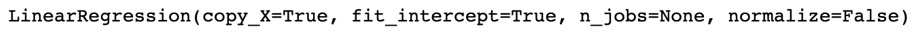


    Caption: Fitting the model on training data

10. Use the model to make predictions on the evaluation dataset:
    ```
    lr_model_1_preds = lr_model_1.predict(eval_X)
    ```


11. Print out the `R2` score of the model:

    ```
    print('lr_model_1 R2 Score: {}'\
          .format(lr_model_1.score(eval_X, eval_y)))
    ```


    The output of this step should look similar to the following:

    


    Caption: Printing the R2 score

    You will notice that the `R2` score for this model is
    `0.926`. You will make use of this figure to compare with
    the next model you train. Recall that this is an evaluation metric.

12. Print out the Mean Squared Error (MSE) of this model:

    ```
    print('lr_model_1 MSE: {}'\
          .format(mean_squared_error(eval_y, lr_model_1_preds)))
    ```


    The output of this step should look similar to the following:

    


    Caption: Printing the MSE

    You will notice that the MSE is `21.675`. This is an
    evaluation metric that you will use to compare this model to
    subsequent models.

    The first model was trained on four features. You will now train a
    new model on four cubed features.

13. Create a list of tuples to serve as a pipeline:

    ```
    steps = [('scaler', MinMaxScaler()),\
             ('poly', PolynomialFeatures(degree=3)),\
             ('lr', LinearRegression())]
    ```


    In this step, you create a list with three tuples. The first tuple
    represents a scaling operation that makes use of
    `MinMaxScaler`. The second tuple represents a feature
    engineering step and makes use of `PolynomialFeatures`.
    The third tuple represents a `LinearRegression` model.

    The first element of the tuple represents the name of the step,
    while the second element represents the class that performs a
    transformation or an estimator.

14. Create an instance of a pipeline:
    ```
    lr_model_2 = Pipeline(steps)
    ```


15. Train the instance of the pipeline:

    ```
    lr_model_2.fit(train_X, train_y)
    ```


    The pipeline implements a `.fit()` method, which is also
    implemented in all instances of transformers and estimators. The
    `.fit()` method causes `.fit_transform()` to be
    called on transformers, and causes `.fit()` to be called
    on estimators. The output of this step is similar to the following:

    
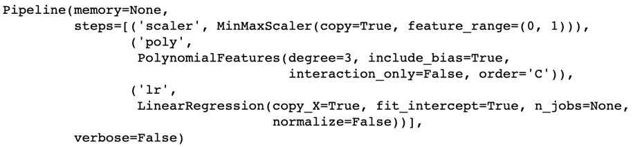


    Caption: Training the instance of the pipeline

    You can see from the output that a pipeline was trained. You can see
    that the steps are made up of `MinMaxScaler` and
    `PolynomialFeatures`, and that the final step is made up
    of `LinearRegression`.

16. Print out the `R2` score of the model:

    ```
    print('lr_model_2 R2 Score: {}'\
          .format(lr_model_2.score(eval_X, eval_y)))
    ```


    The output is similar to the following:

    


    Caption: The R2 score of the model

    You can see from the preceding that the `R2` score is
    `0.944`, which is better than the `R2` score of
    the first model, which was `0.932`. You can start to
    observe that the metrics suggest that this model is better than the
    first one.

17. Use the model to predict on the evaluation data:
    ```
    lr_model_2_preds = lr_model_2.predict(eval_X)
    ```


18. Print the MSE of the second model:

    ```
    print('lr_model_2 MSE: {}'\
          .format(mean_squared_error(eval_y, lr_model_2_preds)))
    ```


    The output is similar to the following:

    


    Caption: The MSE of the second model

    You can see from the output that the MSE of the second model is
    `16.27`. This is less than the MSE of the first model,
    which is `19.73`. You can safely conclude that the second
    model is better than the first.

19. Inspect the model coefficients (also called weights):

    ```
    print(lr_model_2[-1].coef_)
    ```


    In this step, you will note that `lr_model_2` is a
    pipeline. The final object in this pipeline is the model, so you
    make use of list addressing to access this by setting the index of
    the list element to `-1`.

    Once you have the model, which is the final element in the pipeline,
    you make use of `.coef_` to get the model coefficients.
    The output is similar to the following:

    
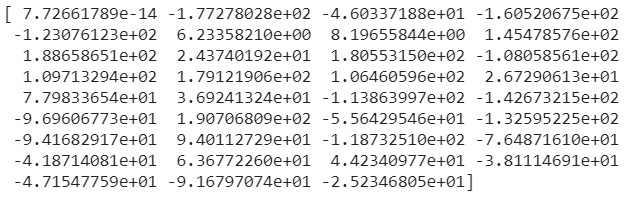


    Caption: Print the model coefficients

    You will note from the preceding output that the majority of the
    values are in the tens, some values are in the hundreds, and one
    value has a really small magnitude.

20. Check for the number of coefficients in this model:

    ```
    print(len(lr_model_2[-1].coef_))
    ```


    The output for this step is similar to the following:

    ```
    35
    ```


    You can see from the preceding screenshot that the second model has
    `35` coefficients.

21. Create a `steps` list with `PolynomialFeatures`
    of degree `10`:
    ```
    steps = [('scaler', MinMaxScaler()),\
             ('poly', PolynomialFeatures(degree=10)),\
             ('lr', LinearRegression())]
    ```


22. Create a third model from the preceding steps:
    ```
    lr_model_3 = Pipeline(steps)
    ```


23. Fit the third model on the training data:

    ```
    lr_model_3.fit(train_X, train_y)
    ```


    The output from this step is similar to the following:

    
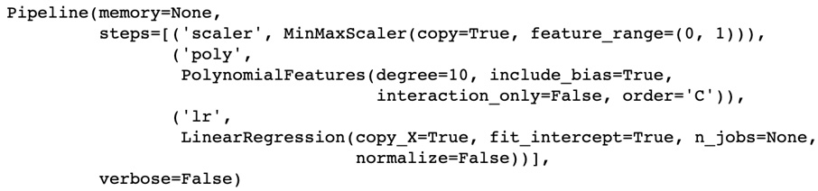


    Caption: Fitting the third model on the data

    You can see from the output that the pipeline makes use of
    `PolynomialFeatures` of degree `10`. You are
    doing this in the hope of getting a better model.

24. Print out the `R2` score of this model:

    ```
    print('lr_model_3 R2 Score: {}'\
          .format(lr_model_3.score(eval_X, eval_y)))
    ```


    The output of this model is similar to the following:

    


    Caption: R2 score of the model

    You can see from the preceding figure that the R2 score is now
    `0.56`. The previous model had an `R2` score of
    `0.944`. This model has an R2 score that is considerably
    worse than the one of the previous model, `lr_model_2`.
    This happens when your model is overfitting.

25. Use `lr_model_3` to predict on evaluation data:
    ```
    lr_model_3_preds = lr_model_3.predict(eval_X)
    ```


26. Print out the MSE for `lr_model_3`:

    ```
    print('lr_model_3 MSE: {}'\
          .format(mean_squared_error(eval_y, lr_model_3_preds)))
    ```


    The output for this step might be similar to the following:

    


    Caption: The MSE of the model

    You can see from the preceding figure that the MSE is also
    considerably worse. The MSE is `126.25`, as compared to
    `16.27` for the previous model.

27. Print out the number of coefficients (also called weights) in this
    model:

    ```
    print(len(lr_model_3[-1].coef_))
    ```


    The output might resemble the following:

    


    Caption: Printing the number of coefficients

    You can see that the model has 1,001 coefficients.

28. Inspect the first 35 coefficients to get a sense of the individual
    magnitudes:

    ```
    print(lr_model_3[-1].coef_[:35])
    ```


    The output might be similar to the following:

    
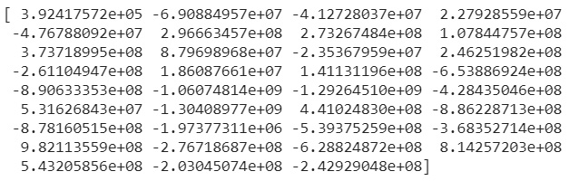


    Caption: Inspecting the first 35 coefficients

    You can see from the output that the coefficients have significantly
    larger magnitudes than the coefficients from `lr_model_2`.

    In the next steps, you will train a lasso regression model on the
    same set of features to reduce overfitting.

29. Create a list of steps for the pipeline you will create later on:

    ```
    steps = [('scaler', MinMaxScaler()),\
             ('poly', PolynomialFeatures(degree=10)),\
             ('lr', Lasso(alpha=0.01))]
    ```


    You create a list of steps for the pipeline you will create. Note
    that the third step in this list is an instance of lasso. The
    parameter called `alpha` in the call to
    `Lasso()` is the regularization parameter. You can play
    around with any values from 0 to 1 to see how it affects the
    performance of the model that you train.

30. Create an instance of a pipeline:
    ```
    lasso_model = Pipeline(steps)
    ```


31. Fit the pipeline on the training data:

    ```
    lasso_model.fit(train_X, train_y)
    ```


    The output from this operation might be similar to the following:

    
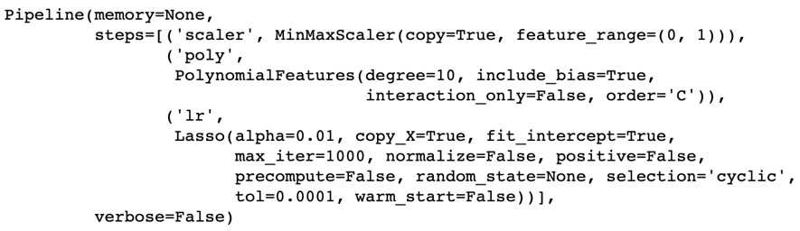


    Caption: Fitting the pipeline on the training data

    You can see from the output that the pipeline trained a lasso model
    in the final step. The regularization parameter was `0.01`
    and the model trained for a maximum of 1,000 iterations.

32. Print the `R2` score of `lasso_model`:

    ```
    print('lasso_model R2 Score: {}'\
          .format(lasso_model.score(eval_X, eval_y)))
    ```


    The output of this step might be similar to the following:

    


    Caption: R2 score

    You can see that the `R2` score has climbed back up to
    `0.94`, which is considerably better than the score of
    `0.56` that `lr_model_3` had. This is already
    looking like a better model.

33. Use `lasso_model` to predict on the evaluation data:
    ```
    lasso_preds = lasso_model.predict(eval_X)
    ```


34. Print the MSE of `lasso_model`:

    ```
    print('lasso_model MSE: {}'\
          .format(mean_squared_error(eval_y, lasso_preds)))
    ```


    The output might be similar to the following:

    


    Caption: MSE of lasso model

    You can see from the output that the MSE is `17.01`, which
    is way lower than the MSE value of `126.25` that
    `lr_model_3` had. You can safely conclude that this is a
    much better model.

35. Print out the number of coefficients in `lasso_model`:

    ```
    print(len(lasso_model[-1].coef_))
    ```


    The output might be similar to the following:

    ```
    1001
    ```


    You can see that this model has 1,001 coefficients, which is the
    same number of coefficients that `lr_model_3` had.

36. Print out the values of the first 35 coefficients:

    ```
    print(lasso_model[-1].coef_[:35])
    ```


    The output might be similar to the following:

    
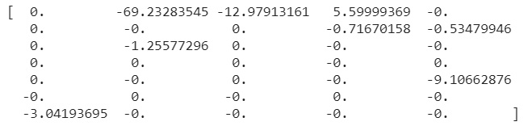


Caption: Printing the values of 35 coefficients

You can see from the preceding output that some of the coefficients are
set to `0`. This has the effect of ignoring the corresponding
column of data in the input. You can also see that the remaining
coefficients have magnitudes of less than 100. This goes to show that
the model is no longer overfitting.

This exercise taught you how to fix overfitting by using
`LassoRegression` to train a new model.

In the next section, you will learn about using ridge regression to
solve overfitting in a model.


Ridge Regression
================


You just learned about lasso regression, which introduces a penalty and
tries to eliminate certain features from the data. Ridge regression
takes an alternative approach by introducing a penalty that penalizes
large weights. As a result, the optimization process tries to reduce the
magnitude of the coefficients without completely eliminating them.


Exercise 7.10: Fixing Model Overfitting Using Ridge Regression
--------------------------------------------------------------

The goal of this exercise is to teach you how to identify when your
model starts overfitting, and to use ridge regression to fix overfitting
in your model.

Note

You will be using the same dataset as in *Exercise 7.09*, *Fixing Model
Overfitting Using Lasso Regression.*

The following steps will help you complete the exercise:

1.  Open a Jupyter notebook.

2.  Import the required libraries:
    ```
    import pandas as pd
    from sklearn.model_selection import train_test_split
    from sklearn.linear_model import LinearRegression, Ridge
    from sklearn.metrics import mean_squared_error
    from sklearn.pipeline import Pipeline
    from sklearn.preprocessing import MinMaxScaler, \
    PolynomialFeatures
    ```


3.  Read in the data:
    ```
    _df = pd.read_csv('https://raw.githubusercontent.com/'\
                      'fenago/data-science/'\
                      'master/Lab07/Dataset/ccpp.csv')
    ```


4.  Inspect the DataFrame:

    ```
    _df.info()
    ```


    The `.info()` method prints out a summary of the
    DataFrame, including the names of the columns and the number of
    records. The output might be similar to the following:

    
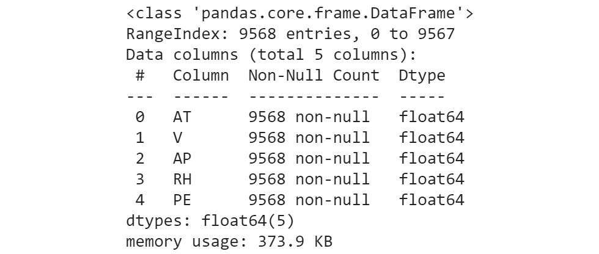


    Caption: Inspecting the dataframe

    You can see from the preceding figure that the DataFrame has 5
    columns and 9,568 records. You can see that all columns contain
    numeric data and that the columns have the names: `AT`,
    `V`, `AP`, `RH`, and `PE`.

5.  Extract features into a column called `X`:
    ```
    X = _df.drop(['PE'], axis=1).values
    ```


6.  Extract labels into a column called `y`:
    ```
    y = _df['PE'].values
    ```


7.  Split the data into training and evaluation sets:
    ```
    train_X, eval_X, train_y, eval_y = train_test_split\
                                       (X, y, train_size=0.8, \
                                        random_state=0)
    ```


8.  Create an instance of a `LinearRegression` model:
    ```
    lr_model_1 = LinearRegression()
    ```


9.  Fit the model on the training data:

    ```
    lr_model_1.fit(train_X, train_y)
    ```


    The output from this step should look similar to the following:

    
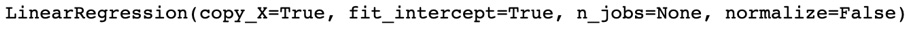


    Caption: Fitting the model on data

10. Use the model to make predictions on the evaluation dataset:
    ```
    lr_model_1_preds = lr_model_1.predict(eval_X)
    ```


11. Print out the `R2` score of the model:

    ```
    print('lr_model_1 R2 Score: {}'\
          .format(lr_model_1.score(eval_X, eval_y)))
    ```


    The output of this step should look similar to the following:

    


    Caption: R2 score

    You will notice that the R2 score for this model is
    `0.933`. You will make use of this figure to compare it
    with the next model you train. Recall that this is an evaluation
    metric.

12. Print out the MSE of this model:

    ```
    print('lr_model_1 MSE: {}'\
          .format(mean_squared_error(eval_y, lr_model_1_preds)))
    ```


    The output of this step should look similar to the following:

    


    Caption: The MSE of the model

    You will notice that the MSE is `19.734`. This is an
    evaluation metric that you will use to compare this model to
    subsequent models.

    The first model was trained on four features. You will now train a
    new model on four cubed features.

13. Create a list of tuples to serve as a pipeline:

    ```
    steps = [('scaler', MinMaxScaler()),\
             ('poly', PolynomialFeatures(degree=3)),\
             ('lr', LinearRegression())]
    ```


    In this step, you create a list with three tuples. The first tuple
    represents a scaling operation that makes use of
    `MinMaxScaler`. The second tuple represents a feature
    engineering step and makes use of `PolynomialFeatures`.
    The third tuple represents a `LinearRegression` model.

    The first element of the tuple represents the name of the step,
    while the second element represents the class that performs a
    transformation or an estimation.

14. Create an instance of a pipeline:
    ```
    lr_model_2 = Pipeline(steps)
    ```


15. Train the instance of the pipeline:

    ```
    lr_model_2.fit(train_X, train_y)
    ```


    The pipeline implements a `.fit()` method, which is also
    implemented in all instances of transformers and estimators. The
    `.fit()` method causes `.fit_transform()` to be
    called on transformers, and causes `.fit()` to be called
    on estimators. The output of this step is similar to the following:

    


    Caption: Training the instance of a pipeline

    You can see from the output that a pipeline was trained. You can see
    that the steps are made up of `MinMaxScaler` and
    `PolynomialFeatures`, and that the final step is made up
    of `LinearRegression`.

16. Print out the `R2` score of the model:

    ```
    print('lr_model_2 R2 Score: {}'\
          .format(lr_model_2.score(eval_X, eval_y)))
    ```


    The output is similar to the following:

    


    Caption: R2 score

    You can see from the preceding that the R2 score is
    `0.944`, which is better than the R2 score of the first
    model, which was `0.933`. You can start to observe that
    the metrics suggest that this model is better than the first one.

17. Use the model to predict on the evaluation data:
    ```
    lr_model_2_preds = lr_model_2.predict(eval_X)
    ```


18. Print the MSE of the second model:

    ```
    print('lr_model_2 MSE: {}'\
          .format(mean_squared_error(eval_y, lr_model_2_preds)))
    ```


    The output is similar to the following:

    


    Caption: The MSE of the model

    You can see from the output that the MSE of the second model is
    `16.272`. This is less than the MSE of the first model,
    which is `19.734`. You can safely conclude that the second
    model is better than the first.

19. Inspect the model coefficients (also called weights):

    ```
    print(lr_model_2[-1].coef_)
    ```


    In this step, you will note that `lr_model_2` is a
    pipeline. The final object in this pipeline is the model, so you
    make use of list addressing to access this by setting the index of
    the list element to `-1`.

    Once you have the model, which is the final element in the pipeline,
    you make use of `.coef_` to get the model coefficients.
    The output is similar to the following:

    
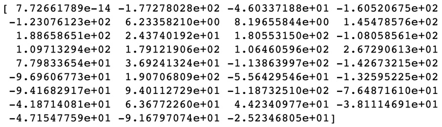


    Caption: Printing model coefficients

    You will note from the preceding output that the majority of the
    values are in the tens, some values are in the hundreds, and one
    value has a really small magnitude.

20. Check the number of coefficients in this model:

    ```
    print(len(lr_model_2[-1].coef_))
    ```


    The output of this step is similar to the following:

    


    Caption: Checking the number of coefficients

    You will see from the preceding that the second model has 35
    coefficients.

21. Create a `steps` list with `PolynomialFeatures`
    of degree `10`:
    ```
    steps = [('scaler', MinMaxScaler()),\
             ('poly', PolynomialFeatures(degree=10)),\
             ('lr', LinearRegression())]
    ```


22. Create a third model from the preceding steps:
    ```
    lr_model_3 = Pipeline(steps)
    ```


23. Fit the third model on the training data:

    ```
    lr_model_3.fit(train_X, train_y)
    ```


    The output from this step is similar to the following:

    


    Caption: Fitting lr\_model\_3 on the training data

    You can see from the output that the pipeline makes use of
    `PolynomialFeatures` of degree `10`. You are
    doing this in the hope of getting a better model.

24. Print out the `R2` score of this model:

    ```
    print('lr_model_3 R2 Score: {}'\
          .format(lr_model_3.score(eval_X, eval_y)))
    ```


    The output of this model is similar to the following:

    


    Caption: R2 score

    You can see from the preceding figure that the `R2` score
    is now `0.568` The previous model had an `R2`
    score of `0.944`. This model has an `R2` score
    that is worse than the one of the previous model,
    `lr_model_2`. This happens when your model is overfitting.

25. Use `lr_model_3` to predict on evaluation data:
    ```
    lr_model_3_preds = lr_model_3.predict(eval_X)
    ```


26. Print out the MSE for `lr_model_3`:

    ```
    print('lr_model_3 MSE: {}'\
          .format(mean_squared_error(eval_y, lr_model_3_preds)))
    ```


    The output of this step might be similar to the following:

    


    Caption: The MSE of lr\_model\_3

    You can see from the preceding figure that the MSE is also worse.
    The MSE is `126.254`, as compared to `16.271`
    for the previous model.

27. Print out the number of coefficients (also called weights) in this
    model:

    ```
    print(len(lr_model_3[-1].coef_))
    ```


    The output might resemble the following:

    ```
    1001
    ```


    You can see that the model has `1,001` coefficients.

28. Inspect the first `35` coefficients to get a sense of the
    individual magnitudes:

    ```
    print(lr_model_3[-1].coef_[:35])
    ```


    The output might be similar to the following:

    
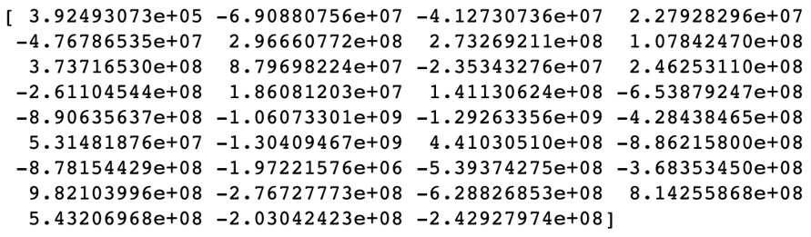


    Caption: Inspecting 35 coefficients

    You can see from the output that the coefficients have significantly
    larger magnitudes than the coefficients from `lr_model_2`.

    In the next steps, you will train a ridge regression model on the
    same set of features to reduce overfitting.

29. Create a list of steps for the pipeline you will create later on:

    ```
    steps = [('scaler', MinMaxScaler()),\
             ('poly', PolynomialFeatures(degree=10)),\
             ('lr', Ridge(alpha=0.9))]
    ```


    You create a list of steps for the pipeline you will create. Note
    that the third step in this list is an instance of
    `Ridge`. The parameter called `alpha` in the
    call to `Ridge()` is the regularization parameter. You can
    play around with any values from 0 to 1 to see how it affects the
    performance of the model that you train.

30. Create an instance of a pipeline:
    ```
    ridge_model = Pipeline(steps)
    ```


31. Fit the pipeline on the training data:

    ```
    ridge_model.fit(train_X, train_y)
    ```


    The output of this operation might be similar to the following:

    
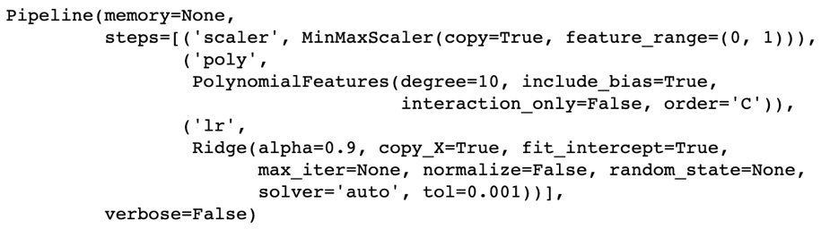


    Caption: Fitting the pipeline on training data

    You can see from the output that the pipeline trained a ridge model
    in the final step. The regularization parameter was `0`.

32. Print the R2 score of `ridge_model`:

    ```
    print('ridge_model R2 Score: {}'\
          .format(ridge_model.score(eval_X, eval_y)))
    ```


    The output of this step might be similar to the following:

    


    Caption: R2 score

    You can see that the R2 score has climbed back up to
    `0.945`, which is way better than the score of
    `0.568` that `lr_model_3` had. This is already
    looking like a better model.

33. Use `ridge_model` to predict on the evaluation data:
    ```
    ridge_model_preds = ridge_model.predict(eval_X)
    ```


34. Print the MSE of `ridge_model`:

    ```
    print('ridge_model MSE: {}'\
          .format(mean_squared_error(eval_y, ridge_model_preds)))
    ```


    The output might be similar to the following:

    


    Caption: The MSE of ridge\_model

    You can see from the output that the MSE is `16.030`,
    which is lower than the MSE value of `126.254` that
    `lr_model_3` had. You can safely conclude that this is a
    much better model.

35. Print out the number of coefficients in `ridge_model`:

    ```
    print(len(ridge_model[-1].coef_))
    ```


    The output might be similar to the following:

    


    Caption: The number of coefficients in the ridge model

    You can see that this model has `1001` coefficients, which
    is the same number of coefficients that `lr_model_3` had.

36. Print out the values of the first 35 coefficients:

    ```
    print(ridge_model[-1].coef_[:35])
    ```


    The output might be similar to the following:

    
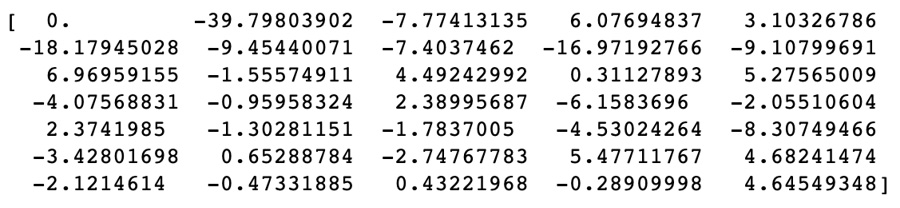


Caption: The values of the first 35 coefficients


This exercise taught you how to fix overfitting by using
`RidgeRegression` to train a new model.


Activity 7.01: Find an Optimal Model for Predicting the Critical Temperatures of Superconductors
------------------------------------------------------------------------------------------------

You work as a data scientist for a cable manufacturer. Management has
decided to start shipping low-resistance cables to clients around the
world. To ensure that the right cables are shipped to the right
countries, they would like to predict the critical temperatures of
various cables based on certain observed readings.

In this activity, you will train a linear regression model and compute
the R2 score and the MSE. You will proceed to engineer new features
using polynomial features of degree 3. You will compare the R2 score and
MSE of this new model to those of the first model to determine
overfitting. You will then use regularization to train a model that
generalizes to previously unseen data.


The steps to accomplish this task are:

1.  Open a Jupyter notebook.
2.  Load the necessary libraries.
3.  Read in the data from the `superconduct` folder.
4.  Prepare the `X` and `y` variables.
5.  Split the data into training and evaluation sets.
6.  Create a baseline linear regression model.
7.  Print out the R2 score and MSE of the model.
8.  Create a pipeline to engineer polynomial features and train a linear
    regression model.
9.  Print out the R2 score and MSE.
10. Determine that this new model is overfitting.
11. Create a pipeline to engineer polynomial features and train a ridge
    or lasso model.
12. Print out the R2 score and MSE.

    The output will be as follows:

    


    Caption: The R2 score and MSE of the ridge model

13. Determine that this model is no longer overfitting. This is the
    model to put into production.

    The coefficients for the ridge model are as shown in the following
    figure:

    
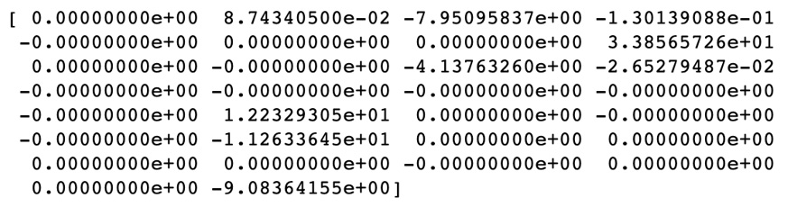


Caption: The coefficients for the ridge model


Summary
=======


In this lab, we studied the importance of withholding some of the
available data to evaluate models. We also learned how to make use of
all of the available data with a technique called cross-validation to
find the best performing model from a set of models you are training. We
also made use of evaluation metrics to determine when a model starts to
overfit and made use of ridge and lasso regression to fix a model that
is overfitting.

In the next lab, we will go into hyperparameter tuning in depth. You
will learn about various techniques for finding the best hyperparameters
to train your models.
