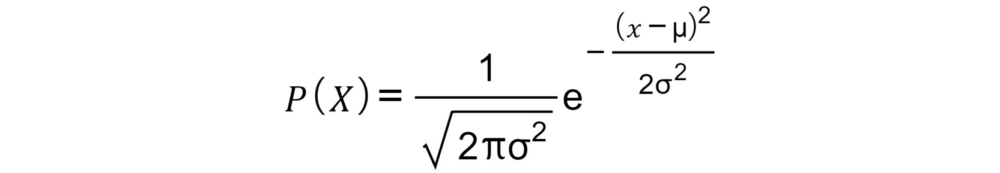

8. Hyperparameter Tuning
========================


Overview

In this lab, each hyperparameter tuning strategy will be first
broken down into its key steps before any high-level scikit-learn
implementations are demonstrated. This is to ensure that you fully
understand the concept behind each of the strategies before jumping to
the more automated methods.

By the end of this lab, you will be able to find further predictive
performance improvements via the systematic evaluation of estimators
with different hyperparameters. You will successfully deploy manual,
grid, and random search strategies to find the optimal hyperparameters.
You will be able to parameterize **k-nearest neighbors** (**k-NN**),
**support vector machines** (**SVMs**), ridge regression, and random
forest classifiers to optimize model performance.


Introduction
============


In previous labs, we discussed several methods to arrive at a model
that performs well. These include transforming the data via
preprocessing, feature engineering and scaling, or simply choosing an
appropriate estimator (algorithm) type from the large set of possible
estimators made available to the users of scikit-learn.

Depending on which estimator you eventually select, there may be
settings that can be adjusted to improve overall predictive performance.
These settings are known as hyperparameters, and deriving the best
hyperparameters is known as tuning or optimizing. Properly tuning your
hyperparameters can result in performance improvements well into the
double-digit percentages, so it is well worth doing in any modeling
exercise.

This lab will discuss the concept of hyperparameter tuning and will
present some simple strategies that you can use to help find the best
hyperparameters for your estimators.

In previous labs, we have seen some exercises that use a range of
estimators, but we haven\'t conducted any hyperparameter tuning. After
reading this lab, we recommend you revisit these exercises, apply
the techniques taught, and see if you can improve the results.


What Are Hyperparameters?
=========================


Hyperparameters can be thought of as a set of dials and switches for
each estimator that change how the estimator works to explain
relationships in the data.

Have a look at *Figure 8.1*:


Caption: How hyperparameters work

If you read from left to right in the preceding figure, you can see that
during the tuning process we change the value of the hyperparameter,
which results in a change to the estimator. This in turn causes a change
in model performance. Our objective is to find hyperparameterization
that leads to the best model performance. This will be the *optimal*
hyperparameterization.

Estimators can have hyperparameters of varying quantities and types,
which means that sometimes you can be faced with a very large number of
possible hyperparameterizations to choose for an estimator.

For instance, scikit-learn\'s implementation of the SVM classifier
(`sklearn.svm.SVC`), which you will be introduced to later in
the lab, is an estimator that has multiple possible
hyperparameterizations. We will test out only a small subset of these,
namely using a linear kernel or a polynomial kernel of degree 2, 3, or
4.

Some of these hyperparameters are continuous in nature, while others are
discrete, and the presence of continuous hyperparameters means that the
number of possible hyperparameterizations is theoretically infinite. Of
course, when it comes to producing a model with good predictive
performance, some hyperparameterizations are much better than others,
and it is your job as a data scientist to find them.

In the next section, we will be looking at setting these hyperparameters
in more detail. But first, some clarification of terms.


Difference between Hyperparameters and Statistical Model Parameters
-------------------------------------------------------------------

In your reading on data science, particularly in the area of statistics,
you will come across terms such as \"model parameters,\" \"parameter
estimation,\" and \"(non)-parametric models.\" These terms relate to the
parameters that feature in the mathematical formulation of models. The
simplest example is that of the single variable linear model with no
intercept term that takes the following form:


Caption: Equation for a single variable linear model

Here, 𝛽 is the statistical model parameter, and if this formulation is
chosen, it is the data scientist\'s job to use data to estimate what
value it takes. This could be achieved using **Ordinary Least Squares**
(**OLS**) regression modeling, or it could be achieved through a method
called median regression.

Hyperparameters are different in that they are external to the
mathematical form. An example of a hyperparameter in this case is the
way in which 𝛽 will be estimated (OLS, or median regression). In some
cases, hyperparameters can change the algorithm completely (that is,
generating a completely different mathematical form). You will see
examples of this occurring throughout this lab.

In the next section, you will be looking at how to set a hyperparameter.


Setting Hyperparameters
-----------------------

In *Lab 7*, *The Generalization of Machine Learning Models*, you
were introduced to the k-NN model for classification and you saw how
varying k, the number of nearest neighbors, resulted in changes in model
performance with respect to the prediction of class labels. Here, k is a
hyperparameter, and the act of manually trying different values of k is
a simple form of hyperparameter tuning.

Each time you initialize a scikit-learn estimator, it will take on a
hyperparameterization as determined by the values you set for its
arguments. If you specify no values, then the estimator will take on a
default hyperparameterization. If you would like to see how the
hyperparameters have been set for your estimator, and what
hyperparameters you can adjust, simply print the output of the
`estimator.get_params()` method.

For instance, say we initialize a k-NN estimator without specifying any
arguments (empty brackets). To see the default hyperparameterization, we
can run:

```
from sklearn import neighbors
# initialize with default hyperparameters
knn = neighbors.KNeighborsClassifier()
# examine the defaults
print(knn.get_params())
```
You should get the following output:

```
{'algorithm': 'auto', 'leaf_size': 30, 'metric': 'minkowski', 
 'metric_params': None, 'n_jobs': None, 'n_neighbors': 5, 
 'p': 2, 'weights': 'uniform'}
```
A dictionary of all the hyperparameters is now printed to the screen,
revealing their default settings. Notice `k`, our number of
nearest neighbors, is set to `5`.

To get more information as to what these parameters mean, how they can
be changed, and what their likely effect may be, you can run the
following command and view the help file for the estimator in question.

For our k-NN estimator:

```
?knn
```

The output will be as follows:


Caption: Help file for the k-NN estimator

If you look closely at the help file, you will see the default
hyperparameterization for the estimator under the
`String form` heading, along with an explanation of what each
hyperparameter means under the `Parameters` heading.

Coming back to our example, if we want to change the
hyperparameterization from `k = 5` to `k = 15`, just
re-initialize the estimator and set the `n_neighbors` argument
to `15`, which will override the default:

```
"""
initialize with k = 15 and all other hyperparameters as default
"""
knn = neighbors.KNeighborsClassifier(n_neighbors=15)
# examine
print(knn.get_params())
```
You should get the following output:

```
{'algorithm': 'auto', 'leaf_size': 30, 'metric': 'minkowski', 
 'metric_params': None, 'n_jobs': None, 'n_neighbors': 15, 
 'p': 2, 'weights': 'uniform'}
```
You may have noticed that k is not the only hyperparameter available for
k-NN classifiers. Setting multiple hyperparameters is as easy as
specifying the relevant arguments. For example, let\'s increase the
number of neighbors from `5` to `15` and force the
algorithm to take the distance of points in the neighborhood, rather
than a simple majority vote, into account when training. For more
information, see the description for the `weights` argument in
the help file (`?knn`):

```
"""
initialize with k = 15, weights = distance and all other 
hyperparameters as default 
"""
knn = neighbors.KNeighborsClassifier(n_neighbors=15, \
                                     weights='distance')
# examine
print(knn.get_params())
```

The output will be as follows:

```
{'algorithm': 'auto', 'leaf_size': 30, 'metric': 'minkowski', 
 'metric_params': None, 'n_jobs': None, 'n_neighbors': 15, 
 'p': 2, 'weights': 'distance'}
```

In the output, you can see `n_neighbors` (`k`) is
now set to `15`, and `weights` is now set to
`distance`, rather than `uniform`.


A Note on Defaults
------------------

Generally, efforts have been made by the developers of machine learning
libraries to set sensible default hyperparameters for estimators. That
said, for certain datasets, significant performance improvements may be
achieved through tuning.


Finding the Best Hyperparameterization
======================================


The best hyperparameterization depends on your overall objective in
building a machine learning model in the first place. In most cases,
this is to find the model that has the highest predictive performance on
unseen data, as measured by its ability to correctly label data points
(classification) or predict a number (regression).

The prediction of unseen data can be simulated using hold-out test sets
or cross-validation, the former being the method used in this lab.
Performance is evaluated differently in each case, for instance, **Mean
Squared Error** (**MSE**) for regression and accuracy for
classification. We seek to reduce the MSE or increase the accuracy of
our predictions.

Let\'s implement manual hyperparameterization in the following exercise.


Exercise 8.01: Manual Hyperparameter Tuning for a k-NN Classifier
-----------------------------------------------------------------

In this exercise, we will manually tune a k-NN classifier, which was
covered in *Lab 7, The Generalization of Machine Learning Models*,
our goal being to predict incidences of malignant or benign breast
cancer based on cell measurements sourced from the affected breast
sample.


These are the important attributes of the dataset:

- ID number
- Diagnosis (M = malignant, B = benign)
- 3-32)

10 real-valued features are computed for each cell nucleus as follows:

- Radius (mean of distances from the center to points on the
    perimeter)

- Texture (standard deviation of grayscale values)

- Perimeter

- Area

- Smoothness (local variation in radius lengths)

- Compactness (perimeter\^2 / area - 1.0)

- Concavity (severity of concave portions of the contour)

- Concave points (number of concave portions of the contour)

- Symmetry

- Fractal dimension (refers to the complexity of the tissue
    architecture; \"coastline approximation\" - 1)


The following steps will help you complete this exercise:

1.  Create a new notebook in Google Colab.

2.  Next, import `neighbors`, `datasets`, and
    `model_selection` from scikit-learn:
    ```
    from sklearn import neighbors, datasets, model_selection
    ```


3.  Load the data. We will call this object `cancer`, and
    isolate the target `y`, and the features, `X`:
    ```
    # dataset
    cancer = datasets.load_breast_cancer()
    # target
    y = cancer.target
    # features
    X = cancer.data
    ```


4.  Initialize a k-NN classifier with its default hyperparameterization:
    ```
    # no arguments specified
    knn = neighbors.KNeighborsClassifier()
    ```


5.  Feed this classifier into a 10-fold cross-validation
    (`cv`), calculating the precision score for each fold.
    Assume that maximizing precision (the proportion of true positives
    in all positive classifications) is the primary objective of this
    exercise:
    ```
    # 10 folds, scored on precision
    cv = model_selection.cross_val_score(knn, X, y, cv=10,\
                                         scoring='precision')
    ```


6.  Printing `cv` shows the precision score calculated for
    each fold:

    ```
    # precision scores
    print(cv)
    ```


    You will see the following output:

    ```
    [0.91666667 0.85       0.91666667 0.94736842 0.94594595 
     0.94444444 0.97222222 0.92105263 0.96969697 0.97142857]
    ```


7.  Calculate and print the mean precision score for all folds. This
    will give us an idea of the overall performance of the model, as
    shown in the following code snippet:

    ```
    # average over all folds
    print(round(cv.mean(), 2))
    ```


    You should get the following output:

    ```
    0.94
    ```


    You should see the mean score is close to 94%. Can this be improved
    upon?

8.  Run everything again, this time setting hyperparameter `k`
    to `15`. You can see that the result is actually
    marginally worse (1% lower):

    ```
    # k = 15
    knn = neighbors.KNeighborsClassifier(n_neighbors=15)
    cv = model_selection.cross_val_score(knn, X, y, cv=10, \
                                         scoring='precision')
    print(round(cv.mean(), 2))
    ```


    The output will be as follows:

    ```
    0.93
    ```


9.  Try again with `k` = `7`, `3`, and
    `1`. In this case, it seems reasonable that the default
    value of 5 is the best option. To avoid repetition, you may like to
    define and call a Python function as follows:

    ```
    def evaluate_knn(k):
        knn = neighbors.KNeighborsClassifier(n_neighbors=k)
        cv = model_selection.cross_val_score(knn, X, y, cv=10, \
                                             scoring='precision')
        print(round(cv.mean(), 2))
    evaluate_knn(k=7)
    evaluate_knn(k=3)
    evaluate_knn(k=1)
    ```


    The output will be as follows:

    ```
    0.93
    0.93
    0.92
    ```


    Nothing beats 94%.

10. Let\'s alter a second hyperparameter. Setting `k = 5`,
    what happens if we change the k-NN weighing system to depend on
    `distance` rather than having `uniform` weights?
    Run all code again, this time with the following
    hyperparameterization:

    ```
    # k =5, weights evaluated using distance
    knn = neighbors.KNeighborsClassifier(n_neighbors=5, \
                                         weights='distance')
    cv = model_selection.cross_val_score(knn, X, y, cv=10, \
                                         scoring='precision')
    print(round(cv.mean(), 2))
    ```


    Did performance improve?

    You should see no further improvement on the default
    hyperparameterization because the output is:

    ```
    0.93
    ```


We therefore conclude that the default hyperparameterization is the
optimal one in this case.


Simple Demonstration of the Grid Search Strategy
------------------------------------------------


This time, instead of manually fitting models with different values of
`k` we just define the `k` values we would like to
try, that is, `k = 1, 3, 5, 7` in a Python dictionary. This
dictionary will be the grid we will search through to find the optimal
hyperparameterization.


The code will be as follows:

```
from sklearn import neighbors, datasets, model_selection
# load data
cancer = datasets.load_breast_cancer()
# target
y = cancer.target
# features
X = cancer.data
# hyperparameter grid
grid = {'k': [1, 3, 5, 7]}
```

In the code snippet, we have used a dictionary `{}` and set
the `k` values in a Python dictionary.

In the next part of the code snippet, to conduct the search, we iterate
through the grid, fitting a model for each value of `k`, each
time evaluating the model through 10-fold cross-validation.

At the end of each iteration, we extract, format, and report back the
mean precision score after cross-validation via the `print`
method:

```
# for every value of k in the grid
for k in grid['k']:
    # initialize the knn estimator
    knn = neighbors.KNeighborsClassifier(n_neighbors=k)
    # conduct a 10-fold cross-validation
    cv = model_selection.cross_val_score(knn, X, y, cv=10, \
                                         scoring='precision')
    # calculate the average precision value over all folds
    cv_mean = round(cv.mean(), 3)
    # report the result
    print('With k = {}, mean precision = {}'.format(k, cv_mean))
```

The output will be as follows:


Caption: Average precisions for all folds

We can see from the output that `k = 5` is the best
hyperparameterization found, with a mean precision score of roughly 94%.
Increasing `k` to `7` didn\'t significantly improve
performance. It is important to note that the only parameter we are
changing here is k and that each time the k-NN estimator is initialized,
it is done with the remaining hyperparameters set to their default
values.

To make this point clear, we can run the same loop, this time just
printing the hyperparameterization that will be tried:

```
# for every value of k in the grid 
for k in grid['k']:
    # initialize the knn estimator
    knn = neighbors.KNeighborsClassifier(n_neighbors=k)
    # print the hyperparameterization
    print(knn.get_params())
```

The output will be as follows:

```
{'algorithm': 'auto', 'leaf_size': 30, 'metric': 'minkowski', 
 'metric_params': None, 'n_jobs': None, 'n_neighbors': 1, 
 'p': 2, 'weights': 'uniform'}
{'algorithm': 'auto', 'leaf_size': 30, 'metric': 'minkowski',
 'metric_params': None, 'n_jobs': None, 'n_neighbors': 3, 
 'p': 2, 'weights': 'uniform'}
{'algorithm': 'auto', 'leaf_size': 30, 'metric': 'minkowski', 
 'metric_params': None, 'n_jobs': None, 'n_neighbors': 5, 
 'p': 2, 'weights': 'uniform'}
{'algorithm': 'auto', 'leaf_size': 30, 'metric': 'minkowski', 
 'metric_params': None, 'n_jobs': None, 'n_neighbors': 7, 
 'p': 2, 'weights': 'uniform'}
```
You can see from the output that the only parameter we are changing is
k; everything else remains the same in each iteration.

Simple, single-loop structures are fine for a grid search of a single
hyperparameter, but what if we would like to try a second one? Remember
that for k-NN we also have weights that can take values
`uniform` or `distance`, the choice of which
influences how k-NN learns how to classify points.

To proceed, all we need to do is create a dictionary containing both the
values of k and the weight functions we would like to try as separate
key/value pairs:

```
# hyperparameter grid
grid = {'k': [1, 3, 5, 7],\
        'weight_function': ['uniform', 'distance']}
# for every value of k in the grid
for k in grid['k']:
    # and every possible weight_function in the grid 
    for weight_function in grid['weight_function']:
        # initialize the knn estimator
        knn = neighbors.KNeighborsClassifier\
              (n_neighbors=k, \
               weights=weight_function)
        # conduct a 10-fold cross-validation
        cv = model_selection.cross_val_score(knn, X, y, cv=10, \
                                             scoring='precision')
        # calculate the average precision value over all folds
        cv_mean = round(cv.mean(), 3)
        # report the result
        print('With k = {} and weight function = {}, '\
              'mean precision = {}'\
              .format(k, weight_function, cv_mean))
```

The output will be as follows:


Caption: Average precision values for all folds for different values
of k

You can see that when `k = 5`, the weight function is not
based on distance and all the other hyperparameters are kept as their
default values, and the mean precision comes out highest. As we
discussed earlier, if you would like to see the full set of
hyperparameterizations evaluated for k-NN, just add
`print(knn.get_params())` inside the `for` loop
after the estimator is initialized:

```
# for every value of k in the grid
for k in grid['k']:
    # and every possible weight_function in the grid 
    for weight_function in grid['weight_function']:
        # initialize the knn estimator
        knn = neighbors.KNeighborsClassifier\
              (n_neighbors=k, \
               weights=weight_function)
        # print the hyperparameterizations
        print(knn.get_params())
```

The output will be as follows:

```
{'algorithm': 'auto', 'leaf_size': 30, 'metric': 'minkowski', 
 'metric_params': None, 'n_jobs': None, 'n_neighbors': 1, 
 'p': 2, 'weights': 'uniform'}
{'algorithm': 'auto', 'leaf_size': 30, 'metric': 'minkowski', 
 'metric_params': None, 'n_jobs': None, 'n_neighbors': 1, 
 'p': 2, 'weights': 'distance'}
{'algorithm': 'auto', 'leaf_size': 30, 'metric': 'minkowski', 
 'metric_params': None, 'n_jobs': None, 'n_neighbors': 3, 
 'p': 2, 'weights': 'uniform'}
{'algorithm': 'auto', 'leaf_size': 30, 'metric': 'minkowski', 
 'metric_params': None, 'n_jobs': None, 'n_neighbors': 3, 
 'p': 2, 'weights': 'distance'}
{'algorithm': 'auto', 'leaf_size': 30, 'metric': 'minkowski', 
 'metric_params': None, 'n_jobs': None, 'n_neighbors': 5, 
 'p': 2, 'weights': 'uniform'}
{'algorithm': 'auto', 'leaf_size': 30, 'metric': 'minkowski', 
 'metric_params': None, 'n_jobs': None, 'n_neighbors': 5, 
 'p': 2, 'weights': 'distance'}
{'algorithm': 'auto', 'leaf_size': 30, 'metric': 'minkowski', 
 'metric_params': None, 'n_jobs': None, 'n_neighbors': 7, 
 'p': 2, 'weights': 'uniform'}
{'algorithm': 'auto', 'leaf_size': 30, 'metric': 'minkowski', 
 'metric_params': None, 'n_jobs': None, 'n_neighbors': 7, 
 'p': 2, 'weights': 'distance'}
```
This implementation, while great for demonstrating how the grid search
process works, may not practical when trying to evaluate estimators that
have `3`, `4`, or even `10` different
types of hyperparameters, each with a multitude of possible settings.

To carry on in this way will mean writing and keeping track of multiple
`for` loops, which can be tedious. Thankfully,
`scikit-learn`\'s `model_selection` module gives us
a method called `GridSearchCV` that is much more
user-friendly. We will be looking at this in the topic ahead.


GridSearchCV
============


`GridsearchCV` is a method of tuning wherein the model can be
built by evaluating the combination of parameters mentioned in a grid.
In the following figure, we will see how `GridSearchCV` is
different from manual search and look at grid search in a muchdetailed
way in a table format.


Tuning using GridSearchCV
-------------------------

We can conduct a grid search much more easily in practice by leveraging
`model_selection.GridSearchCV`.

For the sake of comparison, we will use the same breast cancer dataset
and k-NN classifier as before:

```
from sklearn import model_selection, datasets, neighbors
# load the data
cancer = datasets.load_breast_cancer()
# target
y = cancer.target
# features
X = cancer.data
```

The next thing we need to do after loading the data is to initialize the
class of the estimator we would like to evaluate under different
hyperparameterizations:

```
# initialize the estimator
knn = neighbors.KNeighborsClassifier()
```
We then define the grid:

```
# grid contains k and the weight function
grid = {'n_neighbors': [1, 3, 5, 7],\
        'weights': ['uniform', 'distance']}
```
To set up the search, we pass the freshly initialized estimator and our
grid of hyperparameters to `model_selection.GridSearchCV()`.
We must also specify a scoring metric, which is the method that will be
used to evaluate the performance of the various hyperparameterizations
tried during the search.

The last thing to do is set the number splits to be used using
cross-validation via the `cv` argument. We will set this to
`10`, thereby conducting 10-fold cross-validation:

```
"""
 set up the grid search with scoring on precision and 
number of folds = 10
"""
gscv = model_selection.GridSearchCV(estimator=knn, \
                                    param_grid=grid, \
                                    scoring='precision', cv=10)
```

The last step is to feed data to this object via its `fit()`
method. Once this has been done, the grid search process will be
kick-started:

```
# start the search
gscv.fit(X, y)
```
By default, information relating to the search will be printed to the
screen, allowing you to see the exact estimator parameterizations that
will be evaluated for the k-NN estimator:


Caption: Estimator parameterizations for the k-NN estimator

Once the search is complete, we can examine the results by accessing and
printing the `cv_results_` attribute. `cv_results_`
is a dictionary containing helpful information regarding model
performance under each hyperparameterization, such as the mean test-set
value of your scoring metric (`mean_test_score`, the lower the
better), the complete list of hyperparameterizations tried
(`params`), and the model ranks as they relate to the
`mean_test_score` (`rank_test_score`).

The best model found will have rank = 1, the second-best model will have
rank = 2, and so on, as you can see in *Figure 8.8*. The model fitting
times are reported through `mean_fit_time`.

Although not usually a consideration for smaller datasets, this value
can be important because in some cases you may find that a marginal
increase in model performance through a certain hyperparameterization is
associated with a significant increase in model fit time, which,
depending on the computing resources you have available, may render that
hyperparameterization infeasible because it will take too long to fit:

```
# view the results
print(gscv.cv_results_)
```

The output will be as follows:


Caption: GridsearchCV results

The model ranks can be seen in the following image:


Caption: Model ranks


For example, say we are only interested in each hyperparameterization
(`params`) and mean cross-validated test score
(`mean_test_score`) for the top five high - performing models:

```
import pandas as pd
# convert the results dictionary to a dataframe
results = pd.DataFrame(gscv.cv_results_)
"""
select just the hyperparameterizations tried, 
the mean test scores, order by score and show the top 5 models
"""
print(results.loc[:,['params','mean_test_score']]\
      .sort_values('mean_test_score', ascending=False).head(5))
```
Running this code produces the following output:


Caption: mean\_test\_score for top 5 models

We can also use pandas to produce visualizations of the result as
follows:

```
# visualise the result
results.loc[:,['params','mean_test_score']]\
       .plot.barh(x = 'params')
```

The output will be as follows:


Caption: Using pandas to visualize the output


Exercise 8.02: Grid Search Hyperparameter Tuning for an SVM
-----------------------------------------------------------

In this exercise, we will employ a class of estimator called an SVM
classifier and tune its hyperparameters using a grid search strategy.

The supervised learning objective we will focus on here is the
classification of handwritten digits (0-9) based solely on images. The
dataset we will use contains 1,797 labeled images of handwritten digits.


1.  Create a new notebook in Google Colab.

2.  Import `datasets`, `svm`, and
    `model_selection` from scikit-learn:
    ```
    from sklearn import datasets, svm, model_selection
    ```


3.  Load the data. We will call this object images, and then we\'ll
    isolate the target `y` and the features `X`. In
    the training step, the SVM classifier will learn how `y`
    relates to `X` and will therefore be able to predict new
    `y` values when given new `X` values:
    ```
    # load data
    digits = datasets.load_digits()
    # target
    y = digits.target
    # features
    X = digits.data
    ```


4.  Initialize the estimator as a multi-class SVM classifier and set the
    `gamma` argument to `scale`:

    ```
    # support vector machine classifier
    clr = svm.SVC(gamma='scale')
    ```


5.  Define our grid to cover four distinct hyperparameterizations of the
    classifier with a linear kernel and with a polynomial kernel of
    degrees `2`, `3,` and `4`. We want to
    see which of the four hyperparameterizations leads to more accurate
    predictions:
    ```
    # hyperparameter grid. contains linear and polynomial kernels
    grid = [{'kernel': ['linear']},\
            {'kernel': ['poly'], 'degree': [2, 3, 4]}]
    ```


6.  Set up grid search k-fold cross-validation with `10` folds
    and a scoring measure of accuracy. Make sure it has our
    `grid` and `estimator` objects as inputs:
    ```
    """
    setting up the grid search to score on accuracy and 
    evaluate over 10 folds
    """
    cv_spec = model_selection.GridSearchCV\
              (estimator=clr, param_grid=grid, \
               scoring='accuracy', cv=10)
    ```


7.  Start the search by providing data to the `.fit()` method.
    Details of the process, including the hyperparameterizations tried
    and the scoring method selected, will be printed to the screen:

    ```
    # start the grid search
    cv_spec.fit(X, y)
    ```


    You should see the following output:

    


    Caption: Grid Search using the .fit() method

8.  To examine all of the results, simply print
    `cv_spec.cv_results_` to the screen. You will see that the
    results are structured as a dictionary, allowing you to access the
    information you require using the keys:

    ```
    # what is the available information
    print(cv_spec.cv_results_.keys())
    ```


    You will see the following information:

    


    Caption: Results as a dictionary

9.  For this exercise, we are primarily concerned with the test-set
    performance of each distinct hyperparameterization. You can see the
    first hyperparameterization through
    `cv_spec.cv_results_['mean_test_score']`, and the second
    through `cv_spec.cv_results_['params']`.

    Let\'s convert the results dictionary to a `pandas`
    DataFrame and find the best hyperparameterization:

    ```
    import pandas as pd
    # convert the dictionary of results to a pandas dataframe
    results = pd.DataFrame(cv_spec.cv_results_)
    # show hyperparameterizations
    print(results.loc[:,['params','mean_test_score']]\
          .sort_values('mean_test_score', ascending=False))
    ```


    You will see the following results:

    


    Caption: Parameterization results

    Note

    You may get slightly different results. However, the values you
    obtain should largely agree with those in the preceding output.

10. It is best practice to visualize any results you produce.
    `pandas` makes this easy. Run the following code to
    produce a visualization:

    ```
    # visualize the result
    (results.loc[:,['params','mean_test_score']]\
            .sort_values('mean_test_score', ascending=True)\
            .plot.barh(x='params', xlim=(0.8)))
    ```


    The output will be as follows:

    


Caption: Using pandas to visualize the results


Advantages and Disadvantages of Grid Search
-------------------------------------------

The primary advantage of the grid search compared to a manual search is
that it is an automated process that one can simply set and forget.
Additionally, you have the power to dictate the exact
hyperparameterizations evaluated, which can be a good thing when you
have prior knowledge of what kind of hyperparameterizations might work
well in your context. It is also easy to understand exactly what will
happen during the search thanks to the explicit definitions of the grid.

The major drawback of the grid search strategy is that it is
computationally very expensive; that is, when the number of
hyperparameterizations to try increases substantially, processing times
can be very slow. Also, when you define your grid, you may inadvertently
omit an hyperparameterization that would in fact be optimal. If it is
not specified in your grid, it will never be tried

To overcome these drawbacks, we will be looking at random search in the
next section.


Random Search
=============


Instead of searching through every hyperparameterizations in a
pre-defined set, as is the case with a grid search, in a random search
we sample from a distribution of possibilities by assuming each
hyperparameter to be a random variable. Before we go through the process
in depth, it will be helpful to briefly review what random variables are
and what we mean by a distribution.


Random Variables and Their Distributions
----------------------------------------

A random variable is non-constant (its value can change) and its
variability can be described in terms of distribution. There are many
different types of distributions, but each falls into one of two broad
categories: discrete and continuous. We use discrete distributions to
describe random variables whose values can take only whole numbers, such
as counts.

An example is the count of visitors to a theme park in a day, or the
number of attempted shots it takes a golfer to get a hole-in-one.

We use continuous distributions to describe random variables whose
values lie along a continuum made up of infinitely small increments.
Examples include human height or weight, or outside air temperature.
Distributions often have parameters that control their shape.

Discrete distributions can be described mathematically using what\'s
called a probability mass function, which defines the exact probability
of the random variable taking a certain value. Common notation for the
left-hand side of this function is `P(X=x)`, which in plain
English means that the probability that the random variable
`X` equals a certain value `x` is `P`.
Remember that probabilities range between `0` (impossible) and
`1` (certain).

By definition, the summation of each `P(X=x)` for all possible
`x`\'s will be equal to 1, or if expressed another way, the
probability that `X` will take any value is 1. A simple
example of this kind of distribution is the discrete uniform
distribution, where the random variable `X` will take only one
of a finite range of values and the probability of it taking any
particular value is the same for all values, hence the term uniform.

For example, if there are 10 possible values the probability that
`X` is any particular value is exactly 1/10. If there were 6
possible values, as in the case of a standard 6-sided die, the
probability would be 1/6, and so on. The probability mass function for
the discrete uniform distribution is:


Caption: Probability mass function for the discrete uniform
distribution

The following code will allow us to see the form of this distribution
with 10 possible values of X.

First, we create a list of all the possible values `X` can
take:

```
# list of all xs
X = list(range(1, 11))
print(X)
```

The output will be as follows:

```
 [1, 2, 3, 4, 5, 6, 7, 8, 9, 10]
```
We then calculate the probability that `X` will take up any
value of `x (P(X=x))`:

```
# pmf, 1/n * n = 1
p_X_x = [1/len(X)] * len(X)
# sums to 1
print(p_X_x)
```
As discussed, the summation of probabilities will equal 1, and this is
the case with any distribution. We now have everything we need to
visualize the distribution:

```
import matplotlib.pyplot as plt
plt.bar(X, p_X_x)
plt.xlabel('X')
plt.ylabel('P(X=x)')
```

The output will be as follows:


Caption: Visualizing the bar chart

In the visual output, we see that the probability of `X` being
a specific whole number between 1 and 10 is equal to 1/10.

Note

Other discrete distributions you commonly see include the binomial,
negative binomial, geometric, and Poisson distributions, all of which we
encourage you to investigate. Type these terms into a search engine to
find out more.

Distributions of continuous random variables are a bit more challenging
in that we cannot calculate an exact `P(X=x)` directly because
`X` lies on a continuum. We can, however, use integration to
approximate probabilities between a range of values, but this is beyond
the scope of this course. The relationship between `X` and
probability is described using a probability density function,
`P(X)`. Perhaps the most well-known continuous distribution is
the normal distribution, which visually takes the form of a bell.

The normal distribution has two parameters that describe its shape, mean
(`𝜇`) and variance (`𝜎`[2]). The
probability density function for the normal distribution is:



Caption: Probability density function for the normal distribution

The following code shows two normal distributions with the same mean
(`𝜇`` = 0`) but different variance parameters
(`𝜎``2 = 1` and `𝜎``2 = 2.25`).
Let\'s first generate 100 evenly spaced values from `-10` to
`10` using NumPy\'s `.linspace` method:

```
import numpy as np
# range of xs
x = np.linspace(-10, 10, 100)
```
We then generate the approximate `X` probabilities for both
normal distributions.

Using `scipy.stats` is a good way to work with distributions,
and its `pdf` method allows us to easily visualize the shape
of probability density functions:

```
import scipy.stats as stats
# first normal distribution with mean = 0, variance = 1
p_X_1 = stats.norm.pdf(x=x, loc=0.0, scale=1.0**2)
# second normal distribution with mean = 0, variance = 2.25
p_X_2 = stats.norm.pdf(x=x, loc=0.0, scale=1.5**2)
```
Note

In this case, `loc` corresponds to 𝜇, while `scale`
corresponds to the standard deviation, which is the square root of
`𝜎``2`, hence why we square the inputs.

We then visualize the result. Notice that `𝜎``2`
controls how fat the distribution is and therefore how variable the
random variable is:

```
plt.plot(x,p_X_1, color='blue')
plt.plot(x, p_X_2, color='orange')
plt.xlabel('X')
plt.ylabel('P(X)')
```

The output will be as follows:


Caption: Visualizing the normal distribution


Simple Demonstration of the Random Search Process
-------------------------------------------------

Again, before we get to the scikit-learn implementation of random search
parameter tuning, we will step through the process using simple Python
tools. Up until this point, we have only been using classification
problems to demonstrate tuning concepts, but now we will look at a
regression problem. Can we find a model that\'s able to predict the
progression of diabetes in patients based on characteristics such as BMI
and age?


We first load the data:

```
from sklearn import datasets, linear_model, model_selection
# load the data
diabetes = datasets.load_diabetes()
# target
y = diabetes.target
# features
X = diabetes.data
```
To get a feel for the data, we can examine the disease progression for
the first patient:

```
# the first patient has index 0
print(y[0])
```

The output will be as follows:

```
 151.0
```
Let\'s now examine their characteristics:

```
# let's look at the first patients data
print(dict(zip(diabetes.feature_names, X[0])))
```
We should see the following:


Caption: Dictionary for patient characteristics


For ridge regression, we believe the optimal 𝛼 to be somewhere near 1,
becoming less likely as you move away from 1. A parameterization of the
gamma distribution that reflects this idea is where k and 𝜃 are both
equal to 1. To visualize the form of this distribution, we can run the
following:

```
import numpy as np
from scipy import stats
import matplotlib.pyplot as plt
# values of alpha
x = np.linspace(1, 20, 100)
# probabilities
p_X = stats.gamma.pdf(x=x, a=1, loc=1, scale=2)
plt.plot(x,p_X)
plt.xlabel('alpha')
plt.ylabel('P(alpha)')
```

The output will be as follows:


Caption: Visualization of probabilities

In the graph, you can see how probability decays sharply for smaller
values of 𝛼, then decays more slowly for larger values.

The next step in the random search process is to sample n values from
the chosen distribution. In this example, we will draw 100 𝛼 values.
Remember that the probability of drawing out a particular value of 𝛼 is
related to its probability as defined by this distribution:

```
# n sample values
n_iter = 100
# sample from the gamma distribution
samples = stats.gamma.rvs(a=1, loc=1, scale=2, \
                          size=n_iter, random_state=100)
```
Note

We set a random state to ensure reproducible results.

Plotting a histogram of the sample, as shown in the following figure,
reveals a shape that approximately conforms to the distribution that we
have sampled from. Note that as your sample sizes increases, the more
the histogram conforms to the distribution:

```
# visualize the sample distribution
plt.hist(samples)
plt.xlabel('alpha')
plt.ylabel('sample count')
```

The output will be as follows:


Caption: Visualization of the sample distribution

A model will then be fitted for each value of 𝛼 sampled and assessed for
performance. As we have seen with the other approaches to hyperparameter
tuning in this lab, performance will be assessed using k-fold
cross-validation (with `k =10`) but because we are dealing
with a regression problem, the performance metric will be the test-set
negative MSE.

Using this metric means larger values are better. We will store the
results in a dictionary with each 𝛼 value as the key and the
corresponding cross-validated negative MSE as the value:

```
# we will store the results inside a dictionary
result = {}
# for each sample
for sample in samples:
    """
    initialize a ridge regression estimator with alpha set 
    to the sample value
    """
    reg = linear_model.Ridge(alpha=sample)
    """
    conduct a 10-fold cross validation scoring on 
    negative mean squared error
    """
    cv = model_selection.cross_val_score\
         (reg, X, y, cv=10, \
          scoring='neg_mean_squared_error')
    # retain the result in the dictionary
    result[sample] = [cv.mean()]
```

Instead of examining the raw dictionary of results, we will convert it
to a pandas DataFrame, transpose it, and give the columns names. Sorting
by descending negative mean squared error reveals that the optimal level
of regularization for this problem is actually when 𝛼 is approximately
1, meaning that we did not find evidence to suggest regularization is
necessary for this problem and that the OLS linear model will suffice:

```
import pandas as pd
"""
convert the result dictionary to a pandas dataframe, 
transpose and reset the index
"""
df_result = pd.DataFrame(result).T.reset_index()
# give the columns sensible names
df_result.columns = ['alpha', 'mean_neg_mean_squared_error']
print(df_result.sort_values('mean_neg_mean_squared_error', \
                            ascending=False).head())
```

The output will be as follows:


Caption: Output for the random search process

Note

The results will be different, depending on the data used.

It is always beneficial to visualize results where possible. Plotting 𝛼
by negative mean squared error as a scatter plot makes it clear that
venturing away from 𝛼 = 1 does not result in improvements in predictive
performance:

```
plt.scatter(df_result.alpha, \
            df_result.mean_neg_mean_squared_error)
plt.xlabel('alpha')
plt.ylabel('-MSE')
```

The output will be as follows:


Caption: Plotting the scatter plot

The fact that we found the optimal 𝛼 to be 1 (its default value) is a
special case in hyperparameter tuning in that the optimal
hyperparameterization is the default one.


Tuning Using RandomizedSearchCV
-------------------------------

In practice, we can use the `RandomizedSearchCV` method inside
scikit-learn\'s `model_selection` module to conduct the
search. All you need to do is pass in your estimator, the
hyperparameters you wish to tune along with their distributions, the
number of samples you would like to sample from each distribution, and
the metric by which you would like to assess model performance. These
correspond to the `param_distributions`, `n_iter`,
and `scoring` arguments respectively. For the sake of
demonstration, let\'s conduct the search we completed earlier using
`RandomizedSearchCV`. First, we load the data and initialize
our ridge regression estimator:

```
from sklearn import datasets, model_selection, linear_model
# load the data
diabetes = datasets.load_diabetes()
# target
y = diabetes.target
# features
X = diabetes.data
# initialise the ridge regression
reg = linear_model.Ridge()
```
We then specify that the hyperparameter we would like to tune is
`alpha` and that we would like 𝛼 to be distributed
`gamma`, with `k = 1` and
`𝜃`` = 1`:

```
from scipy import stats
# alpha ~ gamma(1,1)
param_dist = {'alpha': stats.gamma(a=1, loc=1, scale=2)}
```
Next, we set up and run the random search process, which will sample 100
values from our `gamma(1,1)` distribution, fit the ridge
regression, and evaluate its performance using cross-validation scored
on the negative mean squared error metric:

```
"""
set up the random search to sample 100 values and 
score on negative mean squared error
"""
rscv = model_selection.RandomizedSearchCV\
       (estimator=reg, param_distributions=param_dist, \
        n_iter=100, scoring='neg_mean_squared_error')
# start the search
rscv.fit(X,y)
```
After completing the search, we can extract the results and generate a
pandas DataFrame, as we have done previously. Sorting by
`rank_test_score` and viewing the first five rows aligns with
our conclusion that alpha should be set to 1 and regularization does not
seem to be required for this problem:

```
import pandas as pd
# convert the results dictionary to a pandas data frame
results = pd.DataFrame(rscv.cv_results_)
# show the top 5 hyperparamaterizations
print(results.loc[:,['params','rank_test_score']]\
      .sort_values('rank_test_score').head(5))
```

The output will be as follows:


Caption: Output for tuning using RandomizedSearchCV

Note

The preceding results may vary, depending on the data.


Exercise 8.03: Random Search Hyperparameter Tuning for a Random Forest Classifier
---------------------------------------------------------------------------------

In this exercise, we will revisit the handwritten digit classification
problem, this time using a random forest classifier with hyperparameters
tuned using a random search strategy. The random forest is a popular
method used for both single-class and multi-class classification
problems. It learns by growing `n` simple tree models that
each progressively split the dataset into areas that best separate the
points of different classes.

The final model produced can be thought of as the average of each of the
n tree models. In this way, the random forest is an `ensemble`
method. The parameters we will tune in this exercise are
`criterion` and `max_features`.

`criterion` refers to the way in which each split is evaluated
from a class purity perspective (the purer the splits, the better) and
`max_features` is the maximum number of features the random
forest can use when finding the best splits.

The following steps will help you complete the exercise.

1.  Create a new notebook in Google Colab.

2.  Import the data and isolate the features `X` and the
    target `y`:
    ```
    from sklearn import datasets
    # import data
    digits = datasets.load_digits()
    # target
    y = digits.target
    # features
    X = digits.data
    ```


3.  Initialize the random forest classifier estimator. We will set the
    `n_estimators` hyperparameter to `100`, which
    means the predictions of the final model will essentially be an
    average of `100` simple tree models. Note the use of a
    random state to ensure the reproducibility of results:
    ```
    from sklearn import ensemble
    # an ensemble of 100 estimators
    rfc = ensemble.RandomForestClassifier(n_estimators=100, \
                                          random_state=100)
    ```


4.  One of the parameters we will be tuning is `max_features`.
    Let\'s find out the maximum value this could take:

    ```
    # how many features do we have in our dataset?
    n_features = X.shape[1]
    print(n_features)
    ```


    You should see that we have 64 features:

    ```
    64
    ```


    Now that we know the maximum value of `max_features` we
    are free to define our hyperparameter inputs to the randomized
    search process. At this point, we have no reason to believe any
    particular value of `max_features` is more optimal.

5.  Set a discrete uniform distribution covering the range `1`
    to `64`. Remember the probability mass function,
    `P(X=x) = 1/n`, for this distribution, so
    `P(X=x) = 1/64` in our case. Because `criterion`
    has only two discrete options, this will also be sampled as a
    discrete uniform distribution with `P(X=x) = ½`:
    ```
    from scipy import stats
    """
    we would like to smaple from criterion and 
    max_features as discrete uniform distributions
    """
    param_dist = {'criterion': ['gini', 'entropy'],\
                  'max_features': stats.randint(low=1, \
                                                high=n_features)}
    ```


6.  We now have everything we need to set up the randomized search
    process. As before, we will use accuracy as the metric of model
    evaluation. Note the use of a random state:
    ```
    from sklearn import model_selection
    """
    setting up the random search sampling 50 times and 
    conducting 5-fold cross-validation
    """
    rscv = model_selection.RandomizedSearchCV\
           (estimator=rfc, param_distributions=param_dist, \
            n_iter=50, cv=5, scoring='accuracy' , random_state=100)
    ```


7.  Let\'s kick off the process with the. `fit` method. Please
    note that both fitting random forests and cross-validation are
    computationally expensive processes due to their internal processes
    of iteration. Generating a result may take some time:

    ```
    # start the process
    rscv.fit(X,y)
    ```


    You should see the following:

    


    Caption: RandomizedSearchCV results

8.  Next, you need to examine the results. Create a `pandas`
    DataFrame from the `results` attribute, order by the
    `rank_test_score`, and look at the top five model
    hyperparameterizations. Note that because the random search draws
    samples of hyperparameterizations at random, it is possible to have
    duplication. We remove the duplicate entries from the DataFrame:

    ```
    import pandas as pd
    # convert the dictionary of results to a pandas dataframe
    results = pd.DataFrame(rscv.cv_results_)
    # removing duplication
    distinct_results = results.loc[:,['params',\
                                      'mean_test_score']]
    # convert the params dictionaries to string data types
    distinct_results.loc[:,'params'] = distinct_results.loc\
                                       [:,'params'].astype('str')
    # remove duplicates
    distinct_results.drop_duplicates(inplace=True)
    # look at the top 5 best hyperparamaterizations
    distinct_results.sort_values('mean_test_score', \
                                 ascending=False).head(5)
    ```


    You should get the following output:

    


    Caption: Top five hyperparameterizations

    Note

    You may get slightly different results. However, the values you
    obtain should largely agree with those in the preceding output.

9.  The last step is to visualize the result. Including every
    parameterization will result in a cluttered plot, so we will filter
    on parameterizations that resulted in a mean test score \> 0.93:

    ```
    # top performing models
    distinct_results[distinct_results.mean_test_score > 0.93]\
                     .sort_values('mean_test_score')\
                     .plot.barh(x='params', xlim=(0.9))
    ```


    The output will be as follows:

    


Caption: Visualizing the test scores of the top-performing models


Advantages and Disadvantages of a Random Search
-----------------------------------------------

Because a random search takes a finite sample from a range of possible
hyperparameterizations (`n_iter` in
`model_selection.RandomizedSearchCV`), it is feasible to
expand the range of your hyperparameter search beyond what would be
practical with a grid search. This is because a grid search has to try
everything in the range, and setting a large range of values may be too
slow to process. Searching this wider range gives you the chance of
discovering a truly optimal solution.

Compared to the manual and grid search strategies, you do sacrifice a
level of control to obtain this benefit. The other consideration is that
setting up random search is a bit more involved than other options in
that you have to specify distributions. There is always a chance of
getting this wrong. That said, if you are unsure about what
distributions to use, stick with discrete or continuous uniform for the
respective variable types as this will assign an equal probability of
selection to all options.


Activity 8.01: Is the Mushroom Poisonous?
-----------------------------------------

Imagine you are a data scientist working for the biology department at
your local university. Your colleague who is a mycologist (a biologist
who specializes in fungi) has requested that you help her develop a
machine learning model capable of discerning whether a particular
mushroom species is poisonous or not given attributes relating to its
appearance.

The objective of this activity is to employ the grid and randomized
search strategies to find an optimal model for this purpose.


1.  Load the data into Python using the `pandas.read_csv()`
    method, calling the object `mushrooms`.

    Hint: The dataset is in CSV format and has no header. Set
    `header=None` in `pandas.read_csv()`.

2.  Separate the target, `y` and features, `X` from
    the dataset.

    Hint: The target can be found in the first column
    (`mushrooms.iloc[:,0]`) and the features in the remaining
    columns (`mushrooms.iloc[:,1:]`).

3.  Recode the target, `y`, so that poisonous mushrooms are
    represented as `1` and edible mushrooms as `0`.

4.  Transform the columns of the feature set `X` into a
    `numpy` array with a binary representation. This is known
    as one-hot encoding.

    Hint: Use `preprocessing.OneHotEncoder()` to transform
    `X`.

5.  Conduct both a grid and random search to find an optimal
    hyperparameterization for a random forest classifier. Use accuracy
    as your method of model evaluation. Make sure that when you
    initialize the classifier and when you conduct your random search,
    `random_state = 100`.

    For the grid search, use the following:

    ```
    {'criterion': ['gini', 'entropy'],\
     'max_features': [2, 4, 6, 8, 10, 12, 14]}
    ```


    For the randomized search, use the following:

    ```
    {'criterion': ['gini', 'entropy'],\
     'max_features': stats.randint(low=1, high=max_features)}
    ```


6.  Plot the mean test score versus hyperparameterization for the top 10
    models found using random search.

    You should see a plot similar to the following:


Caption: Mean test score plot


Summary
=======


In this lab, we have covered three strategies for hyperparameter
tuning based on searching for estimator hyperparameterizations that
improve performance.


The grid search is an automated method that is the most systematic of
the three but can be very computationally intensive to run when the
range of possible hyperparameterizations increases.
The random search, while the most complicated to set up, is based on
sampling from distributions of hyperparameters.