9. Interpreting a Machine Learning Model
========================================


Overview

This lab will show you how to interpret a machine learning model\'s
results and get deeper insights into the patterns it found. By the end
of the lab, you will be able to analyze weights from linear models
and variable importance for `RandomForest`. You will be able
to implement variable importance via permutation to analyze feature
importance. You will use a partial dependence plot to analyze single
variables and make use of the lime package for local interpretation.


In this lab, we will go through some techniques on how to interpret
your models or their results.


Linear Model Coefficients
=========================


In *Lab 2, Regression*, and *Lab 3, Binary Classification*, you
saw that linear regression models learn function parameters in the form
of the following:


In `sklearn`, it is extremely easy to get the coefficient of a
linear model; you just need to call the `coef_` attribute.
Let\'s implement this on a real example with the Diabetes dataset from
`sklearn`:

```
from sklearn.datasets import load_diabetes
from sklearn.linear_model import LinearRegression
data = load_diabetes()
# fit a linear regression model to the data
lr_model = LinearRegression()
lr_model.fit(data.data, data.target)
lr_model.coef_
```

The output will be as follows:

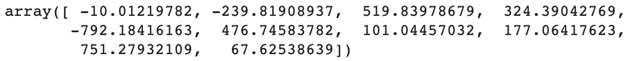

Caption: Coefficients of the linear regression parameters

Let\'s create a DataFrame with these values and column names:

```
import pandas as pd
coeff_df = pd.DataFrame()
coeff_df['feature'] = data.feature_names
coeff_df['coefficient'] = lr_model.coef_
coeff_df.head()
```

The output will be as follows:

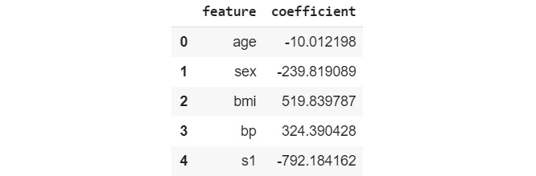

Caption: Coefficients of the linear regression model

A large positive or a large negative number for a feature coefficient
means it has a strong influence on the outcome. On the other hand, if
the coefficient is close to 0, this means the variable does not have
much impact on the prediction.

From this table, we can see that column `s1` has a very low
coefficient (a large negative number) so it negatively influences the
final prediction. If `s1` increases by a unit of 1, the
prediction value will decrease by `-792.184162`. On the other
hand, `bmi` has a large positive number
(`519.839787`) on the prediction, so the risk of diabetes is
highly linked to this feature: an increase in body mass index (BMI)
means a significant increase in the risk of diabetes.


Exercise 9.01: Extracting the Linear Regression Coefficient
-----------------------------------------------------------

In this exercise, we will train a linear regression model to predict the
customer drop-out ratio and extract its coefficients.


The following steps will help you complete the exercise:

1.  Open a new Colab notebook.

2.  Import the following packages: `pandas`,
    `train_test_split` from
    `sklearn.model_selection`, `StandardScaler` from
    `sklearn.preprocessing`, `LinearRegression` from
    `sklearn.linear_model`, `mean_squared_error`
    from `sklearn.metrics`, and `altair`:
    ```
    import pandas as pd
    from sklearn.model_selection import train_test_split
    from sklearn.preprocessing import StandardScaler
    from sklearn.linear_model import LinearRegression
    from sklearn.metrics import mean_squared_error
    import altair as alt
    ```


3.  Create a variable called `file_url` that contains the URL
    to the dataset:
    ```
    file_url = 'https://raw.githubusercontent.com/'\
               'fenago/data-science/'\
               'master/Lab09/Dataset/phpYYZ4Qc.csv'
    ```


4.  Load the dataset into a DataFrame called `df` using
    `.read_csv()`:
    ```
    df = pd.read_csv(file_url)
    ```


5.  Print the first five rows of the DataFrame:

    ```
    df.head()
    ```


    You should get the following output:

    
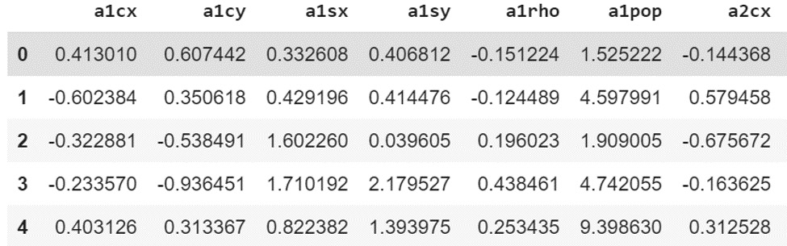


    Caption: First five rows of the loaded DataFrame


6.  Extract the `rej` column using `.pop()` and save
    it into a variable called `y`:
    ```
    y = df.pop('rej')
    ```


7.  Print the summary of the DataFrame using `.describe()`.

    ```
    df.describe()
    ```


    You should get the following output:

    
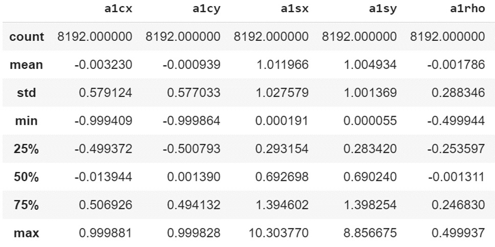


    Caption: Statistical measures of the DataFrame

    Note

    The preceding figure is a truncated version of the output.

    From this output, we can see the data is not standardized. The
    variables have different scales.

8.  Split the DataFrame into training and testing sets using
    `train_test_split()` with `test_size=0.3` and
    `random_state = 1`:
    ```
    X_train, X_test, y_train, y_test = train_test_split\
                                       (df, y, test_size=0.3, \
                                        random_state=1)
    ```


9.  Instantiate `StandardScaler`:
    ```
    scaler = StandardScaler()
    ```


10. Train `StandardScaler` on the training set and standardize
    it using `.fit_transform()`:
    ```
    X_train = scaler.fit_transform(X_train)
    ```


11. Standardize the testing set using `.transform()`:
    ```
    X_test = scaler.transform(X_test)
    ```


12. Instantiate `LinearRegression` and save it to a variable
    called `lr_model`:
    ```
    lr_model = LinearRegression()
    ```


13. Train the model on the training set using `.fit()`:

    ```
    lr_model.fit(X_train, y_train)
    ```


    You should get the following output:

    
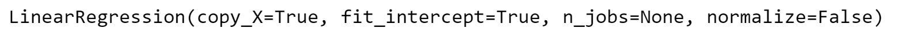


    Caption: Logs of LinearRegression

14. Predict the outcomes of the training and testing sets using
    `.predict()`:
    ```
    preds_train = lr_model.predict(X_train)
    preds_test = lr_model.predict(X_test)
    ```


15. Calculate the mean squared error on the training set and print its
    value:

    ```
    train_mse = mean_squared_error(y_train, preds_train)
    train_mse
    ```


    You should get the following output:

    


    Caption: MSE score of the training set

    We achieved quite a low MSE score on the training set.

16. Calculate the mean squared error on the testing set and print its
    value:

    ```
    test_mse = mean_squared_error(y_test, preds_test)
    test_mse
    ```


    You should get the following output:

    


    Caption: MSE score of the testing set

    We also have a low MSE score on the testing set that is very similar
    to the training one. So, our model is not overfitting.

    Note

    You may get slightly different outputs than those present here.
    However, the values you would obtain should largely agree with those
    obtained in this exercise.

17. Print the coefficients of the linear regression model using
    `.coef_`:

    ```
    lr_model.coef_
    ```


    You should get the following output:

    
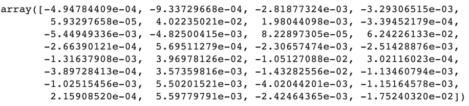


    Caption: Coefficients of the linear regression model

18. Create an empty DataFrame called `coef_df`:
    ```
    coef_df = pd.DataFrame()
    ```


19. Create a new column called `feature` for this DataFrame
    with the name of the columns of `df` using
    `.columns`:
    ```
    coef_df['feature'] = df.columns
    ```


20. Create a new column called `coefficient` for this
    DataFrame with the coefficients of the linear regression model using
    `.coef_`:
    ```
    coef_df['coefficient'] = lr_model.coef_
    ```


21. Print the first five rows of `coef_df`:

    ```
    coef_df.head()
    ```


    You should get the following output:

    
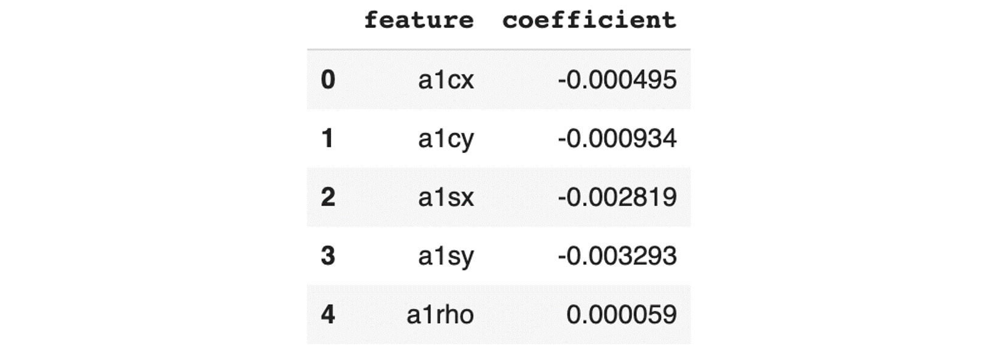


    Caption: The first five rows of coef\_df

    From this output, we can see the variables `a1sx` and
    `a1sy` have the lowest value (the biggest negative value)
    so they are contributing more to the prediction than the three other
    variables shown here.

22. Plot a bar chart with Altair using `coef_df` and
    `coefficient` as the `x` axis and
    `feature` as the `y` axis:

    ```
    alt.Chart(coef_df).mark_bar().encode(x='coefficient',\
                                         y="feature")
    ```


    You should get the following output:

    


RandomForest Variable Importance
================================


After training `RandomForest`, you can assess its variable
importance (or feature importance) with the
`feature_importances_` attribute.

Let\'s see how to extract this information from the Breast Cancer
dataset from `sklearn`:

```
from sklearn.datasets import load_breast_cancer
from sklearn.ensemble import RandomForestClassifier
data = load_breast_cancer()
X, y = data.data, data.target
rf_model = RandomForestClassifier(random_state=168)
rf_model.fit(X, y)
rf_model.feature_importances_
```

The output will be as shown in the following figure:

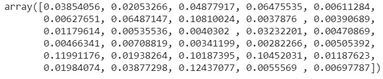

Caption: Feature importance of a Random Forest model

Note

Due to randomization, you may get a slightly different result.

It might be a little difficult to evaluate which importance value
corresponds to which variable from this output. Let\'s create a
DataFrame that will contain these values with the name of the columns:

```
import pandas as pd
varimp_df = pd.DataFrame()
varimp_df['feature'] = data.feature_names
varimp_df['importance'] = rf_model.feature_importances_
varimp_df.head()
```

The output will be as follows:

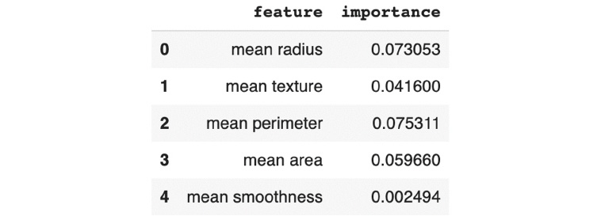

Caption: RandomForest variable importance for the first five
features of the Breast Cancer dataset

From this output, we can see that `mean radius` and
`mean perimeter` have the highest scores, which means they are
the most important in predicting the target variable. The
`mean smoothness` column has a very low value, so it seems it
doesn\'t influence the model much to predict the output.

Note

The range of values of variable importance is different for datasets; it
is not a standardized measure.

Let\'s plot these variable importance values onto a graph using
`altair`:

```
import altair as alt
alt.Chart(varimp_df).mark_bar().encode(x='importance',\
                                       y="feature")
```

The output will be as follows:

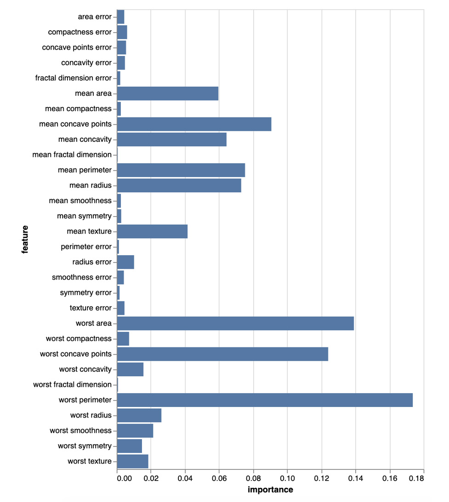

Caption: Graph showing RandomForest variable importance


Exercise 9.02: Extracting RandomForest Feature Importance
---------------------------------------------------------

In this exercise, we will extract the feature importance of a Random
Forest classifier model trained to predict the customer drop-out ratio.

We will be using the same dataset as in the previous exercise.

The following steps will help you complete the exercise:

1.  Open a new Colab notebook.

2.  Import the following packages: `pandas`,
    `train_test_split` from
    `sklearn.model_selection`, and
    `RandomForestRegressor` from `sklearn.ensemble`:
    ```
    import pandas as pd
    from sklearn.model_selection import train_test_split
    from sklearn.ensemble import RandomForestRegressor
    from sklearn.metrics import mean_squared_error
    import altair as alt
    ```


3.  Create a variable called `file_url` that contains the URL
    to the dataset:
    ```
    file_url = 'https://raw.githubusercontent.com/'\
               'fenago/data-science/'\
               'master/Lab09/Dataset/phpYYZ4Qc.csv'
    ```


4.  Load the dataset into a DataFrame called `df` using
    `.read_csv()`:
    ```
    df = pd.read_csv(file_url)
    ```


5.  Extract the `rej` column using `.pop()` and save
    it into a variable called `y`:
    ```
    y = df.pop('rej')
    ```


6.  Split the DataFrame into training and testing sets using
    `train_test_split()` with `test_size=0.3` and
    `random_state = 1`:
    ```
    X_train, X_test, y_train, y_test = train_test_split\
                                       (df, y, test_size=0.3, \
                                        random_state=1)
    ```


7.  Instantiate `RandomForestRegressor` with
    `random_state=1`, `n_estimators=50`,
    `max_depth=6`, and `min_samples_leaf=60`:
    ```
    rf_model = RandomForestRegressor(random_state=1, \
                                     n_estimators=50, max_depth=6,\
                                     min_samples_leaf=60)
    ```


8.  Train the model on the training set using `.fit()`:

    ```
    rf_model.fit(X_train, y_train)
    ```


    You should get the following output:

    
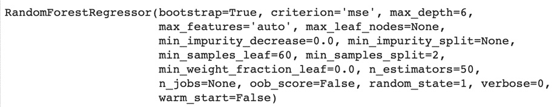


    Caption: Logs of the Random Forest model

9.  Predict the outcomes of the training and testing sets using
    `.predict()`:
    ```
    preds_train = rf_model.predict(X_train)
    preds_test = rf_model.predict(X_test)
    ```


10. Calculate the mean squared error on the training set and print its
    value:

    ```
    train_mse = mean_squared_error(y_train, preds_train)
    train_mse
    ```


    You should get the following output:

    


    Caption: MSE score of the training set

    We achieved quite a low MSE score on the training set.

11. Calculate the MSE on the testing set and print its value:

    ```
    test_mse = mean_squared_error(y_test, preds_test)
    test_mse
    ```


    You should get the following output:

    


    Caption: MSE score of the testing set

    We also have a low MSE score on the testing set that is very similar
    to the training one. So, our model is not overfitting.

12. Print the variable importance using
    `.feature_importances_`:

    ```
    rf_model.feature_importances_
    ```


    You should get the following output:

    
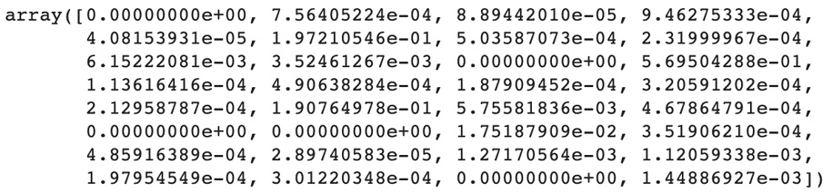


    Caption: MSE score of the testing set

13. Create an empty DataFrame called `varimp_df`:
    ```
    varimp_df = pd.DataFrame()
    ```


14. Create a new column called `feature` for this DataFrame
    with the name of the columns of `df`, using
    `.columns`:
    ```
    varimp_df['feature'] = df.columns
    varimp_df['importance'] = rf_model.feature_importances_
    ```


15. Print the first five rows of `varimp_df`:

    ```
    varimp_df.head()
    ```


    You should get the following output:

    


    Caption: Variable importance of the first five variables

    From this output, we can see the variables `a1cy` and
    `a1sy` have the highest value, so they are more important
    for predicting the target variable than the three other variables
    shown here.

16. Plot a bar chart with Altair using `coef_df` and
    `importance` as the `x` axis and
    `feature` as the `y` axis:

    ```
    alt.Chart(varimp_df).mark_bar().encode(x='importance',\
                                           y="feature")
    ```


    You should get the following output:

    
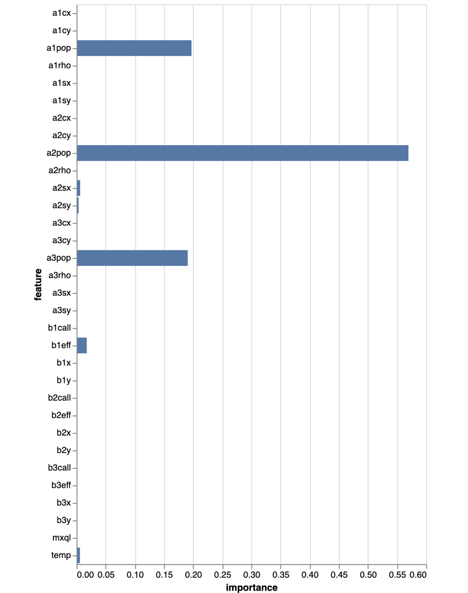


Caption: Graph showing the variable importance of the first five
variables

From this output, we can see the variables that impact the prediction
the most for this Random Forest model are `a2pop`,
`a1pop`, `a3pop`, `b1eff`, and
`temp`, by decreasing order of importance.


Variable Importance via Permutation
===================================


In the previous section, we saw how to extract feature importance for
RandomForest. There is actually another technique that shares the same
name, but its underlying logic is different and can be applied to any
algorithm, not only tree-based ones.

This technique can be referred to as variable importance via
permutation. Let\'s say we trained a model to predict a target variable
with five classes and achieved an accuracy of 0.95. One way to assess
the importance of one of the features is to remove and train a model and
see the new accuracy score. If the accuracy score dropped significantly,
then we could infer that this variable has a significant impact on the
prediction. On the other hand, if the score slightly decreased or stayed
the same, we could say this variable is not very important and doesn\'t
influence the final prediction much. So, we can use this difference
between the model\'s performance to assess the importance of a variable.

The drawback of this method is that you need to retrain a new model for
each variable. If it took you a few hours to train the original model
and you have 100 different features, it would take quite a while to
compute the importance of each variable. It would be great if we didn\'t
have to retrain different models. So, another solution would be to
generate noise or new values for a given column and predict the final
outcomes from this modified data and compare the accuracy score. For
example, if you have a column with values between 0 and 100, you can
take the original data and randomly generate new values for this column
(keeping all other variables the same) and predict the class for them.

This option also has a catch. The randomly generated values can be very
different from the original data. Going back to the same example we saw
before, if the original range of values for a column is between 0 and
100 and we generate values that can be negative or take a very high
value, it is not very representative of the real distribution of the
original data. So, we will need to understand the distribution of each
variable before generating new values.

Rather than generating random values, we can simply swap (or permute)
values of a column between different rows and use these modified cases
for predictions. Then, we can calculate the related accuracy score and
compare it with the original one to assess the importance of this
variable. For example, we have the following rows in the original
dataset:


Caption: Example of the dataset

We can swap the values for the X1 column and get a new dataset:


Caption: Example of a swapped column from the dataset

The `mlxtend` package provides a function to perform variable
permutation and calculate variable importance values:
`feature_importance_permutation`. Let\'s see how to use it
with the Breast Cancer dataset from `sklearn`.

First, let\'s load the data and train a Random Forest model:

```
from sklearn.datasets import load_breast_cancer
from sklearn.ensemble import RandomForestClassifier
 
data = load_breast_cancer()
X, y = data.data, data.target
rf_model = RandomForestClassifier(random_state=168)
rf_model.fit(X, y)
```

Then, we will call the `feature_importance_permutation`
function from `mlxtend.evaluate`. This function takes the
following parameters:

- `predict_method`: A function that will be called for model
    prediction. Here, we will provide the `predict` method
    from our trained `rf_model` model.
- `X`: The features from the dataset. It needs to be in
    NumPy array form.
- `y`: The target variable from the dataset. It needs to be
    in `Numpy` array form.
- `metric`: The metric used for comparing the performance of
    the model. For the classification task, we will use accuracy.
- `num_round`: The number of rounds `mlxtend` will
    perform permutation on the data and assess the performance change.
- `seed`: The seed set for getting reproducible results.

Consider the following code snippet:

```
from mlxtend.evaluate import feature_importance_permutation
imp_vals, _ = feature_importance_permutation\
              (predict_method=rf_model.predict, X=X, y=y, \
               metric='r2', num_rounds=1, seed=2)
imp_vals
```

The output should be as follows:

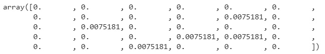

Caption: Variable importance by permutation

Let\'s create a DataFrame containing these values and the names of the
features and plot them on a graph with `altair`:

```
import pandas as pd
varimp_df = pd.DataFrame()
varimp_df['feature'] = data.feature_names
varimp_df['importance'] = imp_vals
varimp_df.head()
import altair as alt
alt.Chart(varimp_df).mark_bar().encode(x='importance',\
                                       y="feature")
```

The output should be as follows:

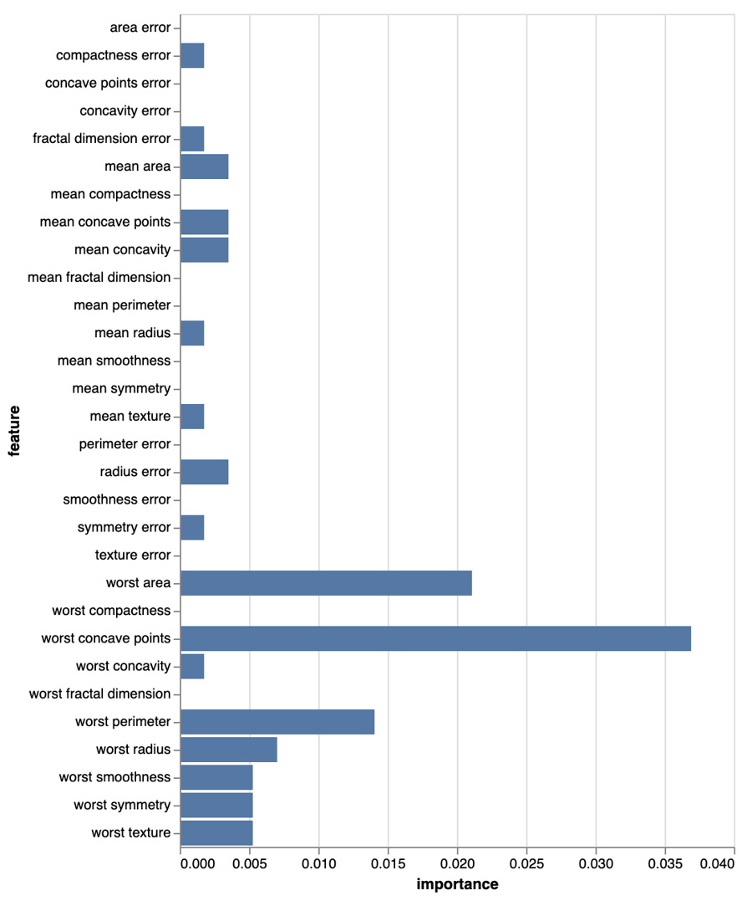

Caption: Graph showing variable importance by permutation

These results are different from the ones we got from
`RandomForest` in the previous section. Here, worst concave
points is the most important, followed by worst area, and worst
perimeter has a higher value than mean radius. So, we got the same list
of the most important variables but in a different order. This confirms
these three features are indeed the most important in predicting whether
a tumor is malignant or not. The variable importance from
`RandomForest` and the permutation have different logic,
therefore, you might get different outputs when you run the code given
in the preceding section.


Exercise 9.03: Extracting Feature Importance via Permutation
------------------------------------------------------------

In this exercise, we will compute and extract feature importance by
permutating a Random Forest classifier model trained to predict the
customer drop-out ratio.

We will using the same dataset as in the previous exercise.

The following steps will help you complete the exercise:

1.  Open a new Colab notebook.

2.  Import the following packages: `pandas`,
    `train_test_split` from
    `sklearn.model_selection`,
    `RandomForestRegressor` from `sklearn.ensemble`,
    `feature_importance_permutation` from
    `mlxtend.evaluate`, and `altair`:
    ```
    import pandas as pd
    from sklearn.model_selection import train_test_split
    from sklearn.ensemble import RandomForestRegressor
    from mlxtend.evaluate import feature_importance_permutation
    import altair as alt
    ```


3.  Create a variable called `file_url` that contains the URL
    of the dataset:
    ```
    file_url = 'https://raw.githubusercontent.com/'\
               'fenago/data-science/'\
               'master/Lab09/Dataset/phpYYZ4Qc.csv'
    ```


4.  Load the dataset into a DataFrame called `df` using
    `.read_csv()`:
    ```
    df = pd.read_csv(file_url)
    ```


5.  Extract the `rej` column using `.pop()` and save
    it into a variable called `y`:
    ```
    y = df.pop('rej')
    ```


6.  Split the DataFrame into training and testing sets using
    `train_test_split()` with `test_size=0.3` and
    `random_state = 1`:
    ```
    X_train, X_test, y_train, y_test = train_test_split\
                                       (df, y, test_size=0.3, \
                                        random_state=1)
    ```


7.  Instantiate `RandomForestRegressor` with
    `random_state=1`, `n_estimators=50`,
    `max_depth=6`, and `min_samples_leaf=60`:
    ```
    rf_model = RandomForestRegressor(random_state=1, \
                                     n_estimators=50, max_depth=6, \
                                     min_samples_leaf=60)
    ```


8.  Train the model on the training set using `.fit()`:

    ```
    rf_model.fit(X_train, y_train)
    ```


    You should get the following output:

    
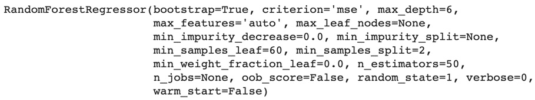


    Caption: Logs of RandomForest

9.  Extract the feature importance via permutation using
    `feature_importance_permutation` from `mlxtend`
    with the Random Forest model, the testing set, `r2` as the
    metric used, `num_rounds=1`, and `seed=2`. Save
    the results into a variable called `imp_vals` and print
    its values:

    ```
    imp_vals, _ = feature_importance_permutation\
                  (predict_method=rf_model.predict, \
                   X=X_test.values, y=y_test.values, \
                   metric='r2', num_rounds=1, seed=2)
    imp_vals
    ```


    You should get the following output:

    
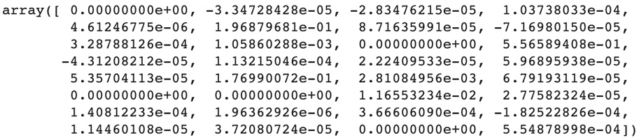


    Caption: Variable importance by permutation

    It is quite hard to interpret the raw results. Let\'s plot the
    variable importance by permutating the model on a graph.

10. Create a DataFrame called `varimp_df` with two columns:
    `feature` containing the name of the columns of
    `df`, using `.columns` and
    `'importance'` containing the values of
    `imp_vals`:
    ```
    varimp_df = pd.DataFrame({'feature': df.columns, \
                              'importance': imp_vals})
    ```


11. Plot a bar chart with Altair using `coef_df` and
    `importance` as the `x` axis and
    `feature` as the `y` axis:

    ```
    alt.Chart(varimp_df).mark_bar().encode(x='importance',\
                                           y="feature")
    ```


    You should get the following output:

    
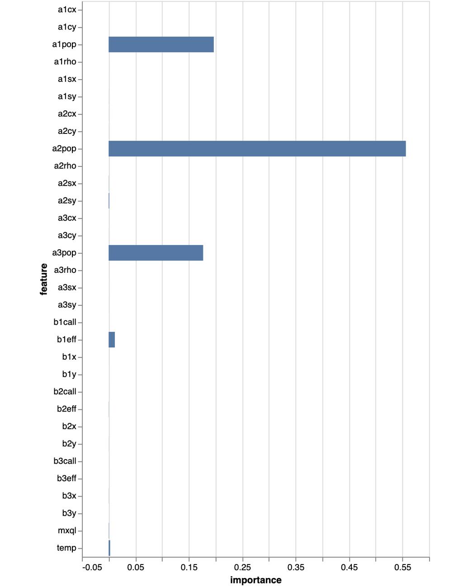


Caption: Graph showing the variable importance by permutation


Partial Dependence Plots
========================


Another tool that is model-agnostic is a partial dependence plot. It is
a visual tool for analyzing the effect of a feature on the target
variable. To achieve this, we can plot the values of the feature we are
interested in analyzing on the `x`-axis and the target
variable on the `y`-axis and then show all the observations
from the dataset on this graph. Let\'s try it on the Breast Cancer
dataset from `sklearn`:

```
from sklearn.datasets import load_breast_cancer
import pandas as pd
data = load_breast_cancer()
df = pd.DataFrame(data.data, columns=data.feature_names)
df['target'] = data.target
```
Now that we have loaded the data and converted it to a DataFrame, let\'s
have a look at the worst concave points column:

```
import altair as alt
alt.Chart(df).mark_circle(size=60)\
             .encode(x='worst concave points', y='target')
```

The resulting plot is as follows:


Caption: Scatter plot of the worst concave points and target
variables

Note

The preceding code and figure are just examples. We encourage you to
analyze different features by changing the values assigned to
`x` and `y` in the preceding code. For example, you
can possibly analyze worst concavity versus worst perimeter by setting
`x='worst concavity'` and `y='worst perimeter'` in
the preceding code.

From this plot, we can see:

- Most cases with 1 for the target variable have values under 0.16 for
    the worst concave points column.
- Cases with a 0 value for the target have values of over 0.08 for
    worst concave points.

With this plot, we are not too sure about which outcome (0 or 1) we will
get for the values between 0.08 and 0.16 for worst concave points. There
are multiple possible reasons why the outcome of the observations within
this range of values is uncertain, such as the fact that there are not
many records that fall into this case, or other variables might
influence the outcome for these cases. This is where a partial
dependence plot can help.

The logic is very similar to variable importance via permutation but
rather than randomly replacing the values in a column, we will test
every possible value within that column for all observations and see
what predictions it leads to. If we take the example from figure 9.21,
from the three observations we had originally, this method will create
six new observations by keeping columns `X2` and
`X3` as they were and replacing the values of `X1`:

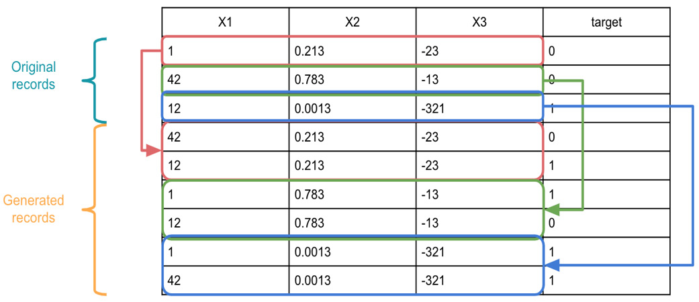

Caption: Example of records generated from a partial dependence plot

With this new data, we can see, for instance, whether the value 12
really has a strong influence on predicting 1 for the target variable.
The original records, with the values 42 and 1 for the `X1`
column, lead to outcome 0 and only value 12 generated a prediction of 1.
But if we take the same observations for `X1`, equal to 42 and
1, and replace that value with 12, we can see whether the new
predictions will lead to 1 for the target variable. This is exactly the
logic behind a partial dependence plot, and it will assess all the
permutations possible for a column and plot the average of
the predictions.

`sklearn` provides a function called
`plot_partial_dependence()` to display the partial dependence
plot for a given feature. Let\'s see how to use it on the Breast Cancer
dataset. First, we need to get the index of the column we are interested
in. We will use the `.get_loc()` method from
`pandas` to get the index for the
`worst concave points` column:

```
import altair as alt
from sklearn.inspection import plot_partial_dependence
feature_index = df.columns.get_loc("worst concave points")
```
Now we can call the `plot_partial_dependence()` function. We
need to provide the following parameters: the trained model, the
training set, and the indices of the features to be analyzed:

```
plot_partial_dependence(rf_model, df, \
                        features=[feature_index])
```


Caption: Partial dependence plot for the worst concave points column

This partial dependence plot shows us that, on average, all the
observations with a value under 0.17 for the worst concave points column
will most likely lead to a prediction of 1 for the target (probability
over 0.5) and all the records over 0.17 will have a prediction of 0
(probability under 0.5).


Exercise 9.04: Plotting Partial Dependence
------------------------------------------

In this exercise, we will plot partial dependence plots for two
variables, `a1pop` and `temp`, from a Random Forest
classifier model trained to predict the customer drop-out ratio.

We will using the same dataset as in the previous exercise.

1.  Open a new Colab notebook.

2.  Import the following packages: `pandas`,
    `train_test_split` from
    `sklearn.model_selection`,
    `RandomForestRegressor` from `sklearn.ensemble`,
    `plot_partial_dependence` from
    `sklearn.inspection`, and `altair`:
    ```
    import pandas as pd
    from sklearn.model_selection import train_test_split
    from sklearn.ensemble import RandomForestRegressor
    from sklearn.inspection import plot_partial_dependence
    import altair as alt
    ```


3.  Create a variable called `file_url` that contains the URL
    for the dataset:
    ```
    file_url = 'https://raw.githubusercontent.com/'\
               'fenago/data-science/'\
               'master/Lab09/Dataset/phpYYZ4Qc.csv'
    ```


4.  Load the dataset into a DataFrame called `df` using
    `.read_csv()`:
    ```
    df = pd.read_csv(file_url)
    ```


5.  Extract the `rej` column using `.pop()` and save
    it into a variable called `y`:
    ```
    y = df.pop('rej')
    ```


6.  Split the DataFrame into training and testing sets using
    `train_test_split()` with `test_size=0.3` and
    `random_state = 1`:
    ```
    X_train, X_test, y_train, y_test = train_test_split\
                                       (df, y, test_size=0.3, \
                                        random_state=1)
    ```


7.  Instantiate `RandomForestRegressor` with
    `random_state=1`, `n_estimators=50`,
    `max_depth=6`, and `min_samples_leaf=60`:
    ```
    rf_model = RandomForestRegressor(random_state=1, \
                                     n_estimators=50, max_depth=6,\
                                     min_samples_leaf=60)
    ```


8.  Train the model on the training set using `.fit()`:

    ```
    rf_model.fit(X_train, y_train)
    ```


    You should get the following output:

    
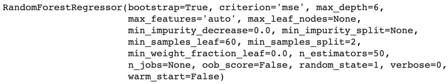


    Caption: Logs of RandomForest

9.  Plot the partial dependence plot using
    `plot_partial_dependence()` from `sklearn` with
    the Random Forest model, the testing set, and the index of the
    `a1pop` column:

    ```
    plot_partial_dependence(rf_model, X_test, \
                            features=[df.columns.get_loc('a1pop')])
    ```


    You should get the following output:

    
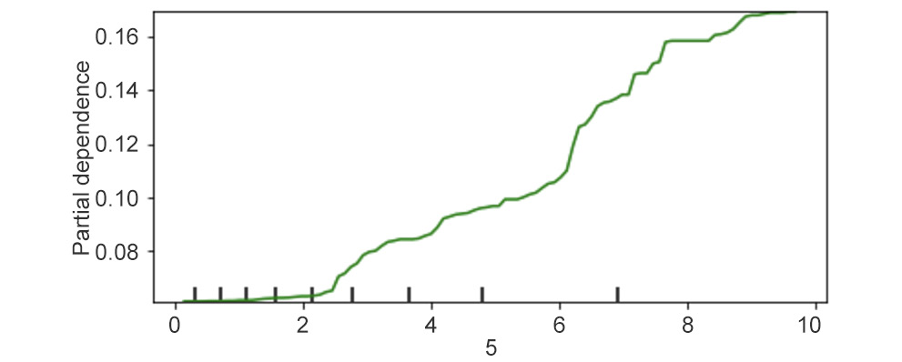


    Caption: Partial dependence plot for a1pop

    This partial dependence plot shows that, on average, the
    `a1pop` variable doesn\'t affect the target variable much
    when its value is below 2, but from there the target increases
    linearly by 0.04 for each unit increase of `a1pop`. This
    means if the population size of area 1 is below the value of 2, the
    risk of churn is almost null. But over this limit, every increment
    of population size for area 1 increases the chance of churn by
    `4%`.

10. Plot the partial dependence plot using
    `plot_partial_dependence()` from `sklearn` with
    the Random Forest model, the testing set, and the index of the
    `temp` column:

    ```
    plot_partial_dependence(rf_model, X_test, \
                            features=[df.columns.get_loc('temp')])
    ```


    You should get the following output:

    
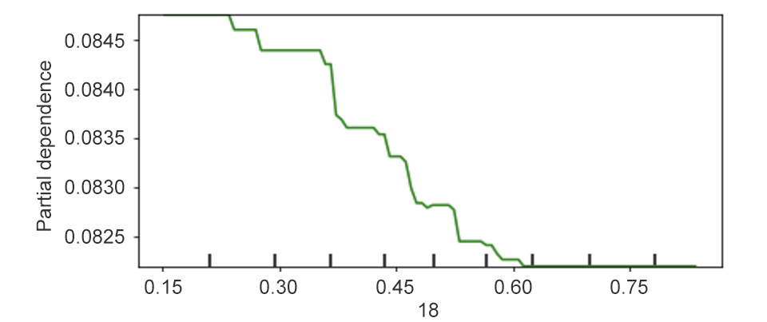


Caption: Partial dependence plot for temp

This partial dependence plot shows that, on average, the
`temp` variable has a negative linear impact on the target
variable: when `temp` increases by 1, the target variable will
decrease by 0.12. This means if the temperature increases by a degree,
the chance of leaving the queue decreases by 12%.


Local Interpretation with LIME
==============================


LIME is one way to get more visibility in such cases. The underlying
logic of LIME is to approximate the original nonlinear model with a
linear one. Then, it uses the coefficients of that linear model in order
to explain the contribution of each variable, as we just saw in the
preceding example. But rather than trying to approximate the entire
model for the whole dataset, LIME tries to approximate it locally around
the observation you are interested in. LIME uses the trained model to
predict new data points near your observation and then fit a linear
regression on that predicted data.

Let\'s see how we can use it on the Breast Cancer dataset. First, we
will load the data and train a Random Forest model:

```
from sklearn.datasets import load_breast_cancer
from sklearn.model_selection import train_test_split
from sklearn.ensemble import RandomForestClassifier
data = load_breast_cancer()
X, y = data.data, data.target
X_train, X_test, y_train, y_test = train_test_split\
                                   (X, y, test_size=0.3, \
                                    random_state=1)
rf_model = RandomForestClassifier(random_state=168)
rf_model.fit(X_train, y_train)
```

The `lime` package is not directly accessible on Google Colab,
so we need to manually install it with the following command:

```
!pip install lime
```

The output will be as follows:

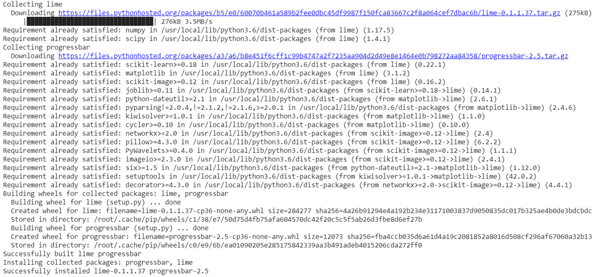

Caption: Installation logs for the lime package

Once installed, we will instantiate the `LimeTabularExplainer`
class by providing the training data, the names of the features, the
names of the classes to be predicted, and the task type (in this
example, it is `classification`):

```
from lime.lime_tabular import LimeTabularExplainer
lime_explainer = LimeTabularExplainer\
                 (X_train, feature_names=data.feature_names,\
                 class_names=data.target_names,\
                 mode='classification')
```

Then, we will call the `.explain_instance()` method with the
observations we are interested in (here, it will be the second
observation from the testing set) and the function that will predict the
outcome probabilities (here, it is `.predict_proba()`).
Finally, we will call the `.show_in_notebook()` method to
display the results from `lime`:

```
exp = lime_explainer.explain_instance\
      (X_test[1], rf_model.predict_proba, num_features=10)
exp.show_in_notebook()
```

The output will be as follows:

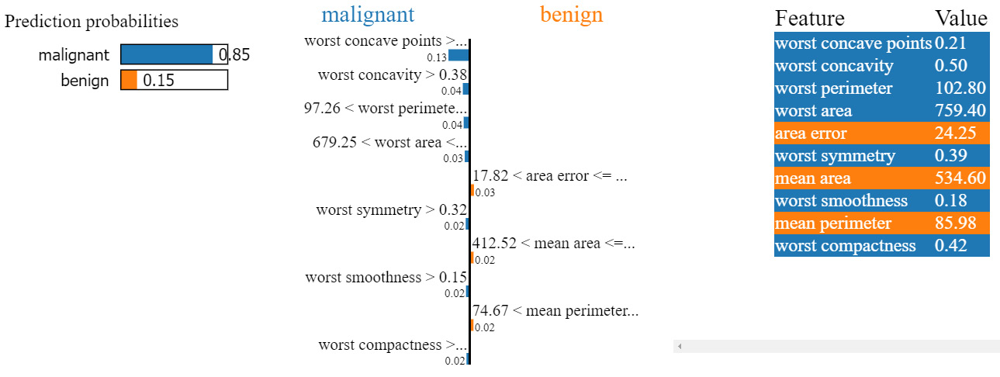

Caption: Output of LIME

Note

Your output may differ slightly. This is due to the random sampling
process of LIME.

There is a lot of information in the preceding output. Let\'s go through
it a bit at a time. The left-hand side shows the prediction
probabilities for the two classes of the target variable. For this
observation, the model thinks there is a 0.85 probability that the
predicted value will be malignant:


Caption: Prediction probabilities from LIME

The right-hand side shows the value of each feature for this
observation. Each feature is color-coded to highlight its contribution
toward the possible classes of the target variable. The list sorts the
features by decreasing importance. In this example, the mean perimeter,
mean area, and area error contributed to the model to increase the
probability toward class 1. All the other features influenced the model
to predict outcome 0:

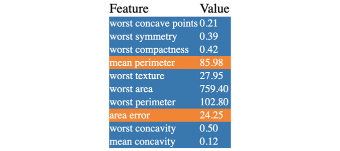

Caption: Value of the feature for the observation of interest

Finally, the central part shows how each variable contributed to the
final prediction. In this example, the `worst concave points`
and `worst compactness` variables led to an increase of,
respectively, 0.10 and 0.05 probability in predicting outcome 0. On the
other hand, `mean perimeter` and `mean area` both
contributed to an increase of 0.03 probability of predicting class 1:

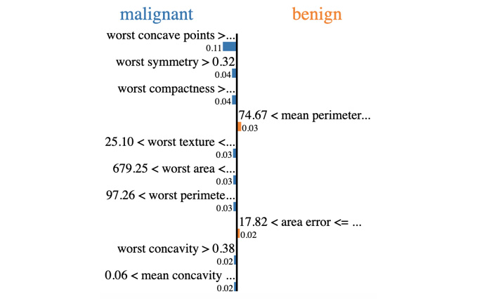

Caption: Contribution of each feature to the final prediction

It\'s as simple as that. With LIME, we can easily see how each variable
impacted the probabilities of predicting the different outcomes of the
model. As you saw, the LIME package not only computes the local
approximation but also provides a visual representation of its results.
It is much easier to interpret than looking at raw outputs. It is also
very useful for presenting your findings and illustrating how different
features influenced the prediction of a single observation.


Exercise 9.05: Local Interpretation with LIME
---------------------------------------------

In this exercise, we will analyze some predictions from a Random Forest
classifier model trained to predict the customer drop-out ratio using
LIME.

We will be using the same dataset as in the previous exercise.

1.  Open a new Colab notebook.

2.  Import the following packages: `pandas`,
    `train_test_split` from
    `sklearn.model_selection`, and
    `RandomForestRegressor` from `sklearn.ensemble`:
    ```
    import pandas as pd
    from sklearn.model_selection import train_test_split
    from sklearn.ensemble import RandomForestRegressor
    ```


3.  Create a variable called `file_url` that contains the URL
    of the dataset:
    ```
    file_url = 'https://raw.githubusercontent.com/'\
               'fenago/data-science/'\
               'master/Lab09/Dataset/phpYYZ4Qc.csv'
    ```


4.  Load the dataset into a DataFrame called `df` using
    `.read_csv()`:
    ```
    df = pd.read_csv(file_url)
    ```


5.  Extract the `rej` column using `.pop()` and save
    it into a variable called `y`:
    ```
    y = df.pop('rej')
    ```


6.  Split the DataFrame into training and testing sets using
    `train_test_split()` with `test_size=0.3` and
    `random_state = 1`:
    ```
    X_train, X_test, y_train, y_test = train_test_split\
                                       (df, y, test_size=0.3, \
                                        random_state=1)
    ```


7.  Instantiate `RandomForestRegressor` with
    `random_state=1`, `n_estimators=50`,
    `max_depth=6`, and `min_samples_leaf=60`:
    ```
    rf_model = RandomForestRegressor(random_state=1, \
                                     n_estimators=50, max_depth=6,\
                                     min_samples_leaf=60)
    ```


8.  Train the model on the training set using `.fit()`:

    ```
    rf_model.fit(X_train, y_train)
    ```


    You should get the following output:

    
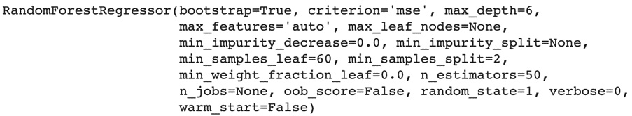


    Caption: Logs of RandomForest

9.  Install the lime package using the `!pip` install command:
    ```
    !pip install lime
    ```


10. Import `LimeTabularExplainer` from
    `lime.lime_tabular`:
    ```
    from lime.lime_tabular import LimeTabularExplainer
    ```


11. Instantiate `LimeTabularExplainer` with the training set
    and `mode='regression'`:
    ```
    lime_explainer = LimeTabularExplainer\
                     (X_train.values, \
                      feature_names=X_train.columns, \
                      mode='regression')
    ```


12. Display the LIME analysis on the first row of the testing set using
    `.explain_instance()` and `.show_in_notebook()`:

    ```
    exp = lime_explainer.explain_instance\
          (X_test.values[0], rf_model.predict)
    exp.show_in_notebook()
    ```


    You should get the following output:

    


    Caption: LIME output for the first observation of the testing
    set

    This output shows that the predicted value for this observation is a
    0.02 chance of customer drop-out and it has been mainly influenced
    by the `a1pop`, `a3pop`, `a2pop`, and
    `b2eff` features. For instance, the fact that
    `a1pop` was under 0.87 has decreased the value of the
    target variable by 0.01.

13. Display the LIME analysis on the third row of the testing set using
    `.explain_instance()` and `.show_in_notebook()`:

    ```
    exp = lime_explainer.explain_instance\
          (X_test.values[2], rf_model.predict)
    exp.show_in_notebook()
    ```


    You should get the following output:

    


Caption: LIME output for the third observation of the testing set


You have completed the last exercise of this lab. You saw how to use
LIME to interpret the prediction of single observations. We learned that
the `a1pop`, `a2pop`, and `a3pop` features
have a strong negative impact on the first and third observations of the
training set.


Activity 9.01: Train and Analyze a Network Intrusion Detection Model
--------------------------------------------------------------------

You are working for a cybersecurity company and you have been tasked
with building a model that can recognize network intrusion then analyze
its feature importance, plot partial dependence, and perform local
interpretation on a single observation using LIME.

The dataset provided contains data from 7 weeks of network traffic.


The following steps will help you to complete this activity:

1.  Download and load the dataset using `.read_csv()` from
    `pandas`.

2.  Extract the response variable using `.pop()` from
    `pandas`.

3.  Split the dataset into training and test sets using
    `train_test_split()` from
    `sklearn.model_selection`.

4.  Create a function that will instantiate and fit
    `RandomForestClassifier` using `.fit()` from
    `sklearn.ensemble`.

5.  Create a function that will predict the outcome for the training and
    testing sets using `.predict()`.

6.  Create a function that will print the accuracy score for the
    training and testing sets using `accuracy_score()` from
    `sklearn.metrics`.

7.  Compute the feature importance via permutation with
    `feature_importance_permutation()` and display it on a bar
    chart using `altair`.

8.  Plot the partial dependence plot using
    `plot_partial_dependence` on the `src_bytes`
    variable.

9.  Install `lime` using `!pip install`.

10. Perform a LIME analysis on row `99893` with
    `explain_instance()`.

    The output should be as follows:

    
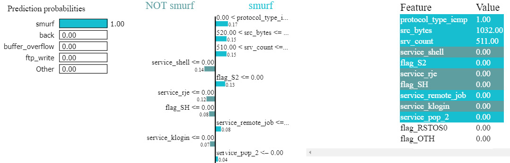


Summary
=======


In this lab, we learned a few techniques for interpreting machine
learning models. We saw that there are techniques that are specific to
the model used: coefficients for linear models and variable importance
for tree-based models. There are also some methods that are
model-agnostic, such as variable importance via permutation.
